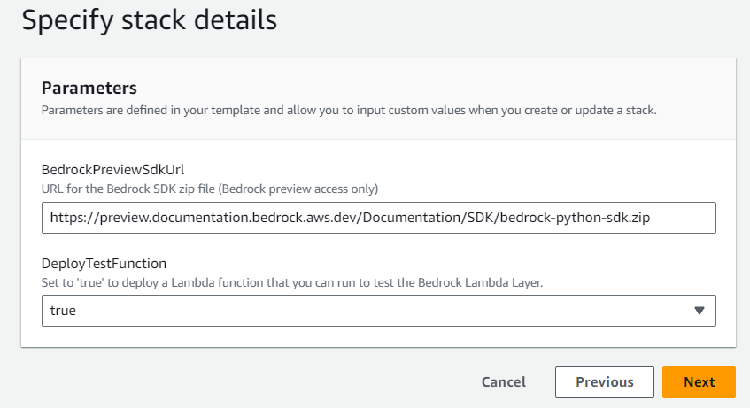

## Call the Bedrock APIs from your AWS Lambda functions, using a Lambda Layer with Python Boto3

The Cloudformation template [bedrock-boto3-lambda-layer-template.yaml](./bedrock-boto3-lambda-layer-template.yaml) deploys:
  - a Lambda Layer containing the Python Boto3 SDK updated to support Bedrock
  - (optionally) a simple example Lambda function that invokes the Bedrock API using the Lambda Layer SDK

The template defines a CloudFormation custom resource function that dynamically downloads and uses the latest published Bedrock SDK files to build the Lambda Layer when you deploy the stack. 

- The default path to the bedrock-python-sdk.zip is automatically populated in the template. To use a different zip file, change the value for **BedrockPreviewSdkUrl**
- To deploy a simple test Lambda function, chose `true` for **DeployTestFunction** (the default is `false`)

   

When the stack is created, select the **Outputs** tab to see the ARN for your new Lambda Layer.

   

If you chose to deploy a test function, select the **Resources** tab, and choose the link for **BedrockTestLambdaFunction** to open and run the simple test function in the AWS Lambda console. Modify the sample code to experiment with different models and prompts. 

   

