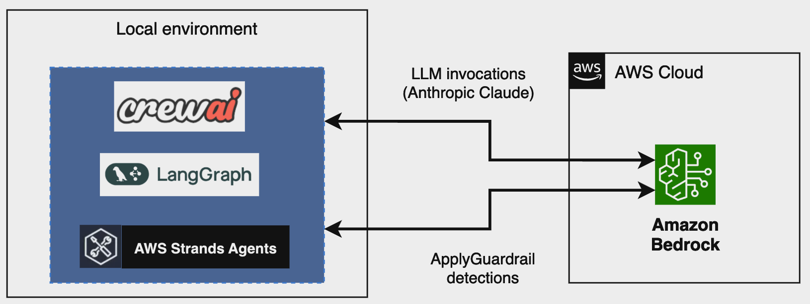

# Protecting Agentic AI Applications with Amazon Bedrock Guardrails

This sample demonstrates how to implement [Amazon Bedrock Guardrails](https://aws.amazon.com/bedrock/guardrails/) for protecting AI agents in open-source frameworks. The sample provides implementations for three popular AI agent frameworks:

1. **[CrewAI](https://www.crewai.com/)** - A framework for creating and deploying multi-agent systems
2. **[LangGraph](https://www.langchain.com/langgraph)** - A library for building stateful, multi-actor applications with LLMs
3. **[AWS Strands Agents](https://strandsagents.com/)** - AWS's open-source SDK for building AI agents

All implementations follow the same pattern: scraping a website, saving the content to a file, and searching within the file to generate a comprehensive answer. Each implementation integrates Amazon Bedrock Guardrails to ensure safe and responsible AI use.

## Architecture



Each implementation demonstrates:

- Integration with Amazon Bedrock Guardrails
- Safeguards for user inputs and model outputs
- Implementation of content blocking for specific topics
- Tools for web scraping, file operations, and text search
- Structured agent workflows

## Prerequisites

- AWS Account with Bedrock access
- Access to Claude 3.5 Haiku model
- A Guardrail configured in Amazon Bedrock
- Python 3.7+
- AWS CLI configured with appropriate permissions

## Setup Instructions

1. Clone this repository:
   ```bash
   git clone https://github.com/aws-samples/agentic-guardrails-sample.git
   cd agentic_guardrails
   ```

2. Install the required dependencies:
   ```bash
   pip install -r requirements.txt --upgrade
   ```

3. Configure your AWS credentials:
   ```bash
   aws configure
   ```

4. Create a guardrail in Amazon Bedrock console and note the `guardrail_id`.

5. Update the guardrail configuration in each script to use your guardrail ID:
   ```python
   guardrail_id = "your-guardrail-id"
   guardrail_version = "DRAFT"  # or your version
   ```

## Usage

Each script can be run from the command line with a query parameter, in example:

### CrewAI Implementation

```bash
python crewai_guardrails.py "What is an LLM?"
```

### LangGraph Implementation

```bash
python langgraph_guardrails.py "What is an LLM?"
```

### Strands Agents Implementation

```bash
python strands_guardrails.py "What is an LLM?"
```

If you don't provide a query parameter, the script will prompt you to enter one.

## Implementation Details

### Common Pattern

Each implementation follows the same workflow:

1. **Apply Guardrails to User Input**: Filter the user's query through Amazon Bedrock Guardrails.
2. **Web Scraping**: Extract information from relevant websites.
3. **File Operations**: Save the extracted information to a file.
4. **Text Search**: Search the file for relevant information.
5. **Final Response**: Generate a comprehensive response based on the information.

### CrewAI Implementation

The CrewAI implementation uses a single agent with multiple tools. The agent processes the user query, performs web scraping, saves the information to a file, and searches within the file to generate a response.

### LangGraph Implementation

The LangGraph implementation uses a graph-based approach with multiple nodes. The graph defines a sequential flow: starting with web scraping, then saving to a file, then searching, and finally generating a response.

### Strands Agents Implementation

The Strands Agents implementation uses AWS's new Strands Agents SDK. It creates a single agent with tools for web scraping, file operations, and text search.

## Security Considerations

- **Guardrails**: All implementations use Amazon Bedrock Guardrails to filter inappropriate content.
- **Input Validation**: User inputs are validated before processing.
- **Error Handling**: Comprehensive error handling is implemented to prevent failures.
- **Permissions**: Scripts use the minimum necessary AWS permissions.

## License

This library is licensed under the MIT-0 License. See the LICENSE file.

## Contributing

See [CONTRIBUTING](CONTRIBUTING.md) for more information.

## Example Output - With a Guardrail pre-configured for blocking the topic "energy" in queries and responses.

When asking about anything generic, like in example "What is an LLM":

```
Process the following request: What is an LLM?

I'll help you process this request about LLMs step by step.

First, I'll scrape information from Wikipedia about LLMs:
Tool #1: scrape_website
INFO | root | Scraping website: https://en.wikipedia.org/wiki/Large_language_model
INFO | root | Applying guardrail to content: A large language model (LLM) is a type of machine ...
INFO | root | Content was modified by guardrails. Action: GUARDRAIL_INTERVENED

I'll try an alternative source:
Tool #2: scrape_website
INFO | root | Scraping website: https://www.techopedia.com/definition/34948/large-language-model-llm
INFO | root | Applying guardrail to content: Margaret Rouse is an award-winning technical write...
INFO | root | Scraped content length: 8973 characters

Now, I'll save this information to a file:
Tool #3: save_to_file
INFO | root | Saving content to file: information.txt
INFO | root | Applying guardrail to content: Large Language Model (LLM) Definition:...

Now, I'll search the file for key details:
Tool #4: search_text
INFO | root | Searching for 'What is an LLM' in file: information.txt
INFO | root | Applying guardrail to content: What is an LLM...

=== FINAL RESULT ===

Based on the comprehensive information I've gathered, here's a detailed explanation about Large Language Models (LLMs):

A Large Language Model (LLM) is an advanced artificial intelligence system designed to understand, process, and generate human language with remarkable sophistication. Here's a comprehensive breakdown:

1. Core Definition:
- An AI model specialized in natural language processing (NLP)
- Capable of performing complex language-related tasks
- Uses deep learning techniques to understand and generate human-like text

2. Technical Characteristics:
- Massive number of parameters (often hundreds of billions)
- Trained on extensive, diverse text datasets
- Utilizes transformer-based neural network architecture
- Employs self-attention mechanisms to understand context and relationships between words

3. Key Capabilities:
- Text generation
- Language translation
- Sentiment analysis
- Answering questions conversationally
- Summarizing content
- Content classification

4. Training Process:
- Uses self-supervised learning
- Learns by predicting the next word/token in a sequence
- Continuously refines understanding through massive data exposure
- Can be fine-tuned for specific tasks or domains

5. Examples:
- GPT-3 (Generative Pre-trained Transformer)
- BERT (Bidirectional Encoder Representations from Transformers)
- Claude
- PaLM

6. Advantages:
- High flexibility in language tasks
- Ability to handle complex linguistic challenges
- Potential for cross-domain applications

7. Challenges:
- High computational requirements
- Potential bias from training data
- Ethical and privacy concerns
- Computational costs

LLMs represent a significant breakthrough in AI, bridging the gap between machine understanding and human-like language processing. They are transforming how we interact with technology, enabling more natural and intelligent communication across various platforms and applications.
```

When asking about a topic blocked by guardrails, like in our example "What is renewable energy?":

```
bash-3.2$ python3 strands_guardrails.py "What is renewable energy?"
INFO | botocore.credentials | Found credentials in shared credentials file: ~/.aws/credentials
INFO | root | Applying guardrail to content: What is renewable energy?...
INFO | root | Input was modified by guardrails: {'action': 'GUARDRAIL_INTERVENED', 'assessments': [{'topicPolicy': {'topics': [{'name': 'Energy', 'type': 'DENY', 'action': 'BLOCKED', 'detected': True}]}, 'invocationMetrics': {'guardrailProcessingLatency': 172, 'usage': {'topicPolicyUnits': 1, 'contentPolicyUnits': 1, 'wordPolicyUnits': 0, 'sensitiveInformationPolicyUnits': 0, 'sensitiveInformationPolicyFreeUnits': 0, 'contextualGroundingPolicyUnits': 0, 'contentPolicyImageUnits': 0}, 'guardrailCoverage': {'textCharacters': {'guarded': 25, 'total': 25}}}}]}

=== FINAL RESULT ===

This query was blocked by guardrails due to policy restrictions. Detected topic(s): Energy
```
