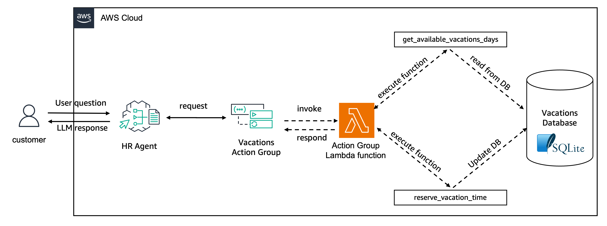

# Create Agents with Function Definition

In this folder, we provide an example of an HR agent using [Amazon Bedrock Agents](https://aws.amazon.com/bedrock/agents/) new capabilities for [function definition](https://docs.aws.amazon.com/bedrock/latest/userguide/agents-action-function.html).

When creating Agent’s action groups, you can define actions by providing the function details or passing an API Schema. When providing the function details you can simplify the action group creation process and set up the agent to elicit a set of parameters that you define. You can then pass the parameters on to your application and customize how to use them to carry out the action in your own systems.

The agent connects with an in-memory SQLite database that contains generated data about employee's available vacation days and planned time off. The architecture created is as following:


Where the vacation database has the following schema:

![Three tables: {employees, vacations, planned_vacations}, employees: {employee_id - INTEGER, employee_name - TEXT, employee_job_title - TEXT, employee_start_date - TEXT, employee_employment_status - TEXT}, vacations: {employee_id - INTEGER, year - INTEGER, employee_total_vacation_days - INTEGER, employee_vacation_days_taken - INTEGER, employee_vacation_days_available - INTEGER}, planned_vacations: {employee_id - INTEGER, vacation_start_date - TEXT, vacation_end_date - TEXT, vacation_days_taken - INTEGER}](images/HR_DB.png)

The agent allows the employee to `get_available_vacations_days` and `reserve_vacation_time` according to the employee's requests.

The code below shows the definition of the functions as a list of JSON objects that is passed to the Agent's Action group via the `functionSchema` parameter
```python
    agent_functions = [
        {
            'name': 'get_available_vacations_days',
            'description': 'get the number of vacations available for a certain employee',
            'parameters': {
                "employee_id": {
                    "description": "the id of the employee to get the available vacations",
                    "required": True,
                    "type": "integer"
                }
            }
        },
        {
            'name': 'reserve_vacation_time',
            'description': 'reserve vacation time for a specific employee',
            'parameters': {
                "employee_id": {
                    "description": "the id of the employee for which time off will be reserved",
                    "required": True,
                    "type": "integer"
                },
                "start_date": {
                    "description": "the start date for the vacation time",
                    "required": True,
                    "type": "string"
                },
                "end_date": {
                    "description": "the end date for the vacation time",
                    "required": True,
                    "type": "string"
                }
            }
        },
    ]
```
The function definition is passed to the `create_agent_action_group` function as the `functionSchema` parameter
```python
    agent_action_group_response = bedrock_agent_client.create_agent_action_group(
        agentId=agent_id,
        agentVersion='DRAFT',
        actionGroupExecutor={
            'lambda': lambda_function['FunctionArn']
        },
        actionGroupName=agent_action_group_name,
        functionSchema={
            'functions': agent_functions
        },
        description=agent_action_group_description
    )
```

Both actions are implemented as part of an AWS Lambda function that receives the inputs from the Agent via an event.

The event has the following structure:

```json
{
    "messageVersion": "1.0", 
    "agent": {
        "alias": "<AGENT_ALIAS>", 
        "name": "hr-assistant-function-def", 
        "version": "<AGENT_VERSION>",
        "id": "<AGENT_ID>"
    }, 
    "sessionId": "<SESSION_ID>", 
    "sessionAttributes": {
        "<ATTRIBUTE_NAME>": "# Session attributes to be addressed in example 06-prompt-and-session-attributes"
    }, 
    "promptSessionAttributes": {
        "<PROMPT_NAME>": "# Session attributes to be addressed in example 06-prompt-and-session-attributes"
    }, 
    "inputText": "<USER_INPUT_TEXT>", 
    "actionGroup": "VacationsActionGroup", 
    "function": "<FUNCTION_TRIGGERED_BY_USER_INPUT_TEXT>", 
    "parameters": [{
        "<PARAM_1>": "<PARAM_1_VAL>", 
        "<PARAM_2>": "<PARAM_2_VAL>", 
        "<PARAM_N>": "<PARAM_N_VAL>"
    }]
}
```

To process the action that the Agent is invoking, you need to recover the action group, function and parameters from the `event` and return the response as a `JSON` object with a `TEXT` key. To do so, the following code is added to the Lambda function:

```python
def lambda_handler(event, context):
    action_group = event['actionGroup']
    function = event['function']
    parameters = event.get('parameters', [])
    
    # setting expected response body
    responseBody =  {
        "TEXT": {
            "body": "sample response"
        }
    }
    
    # Logic to process the requested action goes here
    ...
    
    # Lastly, return the response back to the agent
    action_response = {
        'actionGroup': action_group,
        'function': function,
        'functionResponse': {
            'responseBody': responseBody
        }

    }

    function_response = {
        'response': action_response, 
        'messageVersion': event['messageVersion']
    }
    return function_response
```