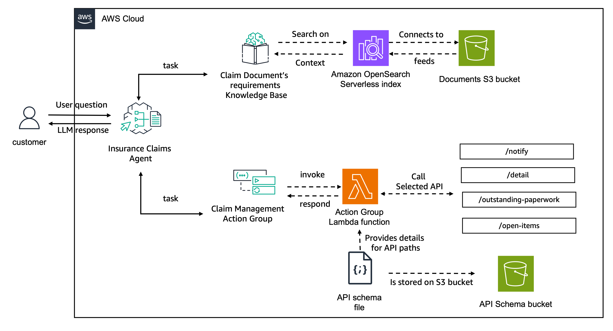

# Create Agents with API Schema
In this folder, we provide an example agent using [Amazon Bedrock Agents](https://aws.amazon.com/bedrock/agents/) integration with [API Schema](https://docs.aws.amazon.com/bedrock/latest/userguide/agents-api-schema.html) and Lambda functions.

When creating Agent’s action groups, you can define actions by providing the function details or passing an API Schema. When providing the API Schema, you can define actions more explicitly and map them to API operations in your system. This option requires your API schema file to have the [OpenAPI](https://swagger.io/specification/) format. You add the API schema to the action group in one of the following ways:

* Upload the schema that you create to an Amazon Simple Storage Service (Amazon S3) bucket.
* Write the schema in the inline OpenAPI schema editor in the AWS Management Console when you add the action group. This option is only available after the agent that the action group belongs to has already been created.

## The example agent implements an Insurance Claims Handler that can:

* Get open claims
* Get details for a certain claim
* Get missing paperwork for an existing claim
* Send reminder for an open claim identifying any missing documentation

The architecture of the created agent is as following:



The capabilities are described to the agent using an API Schema in the OpenAPI Schema format. 

The code below shows the format of a request for the get open claims functionality:
```json
{
  "paths": {
    "/open-items": {
      "get": {
        "summary": "Gets the list of all open insurance claims",
        "description": "Gets the list of all open insurance claims. Returns all claimIds that are open.",
        "operationId": "getAllOpenClaims",
        "responses": {
          "200": {
            "description": "Gets the list of all open insurance claims for policy holders",
            "content": {
              "application/json": {
                "schema": {
                  "type": "array",
                  "items": {
                    "type": "object",
                    "properties": {
                      "claimId": {
                        "type": "string",
                        "description": "Unique ID of the claim."
                      },
                      "policyHolderId": {
                        "type": "string",
                        "description": "Unique ID of the policy holder who has filed the claim."
                      },
                      "claimStatus": {
                        "type": "string",
                        "description": "The status of the claim. Claim can be in Open or Closed state."
                      }
                    }
                  }
                }
              }
            }
          }
        }
      }
    },
    "/open-items/{claimId}/outstanding-paperwork": {
      ...
    },
    ...
  }
}
```
This code shows an example of how to define API routes with an OpenAPI schema for a Bedrock Agents integration. It has a parent route "/open-items" and a child route that provides different information "/open-items/{claimId}/outstanding-paperwork". Defining these APIs allows your agent to know how and when to use your APIs to collect information.

When creating the Agent's Action Group, the schema definition is passed to the action group via the apiSchema parameter containing the s3 location of the API schema file:

```python
agent_action_group_response = bedrock_agent_client.create_agent_action_group(
    agentId=agent_id,
    agentVersion='DRAFT',
    actionGroupExecutor={
        'lambda': lambda_function['FunctionArn']
    },
    actionGroupName='ClaimManagementActionGroup',
    apiSchema={
        's3': {
            's3BucketName': bucket_name,
            's3ObjectKey': bucket_key
        }
    },
    description='Actions for listing claims, identifying missing paperwork, sending reminders'
)
```

The agent's actions are then implemented as part of an AWS Lambda function that receives the inputs from the Agent via an event.

The event has the following structure where apiPath provides the required path for the action required by the user:

```json
{
    "messageVersion": "1.0",
    "response": {
        "actionGroup": "string",
        "apiPath": "string",
        "httpMethod": "string",
        "httpStatusCode": number,
        "responseBody": {
            "<contentType>": {
                "body": "JSON-formatted string" 
            }
        }
    },
    "sessionAttributes": {
        "string": "string",
    },
    "promptSessionAttributes": {
        "string": "string"
    }
}
```

To process the action requested by the Agent, the following code is then added to the Lambda function:

```python
def get_named_parameter(event, name):
    return next(item for item in event['parameters'] if item['name'] == name)['value']


def get_named_property(event, name):
    return next(
        item for item in
        event['requestBody']['content']['application/json']['properties']
        if item['name'] == name)['value']

def lambda_handler(event, context):
    # Getting information from event
    action_group = event['actionGroup']
    api_path = event['apiPath']
    http_method = event['httpMethod']
    
    # getting parameters according to the http method
    if http_method == "get":
        claim_id = get_named_parameter(event, "claim_id")
    elif http_method == "post":
        claim_id = get_named_property(event, "claim_id")
    
    # setting expected response body
    response_body = {
        'application/json': {
            'body': "sample response"
        }
    }
    
    # Logic to process the request goes here
    ...

    # Lastly, return the response to the agent
    
    action_response = {
        'actionGroup': event['actionGroup'],
        'apiPath': event['apiPath'],
        'httpMethod': event['httpMethod'],
        'httpStatusCode': 200,
        'responseBody': response_body
    }
    
    api_response = {
        'messageVersion': '1.0', 
        'response': action_response
    }
        
    return api_response
```
This code collects the Agent's request, processes the request, and then formulates a response to return to the Agent. The response sent back can then be used to answer questions that the end user asks the Agent. 
