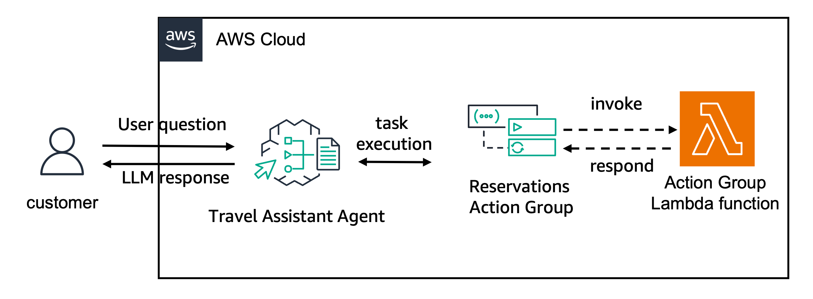

# Create Agents with memory

In this folder, we provide an example of travel agent using Amazon Bedrock Agents new capabilities for [memory](https://docs.aws.amazon.com/bedrock/latest/userguide/agents-memory.html).

When creating you agent, you can enable the memory capabilities using the `memoryConfiguration` parameter. You can then invoke you agent with a `memoryId` to track sessions and summarize them to your memory.

In this example we will create a test agent with the following architecture:




The code below shows how to configure the memory capabilities when creating your agent using the `create_agent` function from boto3 SDK. You should define the  `enabledMemoryTypes` (currently only `SESSION_SUMMARY` is available) and the `storageDays`.

```python
    response = bedrock_agent_client.create_agent(
        agentName=agent_name,
        agentResourceRoleArn=agent_role['Role']['Arn'],
        description=agent_description,
        idleSessionTTLInSeconds=1800,
        foundationModel=agent_foundation_model,
        instruction=agent_instruction,
        memoryConfiguration={
            "enabledMemoryTypes": ["SESSION_SUMMARY"],
            "storageDays": 30
        }
    )
```
When invoking your agent, you need to pass the `memoryId` parameter as well as a `sessionId`. 
```python
    # invoke the agent API
    agent_response = bedrock_agent_runtime_client.invoke_agent(
        inputText="User query to the agent",
        agentId="<AGENT_ID>",
        agentAliasId="<AGENT_ALIAS_ID>",
        sessionId="<SESSION_ID>",
        enableTrace=True or False,
        endSession=True or False,
        memoryId="Your memory id",
        ...
    )
```

Once you invoke the agent with the `endSession` flag set to `True`, the conversation with the same `sessionId` is summarized and made available to the agent's memory. You can use the `get_agent_memory` from the `bedrock-agent-runtime` boto3 SDK client to get the available memory for an agent

```python
    memory_content=bedrock_agent_runtime_client.get_agent_memory(
        agentAliasId="<AGENT_ALIAS_ID>",
        agentId="<AGENT_ID>",
        memoryId="<Same memory id used during the invoke agent calls",
        memoryType='SESSION_SUMMARY'
    )
```

And the `delete_agent_memory` to delete **the full** agent memory for a certain memory id.

```python
    response = bedrock_agent_runtime_client.delete_agent_memory(
        agentAliasId="<AGENT_ALIAS_ID>", 
        agentId="<AGENT_ID>",
        memoryId="<Same memory id used during the invoke agent calls",
    )
```
