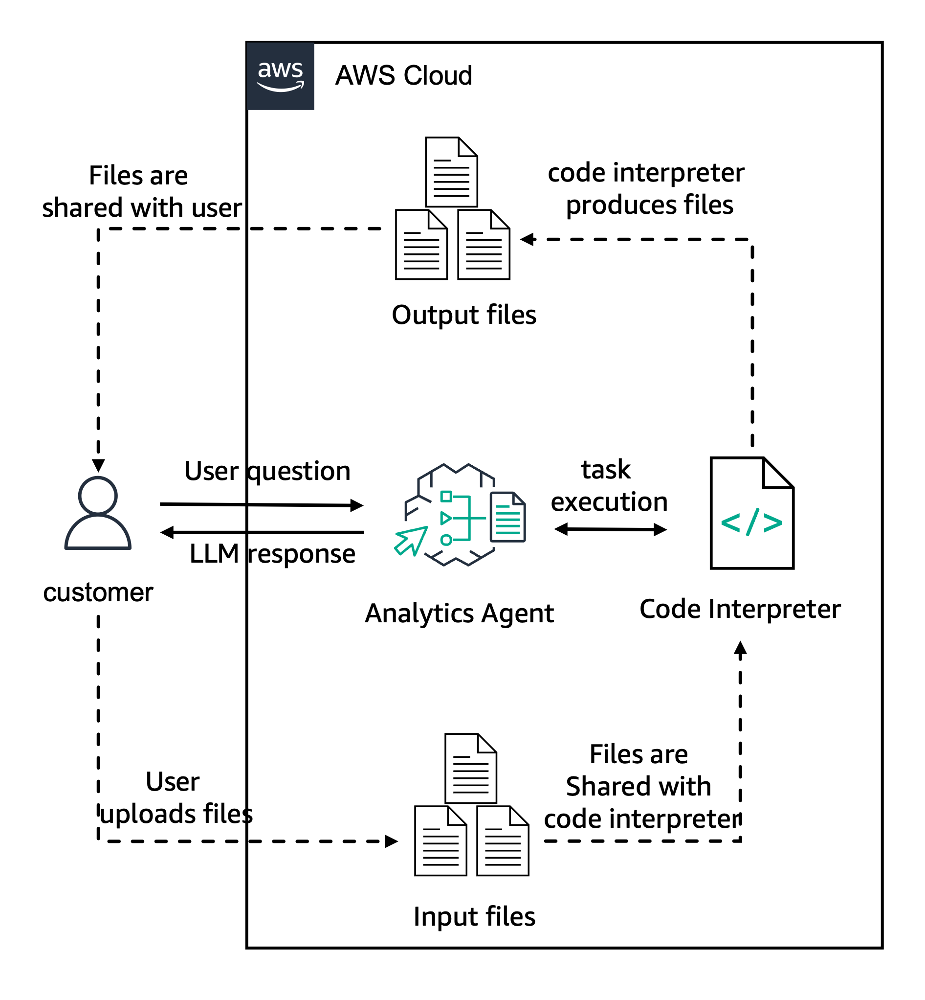

# Create Agents with code interpretation capabilities

In this folder, we provide an example of an analytics agent using Amazon Bedrock Agents new capabilities for [code interpretation](https://docs.aws.amazon.com/bedrock/latest/userguide/agents-code-interpretation.html).

The code interpreter is a sandboxed runtime environment in which the agent can run code. 

In this example we will create a test agent with the following architecture:



## Code interpretation

Code interpretation is made available to the agent via a pre-defined action group. Once the agent is created, you can enable the code interpretation capabilities via the `CreateAgentActionGroup` request using the `parentActionGroupSignature` parameter and setting it to `AMAZON.CodeInterpreter`.

The code below shows how to configure the code interpretation capabilities when creating your agent's action group using the `create_agent_action_group` function from [boto3 SDK](https://boto3.amazonaws.com/v1/documentation/api/latest/reference/services/bedrock-agent/client/create_agent_action_group.html). You should set the  `parentActionGroupSignature` to `AMAZON.CodeInterpreter` and the `actionGroupState` status to `ENABLED`. Note that you must leave the `description`, `apiSchema`, and `actionGroupExecutor` fields blank for this action group.

```python
    response = client.create_agent_action_group(
    actionGroupName='CodeInterpreterAction',
    actionGroupState='ENABLED',
    agentId='<YOUR_AGENT_ID>',
    agentVersion='<YOUR_AGENT_VERSION>',
    parentActionGroupSignature='AMAZON.CodeInterpreter'
)
```

When invoking your agent, should supply parameter including the query text, agent id, agent alias, and a session id. Other parameters allow enabling tracing, to see the details of the model's return communication stream, ending the session, optionally storing conversational memory, and maintaining a state for this session. Code interpretation, however, is not controlled by any parameter; the action group with `parentActionGroupSignature='AMAZON.CodeInterpreter'` makes it available to the agent and, on every invocation, the agent determines whether to use it or not.

```python
    if not session_state:
        session_state = {}
    # invoke the agent API
    agent_response = bedrock_agent_runtime_client.invoke_agent(
        inputText=query,
        agentId=agent_id,
        agentAliasId=alias_id,
        sessionId=session_id,
        enableTrace=enable_trace, 
        endSession=end_session,
        memoryId=memory_id,
        sessionState=session_state
    )    
    
    # Process the response stream (see below)
    process_response(agent_response)
```

## Sending files to the agent

To pass files to the agent, you must add them to the `sessionState`. You can include files from S3 or upload them directly - setti the `sourceType` to `S3` or `BYTE_CONTENT`, respectively. 

When sending files from S3, you specify the S3 location; when uploading them directly, include the file data and set the `mediaType` in the `byteContent`.

When sending files, the `useCase` indicates to the agent whether the file should be used by the agent directly (`CHAT`) or is intended for use in the code interpretation environment (`CODE_INTERPRETER`). For more information, see the [code interpretation documentation](https://docs.aws.amazon.com/bedrock/latest/userguide/agents-test-code-interpretation.html).

```json
"sessionState": {
        "promptSessionAttributes": {
            "string": "string"
        },
        "sessionAttributes": {
            "string": "string"
        },
        "files": [ 
            {
                "name": "<filename1>", 
                "source": { 
                    "sourceType": "S3", 
                    "s3Location": {
                        "uri": "s3Uri" 
                    }
                },
                "useCase": "CHAT" 
            },
            {
                "name": "<filename2>",
                "source": { 
                    "sourceType": "BYTE_CONTENT", 
                    "byteContent": {
                        "mediaType": "text/csv", 
                        "data": "<base64 encoded string>"
                    }
                },
                "useCase": "CHAT"
            }
        ]
    }         
```

This helper function is useful in building the session state to send files to the agent:

```python
# Return a session state populated with the files from the supplied list of filenames
def add_file_to_session_state(file_name, use_case='CODE_INTERPRETER', session_state=None):
    if use_case != "CHAT" and use_case != "CODE_INTERPRETER":
        raise ValueError("Use case must be either 'CHAT' or 'CODE_INTERPRETER'")
    if not session_state:
        session_state = {
            "files": []
        }
    type = file_name.split(".")[-1].upper()
    name = file_name.split("/")[-1]

    if type == "CSV":
        media_type = "text/csv" 
    elif type in ["XLS", "XLSX"]:
        media_type = "application/vnd.openxmlformats-officedocument.spreadsheetml.sheet"
    else:
        media_type = "text/plain"

    named_file = {
        "name": name,
        "source": {
            "sourceType": "BYTE_CONTENT", 
            "byteContent": {
                "mediaType": media_type,
                "data": open(file_name, "rb").read()
            }
        },
        "useCase": use_case
    }
    session_state['files'].append(named_file)

    return session_state
```

## Receiving files from the agent

The agent returns files in the `files` field of JSON response stream. Here is an example of a simple handler to save returned files. 

```python
def process_response(resp):
    if resp['ResponseMetadata']['HTTPStatusCode'] != 200:
        print(f"API Response was not 200: {resp}")

    event_stream = resp['completion']
    for event in event_stream:
        if 'files' in event.keys():
            files_event = event['files']
            files_list = files_event['files']
            for this_file in files_list:
                print(f"{this_file['name']} ({this_file['type']})")
                file_bytes = this_file['bytes']
                file_name = os.path.join('output', )
                with open(this_file['name'], 'wb') as f:
                    f.write(file_bytes)
```

The response stream contains trace events with considerable other information, including the agent's reasoning, inputs to the model invocation, code that the model generates and passes in to the code interpretation environment, and results of code execution in the code interpretation environment.  Refer to the `11-create-agent-with-code-interpreter.ipynb` notebook for more detailed implementation examples, including more elaborate `process_response()` functions.