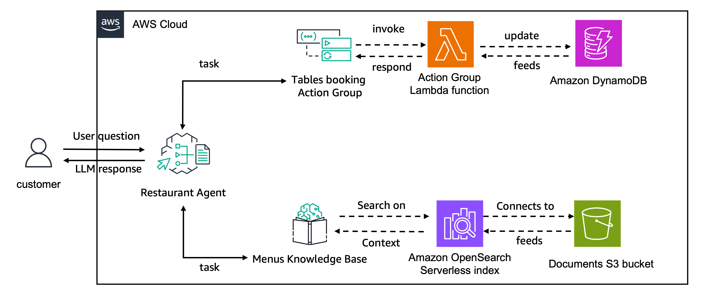

# Creating Agent models not yet optimized for Bedrock Agents

Amazon Bedrock Agents now supports all models from Amazon Bedrock so that you can create agents with any foundation model. Currently, some of the offered models are optimized with prompts/parsers fine-tuned for integrating with the agents architecture. Over time, we plan to offer optimization for all of the offered models.

If you’ve selected a model for which optimization is not yet available, you can override the prompts to extract better responses, and if needed, override the parsers. See [Modify parser Lambda function in Amazon Bedrock Agents](https://docs.aws.amazon.com/bedrock/latest/userguide/lambda-parser.html) for more information.

The prompts used by the not yet optimized models use the [Bedrock Converse API](https://docs.aws.amazon.com/bedrock/latest/APIReference/API_runtime_Converse.html) format with a system prompt as well the messages format. You can use [placeholder variables](https://docs.aws.amazon.com/bedrock/latest/userguide/prompt-placeholders.html) supported by Bedrock Agents in your prompt. Functions will be executed using the converseAPI `toolConfig` parameter. When the model returns a tool as output, Bedrock Agents will handle the tool execution if you connect a Lambda function or return the correct tools configuration if you opt to use [Return of Control](https://docs.aws.amazon.com/bedrock/latest/userguide/agents-returncontrol.html).

In this folder we provide an example of a Mistral Large model that has not yet been optimized for Bedrock Agents. As Mistral Large has not yet been optimized, we will override the orchestration prompt for better responses. We will use `$instruction$`, `$knowledge_base_additional_guideline$`, `$prompt_session_attributes$`, `$question$` and `$agent_scratchpad$` to overwrite our orchestration prompt

## Agent Architecture
In this example we will reuse the restaurant assistant agent that connects with a Knowledge Base for Amazon Bedrock containing the restaurant's different menus. 

This agent also connects to an action group that provides functionalities for handling the table booking in this restaurant. 

The action group created in this example uses [function details](https://docs.aws.amazon.com/bedrock/latest/userguide/agents-action-function.html) to define the functionalities for `create_booking`, `get_booking_details` and `delete_booking`. The action group execution connects with a Lambda function that interacts with an Amazon DynamoDB table.
