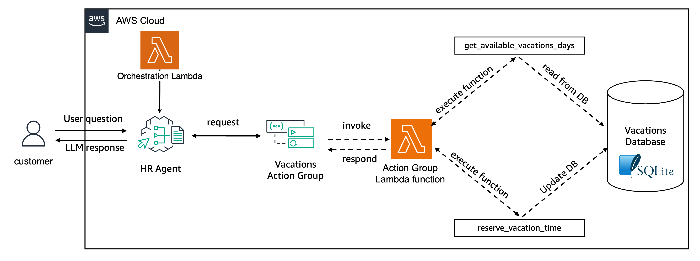

# Create Agents with Clear Box Orchestration

In this folder, we provide an example of an HR agent using [Amazon Bedrock Agents](https://aws.amazon.com/bedrock/agents/) new capabilities for [Clear Box Orchestration].

### What is Clear Box Orchestration
Clear Box Orchestration, AKA Bring Your Own Orchestrator (BYOO), allows the developer to specify an orchestrator lambda to provide their own orchestration. This lambda should be implemented as a re-entrant function which will accept a state, session variables, context (memory contents), tool definitions and agent definition. The lambda will output either a known state or a user defined state along with an output field, session variables and context. The output field structure will depend on the state. The following known states are ones we will define:
State - Output Structure
Start - Any
ModelInvocation - ConverseAPI Request
ToolUse - ConverseAPI ToolUse Respose Structure
FinalAnswer - Any
TraceEvent - Trace Event Structure for the even they want emitted

In this example, a custom orchestration using the ReWoo method will be created. ReWOO (Reasoning WithOut Observation) is a modular orchestration paradigm that detaches the reasoning process from external observations, which significantly reduces token consumption. This paradigm is not currently possible using Bedrock Agent's default orchestration. The following steps re required to implement a ReWoo Lambda orchestrator. 

1. Extract state, conversation_context, session, and input from event
2. Route based on state
    1. Start
        1. Create ReWooPrompt with tools
        2. Prepare Bedrock Converse API request
        3. Return ModelInvocation state and Converse API request.         
    2. ModelInvocation
        1. Extract plan from model response
        2. Parse plan tasks with parameters
        3. Get next task from plan
        4. Get Bedrock converse response for task function
        5. Set session with plan and step
        6. Return ToolUse state Bedrock response        
    3. ToolUse
        1. Extract plan from session
        2. If plan is not finished:
        3. Get next task from plan
        4. Build Bedrock converse response for task
        5. Set response session with plan and step
        6. Return ToolUse state and Bedrock respponse
    4. Fall Through
        1. Set response state to 'FinalAnswer'
        2. Set response blob_string to JSON of input

This example is built off the same HR Agent example given in feature example 01. Here is more information about the action group it uses.

The agent connects with an in-memory SQLite database that contains generated data about employee's available vacation days and planned time off. The architecture created is as following:


Where the vacation database has the following schema:

![Three tables: {employees, vacations, planned_vacations}, employees: {employee_id - INTEGER, employee_name - TEXT, employee_job_title - TEXT, employee_start_date - TEXT, employee_employment_status - TEXT}, vacations: {employee_id - INTEGER, year - INTEGER, employee_total_vacation_days - INTEGER, employee_vacation_days_taken - INTEGER, employee_vacation_days_available - INTEGER}, planned_vacations: {employee_id - INTEGER, vacation_start_date - TEXT, vacation_end_date - TEXT, vacation_days_taken - INTEGER}](images/HR_DB.png)

The agent allows the employee to `get_available_vacations_days` and `reserve_vacation_time` according to the employee's requests.

The code below shows the definition of the functions as a list of JSON objects that is passed to the Agent's Action group via the `functionSchema` parameter
```python
    agent_functions = [
        {
            'name': 'get_available_vacations_days',
            'description': 'get the number of vacations available for a certain employee',
            'parameters': {
                "employee_id": {
                    "description": "the id of the employee to get the available vacations",
                    "required": True,
                    "type": "integer"
                }
            }
        },
        {
            'name': 'reserve_vacation_time',
            'description': 'reserve vacation time for a specific employee',
            'parameters': {
                "employee_id": {
                    "description": "the id of the employee for which time off will be reserved",
                    "required": True,
                    "type": "integer"
                },
                "start_date": {
                    "description": "the start date for the vacation time",
                    "required": True,
                    "type": "string"
                },
                "end_date": {
                    "description": "the end date for the vacation time",
                    "required": True,
                    "type": "string"
                }
            }
        },
    ]
```

