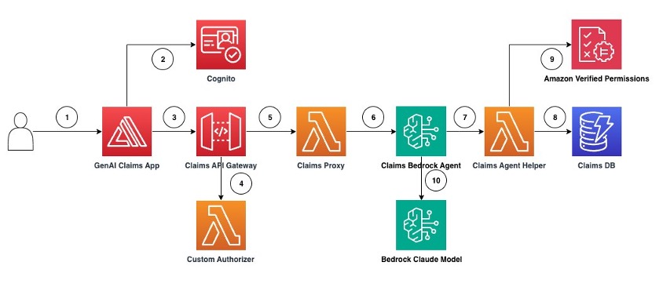
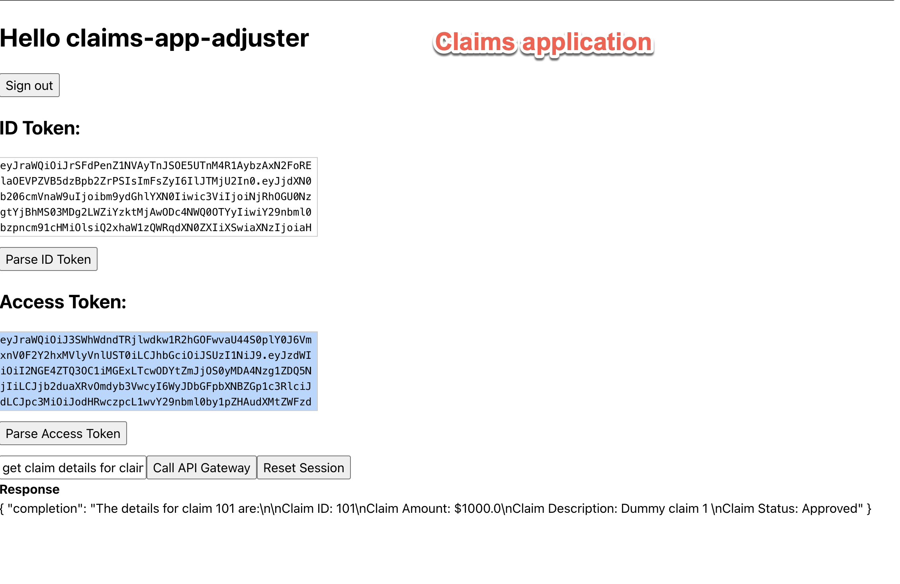
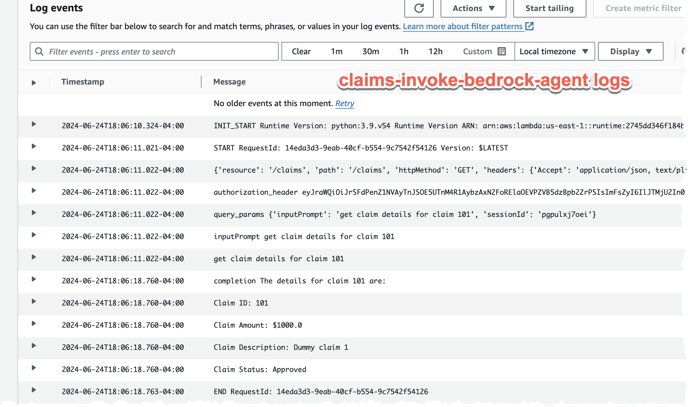
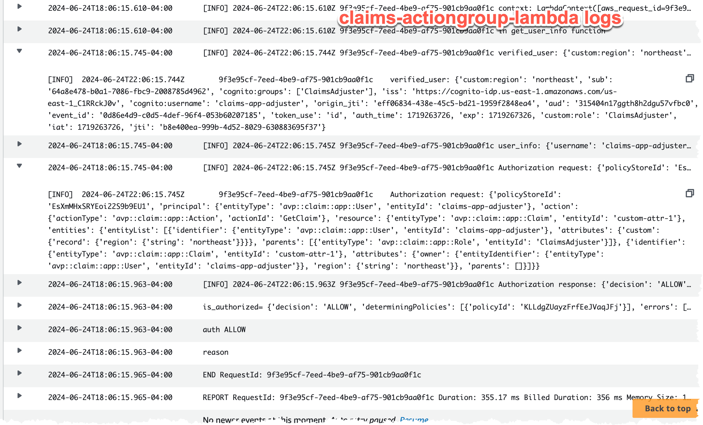

# Designing secure generative AI Application workflows with Amazon Verified Permissions and Agents for Bedrock

[Link AWS Blog: https://aws.amazon.com/blogs/aws/](https://aws.amazon.com/blogs/aws/) \
[Link to Amazon Verified Permissions: https://aws.amazon.com/verified-permissions/](https://aws.amazon.com/verified-permissions/)

This is sample code we will demonstrate how to design fine-grained access controls using Verified Permissions for a generative AI application that uses agents for Bedrock to answer questions about insurance claims that exist in a claims review system using textual prompts as inputs and outputs.


# **Architecture presented in this Repo:**


The architecture and flow of the sample application will be:



The application architecture flow is as follows:

1. User accesses the Generative AI Claims web application (App)
2. The App authenticates the user with the Amazon Cognito service and issues an ID Token and an Access Token. The ID token has the user's identity and custom attributes.
3. Using the App, the user sends a request asking the application to "list the open claims". The request is sent along with the user's ID Token and Access Token. The App calls the Claims API Gateway API to execute the Claims proxy passing user request and tokens.
4. Claims API Gateway runs the Custom Authorizer to validate the access token
5. When access token validation is successful, the Claims API Gateway sends the user request to the Claims Proxy
6. The Claims Proxy invokes the Bedrock Agent passing the user request and ID token. Bedrock agent is configured to use the Anthropic Claude model and to execute actions using the Claims Agent Helper Lambda function
7. Bedrock Agent leverages chain-of-thought-prompting and builds the list of API actions to execute with the help of Claims Agent Helper
8. The Claims Agent Helper retrieves Claim records from Claims DB and constructs claims list object
9. The Claims Agent Helper retrieves user's metadata(i.e. name, sub ) from ID token, builds the Verified Permissions data entities and makes the Verified Permissions authorization request. This request contains the principal (user/role), action (i.e. ListClaim) and resource (Claim). Verified Permissions evaluates the request against all Verified Permissions policies and return Allow or Deny decision. Subsequently, the Claims Agent Helper filters the claims based on that decision. Note that Verified Permissions has 'default deny' functionality; in the absence of an explicit allow, the service defaults to an implicit deny. If there is an explicit Deny in any of the policies involved in the request, Verified Permissions denies the request
10. The Claims Bedrock Agent receives the authorized list of claims, augments the prompt and sends it to Claude model for completion. The Agent returns the completion back to the caller.
# How to use this Repo:

## Prerequisites:

1. Amazon Bedrock Access and AWS CLI Credentials are configured.
2. Ensure that AWS CLI is installed on your machine. It can be downloaded [here](https://aws.amazon.com/cli/)
3. Ensure Python 3.9+ installed on your machine, it is the most stable version of Python for the packages we will be using, it can be downloaded [here](https://www.python.org/downloads/release/python-3911/).
4. Go to the Amazon Bedrock console, Click on Model Access, Select the Anthropic models and save changes. 
5. The solution was tested in us-east-1
6. AWS SAM CLI is installed. Instructions [here] (https://docs.aws.amazon.com/serverless-application-model/latest/developerguide/install-sam-cli.html)
7. Install Amplify CLI [here] (https://docs.amplify.aws/gen1/react/start/getting-started/installation/). If running in Cloud shell, you can use the below command:
```
   npm install -g @aws-amplify/cli
```

## Step 1:

The first step of utilizing this repo is performing a git clone of the repository and navigate to the folder.

```
$ git clone https://github.com/aws-samples/amazon-bedrock-samples.git

$ cd amazon-bedrock-samples/agents-for-bedrock/features-examples/09-fine-grained-access-permissions/
```

## Step 2:

Managing CLI parameters as Environment Variables.
Start with setting a default region. This code was tested in us-east-1.

```
$ aws configure set default.region us-east-1
$ export AWS_PROFILE=<profilename>

```


## Step 3:

The below step will use AWS SAM (Serverless Application Model) to create the following resources as Nested Stacks: 
1. Amazon Verified Permissions Policy Store and Policies
2. Cognito User Pool
3. Amazon Bedrock Agent
4. Amazon API Gateway
5. Cloud 9 Environment

Please ensure that your AWS CLI Profile has access to run CloudFormation and create resources!

```
$ sam build 

$ sam deploy --guided --capabilities CAPABILITY_IAM CAPABILITY_AUTO_EXPAND CAPABILITY_NAMED_IAM
```
When you run the command, AWS SAM will prompt for few questions, enter "claims-app" for the stack name and retain defaults for rest of the questions

### Step 4 - Set the environment variables 

```
#### Set the AWS region ####
$ AWS_REGION="us-east-1"

#### Get the User Pool ID ####
$ WS_USER_POOL_ID=$(aws cognito-idp list-user-pools --max-results 20 --query 'UserPools[?Name==`claims-app-userpool`].Id | [0]' --output text --region $AWS_REGION)

#### Get the Cognito Domain ####
$ WS_COGNITO_DOMAIN=$(aws cognito-idp describe-user-pool --user-pool-id $WS_USER_POOL_ID --query 'UserPool.Domain' --output text --region $AWS_REGION)

#### Get the User Pool Client ID ####
$ WS_USER_POOL_CLIENT_ID=$(aws cognito-idp list-user-pool-clients --user-pool-id $WS_USER_POOL_ID --query 'UserPoolClients[0].ClientId' --output text --region $AWS_REGION)

#### Get the User Pool ARN ####
$ WS_USER_POOL_ARN=$(aws cognito-idp describe-user-pool --user-pool-id $WS_USER_POOL_ID --query 'UserPool.Arn' --output text --region $AWS_REGION)

#### Get the React APP URL ####
$ REACT_APP_API_GATEWAY_URL=$(aws cloudformation describe-stacks --stack-name claims-app --query "Stacks[0].Outputs[?OutputKey=='APIEndpoint'].OutputValue" --output text --region $AWS_REGION )
```

## Step 5:

Set credentials in Amazon Cognito for test users follows: 

```
aws cognito-idp admin-set-user-password --user-pool-id $WS_USER_POOL_ID --username claims-app-adjuster --password <insert_password> --permanent
aws cognito-idp admin-set-user-password --user-pool-id $WS_USER_POOL_ID --username claims-app-admin    --password <insert_password> --permanent

```

## Step 6:

Run the below command to change to the frontend directory. Then run the following command to deploy the frontend application :

```
$ cd 005_Frontend
```
### Step 6.1 - Set the environment variables in env file

```
#### Set the .env file ####
$ rm .env
# Create the .env file
$ echo "AWS_REGION=$AWS_REGION" > .env
$ echo "WS_USER_POOL_ID=$WS_USER_POOL_ID" >> .env
$ echo "WS_COGNITO_DOMAIN=$WS_COGNITO_DOMAIN" >> .env
$ echo "WS_USER_POOL_CLIENT_ID=$WS_USER_POOL_CLIENT_ID" >> .env
$ echo "WS_USER_POOL_ARN=$WS_USER_POOL_ARN" >> .env
$ echo "REACT_APP_API_GATEWAY_URL"=$REACT_APP_API_GATEWAY_URL >> .env

#### install the dependencies ####
$ npm install react-scripts@latest
```

### Step 6.2 - Initialize Amplify project

The amplify init command is used to initialize a new Amplify project. This command sets up the project directory, configures deployment resources in the cloud, and prepares the project for further Amplify operations.

```
$ amplify init
```
You will enter "bedrocksecurity" for name of the project and follow the prompts. You can use the below to help you configure:
```
Enter a name for the project: bedrocksecurity

The following configuration will be applied:

Project information
| Name: bedrocksecurity
| Environment: dev
| Default editor: Visual Studio Code
| App type: javascript
| Javascript framework: react
| Source Directory Path: src
| Distribution Directory Path: build
| Build Command: npm run-script build
| Start Command: npm run-script start

Initialize the project with the above configuration? Yes

Using default provider  awscloudformation

Select the authentication method you want to use: AWS profile

For more information on AWS Profiles, see:
https://docs.aws.amazon.com/cli/latest/userguide/cli-configure-profiles.html

Please choose the profile you want to use oktank
Adding backend environment dev to AWS Amplify app: d5np40989zxhn
```
After initialization, you'll see deployment progress:
```
Deployment completed.
Deploying root stack bedrocksecurity [ ---------------------------------------- ] 0/4
        amplify-bedrocksecurity-dev-1… AWS::CloudFormation::Stack     CREATE_IN_PROGRESS             Sat May 18 2024 15:04:42…     
        AuthRole                       AWS::IAM::Role                 CREATE_IN_PROGRESS             Sat May 18 2024 15:04:44…     
        DeploymentBucket               AWS::S3::Bucket                CREATE_IN_PROGRESS             Sat May 18 2024 15:04:44…     
        UnauthRole                     AWS::IAM::Role                 CREATE_IN_PROGRESS             Sat May 18 2024 15:04:44…     
```
You'll be asked about sharing project configurations. Follow the prompts:
```
✔ Help improve Amplify CLI by sharing non-sensitive project configurations on failures (y/N) · no

    You can always opt-in by running "amplify configure --share-project-config-on"
```
Finally, you'll see confirmation messages:
```
Deployment state saved successfully.
✔ Initialized provider successfully.
✅ Initialized your environment successfully.
✅ Your project has been successfully initialized and connected to the cloud!
Some next steps:

"amplify status" will show you what you've added already and if it's locally configured or deployed
"amplify add <category>" will allow you to add features like user login or a backend API
"amplify push" will build all your local backend resources and provision it in the cloud
"amplify console" to open the Amplify Console and view your project status
"amplify publish" will build all your local backend and frontend resources (if you have hosting category added) and provision it in the cloud
```

Run this command to link the Cognito User pool that was created in CloudFormation to the Amplify application that we are deploying. This will ensure that the requests will be authenticated by the users in the Cognito userpool. 
```
$ amplify auth import
```
You will use the below details for configuration: 
```
What type of auth resource do you want to import? 

Cognito User Pool only

Select the User Pool you want to import: · 

claims-app-demo
```
You will then see this message:

```
✅ Cognito User Pool 'claims-app-userpool' was successfully imported.
```

### Step 6.3 - Add Amplify hosting 
```
$ amplify add hosting
```

### Step 6.4 - Publish Amplify project 

Run the below command to publish the project to AWS Amplify. You will use the below details for configuration: 
```
$ amplify publish
```
```
Select the plugin module to execute : 
Hosting with Amplify Console (Managed hosting with custom domains, Continuous deployment)

Choose a type:  Manual deployment

```


Deployment will complete with below information and a URL will be printed. : 
```
You can now publish your app using the following command:

When the amplify project is published, it should show a message like this with the url of the frontend application: 

✔ Deployment complete!

```
Make a note of the URL and use that to login to the depoloyed application. 


## Step 7:
At this time, please go to the AWS Bedrock console, then go to Model Access and add access to Claude 3 Sonnet under Anthropic models. This step important for the account to leverage the Claude 3 Sonnet model via Bedrock.


## Step 8:

You will login to the application with the username: claims-app-adjuster followed by the password set for the user. Upon login, you will see the claims application.



You can begin asking questions in textbox like using natural language questions like :

1. list all claims
2. get claim details for claim 101
3. update claim details for claim 101

You can head over the CloudWatch logs console to view the logs and observe how the Identity token is being sent to the bedrock agent. 

First observe logs for : Claims Iinvoke Bedrock Agent 



Followed by logs for : Claims Actiongroup Lambda 


