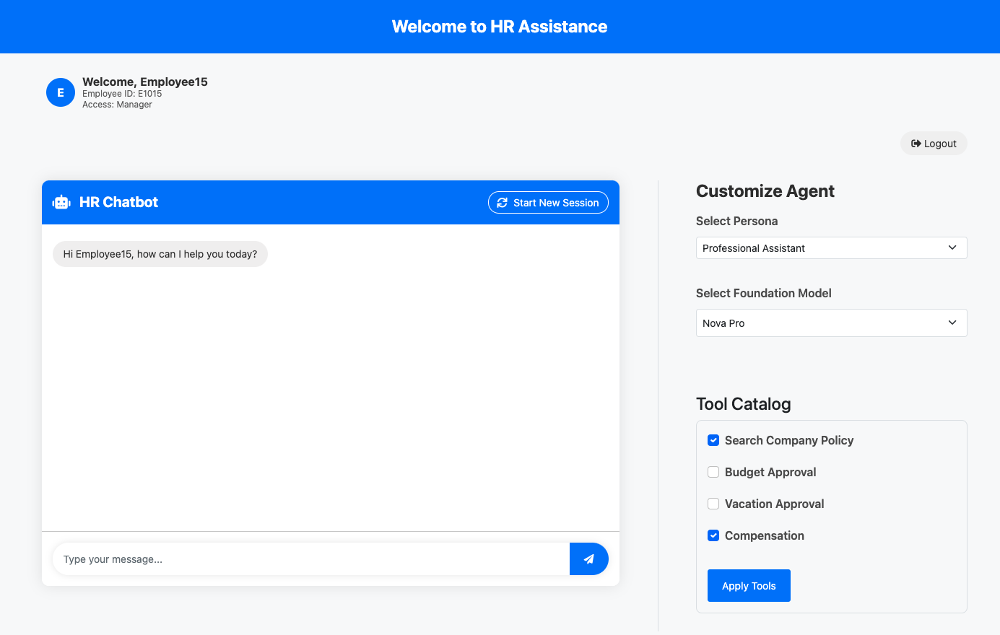
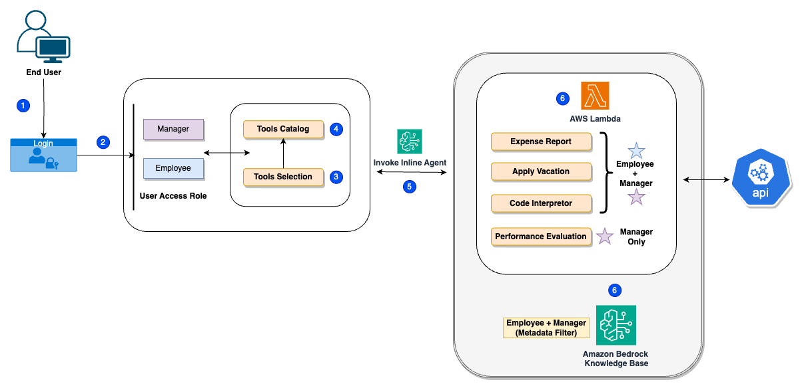

# Dynamic AI Assistant Demo using Amazon Bedrock Inline Agents

This demo showcases Amazon Bedrock's Inline Agents capability through a simple HR scenario with a Flask-based web interface. It demonstrates how a single AI assistant can dynamically adapt its capabilities, tools, and knowledge access based on user roles (Employee/Manager) at runtime.



## Demo Overview

The demo implements an HR Assistant that provides:
- **For Employees**: Access to vacation management, expense reports, and basic policy information
- **For Managers**: Additional access to compensation review and confidential HR policies
- **For All Users**: Code interpreter for data analysis

This demonstrates how Inline Agents can:
- Dynamically modify available tools during runtime
- Filter knowledge base access based on user roles
- Adapt to different user personas without redeploying the agent

## Architecture



## Prerequisites

1. **AWS Account** with access to Amazon Bedrock
2. **AWS CLI** configured with appropriate permissions
3. **Python 3.12+**
4. **Amazon Bedrock Model Access to**:
   - Anthropic Claude Models
   - Amazon Nova Models

## Resource Setup

Run `prerequisite.py` to create required AWS resources:

```bash
python prerequisite.py
```

This creates:

**1. Lambda Functions:**

* Compensation Management: Handles salary and bonus requests
* Vacation Management: Processes time-off requests
* Budget Management: Handles expense approvals

**2. Knowledge Base:**
* Creates a Knowledge Base with sample HR policies
* Uploads policy documents with role-based metadata
* Configures access filtering based on user roles

## Run flask application
Run `flask-application.py` and open the url in the browser to view and interact with application:

```bash
python flask-application.py
```

## Delete resource
```bash
python delete_resources.py
```

## License
This project is licensed under the MIT License - see the LICENSE file for details.