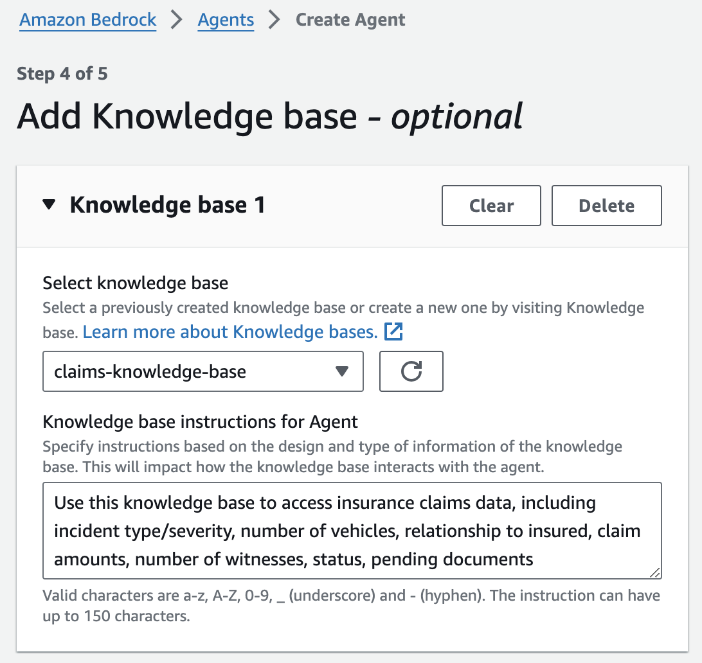

# Deployment Guide
---

## Content
- [Pre-Implementation](#pre-Implementation)
- [Create Knowledge Base](#create-knowledge-base)
- [Create Agent](#create-agent)
- [Testing and Validation](#testing-and-validation)

## Pre-Implementation
By default, [AWS CloudFormation](https://docs.aws.amazon.com/AWSCloudFormation/latest/UserGuide/Welcome.html) uses a temporary session that it generates from your user credentials for stack operations. If you specify a service role, CloudFormation will instead use that role's credentials.

To deploy this solution, your IAM user/role or service role must have permissions to deploy the resources specified in the CloudFormation template. For more details on [AWS Identity and Access Management](https://docs.aws.amazon.com/IAM/latest/UserGuide/introduction.html) (IAM) with CloudFormation, please refer to the [AWS CloudFormation User Guide](https://docs.aws.amazon.com/AWSCloudFormation/latest/UserGuide/using-iam-template.html).

You must also have [AWS Command Line Interface](https://aws.amazon.com/cli/) (CLI) installed. For instructions on installing AWS CLI, please see [Installing, updating, and uninstalling the AWS CLI](https://docs.aws.amazon.com/cli/latest/userguide/cli-chap-install.html).

### Clone [_amazon-bedrock-samples_](https://github.com/aws-samples/amazon-bedrock-samples) Repository
1. Create a local copy of the **amazon-bedrock-samples** repository using _git clone_:

```sh
git clone https://github.com/aws-samples/amazon-bedrock-samples.git
```

#### Optional - Run Security Scan on the AWS CloudFormation Templates
To run a security scan on the AWS CloudFormation templates using [`cfn_nag`](https://github.com/stelligent/cfn_nag) (recommended), you have to install `cfn_nag`:

```sh
brew install ruby brew-gem
brew gem install cfn-nag
```

To initiate the security scan, run the following command:
```sh
# git clone https://github.com/aws-samples/amazon-bedrock-samples
cd amazon-bedrock-samples/agents-and-function-calling-for-bedrock/use-case-examples/insurance-claim-lifecycle-automation
cfn_nag_scan --input-path cfn/bedrock-customer-resources.yml
```

### Deploy CloudFormation Stack to Emulate Existing Customer Resources 
To emulate the existing customer resources utilized by the agent, this solution uses the [create-customer-resources.sh](../shell/create-customer-resources.sh) shell script to automate provisioning of the parameterized CloudFormation template, [bedrock-customer-resources.yml](../cfn/bedrock-customer-resources.yml), to deploy the following resources:

> - [Amazon DynamoDB](https://docs.aws.amazon.com/amazondynamodb/latest/developerguide/Introduction.html) table populated with synthetic [claims data](../agent/lambda/data-loader/claims.json).
> - Three [AWS Lambda](https://docs.aws.amazon.com/lambda/latest/dg/welcome.html) functions that represent customer business logic for creating claims, sending pending document reminders for open status claims, and gathering evidence on new and existing claims.
> - Two Lambda layers for Amazon Bedrock Boto3 and [cfnresponse](https://pypi.org/project/cfnresponse/) libraries.
> - Amazon S3 bucket containing API documentation in OpenAPI schema format for the preceding Lambda functions and the repair estimates, claim amounts, company FAQs, and required claim document descriptions to be used as our [knowledge base data source assets](../agent/knowledge-base-assets).
> - [Amazon Simple Notification Service](https://docs.aws.amazon.com/sns/latest/dg/welcome.html) (SNS) topic to which policy holders' emails are subscribed for email alerting of claim status and pending actions.
> - AWS IAM permissions for the preceding resources.

CloudFormation prepopulates stack parameters with the default values provided in the template. To provide alternative input values, you can specify parameters as environment variables that are referenced in the `ParameterKey=<ParameterKey>,ParameterValue=<Value>` pairs in the _create-customer-resources.sh_ shell script's `aws cloudformation create-stack` command. 

1. Before you run the shell script, navigate to the directory where you cloned the _amazon-bedrock-samples_ repository and modify the shell script permissions to executable:

```sh
# If not already cloned, clone the remote repository (https://github.com/aws-samples/amazon-bedrock-samples) and change working directory to shell folder:
cd amazon-bedrock-samples/agents-and-function-calling-for-bedrock/use-case-examples/insurance-claim-lifecycle-automation/shell/
chmod u+x create-customer-resources.sh
```

2. Set your CloudFormation stack name, SNS email, and evidence upload URL environment variables. The SNS email will be used for policy holder notifications and the evidence upload URL will be shared with policy holders to upload their claims evidence. The [insurance claims processing sample](https://github.com/aws-samples/serverless-eda-insurance-claims-processing/tree/main) provides an example frontend for the evidence upload URL:

```sh
export STACK_NAME=<YOUR-STACK-NAME> # Stack name must be lower case for S3 bucket naming convention
export SNS_EMAIL=<YOUR-POLICY-HOLDER-EMAIL> # Email used for SNS notifications
export EVIDENCE_UPLOAD_URL=<YOUR-EVIDENCE-UPLOAD-URL> # URL provided by the agent to the policy holder for evidence upload
export AWS_REGION=<YOUR-STACK-REGION> # Stack deployment region
```

3. Run the _create-customer-resources.sh_ shell script to deploy the emulated customers resources defined in the _bedrock-customer-resources.yml_ CloudFormation template. These are the resources on which the agent and knowledge base will be built:

```sh
source ./create-customer-resources.sh
```

The preceding `source ./create-customer-resources.sh` shell command runs the following AWS CLI commands to deploy the emulated customer resources stack:

```sh
export ACCOUNT_ID=$(aws sts get-caller-identity --query Account --output text)
export ARTIFACT_BUCKET_NAME=$STACK_NAME-customer-resources
export DATA_LOADER_KEY="agent/lambda/data-loader/loader_deployment_package.zip"
export CREATE_CLAIM_KEY="agent/lambda/action-groups/create_claim.zip"
export GATHER_EVIDENCE_KEY="agent/lambda/action-groups/gather_evidence.zip"
export SEND_REMINDER_KEY="agent/lambda/action-groups/send_reminder.zip"

aws s3 mb s3://${ARTIFACT_BUCKET_NAME} --region ${AWS_REGION}
aws s3 cp ../agent/ s3://${ARTIFACT_BUCKET_NAME}/agent/ --region ${AWS_REGION} --recursive --exclude ".DS_Store"

export BEDROCK_AGENTS_LAYER_ARN=$(aws lambda publish-layer-version \
    --layer-name bedrock-agents-and-function-calling \
    --description "Agents for Bedrock Layer" \
    --license-info "MIT" \
    --content S3Bucket=${ARTIFACT_BUCKET_NAME},S3Key=agent/lambda/lambda-layer/bedrock-agents-and-function-calling-layer.zip \
    --compatible-runtimes python3.11 \
    --region ${AWS_REGION} \
    --query LayerVersionArn --output text)

export CFNRESPONSE_LAYER_ARN=$(aws lambda publish-layer-version \
    --layer-name cfnresponse \
    --description "cfnresponse Layer" \
    --license-info "MIT" \
    --content S3Bucket=${ARTIFACT_BUCKET_NAME},S3Key=agent/lambda/lambda-layer/cfnresponse-layer.zip \
    --compatible-runtimes python3.11 \
    --region ${AWS_REGION} \
    --query LayerVersionArn --output text)

aws cloudformation create-stack \
--stack-name ${STACK_NAME} \
--template-body file://../cfn/bedrock-customer-resources.yml \
--parameters \
ParameterKey=ArtifactBucket,ParameterValue=${ARTIFACT_BUCKET_NAME} \
ParameterKey=DataLoaderKey,ParameterValue=${DATA_LOADER_KEY} \
ParameterKey=CreateClaimKey,ParameterValue=${CREATE_CLAIM_KEY} \
ParameterKey=GatherEvidenceKey,ParameterValue=${GATHER_EVIDENCE_KEY} \
ParameterKey=SendReminderKey,ParameterValue=${SEND_REMINDER_KEY} \
ParameterKey=BedrockAgentsLayerArn,ParameterValue=${BEDROCK_AGENTS_LAYER_ARN} \
ParameterKey=CfnresponseLayerArn,ParameterValue=${CFNRESPONSE_LAYER_ARN} \
ParameterKey=SNSEmail,ParameterValue=${SNS_EMAIL} \
ParameterKey=EvidenceUploadUrl,ParameterValue=${EVIDENCE_UPLOAD_URL} \
--capabilities CAPABILITY_NAMED_IAM \
--region ${AWS_REGION}

aws cloudformation describe-stacks --stack-name $STACK_NAME --region ${AWS_REGION} --query "Stacks[0].StackStatus"
```

## Create Knowledge Base
Knowledge Bases for Amazon Bedrock leverage Retrieval Augmented Generation (RAG), a technique that harnesses customer data stores to enhance responses generated by foundation models. Knowledge bases allow agents to access existing customer data repositories without extensive administrator overhead. To connect a knowledge base to your data, you specify an S3 bucket as the [data source](https://docs.aws.amazon.com/bedrock/latest/userguide/knowledge-base-ingest.html). By employing knowledge bases, applications gain enriched contextual information, streamlining development through a fully-managed RAG solution. This level of abstraction accelerates time-to-market by minimizing the effort of incorporating your data into agent functionality and it optimizes cost by negating the necessity for continuous model retraining to leverage private data.

<p align="center">
  <br>
  <span style="display: block; text-align: center;"><em>Diagram 2: Knowledge Bases for Amazon Bedrock Architecture Overview</em></span>
</p>

Knowledge base functionality is delineated through two key processes:

**Pre-Processing Data:**

> 1. Documents undergo segmentation ("chunking") into manageable sections.
> 2. Those chunks are then converted into embeddings using an Amazon Bedrock embedding model.
> 3. The embeddings are utilized to create a vector index, enabling semantic similarity comparisons between user queries and data source text.
     
**Runtime Execution:**

> 4. During runtime, users provide their text input as a prompt.
> 5. User input text is transformed into vectors using an Amazon Bedrock embedding model.
> 6. The vector index is queried for chunks related to the user's query, augmenting the user prompt with additional context retrieved from the vector index.
> 7. The augmented prompt, coupled with the additional context, is then used to generate a response for the user.

### Deploy Knowledge Base

1. Navigate to the [Amazon Bedrock > Knowledge base > Create knowledge base console](https://us-east-1.console.aws.amazon.com/bedrock/home?region=us-east-1#/knowledge-bases/create-knowledge-base):

    a. Under **Provide knowledge base details**, enter a name and the following optional description, leaving all other default settings:
    ```
    Use to retrieve claim amount and repair estimate information for claim ID, or answer general insurance questions about things like coverage, premium, policy, rate, deductible, accident, and documents
    ```
    b. Under **Set up data source**, enter a name then choose _Browse S3_ and select the 'knowledge-base-assets' folder of the data source S3 bucket you deployed in the preceding deployment step (e.g., \<YOUR-STACK-NAME>-customer-resources/agent/knowledge-base-assets/):

    <p align="center">
      <br>
      <span style="display: block; text-align: center;"><em>Figure 1: Knowledge Base Data Source Configuration</em></span>
    </p>

    c. Under **Select embeddings model and configure vector store**, select _Titan Embeddings G1 - Text_ and leave the other default settings. An [OpenSearch Serverless collection](https://docs.aws.amazon.com/opensearch-service/latest/developerguide/serverless-vector-search.html) will be created for you. This vector store is where the knowledge base pre-processing embeddings are stored and later used for semantic similarity search between queries and data source text.

    d. Under **Review and create**, confirm your configuration settings then select **Create knowledge base**:

<p align="center">
  <br>
  <span style="display: block; text-align: center;"><em>Figure 2: Knowledge Base Configuration Settings</em></span>
</p>

2. Once your knowledge base is created, a green "created successfully" banner will display with the option to sync your data source. Select **Sync** to initiate the data source sync:

<p align="center">
  <br>
  <span style="display: block; text-align: center;"><em>Figure 3: Knowledge Base Data Source Sync</em></span>
</p>

3. Navigate to the [Knowledge Bases for Amazon Bedrock console](https://us-east-1.console.aws.amazon.com/bedrock/home?region=us-east-1#/knowledge-bases), select the knowledge base you just created, then note the **Knowledge base ID** under Knowledge base overview:

<p align="center">
  <br>
  <span style="display: block; text-align: center;"><em>Figure 4: Knowledge Base Overview</em></span>
</p>

4. With your knowledge base still selected in the knowledge base console, select your knowledge base data source listed under **Data source**, then note the **Data source ID** under _Data source overview_:

<p align="center">
  <br>
  <span style="display: block; text-align: center;"><em>Figure 5: Knowledge Base Data Source Overview</em></span>
</p>

❗ Knowledge base ID and Data source ID will be used as environment variables in the later _Deploy Streamlit Web UI for Your Agent_ section.

## Create Agent
Agents operate through a build-time execution process, comprising several key components:

- **Foundation Model:** Users select a foundation model that guides the agent in interpreting user inputs, generating responses, and directing subsequent actions during its orchestration process.
- **Instructions:** Users craft detailed instructions that outline the agent's intended functionality. Optional advanced prompts allow customization at each orchestration step, incorporating Lambda functions to parse outputs.
- **(Optional) Action Groups:** Users define actions for the agent, leveraging an OpenAPI schema to define APIs for task execution and Lambda functions to process API inputs and outputs.
- **(Optional) Knowledge Bases:** Users can associate agents with knowledge bases, granting access to additional context for response generation and orchestration steps.

The agent in this sample solution will use an Anthropic Claude V2.1 foundation model, a set of instructions, three action groups, and one knowledge base.

### Deploy Agent

1. Navigate to the [Amazon Bedrock > Agents > Create Agent console](https://us-east-1.console.aws.amazon.com/bedrock/home?region=us-east-1#/agents/create):

    a. Under **Provide Agent details**, enter an agent name and optional description, leaving all other default settings.

    b. Under **Select model**, select _Anthropic Claude V2.1_ and specify the following instructions for the agent, then select **Next**:
    ```
    You are an insurance agent that has access to domain-specific insurance knowledge. You can create new insurance claims, send pending document reminders to policy holders with open claims, and gather claim evidence. You can also retrieve claim amount and repair estimate information for a specific claim ID or answer general insurance questions about things like coverage, premium, policy, rate, deductible, accident, documents, resolution, and condition. You can answer internal questions about things like which steps an agent should follow and the company's internal processes. You can respond to questions about multiple claim IDs within a single conversation.
    ```

    c. Under **Add Action groups**, add the following three action groups then select **Next**:

    **Action group 1 - create-claim:**
   
    > i. **Description:** Use this action group to create an insurance claim.
    > 
    > ii. Under **Select Lambda function**, choose _<YOUR-STACK-NAME>-CreateClaimFunction_.
    > 
    > iii. Under **Select API schema**, choose _Browse S3_, pick the bucket created during the preceding deployment step (e.g., \<YOUR-STACK-NAME>-customer-resources), then select _agent/api-schema/create_claim.json_.

    <p align="center">
      <br>
      <span style="display: block; text-align: center;"><em>Figure 6: Action Group Configuration</em></span>
    </p>

    **Action group 2 - gather-evidence:**

    > i. **Description:** Use this action group to send the user a URL for evidence upload on open status claims with pending documents. Return the documentUploadUrl to the user.
    > 
    > ii. Under **Select Lambda function**, choose _<YOUR-STACK-NAME>-GatherEvidenceFunction_.
    > 
    > iii. Under **Select API schema**, choose _Browse S3_, pick the bucket created during the preceding deployment step, then select _agent/api-schema/gather_evidence.json_.

    **Action group 3 - send-reminder:**

    > i. **Description:** Use this action group to check claim status, identify missing or pending documents, and send reminders to policy holders.
    >
    > ii. Under **Select Lambda function**, choose _<YOUR-STACK-NAME>-SendReminderFunction_.
    > 
    > iii. Under **Select API schema**, choose _Browse S3_, pick the bucket created during the preceding deployment step, then select _agent/api-schema/send_reminder.json_.

    d. Under **Add Knowledge base**:

    > i. Under **Select knowledge base**, select the knowledge base you created in the preceding deployment step (e.g., claims-knowledge-base).
    >
    > ii. Under **Knowledge base instructions for Agent**, enter the following then select **Next**:

    ```
    Use to retrieve claim amounts and repair estimates for a specific claim ID, or answer general insurance questions about things like coverage, premium, policy, rate, deductible, accident, and documents
    ```
   
    <p align="center">
      <br>
      <span style="display: block; text-align: center;"><em>Figure 7: Agent Knowledge Base Configuration</em></span>
    </p>

    e. Under **Review and create**, confirm your configuration settings then select **Create Agent**: 

<p align="center">
  <br>
  <span style="display: block; text-align: center;"><em>Figure 8: Agent Configuration Settings</em></span>
</p>

Once your agent is created, you will see a green "successfully created" banner.

<p align="center">
  <br>
  <span style="display: block; text-align: center;"><em>Figure 9: Agent Successfully Created Banner</em></span>
</p>

With your agent and knowledge base successfully created, continue to [Testing and Validation](../documentation/testing-and-validation.md).

## Testing and Validation
see [Testing and Validation](../documentation/testing-and-validation.md)

---

## README
see [README](../README.md)

---

Copyright Amazon.com, Inc. or its affiliates. All Rights Reserved.
SPDX-License-Identifier: MIT-0
