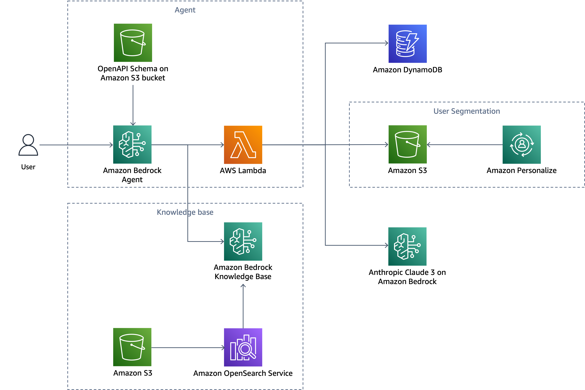
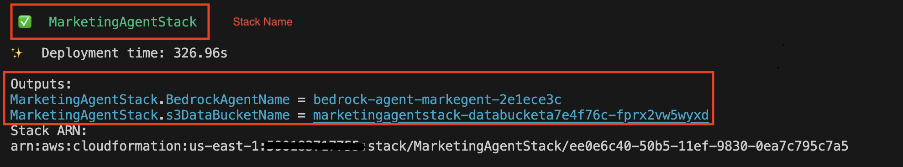

# Bedrock agent for generating marketing content

## Introduction

Marketing effectiveness hinges heavily on creative content, with personalized material proving especially impactful. However, crafting such tailored content has long been a formidable obstacle for marketers, demanding significant time and resources. This challenge is particularly acute for small and medium-sized businesses (SMBs), where scaling personalized content creation can seem insurmountable. Enter generative AI: a game-changing technology that empowers marketers to produce personalized creative content efficiently and at scale, even with constrained resources. This innovation is democratizing personalized marketing, allowing businesses of all sizes to compete more effectively in the digital landscape.


## Architecture



Amazon Bedrock Agents is a crucial tool in developing our marketing agent. This feature allows for the creation and configuration of autonomous agents within your application. These agents coordinate interactions between Foundation Models (FMs), various data sources, software applications, and user conversations. They can automatically invoke APIs to perform actions and access knowledge bases to enhance the information needed for these tasks. You have the flexibility to define custom actions for the agent and specify how to handle them by creating AWS Lambda functions in your preferred programming language. For comprehensive information, please consult the [Amazon Bedrock Agents documentation](https://docs.aws.amazon.com/bedrock/latest/userguide/agents.html).

To simplify the process, the CDK has prepared sample data within following folders is generate and download from [retail demo store](https://github.com/aws-samples/retail-demo-store/tree/master), we generate those file through [generator](https://github.com/aws-samples/retail-demo-store/tree/master/generators) and you can download the image file to `data/image` from [images](https://code.retaildemostore.retail.aws.dev/images.tar.gz).

You can directly download the files we generated and processed from [data](https://aws-blogs-artifacts-public.s3.amazonaws.com/artifacts/ML-16145/data.zip) and uncompress it which includes:
- `data/agent-schema`:
  - Contains the OpenAPI format for Bedrock Agent. Defines how to interact with the Lambda function.
- `data/dynamodb`:
  - Contains user and item tables data for uploading to S3 and importing into DynamoDB.Used for querying user and product information.
- `data/context`:
  - Provides marketing context for LLMs with information on 10 test products.
- `data/personalize`:
  - Includes Amazon Personalize batch inference results with user segmentation and sample output data incldues the same 10 products as in the context folders.

And then you can download the image file to `data/image` from [images](https://code.retaildemostore.retail.aws.dev/images.tar.gz).
- `data/image`:
  - Contains images of the products for easy reference by LLMs.

## Prerequisites

Before installing the AWS CDK, ensure you have the following:

- Node.js (version 20.15.1 or later)
- npm (usually comes with Node.js)
- Python 3.9 or higher and pip and virtualenv
- Docker 27.0.3 or higher
- AWS CLI [installed](https://docs.aws.amazon.com/cli/latest/userguide/getting-started-install.html) and [configured](https://docs.aws.amazon.com/cli/latest/userguide/cli-chap-configure.html)
- [AWS CDK v2](https://docs.aws.amazon.com/cdk/v2/guide/getting_started.html#getting_started_install) installed
- An AWS account with the following permissions:
  - Create and manage IAM roles and policies.
  - Create and invoke AWS Lambda functions.
  - Create, Read from, and Write to Amazon S3 buckets.
  - Access and manage Amazon Bedrock agents and models.
  - Create and manage Amazon DynamoDB.
  - Create and manage OpenSearch Serverless Collection.
  - Enable and able to access to Amazon Bedrock foundation models 
    - Anthropic’s Claude 3 haiku model for this solution

## Installation

Please NOTE: The CDK will ONLY deploy in **us-east-1** region.

1. Clone the repository to your local machine or AWS environment, set up a virtual environment and activate it , download related data and install required Python packages using below code:
```bash
git clone https://github.com/aws-samples/amazon-bedrock-samples.git
cd ./amazon-bedrock-samples/agents-and-function-calling-for-bedrock/use-case-examples/marketing-agent
python3 -m venv .venv
source .venv/bin/activate
pip install -r requirements-dev.txt
wget https://aws-blogs-artifacts-public.s3.amazonaws.com/artifacts/ML-16145/data.zip
unzip data.zip
wget https://code.retaildemostore.retail.aws.dev/images.tar.gz
mkdir -p data/image
tar xf images.tar.gz -C data/image
```

2. Deploymant

```bash
cdk deploy
```

## Testing the agent via AWS Console

1. Find out he agent name on output of `cdk deploy`. For example:



The bedrock agent name is `bedrock-agent-markegent-2e1ece3c`

2. Follow the [document](https://docs.aws.amazon.com/bedrock/latest/userguide/agents-test.html) to test the bedrock.


Enter following message and choose `Run`

`I would like to create marketing content for Sans pareil scarf (e1669081-8ffc-4dec-97a6-e9176d7f6651) which post on social media. Please help me write marketing context.`

Following is a sample test result:


## Cleaning Up

Please **empty** the s3 bucket before running following command. You can find the s3 bucket name on the command output of `cdk deploy`. Once done, you can issue following command to clean up the resources.

```bash
cdk destroy
```

