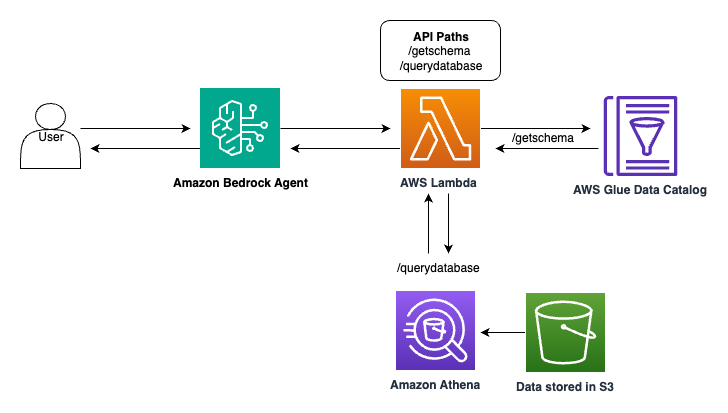

<h1 align="center">Text to SQL Bedrock Agent</h1>

## Authors:
**Pedram Jahangiri** @jpedram, **Sawyer Hirt** @sawyehir, **Zeek Granston** @zeekg, **Suyin Wang** @suyinwa

## Reviewer:
**Maira Ladeira Tanke** @mttanke

## Introduction
Harnessing the power of natural language processing, the "Text to SQL Bedrock Agent" facilitates the automatic transformation of natural language questions into executable SQL queries. This tool bridges the gap between complex database structures and intuitive human inquiries, enabling users to effortlessly extract insights from data using simple English prompts. It leverages AWS Bedrock's cutting-edge agent technology and exemplifies the synergy between AWS's robust infrastructure and advanced large language models offered in AWS bedrock, making sophisticated data analysis accessible to a wider audience.
This repository contains the necessary files to set up and test a Text to SQL conversion using the Bedrock Agent with AWS services.

## Use case
The code here sets up an agent capable of crafting SQL queries from natural language questions. It then retrieves responses from the database, providing accurate answers to user inquiries. The diagram below outlines the high-level architecture of this solution.

The Agent is designed to:
- Retrieve database schemas
- Execute SQL queries

## Prerequisites

Before you begin, ensure you have the following:
- An AWS account with the following permissions:
  - Create and manage IAM roles and policies.
  - Create and invoke AWS Lambda functions.
  - Create, read from, and write to Amazon S3 buckets.
  - Access and manage Amazon Bedrock agents and models.
  - Create and manage Amazon Glue databases and crawlers.
  - Execute queries and manage workspaces in Amazon Athena.
  - Access to Amazon Bedrock foundation models (Anthropic’s Claude 3 Sonnet model for this solution)

- For local setup, 
        - Python and Jupyter Notebooks installed
        - AWS CLI installed and configured
- For AWS SageMaker 
    - Make sure your domain has above permission 
    - Use Data Science 3.0 kernel in SageMaker Studio

## Installation

Clone the repository to your local machine or AWS environment

## Usage

1. Start by opening the `create_and_invoke_sql_agent.ipynb` Jupyter Notebook.
2. Run the notebook cells in order. The notebook will:
   - Import configurations from `config.py`.
   - Set your own 'AWS_PROFILE' 
   - Build the necessary infrastructure using `build_infrastructure.py`, which includes:
     - S3 buckets
     - Lambda functions
     - Bedrock agents
     - Glue databases and crawlers
     - Necessary IAM roles and policies
3. After the infrastructure is set up, you can execute sample queries within the notebook to test the agent.
4. To delete all resources created and avoid ongoing charges, run the clean.py script, in the notebook.

