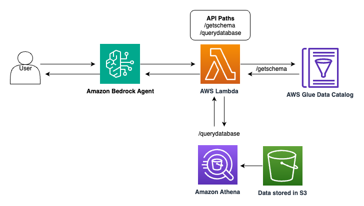

<h1 align="center">Text to SQL Bedrock Agent</h1>


## Authors:
**Pedram Jahangiri** @jpedram, **Sawyer Hirt** @sawyehir, **Zeek Granston** @zeekg, **Suyin Wang** @suyinwa

## Reviewer:
**Maira Ladeira Tanke** @mttanke


## Introduction
Harnessing the power of natural language processing, the "Text to SQL Bedrock Agent" facilitates the automatic transformation of natural language questions into executable SQL queries. This tool bridges the gap between complex database structures and intuitive human inquiries, enabling users to effortlessly extract insights from data using simple English prompts. It leverages AWS Bedrock's cutting-edge agent technology and exemplifies the synergy between AWS's robust infrastructure and advanced large language models offered in AWS bedrock, making sophisticated data analysis accessible to a wider audience.
This repository contains the necessary files to set up and test a Text to SQL conversion using the Bedrock Agent with AWS services.



## Use case
The code here sets up an agent capable of crafting SQL queries from natural language questions. It then retrieves responses from the database, providing accurate answers to user inquiries. The diagram below outlines the high-level architecture of this solution.


The Agent is designed to:
- Retrieve database schemas
- Execute SQL queries


## Prerequisites

Before you begin, ensure you have the following:
- An AWS account with the following permissions:
  - Create and manage IAM roles and policies.
  - Create and invoke AWS Lambda functions.
  - Create, read from, and write to Amazon S3 buckets.
  - Access and manage Amazon Bedrock agents and models.
  - Create and manage Amazon Glue databases and crawlers.
  - Execute queries and manage workspaces in Amazon Athena.
  - Access to Amazon Bedrock foundation models (Anthropic’s Claude 3 Sonnet model for this solution)

- For local setup,
        - Python and Jupyter Notebooks installed
        - AWS CLI installed and configured
        - An explicit AWS Region configured (for example, `AWS_DEFAULT_REGION=us-east-1`)
- For AWS SageMaker 
    - Make sure your domain has above permission 
    - Use Data Science 3.0 kernel in SageMaker Studio

## Installation

Clone the repository to your local machine or AWS environment

## Usage

1. Start by opening the `create_and_invoke_sql_agent.ipynb` Jupyter Notebook.
2. Run the notebook cells in order. The notebook will:
   - Import configurations from `config.py`.
   - Set your own 'AWS_PROFILE' 
   - Build the necessary infrastructure using `build_infrastructure.py`, which includes:
     - S3 buckets
     - Lambda functions
     - Bedrock agents
     - Glue databases and crawlers
     - Necessary IAM roles and policies
3. After the infrastructure is set up, you can execute sample queries within the notebook to test the agent.
4. To delete all resources created and avoid ongoing charges, run the clean.py script, in the notebook.


## Security boundaries

Treat all SQL produced by a generative AI model as untrusted input. This sample applies independent controls at the request, query, IAM, and Athena layers:

- `query_guard.py` accepts exactly one read-only `SELECT` statement and rejects comments, quoted identifiers, common table expressions, administrative statements, data mutations, `UNLOAD`, table functions, statement stacking, malformed tokens and strings, oversized input, non-ASCII syntax, and control characters before an Athena client is created.
- The Lambda execution role can query only the sample's dedicated Athena workgroup, read only the `thehistoryofbaseball` Glue catalog resources and `data/` objects, and write only to the sample bucket's `athena_result/` prefix. It has no AWS-managed Athena, Glue, or S3 FullAccess policy.
- The enforced Athena workgroup pins results to the sample bucket with SSE-S3 encryption, rejects Requester Pays data, emits CloudWatch metrics, and stops queries that scan more than 100 MB.
- Lambda validates its database, workgroup, timeout, and row-limit configuration before creating an Athena client or submitting a query. Query execution is limited to 120 seconds and 100 returned rows; the response includes `truncated: true` when additional rows exist, and timed-out queries are cancelled on a best-effort basis.
- The S3 bucket blocks all public access and enables default server-side encryption.
- Bedrock role assumption and Lambda invocation are restricted to the deploying account and expected agent ARN.
- Deployment stops before constructing clients, ARNs, or resource names when no AWS Region is configured.

These controls are defense in depth: the prompt and OpenAPI description guide model output, but neither is treated as a security boundary.

### Run the security tests

From this directory, run:

```bash
python3 -m unittest discover -s tests -v
python3 -m py_compile lambda_function.py query_guard.py dependencies/*.py tests/*.py
python3 -m json.tool dependencies/text_to_sql_openapi_schema.json > /dev/null
```

The suite includes the reported `UNLOAD` shape, mutating and administrative statements, comment and statement-smuggling variants, malformed and obfuscated tokens, supported read-only queries, preflight configuration failures, bounded-result and timeout behavior, complete IAM-role teardown, versioned S3 cleanup, and assertions that generated IAM policies contain neither wildcard actions nor global resources. A mutation test proves that removing the query validator reopens the reported boundary.

### Existing deployments

A deployment created from an older revision retains its original IAM attachments and Lambda package until it is removed. Run the cleanup script from the same older revision, verify that the sample Lambda and its execution role are gone, and then deploy this revision from a clean checkout. The older sample used the generic role name `AWSGlueServiceRole`; inspect that role before removing it because another workload might share it. New deployments use a sample-specific Glue role name.

## Cleanup

Run `dependencies/clean.py` through the notebook cleanup cell. The script removes the exact sample agent, Lambda, dedicated Athena workgroup, Glue catalog resources, sample-specific IAM roles and policies, and S3 bucket. It enumerates all attached and inline role policies, instance-profile references, permissions boundaries, current S3 objects, object versions, and delete markers before deletion.

Expected already-absent resources are reported and ignored. Other failures are retained while independent cleanup steps continue, then raised together at the end so incomplete cleanup cannot look successful. Review the output and verify the resources are gone before discarding the checkout.
