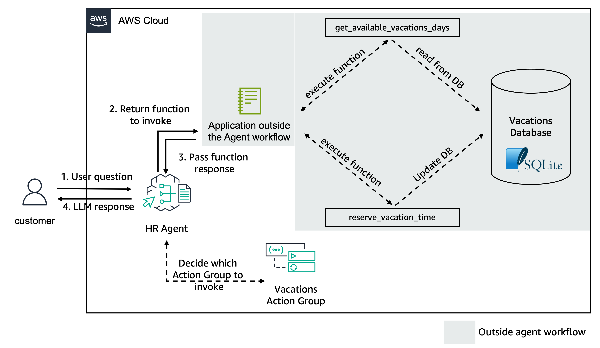

# Create Agent with User Confirmation
In this folder, we provide an example of an HR agent using Agents for Amazon Bedrock new capabilities for function definition and [User Confirmation]( https://docs.aws.amazon.com/bedrock/latest/userguide/agents-userconfirmation.html) for function calling.

This example is similar to the one we have in [03-create-agent-with-return-of-control.ipynb](03-create-agent-with-return-of-control/03-create-agent-with-return-of-control.ipynb); the difference here is that we only implement the `book_vacations` function, where user confirmation is required. The agent invokes the API or function provided in the `invocationInputs`. If user confirmation is enabled for the function or API, the user is presented with the option to `CONFIRM` or `DENY` the action specified in the response.

You can protect your application from harmful prompt injections by asking users to confirm before running the action group function. When a user interacts with your app, Amazon Bedrock Agent identifies the right API or knowledge base to use to complete the task. The information from the API or knowledge bases might contain potentially damaging data. If a response includes an instruction, the agent will follow it. To avoid this, we recommend getting user confirmation before executing certain actions.

The agent for this section allows the employee to `book_vacations` with user confirmation before invoking action group function according to the employee's requests.

Both functionalities are implemented in memory in the notebook and would be available in an existent applications for production use cases. The agent use case is similar to the Lab 1, but the function execution happens outside the scope of the agent, as shown in the architecture below:

The notebook logic connects with a generated in-memory SQLite database that contains information about employee's available vacation days and planned holidays.

The database structure created is as following:
![Three tables: {employees, vacations, planned_vacations}, employees: {employee_id - INTEGER, employee_name - TEXT, employee_job_title - TEXT, employee_start_date - TEXT, employee_employment_status - TEXT}, vacations: {employee_id - INTEGER, year - INTEGER, employee_total_vacation_days - INTEGER, employee_vacation_days_taken - INTEGER, employee_vacation_days_available - INTEGER}, planned_vacations: {employee_id - INTEGER, vacation_start_date - TEXT, vacation_end_date - TEXT, vacation_days_taken - INTEGER}](images/HR_DB.png)