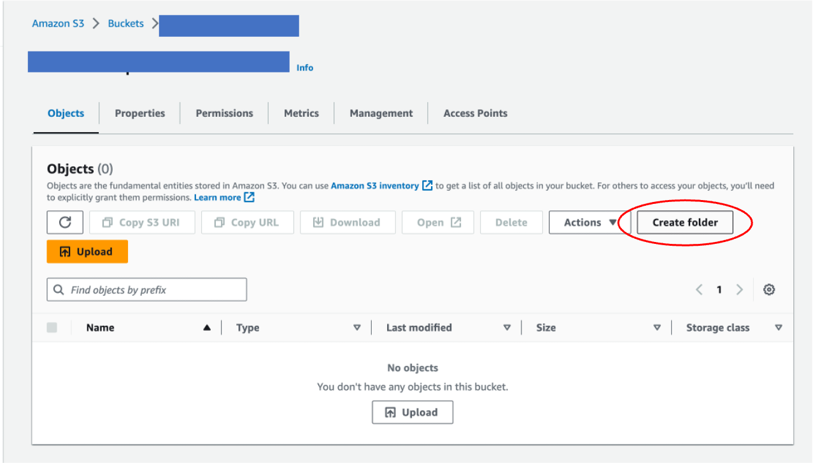
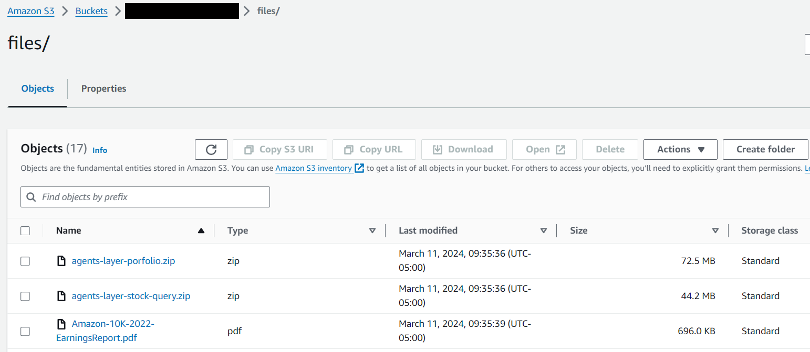
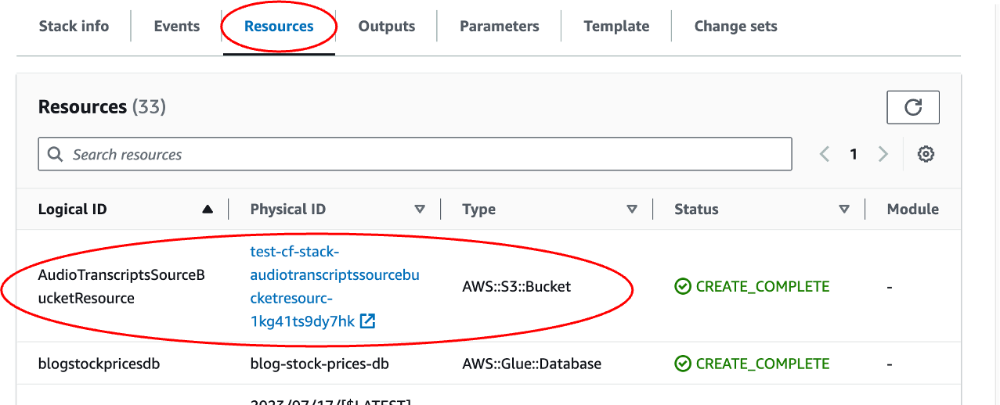
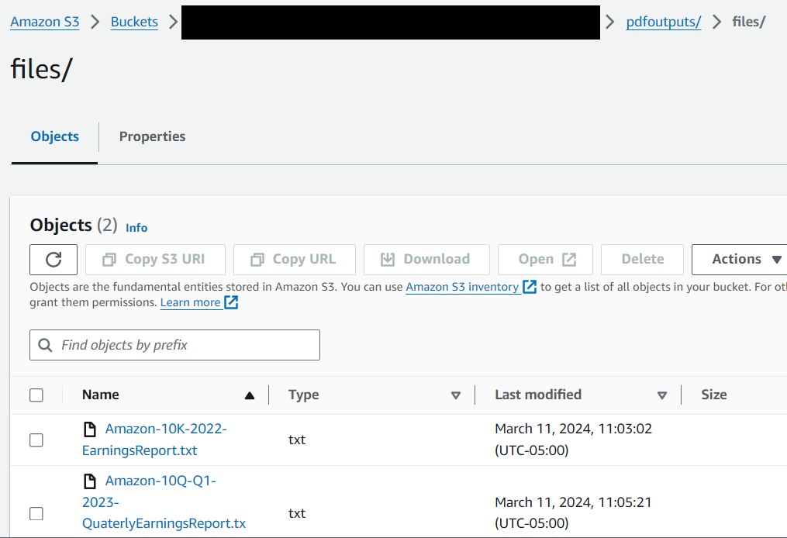
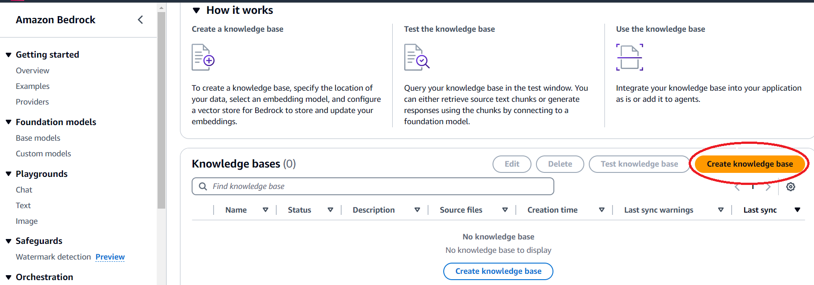
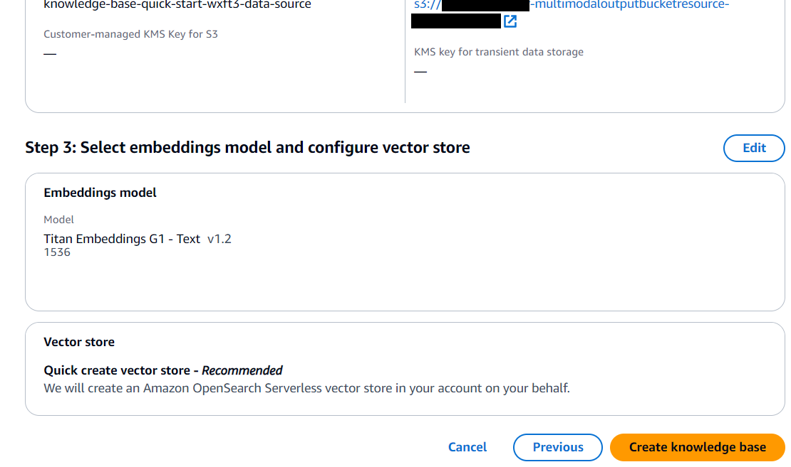
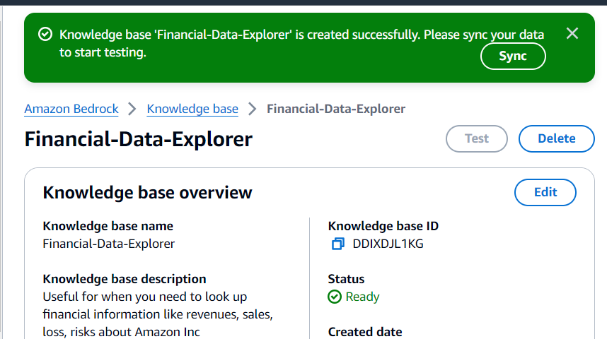
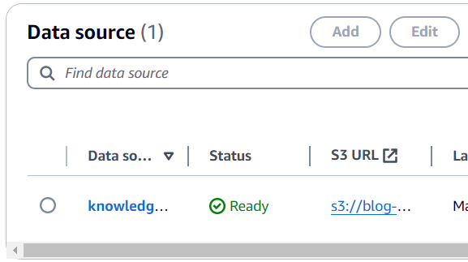
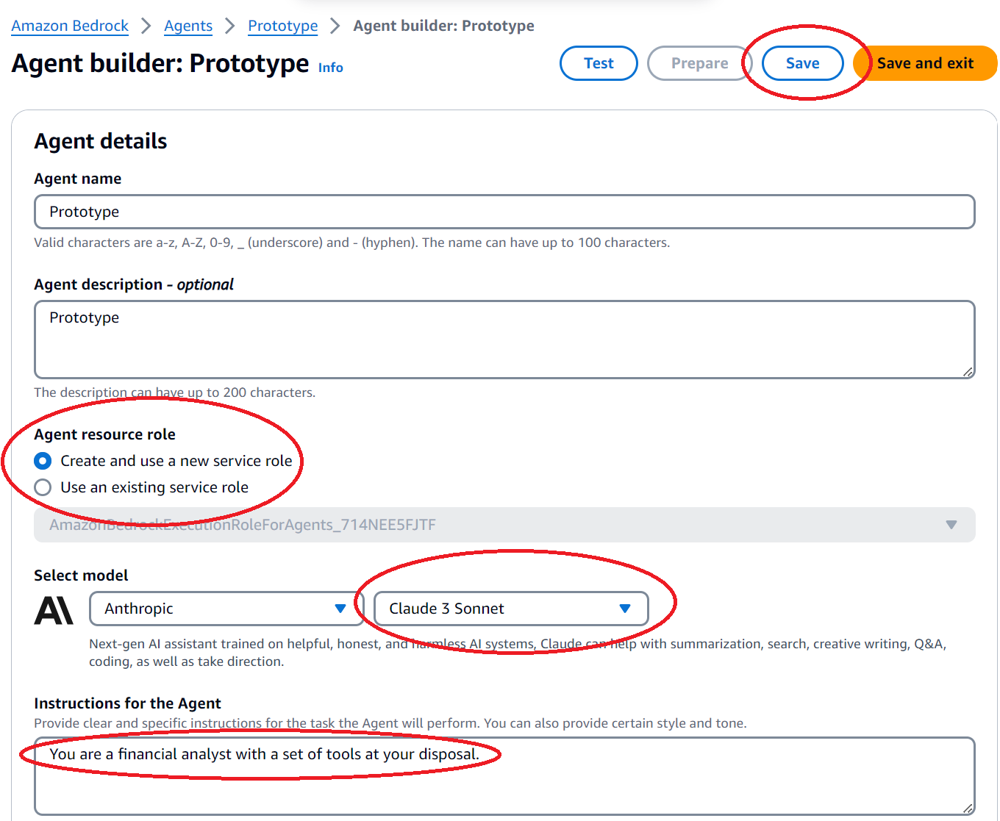

# Generative AI and Multi-Modal Agents in AWS: The Key to Unlocking New Value in Financial Markets

This file walks you through how to set up the infrastructure and applications, and run the code to create a multi-modal agent using Amazon Bedrock. The blog post provides a detailed discussion of this solution.

## Technical Achitecture Diagram

## Implementation Steps

## Prerequisites

This solution uses [Lambda functions](https://aws.amazon.com/lambda/), which are serverless, event-driven compute services that runs applications. The Python code plus other dependencies for the applications are packaged as zip files, stored in *files* in this repo. We need to add them to an S3 bucket in your account in order to set up the Lambda functions.

Please use the us-west-2 region.

First, make an S3 bucket. Go to S3 page in AWS, click "Create bucket". Then enter a bucket name, which should be universally unique. Take a note of the name, because we will need it in following sections. Leave the rest as default, and click "Create bucket" at the bottom of the page.

\
Once the bucket is created, click the bucket name, and create a folder called *files*. To create a folder, click "Create folder", and then enter the folder name "files", then click "Submit".

\
Upload the files in folder *files* to the S3 bucket. 

\
This solution use Anthropic Claude 3 model in Amazon Bedrock. Use the following link as a reference to enable access to the model [link](https://docs.aws.amazon.com/bedrock/latest/userguide/model-access.html)

## Create infrastructure using CloudFormation

[AWS CloudFormation](https://aws.amazon.com/cloudformation/) allows you to create infrasturecture as code. 

First, download the CloudFormation template *cloudformation.yaml*. 

Then upload it in CloudFormation to create a stack. This stack sets up the necessary infrastructure, such as IAM roles and Lambda functions. Go to CloudFormation console in AWS, click Stacks -> Create stack -> With new resources (standard). 

Upload *cloudformation.yaml*, and click "Next". 

On the "Specify stack details" page, 

Give the Stack a name. Take a note of this name as we will need it when running the app. Change the "SourceCodeBucket" to the name of the S3 bucket you created above.

\
Leave the rest as default. Check the acknowledgement box on the last page and submit it. 

It takes a few minutes to create. Once it is created, you can check the generated resources by clicking on Stacks -> Stack Name. Then click "Resources". The example below shows that the AudioTranscriptsSourceBucketResource is an S3 bucket with the bucket name "test-cf-stack-audiotranscriptssourcebucketresourc-1kg41ts9dy7hk".

## Generate text files from audio and pdf files

[AWS CloudShell](https://aws.amazon.com/cloudshell/) allows you to explore and manage AWS resources from a terminal in your browser

Open AWS CloudShell

Execute the following commands

`aws lambda invoke --function-name FSI-TextractAsyncInvocationFunction response.json`

`aws lambda invoke --function-name FSI-Transcribe response.json`

Wait a few minutes (between 5-10 minutes) and check that the following files are created in the S3 bucket `[your_stack_name]-multimodaloutputbucketresource-[random_id]/audioutputs/files/` and `[your_stack_name]-multimodaloutputbucketresource-[random_id]/pdfoutputs/files/`

## Create the Knowledge Base

Go to the Amazon Bedrock page in AWS, then go to "Knowledge base" and then Click "Create Knowledge Base"

\
In the field "Knowledge base name" enter "Financial-Data-Explorer" and in the field "Knowledge base description" enter "Useful for when you need to look up financial information like 10K reports, revenues, sales, net sales, loss and risks about Amazon Inc. Contains the Amazon's earnings call.". Then click "Next"

In the field "S3 URI" select the bucket `[your_stack_name]-multimodaloutputbucketresource-[random_id]`. Then click "Next"

\
Select the model "Titan Embeddings G1 - Text". Then click "Next"

\
Click "Create knowledge base"

\
Wait for the following popup to show up and then click "Sync"

\
Wait for the status of the data source change to "Ready"

## Create the Agent

Click "Create Agent"

\
In the field "Name" enter "Prototype" and in the field "Description" enter "Prototype". Then click "Create"

\
Choose "Create and use a new service role"  and the Anthropic Claude 3 Sonnet model. In the field "Instructions for the Agent" enter "You are a financial analyst with a set of tools at your disposal.". Click "Save".

\
Click "Add" in the "Action groups" section

\
In the field "Enter Action group name" enter "Phrase-Detection", in the field "Description" enter "Useful for when you need to detect key phrases in financial reports.". Choose "Define with API schemas". Choose "Select an existing Lambda function". Select the Lambda function "FSI-KeyPhrasesDetection" and in the field "Select API Schema" select the "openapi_keyphrases.json" file in the bucket created in the prerequisites. Then click "Create"

\
Repeat the previous two steps, three more times using the following information:

Field "Enter Action group name" enter "Portfolio-Optimization" \
Field "Description" enter "Useful when you need to build optimal allocation portfolio. \
Select the Lambda function "FSI-PortfolioTool-BedrockAgent" \
Field "Select API Schema" select the "openapi_portfolio.json" file in the bucket created in the prerequisites.

Field "Enter Action group name" enter "Sentiment-Analysis" \
field "Description" enter "Useful for when you need to analyze the sentiment of an excerpt from a financial report." \
Select the Lambda function "FSI-SentimentDetecttion" \
Field "Select API Schema" select the "openapi_sentiment.json" file in the bucket created in the prerequisites. \

Field "Enter Action group name" enter "Stock-Query" \
Field "Description" enter "Useful for when you need to answer any question about stocks prices." \
Select the Lambda function "FSI-StockQuery-BedrockAgent" \
Field "Select API Schema" select the "openapi_stock_query.json" file in the bucket created in the prerequisites.

At the end you should have the following actions configured:

\
Click "Add" in the "Knowledge bases" section

\
In the field "Select Knowledge base" select "Financial-Data-Explorer", in the field "Knowledge base instructions for Agent" enter "Useful for when you need to look up financial information like 10K reports, revenues, sales, net sales, loss and risks about Amazon Inc. Contains the Amazon's earnings call.". Then click "Add"

\
Click "Save and exit" 

\
In the test chat window (left), click "Prepare"

\
Enter your question or requirement to test the agent

## Key considerations using action groups

As part of wrapping the business logic using [Lambda functions](https://aws.amazon.com/lambda/), it's important to highlight two aspects:
1. The OpenAPI Schemas for each action group were built in a local text editor using this [documentation](https://docs.aws.amazon.com/bedrock/latest/userguide/) as a reference, it can also be built using the in-line OpenAPI schema editor in the Amazon Bedrock console. It's important to highlight the importance of defining an adequate description for each method, and also for each field in the request and the response, because the agent can use this information to determine when to call this API operation and to understand what the operation does.
2. For the code in the [Lambda functions](https://aws.amazon.com/lambda/), it's important to know what the agent send to the Lambda function and what should be response. For the request you can check the general format in this [link](https://docs.aws.amazon.com/bedrock/latest/userguide/agents-lambda.html#agents-lambda-input), in the *parameters* or *requestBody* fields you can get the data necessary to execute the logic depending of your needs. For the response you can check the general format in this [link](https://docs.aws.amazon.com/bedrock/latest/userguide/agents-lambda.html#agents-lambda-response), it's important to generate in the code a response object that comply with structure defined in the corresponding OpenAPI Schema.

## Security

See [CONTRIBUTING](CONTRIBUTING.md#security-issue-notifications) for more information.

## License

This library is licensed under the MIT-0 License. See the LICENSE file.

