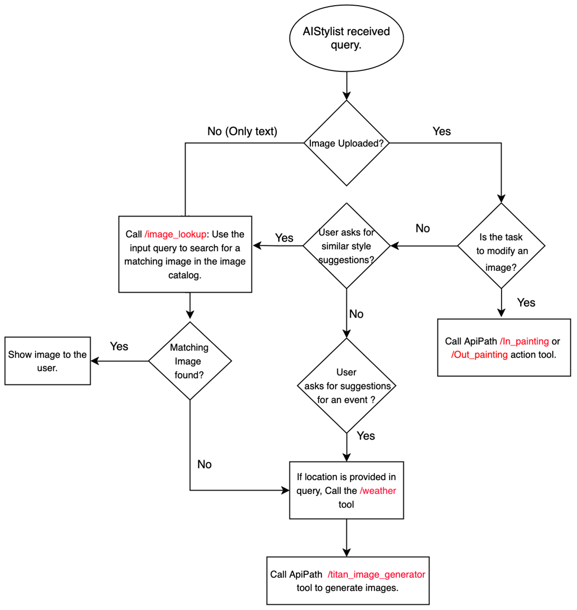

# Fashion Assistant Agent

This project is a fashion assistant agent built with Amazon Titan models and Agents for Amazon Bedrock, aimed at providing users with personalized fashion advice and experience.

## Features

- Image-to-Image or Text-to-Image Search: Allows users to search for products from the catalog that are similar to styles they like.
- Text-to-Image Generation: If the desired style is not available in the database, it can generate customized images based on the user's query.
- Weather API Integration: By fetching weather information from the location mentioned in the user's prompt, the agent can suggest appropriate outfits for the occasion.
- Outpainting: Users can upload an image and request to change the background, allowing them to visualize their preferred styles in different settings.
- Inpainting: Enables users to modify specific clothing items in an uploaded image, such as changing the design or color.

## Flow Chart

## Prerequisites

- An active AWS account and IAM role (with permissions for Bedrock, Lambda, and S3)
- Access to Anthropic Claude-3 Sonnet, Amazon Titan Image Generator, and Titan Multi-modal Embedding models enabled
- Prepare required datasets (e.g., fashion images from Kaggle)
- Install required Python libraries (e.g., Streamlit)

## Setup

1. Clone the GitHub repository
2. Complete prerequisites and grant sufficient permissions
3. (Optional) If using the image lookup feature, execute code snippets in `Create_OSS_vectorstore.ipynb` to create a vector store and use the Titan Multi-modal Embedding model to embed and store sample images
4. Execute code snippets in `Create_Agent.ipynb` to create the infrastructure and build the agent
5. Run the Streamlit UI to interact with the agent: `streamlit run frontend/app.py`

## Testing

1. Navigate to the Streamlit UI
2. Upload an image or enter a text prompt describing the desired style
3. Hit enter to send the prompt to the agent
4. View the agent's response (generated images, similar style recommendations, or modified images)

## Cleanup

To avoid unnecessary costs, make sure to delete the resources used in this solution.

By leveraging the power of Amazon Titan models and Agents for Bedrock, this fashion assistant agent can provide users with a personalized and engaging experience, helping them find their perfect style.