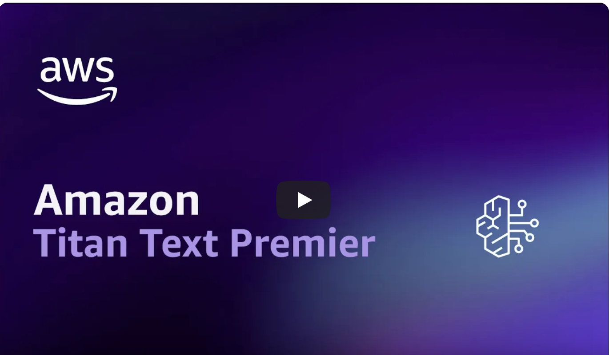
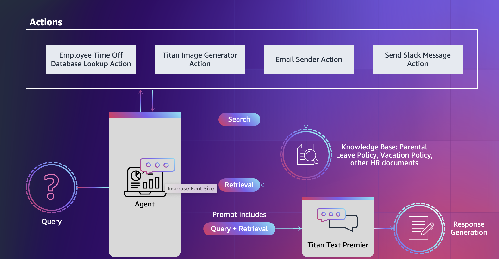

# HR Assistant Using Titan Text Premier with Agents and Knowledge Bases for Amazon Bedrock
---
## Authors:
Anupam Dewan @dewanup, Jie Lie @liaji, Han Liu @haliuz

## Reviewer:
Maira Ladeira Tanke @mttanke

## Content
- [Overview](#overview)
- [Agents and Knowledge Bases Architecture](#agents-and-knowledge-bases-architecture)
- [Deployment Guide](#deployment-guide)
- [Test Conversation](#test-conversation)
- [Clean Up](#clean-up)

## Overview

Amazon Titan Text Premier is the latest addition to the Titan family of Large Language Models. It is a high-performing, cost effective and model engineered to deliver superior performance for enterprise grade applications. 
With a maximum context length of 32K tokens, it has been specifically optimized for enterprise use cases, such as building Retrieval Augmented Generation (RAG) and agent-based applications with Knowledge Bases and Agents for Amazon Bedrock. With Titan Text Premier, you can unlock new levels of efficiency and productivity by creating custom agents that can automate multistep internal or external tasks. You can also use this model to build interactive AI assistants that leverage your existing APIs and interact with your own data.

This sample solution  uses Titan Text Premier with, Agents, and Knowledge Bases, all tied together with Amazon Bedrock. The solution showcases an HR assistant build on existing enterprise resources, with the an employee asking questions around HR related tasks like time off, leave policies, employee pay-stubs. The solution also aims at automating leave requests and question answering on time off policies and employee payment related details. Your Bedrock-powered HR Assistant can assist employees from asking policy related questions, to submitting a time off and sending communications through email and slack to their team-mates and managers.

### Demo Recording

## Agents and Knowledge Bases for Amazon Bedrock

### Agents and Knowledge Bases Functionality
Agents and Knowledge Bases for Amazon Bedrock work together to provide the following set of capabilities:

- **Task Orchestration** - Agents expand FMs to understand natural language user inquiries and dissect multi-step tasks into smaller, executable steps.
- **Interactive Data Collection** - Agents engage in natural conversations to gather supplementary information from users.
- **Task Fulfillment** - Agents complete customer requests through series of reasoning steps and corresponding actions based on [ReAct prompting](https://www.promptingguide.ai/techniques/react).
- **System Integration** - Agents make API calls to integrated company systems to run specific actions.
- **Data Querying** - Knowledge bases enhance accuracy and performance through fully-managed [retrieval augmented generation (RAG)](https://docs.aws.amazon.com/sagemaker/latest/dg/jumpstart-foundation-models-customize-rag.html) using customer specific data sources.
- **Source Attribution** - Agents conduct source attribution, identifying and tracing the origin of information or actions through chain-of-thought reasoning.

### Agents and Knowledge Bases Architecture

  
  <em>Diagram 1: Agents and Knowledge Bases for Amazon Bedrock Architecture Overview</em>

The workflow consists of the following steps:

1. **Input Query**: Users provide natural language inputs to the agent.

    **Sample Prompts:**
    * _(**KB call**) Can you get me some details about Parental Leave Policy?_
   
    * _(**KB+Athena API**) My partner and I are expecting a baby on July 1st. Can I take 2 weeks off?_
    
      - _Employee Name: `Pepper Li`_
      - _Employee Alias: `hremployee`_
    
    * _(**KB + Athena API Call**) Yes, Please request two weeks time off using my vacation time, from July 1st, 2024 to July 12, 2024_
    
    * _(**Image Generator**) Generate a cartoon image of new born child with parents_
    
    
    * _(**Email Action**) Send a email with above image to my team telling them that I will be away for 2 weeks starting July 1_
    
      - _Email Address: Use the email that you used at <SNS_EMAIL>_
    
    * _(**Slack Message**) You can setup slack message API similarly using [Slack Webhooks](https://api.slack.com/messaging/webhooks)_

2. **Preprocessing Step**: During pre-processing, the agent validates, contextualizes, and categorizes user input. The user input (or _Task_) is interpreted by the agent using chat history and the instructions and underlying foundation model that were specified during [agent creation](https://docs.aws.amazon.com/bedrock/latest/userguide/agents-create.html). The agent's [instructions](https://docs.aws.amazon.com/bedrock/latest/userguide/agents.html) are descriptive guidelines outlining the agent's intended actions. Also, you can optionally configure [advanced prompts](https://docs.aws.amazon.com/bedrock/latest/userguide/advanced-prompts.html), which allow you to boost your agent's precision by employing more detailed configurations and offering manually selected examples for few-shot prompting. This method allows you to enhance the model's performance by providing labeled examples associated with a particular task. 

3. **Action Groups**: [Action groups](https://docs.aws.amazon.com/bedrock/latest/userguide/agents-setup.html) are a set of APIs and corresponding business logic, whose OpenAPI schema is defined as JSON files stored in [Amazon Simple Storage Service](https://docs.aws.amazon.com/AmazonS3/latest/userguide/Welcome.html) (S3). The schema allows the agent to reason around the function of each API. Each action group can specify one or more API paths, whose business logic is run through the [AWS Lambda](http://aws.amazon.com/lambda) function associated with the action group. 
> In this sample application the agent has multiple actions associated within an action group, such as looking up and updating the data around the employee's time off in an Athena table, sending slack and outlook messages to team mates, generating images using Titan Image Generator, making a Knowledge Base Query to get the relevent details.

4. **Knowledge bases Look Up as an action**: Knowledge bases provide fully-managed RAG to supply the agent with access to your data. You first configure the knowledge base by specifying a description that instructs the agent when to use your knowledge base. Then you point the knowledge base to your Amazon S3 data source. Finally, you specify an embedding model and choose to use your existing vector store or allow Bedrock to create the vector store on your behalf. Once configured, each [data source sync](https://docs.aws.amazon.com/bedrock/latest/userguide/knowledge-base-ingest.html) creates vector embeddings of your data that the agent can use to return information to the user or augment subsequent FM prompts.
> In this sample application, we use Titan Embedding Model as an embedding model along with default open search serverless vector database for storing our embedding. The Knowledge Base contains the employer’s relevant HR documents, such as parental leave policy, vacation policy, payment slips and more. 

5. **Orchestration**: During orchestration, the agent develops a _rational_ with the logical steps of which action group API invocations and knowledge base queries are needed to generate an _observation_ that can be used to augment the base prompt for the underlying FM. This ReAct style of prompting serves as the input for activating the FM, which then anticipates the most optimal sequence of actions to complete the user's task. 
> In this sample application, The agent processes the employee's query, reasons on the query, breaks it down into a series of sub-tasks, determines the proper sequence of steps, and finally executes the appropriate actions and knowledge searches on the fly. 
      
6. During **post-processing**, once all _orchestration_ iterations are complete, the agent curates a final response. Post-processing is disabled by default.

## Deployment Guide
see [Deployment Guide](documentation/deployment-guide.md)

## Test Conversation
see [Test Conversation](documentation/deployment-guide.md#test-conversation)

## Clean Up
see [Clean Up](documentation/clean-up.md)

## Refrences:

Data Sources:

(1) The Aglaia_Benifits_Policy.pdf is a Fictitious Company HR policy
(2) Paystubs for January and Feburary is also synthetically created fake paystubs

---

Copyright Amazon.com, Inc. or its affiliates. All Rights Reserved.
SPDX-License-Identifier: MIT-0
