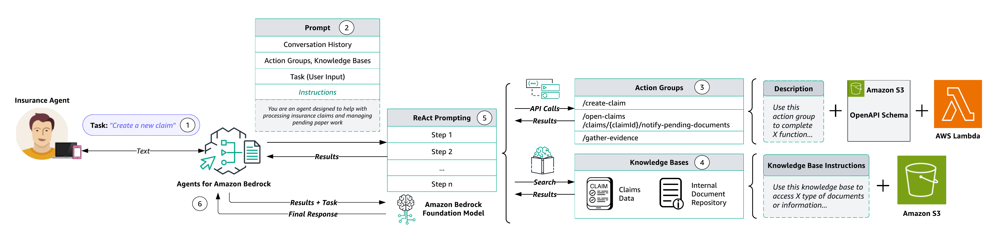

# Insurance Claim Lifecycle Automation Using Agents and Knowledge Bases for Amazon Bedrock
---

## Content
- [Overview](#overview)
- [Agents and Knowledge Bases Architecture](#agents-and-knowledge-bases-architecture)
- [Cost](#cost)
- [Deployment Guide](#deployment-guide)
- [Testing and Validation](#testing-and-validation)
- [Clean Up](#clean-up)

## Overview

You can now use [Agents for Amazon Bedrock](https://docs.aws.amazon.com/bedrock/latest/userguide/agents.html) and [Knowledge Bases for Amazon Bedrock](https://docs.aws.amazon.com/bedrock/latest/userguide/knowledge-base.html) to configure specialized agents that seamlessly run actions based on user input and your organization's data. These managed agents play conductor, orchestrating interactions between foundation models (FMs), API integrations, user conversations, and knowledge bases loaded with your data. 

This sample solution highlights how you can use Agents and Knowledge Bases for Amazon Bedrock to **build on existing enterprise resources** to automate the tasks associated with the insurance claim lifecycle, efficiently scale and improve customer service, and enhance decision support through improved knowledge management. Your Bedrock-powered insurance agent can assist human agents by creating new claims, sending pending document reminders for open claims, gathering claims evidence, and searching for information across existing claims and customer knowledge repositories.

### Demo Recording

## Agents and Knowledge Bases for Amazon Bedrock

### Agents and Knowledge Bases Functionality
Agents and Knowledge Bases for Amazon Bedrock work together to provide the following set of capabilities:

- **Task Orchestration** - Agents expand FMs to understand natural language user inquiries and dissect multi-step tasks into smaller, executable steps.
- **Interactive Data Collection** - Agents engage in natural conversations to gather supplementary information from users.
- **Task Fulfillment** - Agents complete customer requests through series of reasoning steps and corresponding actions based on [ReAct prompting](https://www.promptingguide.ai/techniques/react).
- **System Integration** - Agents make API calls to integrated company systems to run specific actions.
- **Data Querying** - Knowledge bases enhance accuracy and performance through fully-managed [retrieval augmented generation (RAG)](https://docs.aws.amazon.com/sagemaker/latest/dg/jumpstart-foundation-models-customize-rag.html) using customer specific data sources.
- **Source Attribution** - Agents conduct source attribution, identifying and tracing the origin of information or actions through chain-of-thought reasoning.

### Agents and Knowledge Bases Architecture

  
  <em>Diagram 1: Agents and Knowledge Bases for Amazon Bedrock Architecture Overview</em>

The workflow consists of the following steps:

1. Users provide natural language inputs to the agent.

    **Sample Prompts:**
    - _Create a new claim._
    - _Send a pending documents reminder to the policy holder of claim ID 2s34w-8x._
    - _Gather evidence for claim ID 5t16u-7v._
    - _What is the total claim amount for claim ID 3b45c-9d?_
    - _What is the total repair estimate for that same claim?_
    - _What factors determine my car insurance premium?_
    - _How can I lower my car insurance rates?_
    - _Which claims have open status?_
    - _Send pending document reminders to all policy holders with open claims._
      
2. During **pre-processing**, the agent validates, contextualizes, and categorizes user input. The user input (or _Task_) is interpreted by the agent using chat history and the instructions and underlying foundation model that were specified during [agent creation](https://docs.aws.amazon.com/bedrock/latest/userguide/agents-create.html). The agent's [instructions](https://docs.aws.amazon.com/bedrock/latest/userguide/agents.html) are descriptive guidelines outlining the agent's intended actions. Also, you can optionally configure [advanced prompts](https://docs.aws.amazon.com/bedrock/latest/userguide/advanced-prompts.html), which allow you to boost your agent's precision by employing more detailed configurations and offering manually selected examples for few-shot prompting. This method allows you to enhance the model's performance by providing labeled examples associated with a particular task. 

3. [Action groups](https://docs.aws.amazon.com/bedrock/latest/userguide/agents-setup.html) are a set of APIs and corresponding business logic, whose OpenAPI schema is defined as JSON files stored in [Amazon Simple Storage Service](https://docs.aws.amazon.com/AmazonS3/latest/userguide/Welcome.html) (S3). The schema allows the agent to reason around the function of each API. Each action group can specify one or more API paths, whose business logic is run through the [AWS Lambda](http://aws.amazon.com/lambda) function associated with the action group.

4. Knowledge bases provide fully-managed RAG to supply the agent with access to your data. You first configure the knowledge base by specifying a description that instructs the agent when to use your knowledge base. Then you point the knowledge base to your Amazon S3 data source. Finally, you specify an embedding model and choose to use your existing vector store or allow Bedrock to create the vector store on your behalf. Once configured, each [data source sync](https://docs.aws.amazon.com/bedrock/latest/userguide/knowledge-base-ingest.html) creates vector embeddings of your data that the agent can use to return information to the user or augment subsequent FM prompts.

5. During **orchestration**, the agent develops a _rational_ with the logical steps of which action group API invocations and knowledge base queries are needed to generate an _observation_ that can be used to augment the base prompt for the underlying FM. This ReAct style of prompting serves as the input for activating the FM, which then anticipates the most optimal sequence of actions to complete the user's task.

6. During **post-processing**, once all _orchestration_ iterations are complete, the agent curates a final response. Post-processing is disabled by default.

## Cost

You are responsible for the cost of the AWS services used while running this sample solution. As of May 2024, the cost for running this solution with the specified settings in the us-east-1 (N. Virginia) AWS Region is approximately **$766.57** per month based on the following assumptions.

#### Amazon S3 ([Pricing](https://aws.amazon.com/s3/pricing/)):

- **Storage:**
  - Volume: 1 TB (1024 GB) of data in the S3 Standard storage class.
  - Storage Cost: $0.023 per GB-month.
  - Estimated monthly storage cost: $0.023/GB-month * 1024 GB = $23.55

- **Data Transfer:**
  - Volume: 1 TB (1024 GB) of data transfer out per month.
  - Data Transfer Cost: $0.09 per GB for the first 10 TB.
  - Estimated monthly data transfer cost: $0.09/GB * 1024 GB = $92.16

- **Requests:**
  - GET Requests: 1,000,000 requests at $0.0004 per 1,000 requests.
  - PUT Requests: 1,000,000 requests at $0.005 per 1,000 requests.
  - Estimated monthly requests cost: 
    - GET: $0.0004 * (1,000,000 / 1,000) = $0.40
    - PUT: $0.005 * (1,000,000 / 1,000) = $5.00
    - Total requests cost: $0.40 + $5.00 = $5.40

- **Total Amazon S3 Cost:**
  - Storage: $23.55
  - Data Transfer: $92.16
  - Requests: $5.40
  - **Total: $121.11**

#### Amazon OpenSearch ([Pricing](https://aws.amazon.com/opensearch-service/pricing/)):

- **Storage:**
  - Volume: 1 TB (1024 GB) managed storage.
  - Storage Cost: $0.24 per GB per month.
  - Estimated monthly storage cost: $0.24/GB * 1024 GB = $245.76

- **Compute:**
  - OCU - Indexing: 0.5 [OpenSearch Compute Units](https://docs.aws.amazon.com/opensearch-service/latest/developerguide/serverless-scaling.html) (OCU) at $0.24 per OCU per hour.
  - OCU - Search and Query: 0.5 OCU at $0.24 per OCU per hour.
  - OpenSearch Serverless dev mode allows for cost optimization with as low as 0.5 OCU.
  - Estimated monthly compute cost: $0.24 * 1 OCU * 24 hours * 30 days = $172.80

- **Total Amazon OpenSearch Cost:**
  - Storage: $245.76
  - Compute: $172.80
  - **Total: $418.56**

#### AWS Lambda ([Pricing](https://aws.amazon.com/lambda/pricing/)):

- **Compute:**
  - Invocation Count: 100,000 invocations per month.
  - Duration: 0.5 seconds on average.
  - Total Execution Time: 50,000 seconds per month.
  - Memory: 128 MB.
  - Total GB-Seconds: 50,000 * 128 MB / 1024 = 6,250 GB-Seconds.
  - Cost: $0.0000166667 per GB-second.
  - Estimated monthly cost: $0.0000166667 * 6,250 GB-Seconds = $0.10

- **Total AWS Lambda Cost: $0.10**

#### Agents and Knowledge Bases for Amazon Bedrock ([Pricing](https://aws.amazon.com/bedrock/pricing/)):

- **Model:**
  - Selection: Anthropic Claude 3 Sonnet.
  - Usage Volume: 3,000,000 tokens per month.
  - Price per 1,000 input tokens: $0.003
  - Price per 1,000 output tokens: $0.015

- **Tokens:**
  - Input Tokens: 100,000 tokens/day * 30 days = 3,000,000 tokens/month.
  - Output Tokens: 100,000 tokens/day * 30 days = 3,000,000 tokens/month.
  - Cost for input tokens: $0.003 * (3,000,000 / 1,000) = $9.00
  - Cost for output tokens: $0.015 * (3,000,000 / 1,000) = $45.00

- **Total Agents Cost: $54.00**

### Total Monthly Solution Cost

Summing up all the individual costs:

- **Amazon S3 Cost: $121.11**
- **Amazon OpenSearch Cost: $591.36**
- **AWS Lambda Cost: $0.10**
- **Agents and Knowledge Bases for Amazon Bedrock Cost: $54.00**

**Total Estimated Monthly Cost: $766.57**

## Deployment Guide
see [Deployment Guide](documentation/deployment-guide.md)

## Testing and Validation
see [Testing and Validation](documentation/testing-and-validation.md)

## Clean Up
see [Clean Up](documentation/clean-up.md)

---

Copyright Amazon.com, Inc. or its affiliates. All Rights Reserved.
SPDX-License-Identifier: MIT-0
