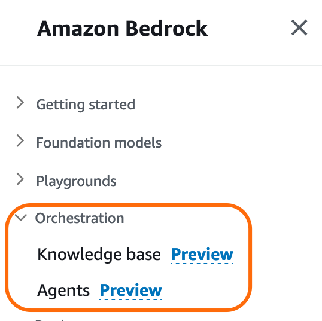

# Automotive agent using Amazon Bedrock

1. [Introduction](#introduction)
2. [Agents for Amazon Bedrock](#agents-for-amazon-bedrock)
3. [ReAct Prompting](#react-prompting)
4. [Components in agents for Amazon Bedrock](#components-in-agents-for-amazon-bedrock)
5. [Solution overview](#solution-overview)
6. [Prerequisites](#prerequisites)
7. [Bedrock Agents setup](#bedrock-agents-setup)
8. [Conclusion](#conclusion)
9. [Authors](#authors)

### Introduction

From enhancing the conversational experience to agent assistance, there are a plenty of ways that generative AI and foundation models (FMs) can help deliver faster, better support. With the increasing availability and diversity of FMs, it is difficult to experiment and keep up-to-date with the latest model versions. [Amazon Bedrock](https://aws.amazon.com/bedrock/) is a fully managed service that offers a choice of high-performing FMs from leading AI companies like AI21 Labs, Anthropic, Cohere, Meta, Stability AI, and Amazon. With Amazon Bedrock’s comprehensive capabilities, you can easily experiment with a variety of top FMs, customize them privately with your data using techniques such as fine tuning and retrieval-augmented generation (RAG).

### Agents for Amazon Bedrock

In July, AWS announced the preview of [agents for Amazon Bedrock](https://aws.amazon.com/bedrock/features/?trk=80acb49a-e4e5-48be-8dd5-24a05b52f386&sc_channel=el), a new capability for developers to create fully managed agents in a few clicks. Agents extend FMs to execute complex business tasks—from booking travel and processing insurance claims to creating ad campaigns and managing inventory—all without writing any code. With fully managed agents, you don’t have to worry about provisioning or managing infrastructure.

In this post, we provide a step-by-step guide with building blocks to create a customer service bot. We use a text generation model ([Anthropic Claude V2.1](https://www.anthropic.com/index/claude-2-1)) and agents for Amazon Bedrock for this solution.

We provide the [AWS CDK](https://aws.amazon.com/cdk/) code to provision the resources required for building this solution. Then we walk you through steps on how to create an agent for Amazon Bedrock.

### ReAct Prompting

FMs reason and figure out how to solve user-requested tasks with a reasoning technique called [ReAct](https://react-lm.github.io/). It is a general paradigm that combines reasoning and acting with FMs. ReAct prompts FMs to generate verbal reasoning traces and actions for a task. This allows the system to perform dynamic reasoning to create, maintain, and adjust plans for acting while incorporating additional information into the reasoning. The structured prompts include a sequence of question-thought-action-observation examples.

* The question is the user-requested task or problem to solve. 
* The thought is a reasoning step that helps demonstrate to the FM how to tackle the problem and identify an action to take. 
* The action is an API that the model can invoke from an allowed set of APIs. 
* The observation is the result of carrying out the action.

### Components in agents for Amazon Bedrock

Behind the scenes, agents for Amazon Bedrock automate the prompt engineering and orchestration of user-requested tasks. They can securely augment the prompts with company-specific information to provide responses back to the user in natural language. The agent breaks the user-requested task into multiple steps and orchestrates sub tasks with the help of FMs. Action groups are tasks that the agent can perform autonomously. Action groups are mapped to an [AWS Lambda](https://aws.amazon.com/lambda/) function and related API schema to perform API calls. Below architecture depicts the agent structure.

### Solution overview

We use a automotive use case to build the customer service bot. The bot will help customers on looking at car information by using some of the manuals provided, and retrieve pricing information for specific car models stored in a NoSQL database [Amazon DynamoDB](https://aws.amazon.com/dynamodb/)


1. Create a Bedrock Knowledge Base by pointing to the PDF documents residing in an Amazon Simple Storage Service (S3) bucket

2. You can create an agent with Bedrock supported FMs like Anthropic Claude V2.1.

3. Attach API schema, residing in an Amazon S3 bucket, and a Lambda function containing the business logic to the agent. (Note: This is a one-time setup)

4. The agent uses customer requests to create a prompt using the ReAct framework. It, then, uses the API schema to invoke corresponding code in the Lambda function.

5. You can perform a variety of tasks including sending email notifications, writing to databases, triggering application APIs in the Lambda functions.

In this post, we use the Lambda function to retrieve customer details, list shoes matching customer preferred activity and finally, place orders. Our code is backed by an in-memory SQLite database. You can use similar constructs to write to a persistent data store. We walk you through agent setup in the next section.

### Prerequisites

1. To implement the solution provided in this post, you should have an [AWS account](https://signin.aws.amazon.com/signin?redirect_uri=https%3A%2F%2Fportal.aws.amazon.com%2Fbilling%2Fsignup%2Fresume&client_id=signup) and access to Amazon Bedrock with agents enabled (currently in preview). 
2. Unzip the content for the knowledge base [docs.tar.gz](./data/docs/docs.tar.gz)
3. Use the CDK code for deploying the resources

```
chmod + x deploy_stach.sh
```

```
./deploy_stach.sh
```

The CDK stack will create the following resources:
1. IAM Role for Bedrock Knowledge Base
2. IAM Role for Bedrock Agent
3. IAM Role for the Lambda function used in the Bedrock action group
4. DynamoDB Table
5. Populate the DynamoDB table with the content [pricing](./data/pricing/index.json)


*Note: Knowledge Base for Amazon Bedrock requires the role name to be prefixed by `AmazonBedrockExecutionRoleForKnowledgeBase_*`*
*Note: Agents for Amazon Bedrock requires the role name to be prefixed by `AmazonBedrockExecutionRoleForAgents_*`*

### Bedrock Agents setup

#### Create an Agent for Amazon Bedrock

To create the Knowledge Base, open the [Amazon Bedrock console](https://console.aws.amazon.com/bedrock/home) and choose **Knowledge base** in the left navigation pane. Then select **Create knowledge base**.



This starts the Knowledge base creation workflow.

1. **Provide knowledge base details:** Give the knowledge base a name and description (optional). Select the service role created by the CDK stack and select **Next**.


2. **Data source:** Define the data source used for indexing documentation into the vector Database. Select the Amazon S3 bucket created that contains the PDF documents.

3. (Optional) **Chunking strategy:** Define the chunking strategy for indexing the documents in the vector DB.


To create an agent, open the [Amazon Bedrock console](https://console.aws.amazon.com/bedrock/home) and choose **Agents** in the left navigation pane. Then select **Create Agent**.

1.	**Provide agent details:** Give the agent a name and description (optional). Select the service role created by the CloudFormation stack and select **Next**.


2.	**Select a foundation model:** In the next screen, you will select a model. Provide clear and precise instructions to the agent on what tasks to perform and how to interact with the users.


3. **Add action groups:** An action is a task the agent can perform by making API calls. A set of actions comprise an action group. You will provide an API schema that will define all the APIs in the action group. Note that you must provide an API schema in the [OpenAPI schema](https://swagger.io/specification/) JSON format. The Lambda function contains the business logic required to perform API calls. You must associate a Lambda function to each action group.

Give the action group a name and provide a description for the action. Select the Lambda function and provide an API schema file and select **Next**.


4. **Add knowledge base:** Link the Agent to the knowledge base previously created, by defining the system prompt used for accessing it


5.	In the final step, review the agent configuration and select **Create Agent**.

#### Test/Deploy agents for Amazon Bedrock

1.	**Test the agent:** After the agent is created, you will see the agent overview along with a working draft. Bedrock console provides a UI to test your agent.

##### Access knowledge base


##### Access action group


### Call to action

Feel free to download and test the code in this GitHub repository. You can also invoke the agents for Amazon Bedrock programmatically using the sample Jupyter Notebook provided.

### Conclusion

Agents for Amazon Bedrock can help you increase productivity, improve your customer service experience, or automate DevOps tasks. In this post, we showed you how to setup agents for Amazon Bedrock to create a customer service bot.

We encourage you to learn more by reviewing [additional features](https://aws.amazon.com/bedrock/knowledge-bases/) of Amazon Bedrock. You can use the sample code provided in this post to create your own implementation. Try our [workshop](https://catalog.us-east-1.prod.workshops.aws/workshops/a4bdb007-5600-4368-81c5-ff5b4154f518/en-US) to gain hands-on experience with Amazon Bedrock.

## Security

See [CONTRIBUTING](CONTRIBUTING.md#security-issue-notifications) for more information.

## License

This library is licensed under the MIT-0 License. See the LICENSE file.

## Authors
**Bruno Pistone** - Senior, Generative AI and Machine Learning Specialist Solutions Architect

