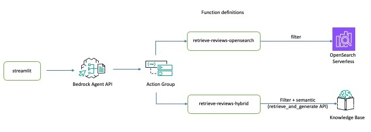

# Custom integration with knowledge base

The agent integrates with the knowledge base **without an explicit association** to it. Essentially, based on the function invoked in the function definitions, it can choose to query the vector DB directly by filtering or the knowledge base through both filtering and semantic similarity. This is useful when you want to leverage on the managed knowledge base for data maintenance (create,delete,update of documents in vector database), and exert more control over invocations of the knowledge base.

## Architecture



## Dataset

This example uses the [amazon reviews 2018 dataset](https://jmcauley.ucsd.edu/data/amazon_v2/categoryFilesSmall/All_Beauty_5.json.gz) with these fields - review (string), rating (number), timestamp (number), reviewers (string list).

We create the following metadata file for each of the text chunks (review) in the knowledge base.

The timestamp is in epoch format so date filters using ```greaterThan/lessThan``` operators can be used since Bedrock KB doesn't support date type currently.

In addition, string list can be filtered using the ```in``` operator. This can be used to implement document level access controls in OpenSearch Serverless. Each document can have a role attribute containing the list of roles that can access the document.

```json
{"metadataAttributes": {"rating": 4.0, "timestamp": 1588615855070, "reviewers": ["lebron", "jokic", "curry"]}}
```

## Knowledge Base integration

[Function definitions](https://docs.aws.amazon.com/bedrock/latest/userguide/agents-action-function.html) are used to define the APIs that are callable by the agent.

The first function ```retrieve-reviews-opensearch``` takes in as arguments the number of results to return, the start date and the end date of the documents. This API performs a direct query on the OpenSearch database.

The second function ```retrieve-reviews-hybrid``` is similar to the first except it takes in additional reviewer and description arguments. This API uses a Bedrock KB hybrid query type - filters using count, start_date, end_date, reviewers and semantic similarity using vectors.  

## Run

1. Request [model access](https://docs.aws.amazon.com/bedrock/latest/userguide/model-access.html) to Anthropic Claude 3 Haiku and Cohere Embed (English).

2. Step through the cells in main.ipynb

3. Interact using streamlit web app

```bash
streamlit run main.py -- --id your_agent_id --alias your_agent_alias_id
```

### Sample prompts and responses

1. Trigger direct query on OpenSearch

Prompt

```Give me the last 2 reviews```

Response

```text
Here are the last 2 reviews within the given date range: 1. "Nice light mousse. Gives some control to old gray wild hair." - 5 star rating, timestamp: 1488067230000.0 2. "This and the matching conditioner saved my scalp. My hair was falling out due to a very dry scalp. Nothing else I tried would cure my issue. My head literally hurt. After one use, my scalp had real relief. My hair looks beautiful after just two washes. I'm definitely going to buy this again. The smell is not great, but you'll look past it to save your scalp. It is one of the only products that is 100% truly organic. No added chemicals. Very gentle and effective. I highly recommend this product." - 5 star rating, timestamp: 1492387230000.0
```

2. Trigger knowledge base retrieval API

Prompt

```Give me the last 2 reviews on hair conditioner from jokic```

Response

```text
Based on the search results, the last 2 reviews on the hair conditioner product from the reviewer "jokic" within the given date range are: 1. "A really good gentle cleanser. Always leaves my hair feeling clean, and soft. Also virtually eliminated dandruff issues where other bigger named products consistently failed." - 5 star rating, timestamp 1521072000000.0 2. "Best shampoo/conditioner hands down" - 5 star rating, timestamp 1490140800000.0 The reviews describe the hair conditioner as leaving the hair feeling clean and soft, and virtually eliminating dandruff issues where other products failed. It is also described as the "best shampoo/conditioner hands down".
```