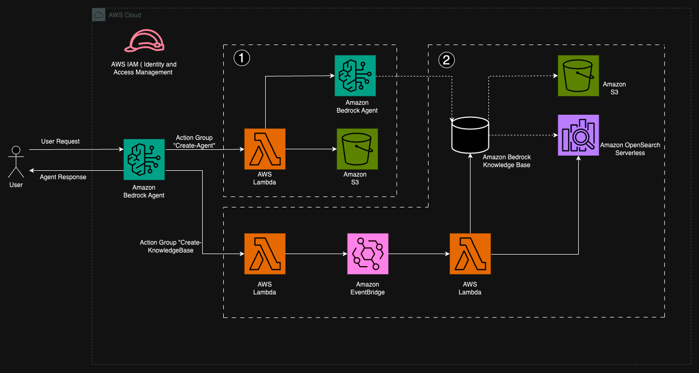
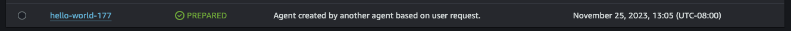
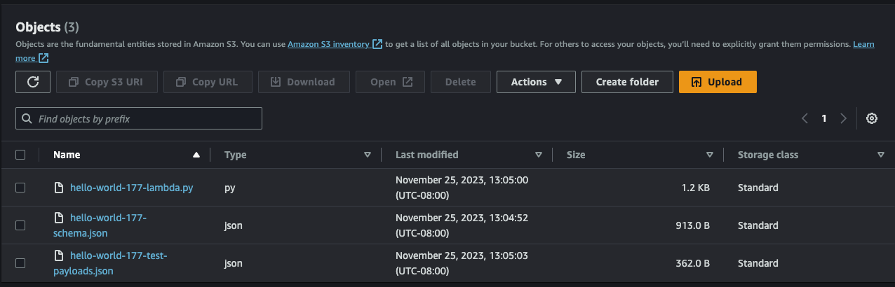
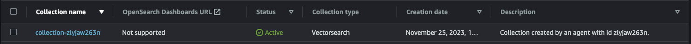
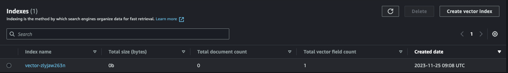
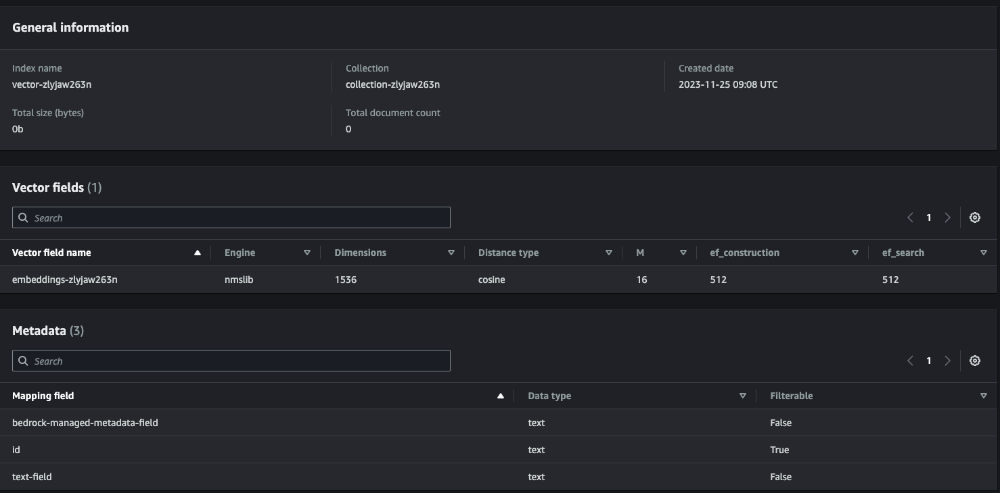
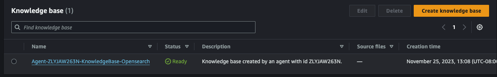
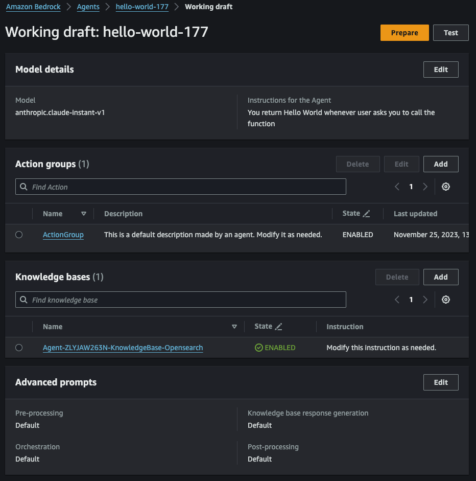
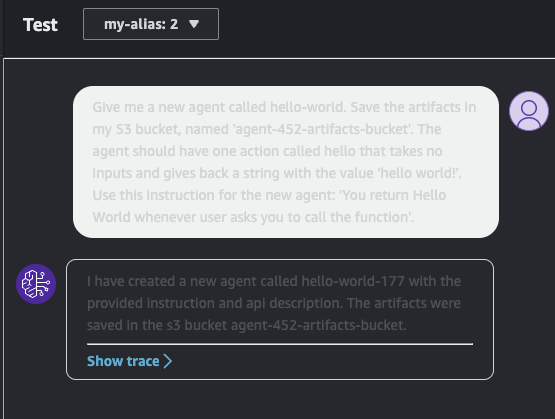
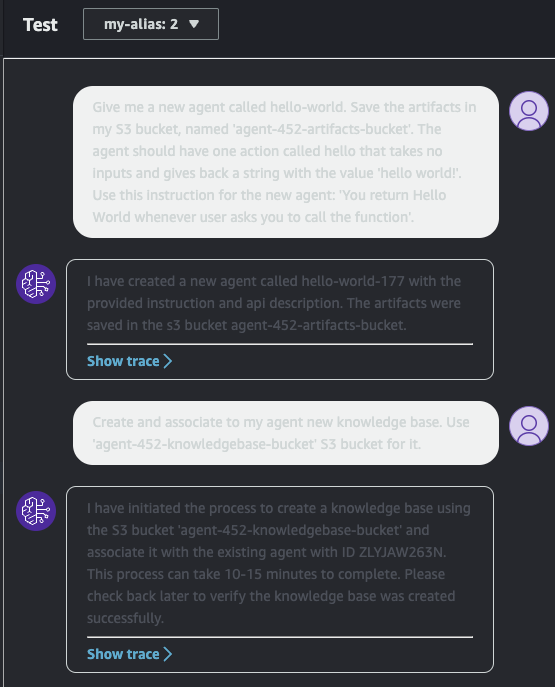

# Authors:

Mark Roy @roymark
Max Tybar @maxtybar
Paul Min @paulmin

**Side note: If you want to use AWS CDK BedrockAgent construct to deploy agents and knowledge bases, feel free to check out [npm package](https://www.npmjs.com/package/bedrock-agents-cdk?activeTab=readme) repository.**

# Options to deploy
1. Using AWS CDK. Click [here](cdk-deployment) if you want to go this route.
2. Using AWS CloudFormation. Click [here](cloudformation-deployment) if you want to go this route.

# Description:
The agent is set up and instructed to the following - based on user's prompt, call Bedrock Claude and generate a sample Lambda function as well as Open API spec, save them to S3 bucket that user provides and later use this information to generate a new agent that would adhere to prompt's guidance. During the second part the agent either creates and associates a knowledge base to the newly created agent or ends conversation. Workflow looks as follow:
1. Agent first calls bedrock api and creates an api schema json file and python file and uploads them to S3 bucket. 
2. After that, the agent creates IAM roles for Lambda and a new agent, a lambda function from recently generated python file and an agent itself. 
3. It then creates an action group and attaches it to that agent as well as creates and attaches invokeLambda permission to the Lambda function to allow a newly created Lambda function. 
4. At the end of execution, a user can follow up and ask an agent to create and attach a knowledge base to the newly created agent. Agent expects S3 bucket name for a knowledge base to be used as a data source (note - it should be different from the previously provided S3 bucket).
5. If the answer is affirmative, the agent is going to create Opensearch serverless collection, a knowledge base, a data source using an S3 bucket we provided it and associate a knowledge base to the newly created agent. Agent displays some of the information about the created resources to the user.

This whole process takes somewhere from 7 to 10 minutes, depending on the propmt complexity (1.5-2 minutes for the first prompt and 4-7 minutes for the second prompt). You can find architecture, agent's generated code, Open API schema and test payload examples below. When you provision your resources either with CloudFormation or CDK note 2 S3 bucket names that were displayed to you. More details on deployemnt steps to take are in respective folders depending on the route of deployment you chose. 

# Architecture



1. **Workflow for "Create-Agent" Action Group.** Given the prompt agent calls Lambda function that generates code, Open API schema and test payload based on the user's prompt and then saves it to S3 bucket. It then creates new Lambda function from the generated code, Bedrock agent and action group, and attaches this Lambda function as well as Open API schema to that action group.
2. **Workflow for "Create-KnowledgeBase" Action Group.** When new agent is created, initial agent provides user with a response that contains information about provisioned resourses. The user then prompts agent to create and associate a new KnowledgeBase with that newly created agent. The agent then kick offs a second Lambda that puts an event in the EventBridge and returns user information that the process was started. EventBridge in turn "passes" the event payload to third Lambda function that works in the background and creates OpenSearch Serverless collection, vector index, Knowledge Base. At the end it associates a newly created Knowledge Base (that is backed by OpenSearch Serverless collection) to a newly created agent that was created in step 1. 

# Screenshots with resources created:

1. Agent has been creted:



2. Agent populated our S3 bucket with artifacts (lambda file, Open API schema) that it used for creation of a new agent:



3. Agent created an OpenSearch collection (with associated policies).



4. Agent created an index in this collection.



5. Agent created a vetor field in this index.



6. Agent created a knowledge base and associated it to a newly created agent.





# Agent interaction in sequence:

<div align="center">

</div>

<div align="center">

</div>

# Important note about generated services and artifacts

You will see the following files generated in the S3 bucket provided to the agent in initial prompt (with your agent name substituted in ``{agent-name}`` and ``{random-prefix}`` being a 3 digit randomly generated number): 
1. ``{agent-name}-{random-prefix}-lambda.py`` - this is template Python code that was generated by Bedrock and that is used in Lambda that is attached to your agent
2. ``{agent-name}-{random-prefix}-schema.json`` - Open API json template generated by an agent and used by a newly created agent.
3. ``{agent-name}-{random-prefix}-test-payloads.json`` - API example payload for reference against your functions.

Generated code and Open API schema are only templates for the new agent to be used. Make sure you change/update them as needed. Also, make sure you check and attach all the appropriate IAM policies to the generated IAM roles both for agent and Lambda functions, as well as Data, Network and Encryption policies generated for OpenSearch serverless collection, based on your needs.

# Generated Python code by an agent:

```python
import json

def get_named_parameter(event, name):
    return next(item for item in event['parameters'] if item['name'] == name)['value']

def get_named_property(event, name):
    return next(item for item in event['requestBody']['content']['application/json']['properties'] if item['name'] == name)['value']

def handle_hello_get(event):
    # Code was generated 
    return {
        "message": "hello world!"
    }

def lambda_handler(event, context):
    print(event)
    
    response_code = 200
    action_group = event['actionGroup']
    api_path = event['apiPath']
    
    if api_path == '/hello':
        result = handle_hello_get(event)
    else:
        response_code = 404
        result = f"Unrecognized api path: {action_group}::{api_path}"

    response_body = {
        'application/json': {
            'body': result
        }
    }

    action_response = {
        'actionGroup': event['actionGroup'],
        'apiPath': event['apiPath'],
        'httpMethod': event['httpMethod'],
        'httpStatusCode': response_code,
        'responseBody': response_body
    }

    api_response = {'messageVersion': '1.0', 'response': action_response}
    return api_response
```

# Generated Open API schema by an agent:

```json
{
  "openapi": "3.0.1",
  "info": {
    "title": "hello-world-177 API",
    "description": "API with a single hello action that takes no inputs and returns 'hello world!'",
    "version": "1.0.0"
  },
  "paths": {
    "/hello": {
      "get": {
        "description": "Returns a hello world message",
        "responses": {
          "200": {
            "description": "A hello world message object", 
            "content": {
              "application/json": {
                "schema": {
                  "$ref": "#/components/schemas/HelloWorldResponse"
                }
              }
            }
          }
        }
      }
    }
  },
  "components": {
    "schemas": {
      "HelloWorldResponse": {
        "type": "object",
        "properties": {
          "message": {
            "type": "string",
            "description": "The hello world message"
          }
        }
      }
    }
  }
}
```

# Generated API test payload by an agent:

```json
[
  {
    "actionGroup": "AG",
    "apiPath": "/hello", 
    "action": "get",
    "httpMethod": "get",
    "messageVersion": "1.0",
    "parameters": [],
    "requestBody": {}
  },
  {
    "actionGroup": "AG",
    "apiPath": "/hello",
    "action": "get", 
    "httpMethod": "get",
    "messageVersion": "1.0",
    "parameters": [],
    "requestBody": {}
  }
]
```
