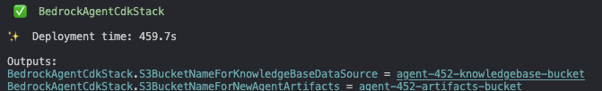
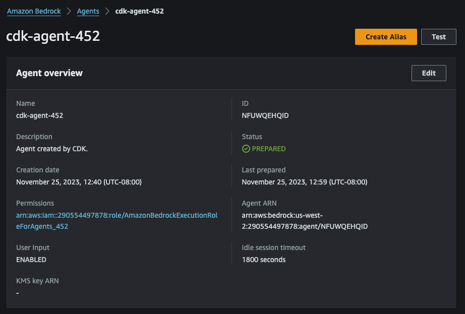
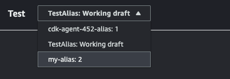

# AWS CDK Deployment

**Side note: If you want to use AWS CDK BedrockAgent construct to deploy agents and knowledge bases, feel free to check out [npm package](https://www.npmjs.com/package/bedrock-agents-cdk?activeTab=readme) repository.**

Installation guide assumes you have AWS account and Administrator Access to provision all the resources. 
Provisioning will take somewhere from 7 to 9 minutes.

# Prerequisites
=============

* node >= 16.0.0
* npm >= 8.0.0
* AWS CLI >= 2.0.0
* AWS CDK >= 2.66.1

# Installation

Download current directory or clone repo and cd into ``cdk-deployment``. From within the root project folder (``cdk-deployment``), run the following commands:

```
npm install
```
Note - if you have `npm ERR!` erros related to overlapping dependencies, run `npm install --force`.

```
cdk bootstrap
```

```
cdk deploy --require-approval never
```

Optional - if you want your agent to have a custom name you can do deployment like this (substituting ``"my-agent-name"`` with your desired name). **Keep your agent name length under 20 characters**:

```
cdk deploy --parameters AgentName="my-agent-name" --require-approval never
```

# After intallation

A few steps to be completed after you deployed the infrastructure.

1. Note 2 S3 bucket names that were displayed in your command line terminal at the end of execution. ``BedrockAgentCdkStack.S3BucketNameForNewAgentArtifacts`` value will contain S3 bucket name that you would need to use for the first prompt. ``BedrockAgentCdkStack.S3BucketNameForKnowledgeBaseDataSource`` value will contain S3 bucket name that you will need to use in the second prompt. It will look like this:

<div align="center">

</div>

2. In the console navigate to [Amazon Bedrock Agents](https://us-west-2.console.aws.amazon.com/bedrock/home?region=us-west-2#/agents). Select agent with the name that you provided. If you did not provide a name, the defaul name will be in the form ``cdk-agent-{random-prefix}`` with ``{random-prefix}`` containig a random 3 digit number. In agent overview panel select ``Edit``:

<div align="center">

</div>

3. Click ``Yes`` in ``User input`` panel. In the bottom right click ``Save``.

<div align="center">

</div>

4. In the agent overview click ``Create Alias``.

<div align="center">

</div>

5. Give your alias a name and click ``Create Alias``.

<div align="center">

</div>

6. On the right side click ``Prepare``. This will "update" your agent's state.

<div align="center">

</div>

7. After agent is prepared click on the "expand" button in the top right.

<div align="center">

</div>

8. Make sure you select the alias' name that you just created in the top dropdown menu. After that you can interacting with your agent.

<div align="center">

</div>


# Prompt 1 example (initial prompt):

Feel free to experiment with the propmt. However, results might be unpredictable.

```
Give me a new agent called hello-world. Save the artifacts in my S3 bucket, named 'agent-452-artifacts-bucket'. 
The agent should have one action called hello that takes no inputs and gives back a string with the value 'hello world!'. 
Use this instruction for the new agent: 'You return Hello World whenever user asks you to call the function'.
```

# Prompt 2 example (after agent was created):

Feel free to experiment with the propmt. However, results might be unpredictable.

```
Create and associate to my agent new knowledge base. 
Use 'agent-452-knowledgebase-bucket' S3 bucket for it.
```

# How to delete the infrastructe

From within the root project folder (``cdk-deployment``), run the following command:

```
cdk destroy --force
```

This will delete the initial agent and the resource that were provisioned for it. If you created a new agent and a knowledge base, make sure you remove OpenSearch Collection, new agent and a Knowledge Base associated to it in the console to stop incurring any charges associated with these services.