# Authors:

Mark Roy @roymark
Max Tybar @maxtybar
Paul Min @paulmin

**Side note: If you want to use AWS CDK BedrockAgent construct to deploy agents and knowledge bases, feel free to check out [npm package](https://www.npmjs.com/package/bedrock-agents-cdk?activeTab=readme) repository.**

**Additionaly, if after testing out this example you want to take it a step further and expirement with creating and associating a knowledge base to a newly created agent, please take a look at [create-agent-and-kb](../create-agent-and-kb/).**

# Description:
The agent is set up and instructed to the following - based on user's prompt, call Bedrock Claude and generate a sample Lambda function as well as Open API spec, save them to S3 bucket that user provides and later use this information to generate a new agent that would adhere to prompt's guidance. Create alias and prepare the agent. Workflow looks as follow:
1. Agent first calls bedrock api and creates an api schema json file and python file and uploads them to S3 bucket. 
2. After that, the agent creates IAM roles for Lambda (if it wasn't provided) and a new agent, a lambda function from recently generated python file and an agent itself. 
3. It then creates an action group and attaches it to that agent as well as creates and attaches ``lambda:invokeFunction`` permission to the Lambda function to allow a newly created agent to call Lambda function. 
4. Agent then sets the state of a newly created agent to ``PREPARED`` and creates an alias for it.
4. At the end of execution, displays some of the information about the created resources to the user.


# Options to deploy
1. Using AWS CDK. Click [here](cdk-deployment) if you want to go this route.
2. Using AWS CloudFormation. Click [here](cloudformation-deployment) if you want to go this route.
3. Manually in the console. Continue reading below if you want to go this route. Manual deployment process takes about 1.5-2 minutes. You can find attached code, Open API schema, agent instruction and prompt example below.

# Manual deployment of this sample agent via the console
1. Make sure you have an ``existing S3 bucket`` that was created in the same region where you want to have an agent. You will need to provide a bucket name in the prompt to an agent.
2. Create agent IAM role. See more infomation about the role creation process [here](https://docs.aws.amazon.com/bedrock/latest/userguide/knowledge-base-permissions.html) as well as a screenshot example below. **(Note: this is just for illustrative purposes. For production it is recommended to grant only the permissions required to complete a task).**

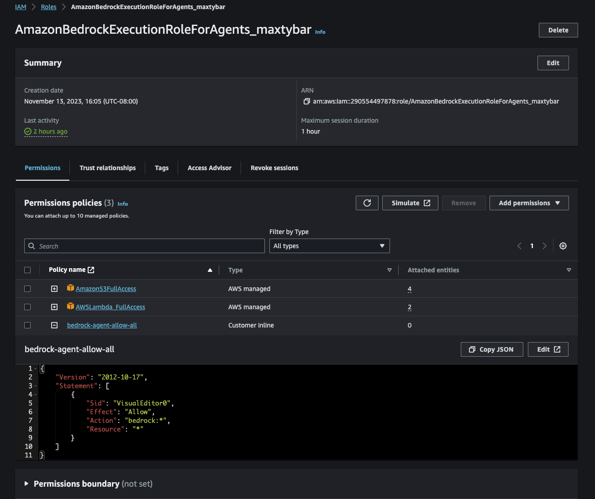 

3. Create an initial agent (follow instructions [here](https://docs.aws.amazon.com/bedrock/latest/userguide/agents-create.html)) in the AWS Console within [Amazon Bedrock service](https://us-west-2.console.aws.amazon.com/bedrock). For agent instructions, copy text from **Agent Instruction** box below.
4. Create 1 Lambda function using code found [here](./manual-deployment/lambda-function/create_agent.py).
5. Upload **all** files found [here](./manual-deployment/lambda-files/) to the Lambda function (Note: Due to Lambda limitations you might have to create new files inside the Lambda folder tree and maually copy and paste the text/code from the files. File naming is important). Do not forget to hit ``Deploy`` in your Lambda function to make sure all the code changes were updated. Your Lambda folder should look like in the screenshot below:

<div align="center">
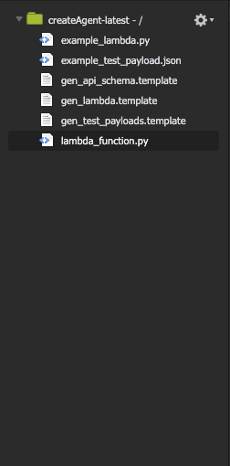
</div>

6. [``Optional``] In your Lambda function settings go to ``Configuration`` -> ``Environment variables`` and set the following enviroment variables (if you don't set them the default values will be used):
  - **LAMBDA_ROLE_ARN** - arn of the lambda role that you want your Lambda function (that will be created with the new agent) to have.
    - Default - the role will be created for you with only ``AWSLambdaBasicExecutionRole`` attached to it. 
  - **MODEL_ID** - Bedrock model id that will be used to generate template function and Open API schema based on your API description in the prompt. Find list of the model ids [here](https://docs.aws.amazon.com/bedrock/latest/userguide/model-ids-arns.html).
    - Default - ``"anthropic.claude-v2"``.
  - **AGENT_MODEL_NAME** - Bedrock model id that will be used by your newly created agent.
    - Default - ``"anthropic.claude-instant-v1"``.
  - **PYTHON_VERSION** - Python version that you want your Lambda function (that will be created with the new agent) to have.
    - Default - ``"python3.11"``.
  - **BASE_S3_KEY** - name of the subfolder that you want to have in your S3 bucket. 
    - Default - ``"create-agent"``.
7. Create and upload a Lambda layer that could be found in [here](./manual-deployment/lambda-layer/) (you can add Lambda layer by going into ``Additional resources`` section in Lambda console). Add layer to your function. 


 
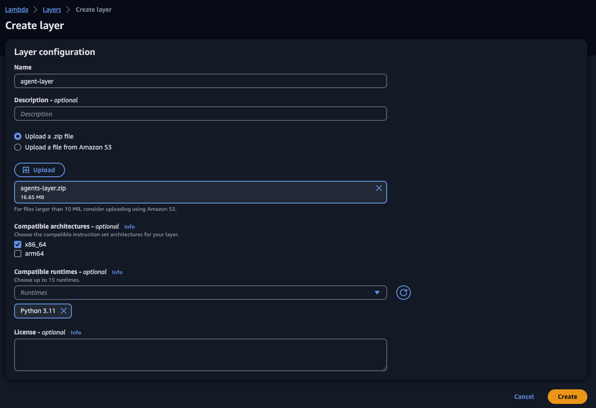 
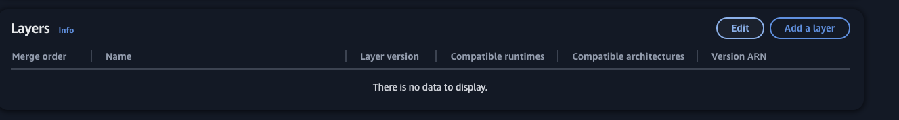
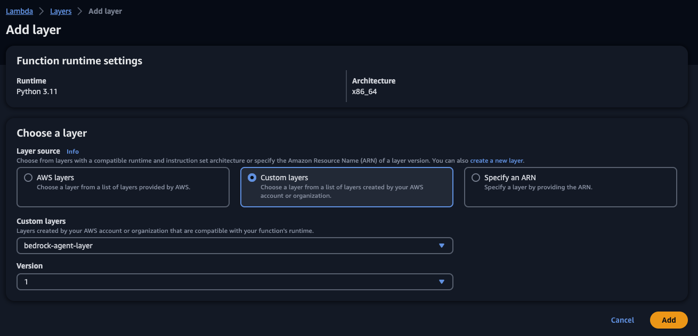

8. Create a working draft and an action group for your agent and associate the function that you created in step 4 to the action group as well as schema [create-agent-schema.json](manual-deployment/openapi-schema/create-agent-schema.json) (you need to upload the schema to your S3 bucket first or copy and paste it inline in the agent creation editor) to the action group. See screenshot below from the console with the working draft. In the agent's main menu click ``Prepare`` to save agent's state.

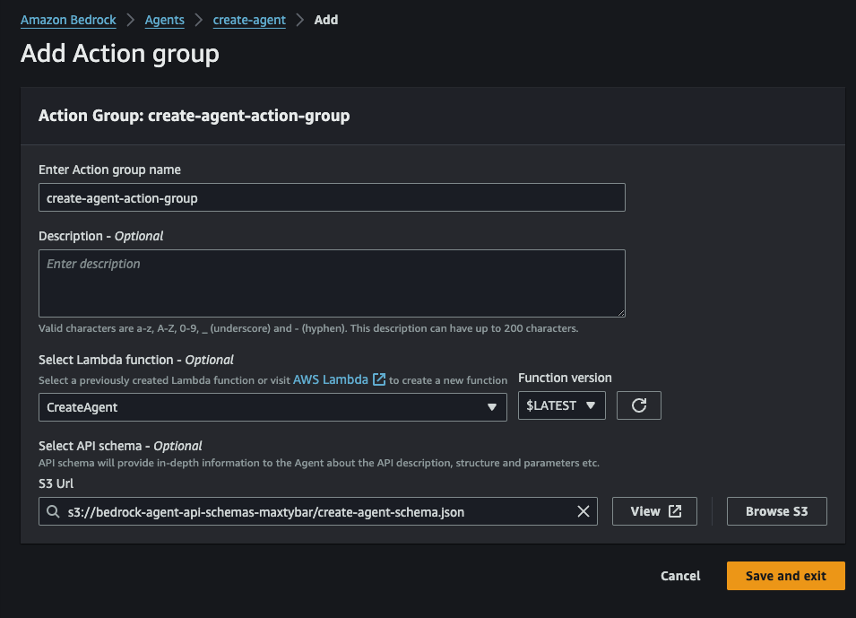

9. Set up execution timeout for your lambda function to be at ``5 minutes``. 
10. Make sure your Lambda function (that you created in step 4) have appropriate IAM roles (Lambda makes API calls to [AWS Identity and Access Management (IAM)](https://aws.amazon.com/iam/), [AWS Lambda](https://aws.amazon.com/lambda/), [Amazon S3](https://aws.amazon.com/s3/) and [Amazon Bedrock](https://aws.amazon.com/bedrock/) services) attached to your Lambda function. See screenshot example of IAM role attached below. **(Note: this is just for illustrative purposes. For production it is recommended to grant only the permissions required to complete a task).**

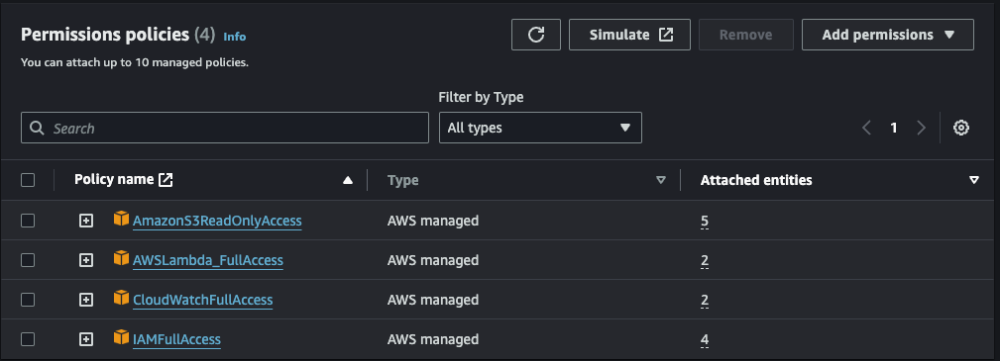


11. Finally, attach resource-based policy below (make sure you substitute value in {} with your respective values) to your Lambda function (see screenshots of the console attachement process under the policy):

```json
{
  "Version": "2012-10-17",
  "Id": "default",
  "Statement": [
    {
      "Sid": "allowInvoke",
      "Effect": "Allow",
      "Principal": {
        "Service": "bedrock.amazonaws.com"
      },
      "Action": "lambda:InvokeFunction",
      "Resource": "arn:aws:lambda:{region-of-your-lambda}:{you-aws-account-id}:function:{name-of-your-lambda}",
      "Condition": {
        "ArnLike": {
          "AWS:SourceArn": "arn:aws:bedrock:{region-of-your-agent}:{you-aws-account-id}:agent/{your-agent-id}"
        }
      }
    }
  ]
}
```


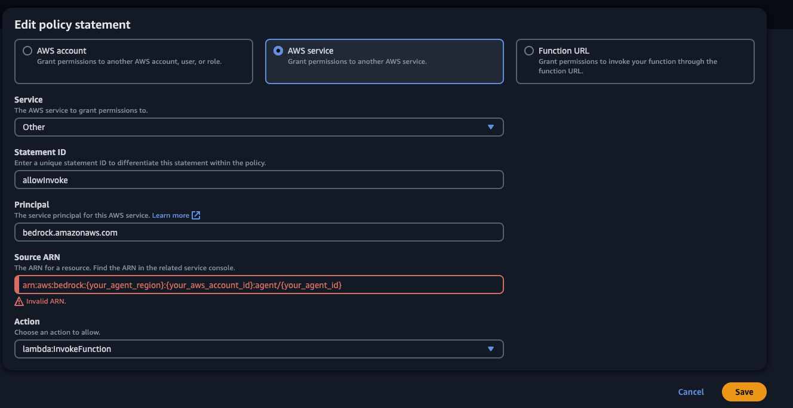

# Agent Instruction:

Important note: if you want to provide the name of your agent - keep it under 20 characters long. Example: ``account-manager-assistant`` is too long as it contains 25 characters. 

```
You are an assistant for solution architects (SA) to create code for Agents for Amazon Bedrock. 
When creating an agent, consider the following: 
1. The user may tell you where to save the artifacts, and they may not tell you that it is an s3 bucket. 
Assume that the destination they provide is indeed the name of the s3 bucket. 
If they provide the bucket name, use it instead of prompting them for the bucket name. 
2. The user may describe an entire list of actions or api's 
3. They may refer to the api in various terms like method, function, tool, action 
4. Feel free to come up with an agent name based on the description when returning results 
of creation of an agent but always keep it under 20 characters long. 
Simply provide the returned status text.
```

# Agent Prompt example (for consistency, do not provide any '/' symbols in the bucket names):

```
My s3 bucket is named 'maxtybar-bedrock'. Make me a new calculator agent called 'reinv-calc-agent', 
with methods to add, multiply, divide, and subtract two numbers. 
Name the parameters in a way that leaves no confusion about which number to subtract and which to divide.
```

# Successfull execution:

1. Agent has been created.


2. Agent populated our S3 bucket with artifacts (lambda file, Open API schema) that it used for creation of a new agent.

 

3. Agent was prepared and versioned.

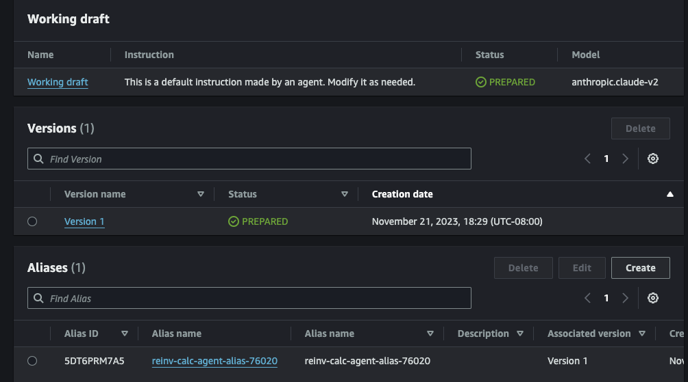

# Agent successfull interaction:

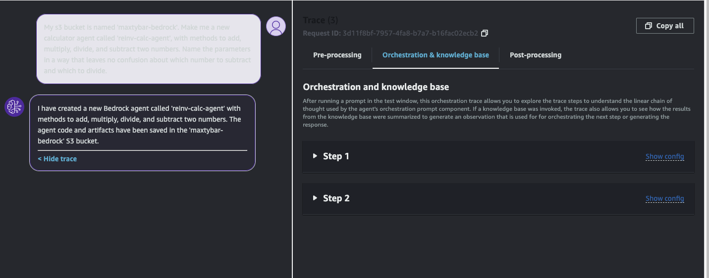

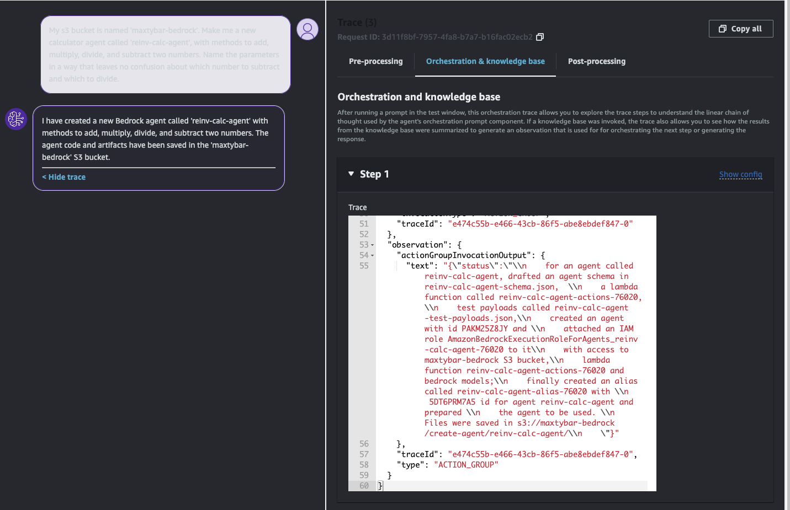

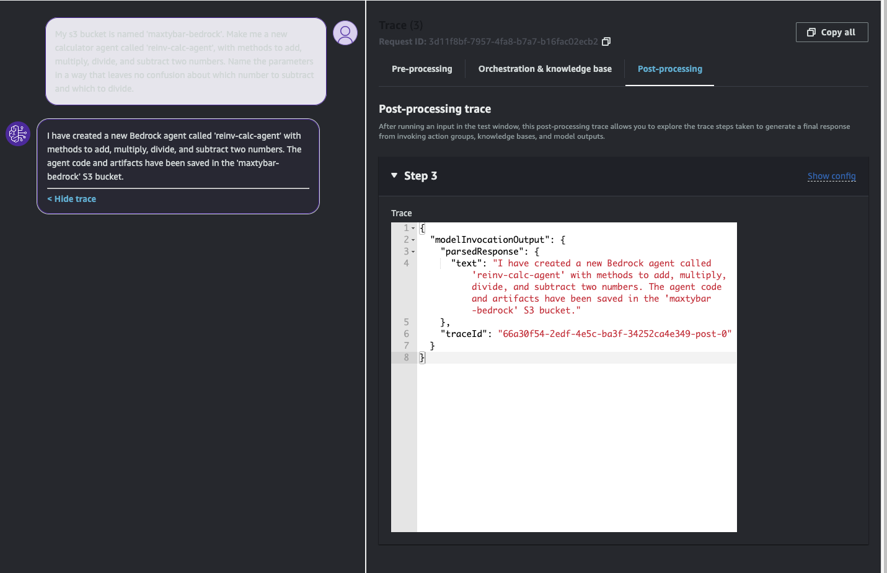

# Important note about generated services and artifacts

You will see the following files generated in the S3 bucket provided to the agent in initial prompt (``{agent_name}`` substituted with your agent's name): 
1. ``{agent_name}-lambda.py`` - this is template Python code that was generated by Bedrock and that is used in Lambda that is attached to your agent
2. ``{agent_name}-schema.json`` - Open API json template generated by an agent and used by a newly created agent.
3. ``{agent_name}-test-payloads.json`` - API example payload for reference against your functions.

Generated code and Open API schema are only templates for the new agent to be used. Make sure you change/update them as needed.

# Generated Python code by an agent:
```python


import json

def get_named_parameter(event, name):
    return next(item for item in event['parameters'] if item['name'] == name)['value']

def get_named_property(event, name):
    return next(item for item in event['requestBody']['content']['application/json']['properties'] if item['name'] == name)['value']

def handle_add(event):
    x = float(get_named_parameter(event, 'x'))
    y = float(get_named_parameter(event, 'y'))
    
    # TODO: Implement addition
    
    return {
      "sum": 0 
    }

def handle_multiply(event):
    x = float(get_named_parameter(event, 'x'))
    y = float(get_named_parameter(event, 'y'))

    # TODO: Implement multiplication

    return {
      "product": 0
    }
    
def handle_divide(event):
    x = float(get_named_parameter(event, 'x'))
    y = float(get_named_parameter(event, 'y'))
    
    # TODO: Implement division

    return {
      "quotient": 0
    }

def handle_subtract(event):
    x = float(get_named_parameter(event, 'x'))
    y = float(get_named_parameter(event, 'y'))

    # TODO: Implement subtraction
    
    return {
      "difference": 0
    }

def lambda_handler(event, context):
    print(event)  
    response_code = 200
    action_group = event['actionGroup']
    api_path = event['apiPath']
    
    if api_path == '/add':
        result = handle_add(event)
    elif api_path == '/multiply':
        result = handle_multiply(event)
    elif api_path == '/divide':
        result = handle_divide(event)
    elif api_path == '/subtract':
        result = handle_subtract(event)
    else:
        response_code = 404
        result = f"Unrecognized api path: {action_group}::{api_path}"
        
    response_body = {
        'application/json': {
            'body': result
        }
    }
        
    action_response = {
        'actionGroup': event['actionGroup'],
        'apiPath': event['apiPath'],
        'httpMethod': event['httpMethod'],
        'httpStatusCode': response_code,
        'responseBody': response_body
    }

    api_response = {'messageVersion': '1.0', 'response': action_response}
    return api_response
```

# Generated Open API schema by an agent:

```json


{
  "openapi": "3.0.0",
  "info": {
    "title": "reinv-calc-agent API", 
    "description": "APIs for simple math operations like add, subtract, multiply and divide",
    "version": "1.0.0"
  },
  "paths": {
    "/add": {
      "post": {
        "description": "Adds two numbers",
        "parameters": [
          {
            "name": "x",
            "in": "query",
            "description": "First number to add",
            "required": true,
            "schema": {
              "type": "number"
            }
          },
          {
            "name": "y",
            "in": "query",
            "description": "Second number to add",
            "required": true,
            "schema": {
              "type": "number"
            }
          }
        ],
        "responses": {
          "200": {
            "description": "Success",
            "content": {
              "application/json": {
                "schema": {
                  "$ref": "#/components/schemas/AddResponse"
                }
              }
            }
          }
        }
      }
    },
    "/multiply": {
      "post": {
        "description": "Multiplies two numbers",
        "parameters": [
          {
            "name": "x",
            "in": "query",
            "description": "First number to multiply",
            "required": true,
            "schema": {
              "type": "number"
            }
          },
          {
            "name": "y",
            "in": "query",
            "description": "Second number to multiply",
            "required": true,
            "schema": {
              "type": "number"
            }
          }
        ],
        "responses": {
          "200": {
            "description": "Success",
            "content": {
              "application/json": {
                "schema": {
                  "$ref": "#/components/schemas/MultiplyResponse"
                }
              }
            }
          }
        }
      }
    },
    "/divide": {
      "post": {
        "description": "Divides two numbers",
        "parameters": [
          {
            "name": "x",
            "in": "query",
            "description": "Dividend number",
            "required": true,
            "schema": {
              "type": "number"
            }
          },
          {
            "name": "y",
            "in": "query",
            "description": "Divisor number",
            "required": true,
            "schema": {
              "type": "number"
            }
          }
        ],
        "responses": {
          "200": {
            "description": "Success",
            "content": {
              "application/json": {
                "schema": {
                  "$ref": "#/components/schemas/DivideResponse"
                }
              }
            }
          }
        }
      }
    },
    "/subtract": {
      "post": {
        "description": "Subtracts two numbers",
        "parameters": [
          {
            "name": "x",
            "in": "query",
            "description": "Minuend number",
            "required": true,
            "schema": {
              "type": "number"
            }
          },
          {
            "name": "y",
            "in": "query", 
            "description": "Subtrahend number",
            "required": true,
            "schema": {
              "type": "number"
            }
          }
        ],
        "responses": {
          "200": {
            "description": "Success",
            "content": {
              "application/json": {
                "schema": {
                  "$ref": "#/components/schemas/SubtractResponse"
                }
              }
            }
          }
        }
      }
    }
  },
  "components": {
    "schemas": {
      "AddResponse": {
        "type": "object",
        "description": "Response schema for add operation",
        "properties": {
          "sum": {
            "type": "number",
            "description": "Sum of the two input numbers"
          }
        }
      },
      "MultiplyResponse": {
        "type": "object",
        "description": "Response schema for multiply operation",
        "properties": {
          "product": {
            "type": "number",
            "description": "Product of multiplying the two input numbers"  
          }
        }
      },
      "DivideResponse": {
        "type": "object",
        "description": "Response schema for divide operation",
        "properties": {
          "quotient": {
            "type": "number",
            "description": "Quotient obtained by dividing the two input numbers"
          }
        }
      },
      "SubtractResponse": {
        "type": "object",
        "description": "Response schema for subtract operation",  
        "properties": {
          "difference": {
            "type": "number",
            "description": "Difference obtained by subtracting the two input numbers"
          }
        }
      }
    }
  }
}
```

# Generated Lambda test payload by an agent:

```json
[
  {
    "actionGroup": "AG",
    "apiPath": "/add", 
    "action": "add",
    "httpMethod": "post",
    "messageVersion": "1.0",
    "parameters": [
      {
        "name": "num1",
        "type": "number", 
        "value": "10"
      },
      {  
        "name": "num2",
        "type": "number",
        "value": "20"
      }
    ]
  },
  {
    "actionGroup": "AG",
    "apiPath": "/add",
    "action": "add",
    "httpMethod": "post",  
    "messageVersion": "1.0",
    "parameters": [
      {
        "name": "num1",
        "type": "number",
        "value": "5"
      },
      {
        "name": "num2",
        "type": "number",
        "value": "7"  
      }
    ]
  },
  {
    "actionGroup": "AG",
    "apiPath": "/subtract",
    "action": "subtract",
    "httpMethod": "post",
    "messageVersion": "1.0",
    "parameters": [
      {
        "name": "minuend",
        "type": "number",
        "value": "100"
      },
      {
        "name": "subtrahend",
        "type": "number", 
        "value": "20"
      }
    ]
  },
  {
    "actionGroup": "AG",
    "apiPath": "/subtract",
    "action": "subtract",
    "httpMethod": "post",
    "messageVersion": "1.0",
    "parameters": [
      {
        "name": "minuend",
        "type": "number",
        "value": "50"
      },
      {
        "name": "subtrahend",
        "type": "number",
        "value": "30"
      }
    ]
  },
  {
    "actionGroup": "AG",
    "apiPath": "/multiply",
    "action": "multiply",
    "httpMethod": "post",
    "messageVersion": "1.0",
    "parameters": [
      {
        "name": "factor1",
        "type": "number",
        "value": "5"
      },
      {
        "name": "factor2",
        "type": "number",
        "value": "10"
      }
    ]
  },
  {
    "actionGroup": "AG",
    "apiPath": "/multiply",
    "action": "multiply",
    "httpMethod": "post",
    "messageVersion": "1.0", 
    "parameters": [
      {
        "name": "factor1",
        "type": "number",
        "value": "7"
      },
      {
        "name": "factor2",
        "type": "number",
        "value": "8"
      }
    ]
  },
  {
    "actionGroup": "AG",
    "apiPath": "/divide",
    "action": "divide",
    "httpMethod": "post",
    "messageVersion": "1.0",
    "parameters": [
      {
        "name": "dividend",
        "type": "number",
        "value": "100"
      },
      {
        "name": "divisor",
        "type": "number",
        "value": "10"
      }
    ]
  },
  {  
    "actionGroup": "AG",
    "apiPath": "/divide",
    "action": "divide",
    "httpMethod": "post",
    "messageVersion": "1.0",
    "parameters": [
      {
        "name": "dividend",
        "type": "number", 
        "value": "81"
      },
      {
        "name": "divisor",
        "type": "number",
        "value": "9"
      }
    ]
  }
]
```