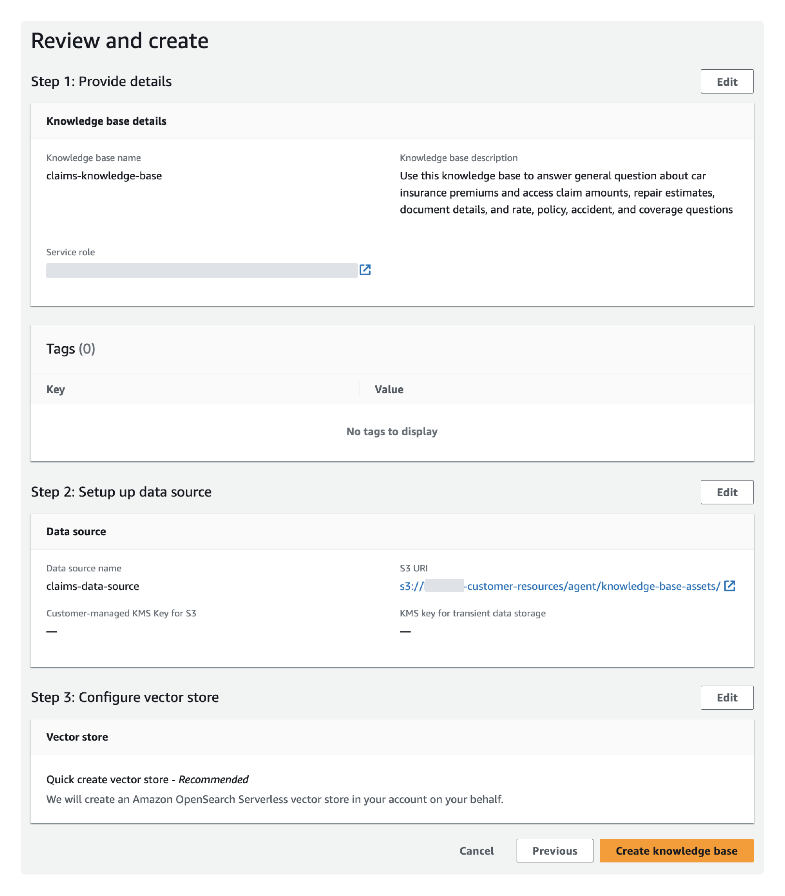
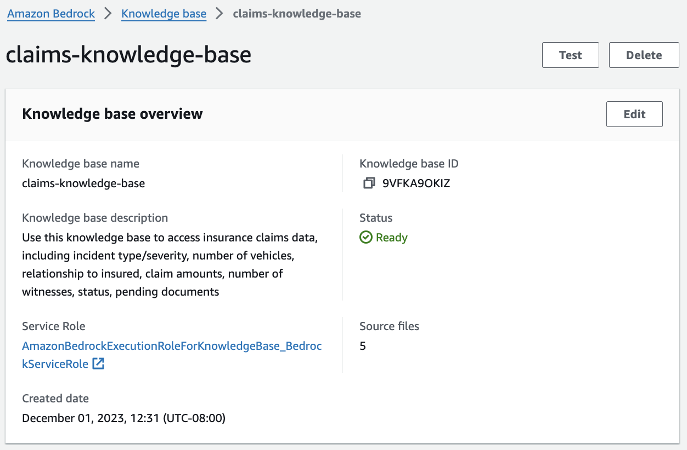
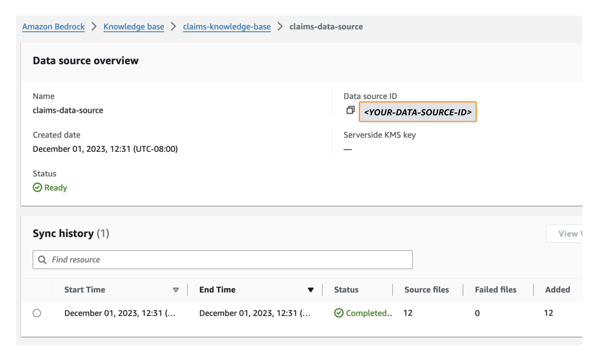
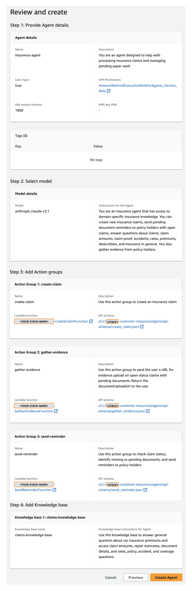
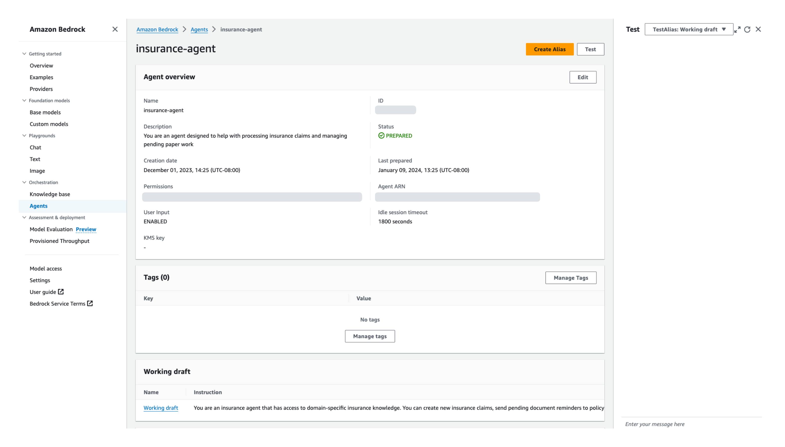

# Deployment Guide
---

## Content
- [Pre-Implementation](#pre-Implementation)
- [Create Knowledge Base](#create-knowledge-base)
- [Create Agent](#create-agent)
- [Post-Implementation](#post-Implementation)

## Pre-Implementation

### Clone [_amazon-bedrock-samples_](https://github.com/aws-samples/amazon-bedrock-samples) Repository
1. Create a local copy of the **amazon-bedrock-samples** repository using _git clone_:

```sh
git clone https://github.com/aws-samples/amazon-bedrock-samples.git
```

#### Optional - Run Security Scan on the CloudFormation Templates
To run a security scan on the [AWS CloudFormation](https://docs.aws.amazon.com/AWSCloudFormation/latest/UserGuide/Welcome.html) templates using [`cfn_nag`](https://github.com/stelligent/cfn_nag) (recommended), you have to install `cfn_nag`:

```sh
brew install ruby brew-gem
brew gem install cfn-nag
```

To initiate the security scan, run the following command:
```sh
# git clone https://github.com/aws-samples/amazon-bedrock-samples
# cd amazon-bedrock-samples
cfn_nag_scan --input-path cfn/bedrock-insurance-agent.yml
```

### Deploy CloudFormation Stack to Emulate Existing Customer Resources 
To emulate the existing customer resources utilized by the agent, this solution uses the [create-customer-resources.sh](../shell/create-customer-resources.sh) shell script to automate provisioning of the parameterized CloudFormation template, [bedrock-insurance-agent.yml](../cfn/bedrock-insurance-agent.yml), to deploy the following resources:

> - [Amazon DynamoDB](https://docs.aws.amazon.com/amazondynamodb/latest/developerguide/Introduction.html) table populated with synthetic [claims data](../agent/lambda/data-loader/claims.json).
> - Three [AWS Lambda](https://docs.aws.amazon.com/lambda/latest/dg/welcome.html) functions that represent customer business logic for creating claims, sending pending document reminders for open status claims, and gathering evidence on new and existing claims.
> - Two [Amazon S3](https://docs.aws.amazon.com/AmazonS3/latest/userguide/Welcome.html) buckets: 1/ Containing API documentation in OpenAPI schema format for the preceding Lambda functions and 2/ hosting the repair estimates, claim amounts, company FAQs, and required claim document descriptions to be used as our knowledge base data source.
> - [Amazon Simple Notification Service (SNS)](https://docs.aws.amazon.com/sns/latest/dg/welcome.html) topic to which policy holders' emails are subscribed for email alerting of claim status and pending actions.
> - [AWS Identity and Access Management (IAM)](https://docs.aws.amazon.com/IAM/latest/UserGuide/introduction.html) permissions for the preceding resources.

CloudFormation prepopulates stack parameters with the default values provided in the template. To provide alternative input values, you can specify parameters as environment variables that are referenced in the `ParameterKey=<ParameterKey>,ParameterValue=<Value>` pairs in the _create-customer-resources.sh_ shell script's `aws cloudformation create-stack` command. 

2. Before you run the shell script, navigate to the directory where you cloned the _amazon-bedrock-samples_ repository and modify the shell script permissions to executable:

```sh
# If not already cloned, clone the remote repository (https://github.com/aws-samples/amazon-bedrock-samples) and change working directory to shell folder:
cd amazon-bedrock-samples/agents/bedrock-insurance-agent/shell/
chmod u+x create-customer-resources.sh
```

3. Set your CloudFormation stack name, SNS email, and evidence upload URL environment variables. The SNS email will be used for policy holder notifications and the evidence upload URL will be shared with policy holders to upload their claims evidence. The [insurance claims processing sample](https://github.com/aws-samples/serverless-eda-insurance-claims-processing/tree/main) provides an example frontend for the evidence upload URL:

```sh
export STACK_NAME=<YOUR-STACK-NAME> # Stack name must be lower case for S3 bucket naming convention
export SNS_EMAIL=<YOUR-POLICY-HOLDER-EMAIL> # Email used for SNS notifications
export EVIDENCE_UPLOAD_URL=<YOUR-EVIDENCE-UPLOAD-URL> # URL provided by the agent to the policy holder for evidence upload
```

4. Run the _create-customer-resources.sh_ shell script to deploy the emulated customers resources defined in the _bedrock-insurance-agent.yml_ CloudFormation template. These are the resources on which the Bedrock Agent and Knowledge base will be built:

```sh
source ./create-customer-resources.sh
```

&nbsp;&nbsp;&nbsp;[_create-customer-resources.sh_](../shell/create-customer-resources.sh) contents:

```sh
export ACCOUNT_ID=$(aws sts get-caller-identity --query Account --output text)
export ARTIFACT_BUCKET_NAME=$STACK_NAME-customer-resources
export KB_BUCKET_NAME=$STACK_NAME-bedrock-kb
export DATA_LOADER_KEY="agent/lambda/data-loader/loader_deployment_package.zip"
export CREATE_CLAIM_KEY="agent/lambda/action-groups/create_claim.zip"
export GATHER_EVIDENCE_KEY="agent/lambda/action-groups/gather_evidence.zip"
export SEND_REMINDER_KEY="agent/lambda/action-groups/send_reminder.zip"

aws s3 mb s3://${KB_BUCKET_NAME} --region us-east-1
aws s3 cp ../agent/knowledge-base-assets/ s3://${KB_BUCKET_NAME}/knowledge-base-assets/ --recursive --exclude ".DS_Store"

aws s3 mb s3://${ARTIFACT_BUCKET_NAME} --region us-east-1
aws s3 cp ../agent/ s3://${ARTIFACT_BUCKET_NAME}/agent/ --recursive --exclude ".DS_Store"

export BEDROCK_AGENTS_LAYER_ARN=$(aws lambda publish-layer-version \
    --layer-name bedrock-agents \
    --description "Agents for Bedrock Layer" \
    --license-info "MIT" \
    --content S3Bucket=${ARTIFACT_BUCKET_NAME},S3Key=agent/lambda/lambda-layer/bedrock-agents-layer.zip \
    --compatible-runtimes python3.11 \
    --query LayerVersionArn --output text)

aws cloudformation create-stack \
--stack-name ${STACK_NAME} \
--template-body file://../cfn/bedrock-insurance-agent.yml \
--parameters \
ParameterKey=ArtifactBucket,ParameterValue=${ARTIFACT_BUCKET_NAME} \
ParameterKey=DataLoaderKey,ParameterValue=${DATA_LOADER_KEY} \
ParameterKey=CreateClaimKey,ParameterValue=${CREATE_CLAIM_KEY} \
ParameterKey=GatherEvidenceKey,ParameterValue=${GATHER_EVIDENCE_KEY} \
ParameterKey=SendReminderKey,ParameterValue=${SEND_REMINDER_KEY} \
ParameterKey=BedrockAgentsLayerArn,ParameterValue=${BEDROCK_AGENTS_LAYER_ARN} \
ParameterKey=SNSEmail,ParameterValue=${SNS_EMAIL} \
ParameterKey=CustomerWebsiteUrl,ParameterValue=${CUSTOMER_WEBSITE_URL} \
--capabilities CAPABILITY_NAMED_IAM

aws cloudformation describe-stacks --stack-name $STACK_NAME --query "Stacks[0].StackStatus"
aws cloudformation wait stack-create-complete --stack-name $STACK_NAME
```

## Create Knowledge Base for Amazon Bedrock
Knowledge base for Amazon Bedrock leverages Retrieval Augmented Generation (RAG), a technique that harnesses data stores to enhance responses generated by foundation models (FMs). Knowledge bases allow agents to access existing customer data repositories without extensive administrator overhead. To connect a knowledge base to your data, you specify an S3 bucket as the [data source](https://docs.aws.amazon.com/bedrock/latest/userguide/knowledge-base-ingest.html). By employing knowledge bases, applications gain enriched contextual information, streamlining development through a fully-managed RAG solution. This level of abstraction accelerates time-to-market by minimizing the effort of incorporating your data into agent functionality and it optimizes cost by negating the necessity for continuous model retraining to leverage private data. Knowledge base functionality is delineated through two key processes:

- **Pre-Processing Data:** Documents undergo segmentation ("chunking") into manageable sections before conversion into embeddings. These embeddings are utilized to create a vector index, enabling semantic similarity comparisons between queries and data source text.
- **Runtime Execution:** During runtime, user queries are transformed into vectors using an Amazon Bedrock embedding model. The vector index is queried for chunks related to the user's query, augmenting the user prompt with additional context retrieved from the vector index. The augmented prompt, coupled with this context, is then used to generate a response for the user.

<p align="center">
  <br>
  <span style="display: block; text-align: center;"><em>Diagram 2: Knowledge Base for Amazon Bedrock Architecture Overview</em></span>
</p>

### Deploy Knowledge Base

5. Navigate to the [Amazon Bedrock > Knowledge base > Create knowledge base console](https://us-east-1.console.aws.amazon.com/bedrock/home?region=us-east-1#/knowledge-bases/create-knowledge-base):

    a. Under **Provide knowledge base details**, enter a _Knowledge base name_ and the following optional _Description_, leaving all other default settings:
    ```sh
    Use this knowledge base to answer general question about car insurance premiums and access claim amounts, repair estimates, document details, and rate, policy, accident, and coverage questions
    ```
    b. Under **Set up data source**, enter a _Data source name_ then choose _Browse S3_ and select the 'knowledge-base-assets' folder of the data source S3 bucket you deployed in the preceding deployment step (e.g., \<YOUR-STACK-NAME>-customer-resources/agent/knowledge-base-assets/).

    <p align="center">
      <br>
      <span style="display: block; text-align: center;"><em>Figure 1: Knowledge Base Data Source Configuration</em></span>
    </p>

    c. Under **Configure vector store**, leave the default settings. An [OpenSearch Serverless vector store](https://docs.aws.amazon.com/opensearch-service/latest/developerguide/serverless-vector-search.html) will be created for you. This vector store is where the knowledge base pre-processing embeddings are stored and later used for semantic similarity search between queries and data source text.

    d. Under **Review and create**, confirm your configuration settings then select **Create knowledge base**:

<p align="center">
  <br>
  <span style="display: block; text-align: center;"><em>Figure 2: Knowledge Base Configuration Settings</em></span>
</p>

6. Once your knowledge base is created, a green "created successfully" banner will display with the option to sync your data source. Select **Sync** to initiate the data source sync:

<p align="center">
  <br>
  <span style="display: block; text-align: center;"><em>Figure 3: Knowledge Base Data Source Sync</em></span>
</p>

7. Navigate to the [Knowledge Base Console](https://us-east-1.console.aws.amazon.com/bedrock/home?region=us-east-1#/knowledge-bases), select the knowledge base you just created, then note the **Knowledge base ID** under Knowledge base overview:

<p align="center">
  <br>
  <span style="display: block; text-align: center;"><em>Figure 4: Knowledge Base Overview</em></span>
</p>

8. With your knowledge base still selected in the Knowledge Base Console, select your knowledge base data source listed under **Data source**, then note the **Data source ID** under _Data source overview_:

<p align="center">
  <br>
  <span style="display: block; text-align: center;"><em>Figure 5: Knowledge Base Data Source Overview</em></span>
</p>

❗ Knowledge base ID and Data source ID will be used as environment variables in the later Post-Implementation step.

## Create Agent for Amazon Bedrock
Agents operate through a build-time execution process, comprising several key components:

- **Foundation Model:** Users select a foundation model that guides the agent in interpreting user inputs, generating responses, and directing subsequent actions during its orchestration process.
- **Instructions:** Users craft detailed instructions that outline the agent's intended functions. Optional advanced prompts allow customization at each orchestration step, incorporating Lambda functions to parse outputs.
- **(Optional) Action Groups:** Users define actions for the agent, leveraging an OpenAPI schema to define APIs for task execution and Lambda functions to process API inputs and outputs.
- **(Optional) Knowledge Bases:** Users can associate agents with knowledge bases, granting access to additional context for response generation and orchestration steps.

The agent in this sample solution will use an Anthropic Claude V2.1 foundation model, a set of instructions, three action groups, and one knowledge base.

### Deploy Agent

9. Navigate to the [Amazon Bedrock > Agents > Create Agent console](https://us-east-1.console.aws.amazon.com/bedrock/home?region=us-east-1#/agents/create):

    a. Enter an _Agent name_ and optional _Description_, leaving all other default settings.

    b. Select **Anthropic Claude V2.1** for _Model details_ and specify the following _Instructions for the Agent_, then select **Next**:
    ```
    You are an insurance agent that has access to domain-specific insurance knowledge. You can create new insurance claims, send pending document reminders to policy holders with open claims, answer questions about claims, claim amounts, claim proof, accidents, rates, premiums, deductibles, and insurance in general. You also gather evidence from policy holders.
    ```

    c. Add the following three action groups then select **Next**:

    **Action group 1 - create-claim:**
   
    > i. Description: Use this action group to create an insurance claim
    > 
    > ii. Under **Select Lambda function**, choose _<YOUR-STACK-NAME>-CreateClaimFunction_.
    > 
    > iii. Under **Select API schema**, choose _Browse S3_, pick the bucket created during the preceding deployment step (e.g., \<YOUR-STACK-NAME>-customer-resources), then select _agent/api-schema/create_claim.json_.

    <p align="center">
      <br>
      <span style="display: block; text-align: center;"><em>Figure 6: Action Group Configuration</em></span>
    </p>

    **Action group 2 - gather-evidence:**

    > i. Description: Use this action group to send the user a URL for evidence upload on open status claims with pending documents. Return the documentUploadUrl to the user
    > 
    > ii. Under **Select Lambda function**, choose _<YOUR-STACK-NAME>-GatherEvidenceFunction_.
    > 
    > iii. Under **Select API schema**, choose _Browse S3_, pick the bucket created during the preceding deployment step, then select _agent/api-schema/gather_evidence.json_.

    **Action group 3 - send-reminder:**

    > i. Description: Use this action group to check claim status, identify missing or pending documents, and send reminders to policy holders
    >
    > ii. Under **Select Lambda function**, choose _<YOUR-STACK-NAME>-SendReminderFunction_.
    > iii. Under **Select API schema**, choose _Browse S3_, pick the bucket created during the preceding deployment step, then select _agent/api-schema/send_reminder.json_.

    d. Add Knowledge base:

    > i. Under **Select knowledge base**, select the knowledge base you created in the preceding deployment step (e.g., claims-knowledge-base).
    >
    > ii. Under **Knowledge base instructions for Agent**, enter the following then select **Next**:

    ```
    Use this knowledge base to answer general question about car insurance premiums and access claim amounts, repair estimates, document details, and rates, policy, accident, and coverage questions 
    ```
   
    <p align="center">
      <br>
      <span style="display: block; text-align: center;"><em>Figure 7: Agent Knowledge Base Configuration</em></span>
    </p>

    e. Under **Review and create**, confirm your configuration settings then select **Create Agent**: 

<p align="center">
  <br>
  <span style="display: block; text-align: center;"><em>Figure 8: Agent Configruation Settings</em></span>
</p>

Once your agent is created, you will see a green "created successfully" banner.

<p align="center">
  <br>
  <span style="display: block; text-align: center;"><em>Figure 9: Agent Successfully Created Banner</em></span>
</p>

## Post-Implementation
Following the successful creation of your agent and knowledge base, the next development phase involves the preparation and testing of your agent's functionality. Preparing the agent involves packaging the latest changes, while testing provides a critical opportunity to interact with and evaluate the agent's behavior. Through this process, you can refine its capabilities, enhance its efficiency, and address any potential issues or improvements necessary for optimal performance.

### Prepare and Test Your Agent
When you create an agent, it appears in the **Agents** section of the Bedrock console.

<p align="center">
  <br>
  <span style="display: block; text-align: center;"><em>Figure 10: Agents for Amazon Bedrock Console</em></span>
</p>

10. To begin testing, select your agent in the Agents section, then choose **Working draft**. Initially, you have a working draft and a default _TestAlias_ pointing to this draft. The working draft allows for iterative development.

<p align="center">
  <br>
  <span style="display: block; text-align: center;"><em>Figure 11: Agent Overview Console</em></span>
</p>
    
11. Select **Prepare** to package the agent with the latest changes before testing. Regularly check the agent's last prepared time to ensure testing with the latest configurations.

<p align="center">
  <br>
  <span style="display: block; text-align: center;"><em>Figure 12: Agent Working Draft Console</em></span>
</p>

12. Access the test window from any page within the agent's working draft console by selecting the left arrow icon at the top right. In the test window, select an alias and its version for testing. We will use the _TestAlias_ to invoke the draft version of our agent. If the agent is not prepared, a prompt appears in the test window.

<p align="center">
  <br>
  <span style="display: block; text-align: center;"><em>Figure 13: Agent Prepare Message</em></span>
</p>

Once you have accessed the testing window and prepared your agent, continue to [Testing and Validation](../documentation/testing-and-validation.md).

## Testing and Validation
see [Testing and Validation](../documentation/testing-and-validation.md)

---

## README
see [README](../README.md)

---

Copyright Amazon.com, Inc. or its affiliates. All Rights Reserved.
SPDX-License-Identifier: MIT-0
