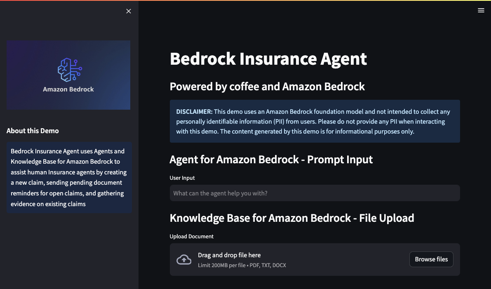

# Testing and Validation
---

## Assessment Measures and Evaluation Technique
The following testing procedure aims to verify that the agent correctly identifies, understands, and fulfills user intents for creating new claims, sending pending document reminders for open claims, gathering claims evidence, and searching for information on existing claims and FAQ document repositories. Response accuracy is determined by evaluating the relevancy, coherency, and human-like nature of the answers generated by Agents and Knowledge base for Amazon Bedrock. 

### Testing and Validation Procedure
1.  **Input Validation Testing:** Use sample prompts to assess the agent's understanding and responsiveness to diverse user inputs.
2.  **Instruction Configuration Testing:** Validate the agent's adherence to configured instructions for interpreting user inputs accurately.
3.  **User Input Interpretation:**
  > - **Pre-processing Evaluation:** Assess the agent's ability to validate, contextualize, and categorize user input accurately.
  > - **Orchestration Workflow:** Evaluate the logical steps the agent follows (e.g., "Trace) for action group API invocations and knowledge base queries to enhance the base prompt for the foundation model.
  > - **Post-processing Assessment:** Review the final responses generated by the agent after orchestration iterations to ensure accuracy and relevance.
4.  **Action Group Testing:**
  > - **API Schema Validation:** Validate that the OpenAPI schema (defined as JSON files stored in S3) functions effectively to guide the agent in reasoning around each API's purpose.
  > - **Business Logic Execution:** Test the execution of business logic associated with API paths through Lambda functions linked with the action group.
5.  **Knowledge Base Evaluation:**
  > - Configuration Verification: Ensure the knowledge base setup correctly directs the agent on when to access the data.
  > - S3 Data Source Integration: Validate the agent's ability to access and utilize data stored in the specified Amazon S3 data source.
6.  **End-to-End Testing:**
  > - Integrated Workflow: Perform comprehensive tests involving both action groups and knowledge bases to simulate real-world scenarios.
  > - Response Quality Assessment: Evaluate the overall accuracy, relevancy, and coherence of the agent's responses in diverse contexts and scenarios.

<p align="center">
  <br>
  <span style="display: block; text-align: center;"><em>Figure 10: Agent and Knowledge Base Testing and Validation</em></span>
</p>

Response Analysis and Debugging Tools:

Responses with sourced information contain footnotes for citations.
Select "Show trace" under a response to view the agent's reasoning process, including knowledge base and action group usage, and configurations.
Traces can be expanded or collapsed for detailed analysis.
Configuring Action Groups and Knowledge Bases:

Within the working draft, you can enable or disable action groups and knowledge bases.
To change the state, hover over the State section and click the edit button, then choose "Enabled" or "Disabled".
Disabling an action group or knowledge base means the agent won’t use it in orchestration.
Use this feature to debug by assessing the agent’s behavior with various settings.
Finalizing Changes:

Always select "Prepare" after making changes to apply them before testing the agent.
This process involves iterative development and testing of the agent, using tools like the test window and trace feature for effective debugging and optimization.

<p align="center">
  <br>
  <span style="display: block; text-align: center;"><em>Figure 11: Agent and Knowledge Base Tracing</em></span>
</p>

7.  Performance and Scaling Tests:
• Load Testing: Assess the agent's performance under varying loads of concurrent user requests.
• Scalability Testing: Evaluate the agent's scalability to handle increased volumes of data and user interactions without compromising response times or quality.
8.  Error Handling and Recovery:
• Error Scenarios: Test the agent's behavior and responses in scenarios of malformed inputs or unexpected errors.
• Recovery Mechanisms: Validate the agent's ability to recover from errors and maintain its functionality.
9.  Documentation and Reporting:
• Test Reports: Compile detailed reports outlining test scenarios, results, and any identified issues.
• Documentation Updates: Update agent documentation with any discovered enhancements, adjustments, or fixes.
10. Regression Testing:
• Re-test Procedures: Run tests periodically to ensure ongoing accuracy and functionality after updates or modifications to the agent.

### Deploy Streamlit Web UI for Your Agent
[Streamlit](https://streamlit.io/) is a Python library designed to streamline and simplify the process of building frontend applications. We use Streamlit in this solution to launch an example frontend, intended to emulate what would be a customer's Production application. The application provides two features:

- **Agent for Amazon Bedrock - Prompt Input:** Allows the user to [invoke the agent](https://docs.aws.amazon.com/bedrock/latest/userguide/api-agent-invoke.html) using their own task input.
- **Knowledge Base for Amazon Bedrock - File Upload:** Enables the user to upload their local files to the Amazon S3 bucket that is being used as the data source for the customer's knowledge base. Once the file is uploaded, the application [starts an ingestion job](https://docs.aws.amazon.com/bedrock/latest/userguide/knowledge-base-api-ingestion.html) to sync the knowledge base data source.

10. To run your Streamlit application, execute the following command then continue to [Testing and Validation](../documentation/testing-and-validation.md).

```sh 
streamlit run agent_streamlit.py
```
<p align="center">
  <br>
  <span style="display: block; text-align: center;"><em>Figure 10: Streamlit Agent Application</em></span>
</p>

## Resources
- [Generative AI on AWS](https://aws.amazon.com/generative-ai/)
- [Amazon Bedrock](https://aws.amazon.com/bedrock/)
- [Agents for Amazon Bedrock](https://docs.aws.amazon.com/bedrock/latest/userguide/agents.html)
- [Knowledge Base for Amazon Bedrock](https://docs.aws.amazon.com/bedrock/latest/userguide/knowledge-base.html)
- [Amazon DynamoDB](https://aws.amazon.com/dynamodb/)
- [Amazon Simple Notification Service (SNS)](https://docs.aws.amazon.com/sns/latest/dg/welcome.html)

---

## Clean Up
see [Clean Up](../documentation/clean-up.md)

---

Copyright Amazon.com, Inc. or its affiliates. All Rights Reserved.
SPDX-License-Identifier: MIT-0
