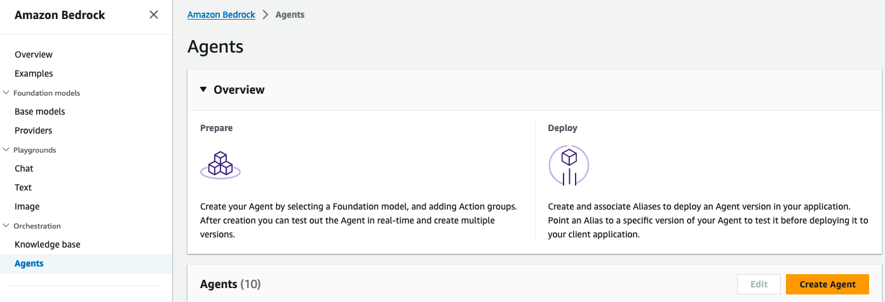

# Using Amazon Bedrock Agents

Agents for Amazon Bedrock accelerate the delivery of generative AI applications that can manage and perform tasks by making API calls to your company systems. Agents extend FMs to understand user requests, break down complex tasks into multiple steps, carry on a conversation to collect additional information, and take actions to fulfill the request.

## Contents

- [Introduction to Bedrock Agents](introduction-to-agents) - A simple agent to get you started with the syntax and the [ReAct](https://arxiv.org/pdf/2210.03629.pdf) reasoning technique.

## Contributing

We welcome community contributions! Please ensure your sample aligns with AWS [best practices](https://aws.amazon.com/architecture/well-architected/), and please update the **Contents** section of this README file with a link to your sample, along with a description.
