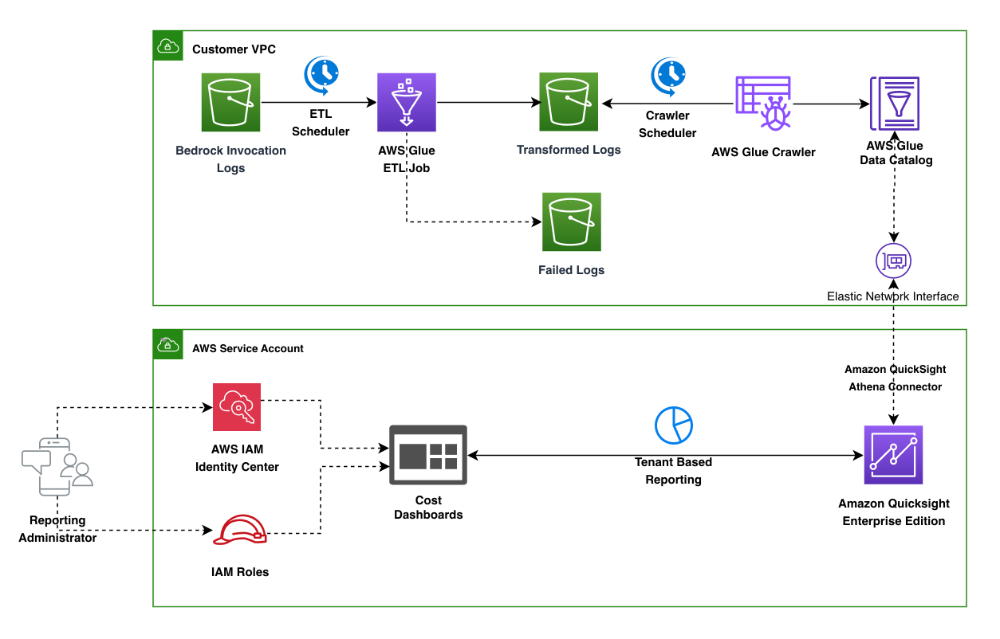

# Bedrock Converse Cost Reporting

An AWS CDK solution focused on analyzing Amazon Bedrock Converse API usage costs with automated ETL processing and QuickSight dashboards for metadata sent through Converse API.

## Overview

Bedrock Converse Cost Reporting provides a targeted solution for monitoring and analyzing your Amazon Bedrock Converse API usage and costs. It specifically processes Bedrock Converse metadata from model invocation logs, transforms the data, and presents it in interactive QuickSight dashboards, allowing you to:

- Track usage patterns across different models and applications
- Analyze costs by model, user, application, or custom tags
- Identify optimization opportunities
- Forecast future spending based on historical usage
- Allocate costs to different business units or projects

## Architecture Overview



The solution consists of the following components:

1. **Data Collection**: Bedrock model invocation logs are stored in an S3 bucket
2. **Data Processing**: AWS Glue ETL jobs transform raw Converse metadata into structured data
3. **Data Storage**: Transformed data is stored in S3 and cataloged in AWS Glue Data Catalog
4. **Data Analysis**: Amazon QuickSight dashboards provide interactive visualizations
5. **Pricing Data**: Converse API pricing information is maintained in a separate table
6. **Metadata Processing**: Converse-specific metadata and custom tags are extracted and pivoted for cost allocation

### Solution Workflow

1. Amazon Bedrock logs all model invocations to an S3 bucket
2. AWS Glue ETL job processes the raw logs, focusing on extracting Converse-specific metrics and metadata
3. Transformed data is stored in a structured format in S3
4. AWS Glue crawlers catalog the data for querying
5. Amazon QuickSight dashboards visualize Converse usage patterns and costs

## Plan Your Deployment

### Prerequisites

- AWS CLI configured with appropriate permissions (<https://docs.aws.amazon.com/cli/v1/userguide/cli-chap-configure.html>)
- AWS CDK installed (<https://docs.aws.amazon.com/cdk/v2/guide/getting-started.html>)
- Python 3.12+ installed
- uv package manager installed (<https://docs.astral.sh/uv/getting-started/installation/>)
- Bedrock Model invocation logging enabled with S3 destination (<https://docs.aws.amazon.com/bedrock/latest/userguide/model-invocation-logging.html>)
- Read access to the Bedrock invocation logs folder in S3
- QuickSight enabled with an Admin user (<https://docs.aws.amazon.com/en_us/quicksight/latest/user/setting-up.html>)

### Required Permissions

The deployment requires the following permissions:

- CloudFormation: Full access to create and manage stacks
- S3: Create buckets, manage objects, and configure bucket policies
- Glue: Create databases, tables, crawlers, and jobs
- IAM: Create roles and policies
- QuickSight: Create datasets and dashboards
- Lambda: Create and manage functions

### Resource Planning

Before deployment, consider the following:

- **S3 Storage**: Ensure sufficient storage for both raw logs and transformed data
- **Glue Resources**: The solution creates Glue databases, tables, crawlers, and ETL jobs
- **QuickSight Capacity**: Verify your QuickSight subscription has sufficient capacity for the dashboards
- **Cost Considerations**: Review the AWS pricing for all services used in this solution

## Security

The solution implements the following security best practices:

- **Least Privilege**: IAM roles with minimal required permissions
- **Data Encryption**: S3 buckets configured with server-side encryption
- **Access Control**: Restricted access to resources based on IAM policies
- **Secure Data Processing**: Glue jobs run in isolated environments
- **Audit Logging**: CloudTrail logging for all API calls

### Data Privacy

The solution processes Bedrock model invocation logs which may contain sensitive data. Ensure that:

1. Access to the QuickSight dashboards is restricted to authorized personnel
2. S3 bucket policies are configured to prevent unauthorized access
3. Data retention policies are implemented according to your organization's requirements
4. Consider implementing additional encryption for sensitive data

## Deployment

### Clone the Repository

```shell
git clone https://github.com/aws-samples/amazon-bedrock-samples.git
cd amazon-bedrock-samples/tbd/bedrock-cost-reporting
```

### Install uv (if not already installed)

If you don't have `uv` installed, install it first:

```shell
pip install uv
```

### Deploy the Solution

```shell
# Install dependencies with uv
uv sync

# Make the script executable
chmod +x deploy.sh

# Run the deployment script
./deploy.sh
```

The deployment script will:

1. Verify prerequisites (ensure uv sync has been run)
2. Check required dependencies
3. Automatically use the uv virtual environment for CDK commands
3. Check if CDK is bootstrapped in your AWS account/region
4. Prompt for required parameters:
   - S3 bucket name where Bedrock logs are stored (with validation)
   - QuickSight region
   - QuickSight username (with validation)
5. Option to generate sample Bedrock logs for testing (50 simulated API calls)
6. Deploy the CDK stack with the provided parameters
7. Upload pricing data to the transformed data bucket
8. Optionally run the Glue ETL job and crawlers
9. Provide the QuickSight dashboard URL upon completion

### Post-Deployment

After deployment, you can access the QuickSight dashboard to view your Bedrock usage and cost analytics:

1. Use the dashboard URL provided in the deployment output
2. If you need to find the URL later, you can retrieve it from CloudFormation:

   ```
   aws cloudformation describe-stacks --stack-name BedrockCostReportingStack --query "Stacks[0].Outputs[?OutputKey=='DashboardURL'].OutputValue" --output text
   ```

3. Alternatively, navigate to the QuickSight console in your AWS account and find the "Bedrock Converse Cost Reporting" dashboard
4. Explore the various visualizations and insights

## Troubleshooting

### Common Issues

1. **CDK Bootstrap Error**: Ensure your AWS account is bootstrapped for CDK in the target region

   ```
   cdk bootstrap aws://ACCOUNT-NUMBER/REGION
   ```

   The deployment script will check for this and offer to bootstrap for you if needed.

2. **S3 Bucket Access**: Verify that the deployment has access to the Bedrock logs S3 bucket. The script will validate bucket access before proceeding.

3. **QuickSight Access**: Ensure the QuickSight user exists and has admin permissions. The script will attempt to validate the QuickSight user.

4. **Python Version**: Ensure you have Python 3.12+ installed. The script will check your Python version.

5. **Glue Job Failures**: Check CloudWatch logs for the Glue job for detailed error messages

   ```
   aws logs get-log-events --log-group-name /aws-glue/jobs/output --log-stream-name <job-run-id>
   ```

6. **Missing Data in Dashboard**: Verify that the Glue crawlers have run successfully and the data is properly cataloged

### Deployment Logs

The deployment script creates a detailed log file in the project directory with the format `deploy_YYYYMMDD_HHMMSS.log`. This log includes information about each step of the deployment process, validation checks, and any errors encountered. Review this file for troubleshooting and audit purposes.

## Customizing the Solution

### Modifying the ETL Process

To customize the data transformation process:

1. Edit the Glue ETL script at `cdk/glue/bedrock_logs_transform.py`
2. Update the schema definitions in the corresponding JSON files
3. Redeploy the solution using the deployment script

### Updating Pricing Data

The pricing data is stored in `cdk/glue/pricing.csv`. To update pricing:

1. Edit the CSV file with the latest pricing information, including cache read/write costs
2. Upload the updated file to the transformed data S3 bucket:

   ```
   aws s3 cp cdk/glue/pricing.csv s3://TRANSFORMED-BUCKET-NAME/pricing/
   ```

3. Run the pricing crawler to update the data catalog:

   ```
   aws glue start-crawler --name bedrock-pricing-crawler
   ```

The pricing data now includes columns for cache read and cache write costs in addition to input and output costs.

### Customizing QuickSight Dashboards

The QuickSight dashboards can be customized directly in the QuickSight console:

1. Navigate to the QuickSight console
2. Open the Bedrock Converse Cost Reporting dashboard
3. Use the QuickSight editor to modify visualizations, add filters, or create new insights
4. Save your customized version of the dashboard

## Maintenance and Updates

### Regular Maintenance

1. **Update Pricing Data**: Keep the pricing data current as Amazon Bedrock pricing changes
2. **Monitor ETL Jobs**: Check Glue job execution logs periodically for any issues
3. **Review IAM Permissions**: Periodically review and update IAM roles and policies
4. **Optimize S3 Storage**: Implement lifecycle policies for cost-effective storage of historical data
5. **Refresh QuickSight Datasets**: Ensure QuickSight datasets are refreshed on an appropriate schedule

### Updating the Solution

To update to a new version of the solution:

1. Pull the latest changes from the repository
2. Run the deployment script with the same parameters
3. The script will update the CloudFormation stack with any changes

## Uninstall

To remove the solution from your AWS account:

1. Navigate to the project directory:

   ```
   cd amazon-bedrock-samples/cost-reporting/converse-metadata-cost-reporting
   ```

2. Use CDK to destroy all resources:

   ```
   cd cdk
   cdk destroy
   ```

3. Confirm the deletion when prompted

The CDK destroy command will automatically remove all resources created by the solution, including:

- QuickSight dashboards, analyses, and datasets
- Transformed data S3 bucket and its contents
- Glue databases, tables, crawlers, and jobs
- IAM roles and policies

Note: This will not delete your original Bedrock logs in the source S3 bucket.
