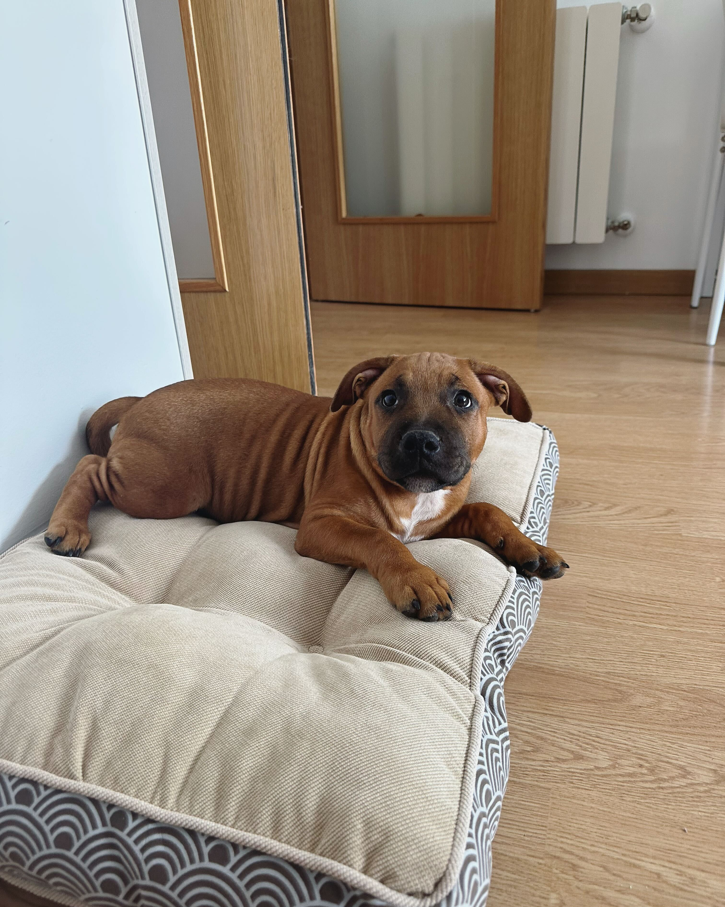
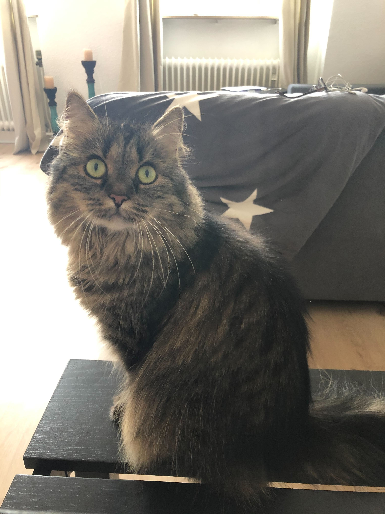

# Amazon Nova Canvas Model Fine-tuning

### Overview

This repository provides resources and notebooks for fine-tuning the Amazon Nova Canvas Model with Amazon Bedrock. Amazon Nova Canvas delivers high-quality images, with the flexibility to tailor visual outputs to match your creative needs. It can perform advanced image editing tasks such as in-painting, out-painting, image conditioning and many more. However, users would like to adapt the model to unique characteristics in custom datasets that the model is not already trained on.

| Ron the dog| Smila the cat|
|---------|---------|
|  |  |

### Notebooks
**1. Customize the model**

In the notebook **1-CanvasFT-customization-job**, you will find step-by-step instructions on how to customize the Amazon Nova Canvas model. You will learn how to prepare the training dataset and launch a fine-tuning job. 

**2. Provision and test the customized model**

The notebook **2-CanvasFT-provisioned-throughput-inference** guides you through the process of provisioning the fine-tuned model. You will compare base model results vs the customized model results.