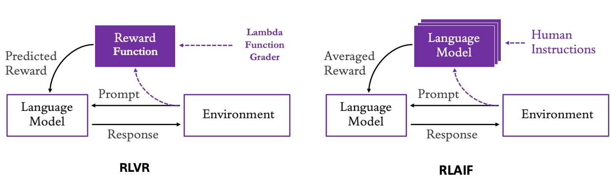

# Bedrock Reinforcement Fine-Tuning (RFT)

Examples for training models on Amazon Bedrock using Reinforcement Fine-Tuning.

## What's here

End-to-end notebooks showing how to RFT various models on different datasets:

| Model            | Dataset | Domain              | Reward Type | Notebook                                                                 |
| ---------------- | ------- | ------------------- | ----------- | ------------------------------------------------------------------------ |
| Amazon Nova Lite | GSM8K   | Math reasoning      | RLVR        | [models/nova/nova_gsm8k_rft.ipynb](models/nova/nova_gsm8k_rft.ipynb)     |
| Amazon Nova Lite | FinQA   | Financial reasoning | RLVR        | [models/nova/nova_finqa_rft.ipynb](models/nova/nova_finqa_rft.ipynb)     |
| Amazon Nova Lite | PandaLM | LLM evaluation      | RLAIF       | [models/nova/nova_pandalm_rft.ipynb](models/nova/nova_pandalm_rft.ipynb) |

More coming soon—additional Nova variants, Llama models, and more datasets.

## How RFT works

1. **You provide prompts** — Questions or tasks without answers
2. **The model generates responses** — Multiple candidate outputs per prompt
3. **A reward function scores them** — Your Lambda returns 0-1 based on correctness
4. **The model learns from feedback** — Reinforcement learning optimizes for higher rewards

Unlike supervised fine-tuning, RFT doesn't require gold-standard answers in the training data—just a way to verify correctness programmatically.

## RLVR vs RLAIF

This repository demonstrates two approaches to generating reward signals:

### Reinforcement Learning with Verifiable Rewards (RLVR)


RLVR uses programmatic verification to score model outputs. Best for tasks with objectively correct answers (math, code, factual QA).

**How it works:**

- **Training Data** provides prompts (sᵢ) to the model
- **Policy π_θ(.)** — The language model parameterized by θ that generates responses
- **Candidate Output (aᵢ)** — The model's generated response/action for prompt sᵢ
- **Verifiable Reward Function (λ)** — A Lambda function that programmatically checks correctness
- **Verifiable Reward (rᵢ) ∈ {α, 0}** — Binary reward: α (typically 1.0) for correct, 0 for incorrect
- **Policy Update: θ{t+1} = θₜ + α∇*θJ(π*θ)** — Gradient ascent to maximize expected reward J(π_θ)

**Used in:** GSM8K (math), FinQA (financial reasoning)

### Reinforcement Learning from AI Feedback (RLAIF)



RLAIF uses another language model (the "judge") to evaluate outputs. Best for subjective tasks where correctness can't be programmatically verified.

**Key differences:**
| Aspect | RLVR | RLAIF |
|--------|------|-------|
| Reward source | Programmatic verification | LLM-as-judge |
| Speed | Fast | Slower (LLM inference) |
| Cost | Lower | Higher |
| Best for | Verifiable answers | Subjective quality |

**Used in:** PandaLM (LLM evaluation/comparison)

## Directory structure

```
bedrock-reinforcement-fine-tuning/
├── models/                  # Training notebooks organized by model
│   └── nova/
│       ├── nova_gsm8k_rft.ipynb
│       ├── nova_finqa_rft.ipynb
│       └── nova_pandalm_rft.ipynb
├── reward-functions/        # Lambda functions that score model outputs
│   ├── gsm8k_rew_func.py    # Math answer verification (RLVR)
│   ├── finqa_rew_func.py    # Financial answer verification (RLVR)
│   └── pandalm_rew_func.py  # LLM-as-judge evaluation (RLAIF)
├── helpers/                 # Shared utilities (IAM roles, Lambda deployment, etc.)
├── images/                  # Architecture diagrams
└── README.md
```

## Prerequisites

- AWS account with Bedrock access
- S3 bucket for training data and outputs
- IAM permissions to create Lambda functions and IAM roles
- For RLAIF: Bedrock model access for the judge model

## Quick start

1. Pick a notebook from the table above
2. Update the config section with your S3 bucket and region
3. Run all cells

The notebook handles everything: data prep, Lambda deployment, IAM setup, and job submission.

## Writing your own reward function

Reward functions are Lambda functions that receive model outputs and return scores.

### RLVR (Programmatic verification)

```python
# Input: List of samples with messages and reference_answer
# Output: List of {"id": "...", "aggregate_reward_score": 0.0-1.0}

def lambda_handler(event, context):
    results = []
    for sample in event:
        # Extract model output and ground truth
        # Compare programmatically
        score = 1.0 if correct else 0.0
        results.append({"id": sample["id"], "aggregate_reward_score": score})
    return results
```

### RLAIF (LLM-as-judge)

```python
# Same interface, but calls a judge model to evaluate

def lambda_handler(event, context):
    results = []
    for sample in event:
        # Format evaluation prompt
        # Call judge model via Bedrock
        # Parse score from judge response
        results.append({
            "id": sample["id"],
            "aggregate_reward_score": score,
            "metrics_list": [{"name": "judge_score", "value": score, "type": "Reward"}]
        })
    return results
```

See `reward-functions/` for complete examples.

## Resources

- [AWS Blog: Improve model accuracy with RFT in Amazon Bedrock](https://aws.amazon.com/blogs/aws/improve-model-accuracy-with-reinforcement-fine-tuning-in-amazon-bedrock/)
- [Docs: RFT for Amazon Nova](https://docs.aws.amazon.com/bedrock/latest/userguide/nova-rft.html)
- [Docs: Reinforcement Fine-Tuning overview](https://docs.aws.amazon.com/bedrock/latest/userguide/reinforcement-fine-tuning.html)
- [Video: RFT walkthrough](https://www.youtube.com/watch?v=oNERioZEJiw)
- [Interactive demo: RFT in the console](https://aws.storylane.io/share/2wbkrcppkxdr)
- [PandaLM Paper](https://arxiv.org/abs/2306.05087)
- [RLAIF Paper](https://arxiv.org/abs/2309.00267)
