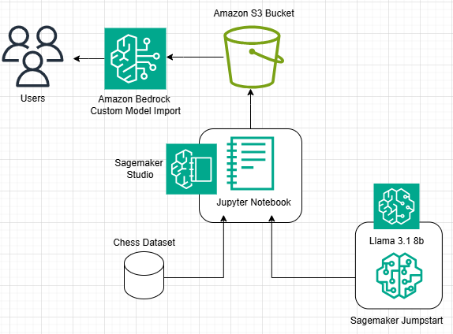

<h1> Overview </h1>

In this notebook Llama 3.1 8b will be fine-tuned to play chess. The model will be pulled from the Sagemaker Jumpstart model hub and fine-tuned using a Sagemaker training job. Sagemaker Jumpstart is a model hub with 400+ LLM's that can be deployed as is or fine-tuned. An overview of Llama 3.1 on Sagemaker Jumpstart can be found [here](https://aws.amazon.com/blogs/machine-learning/meta-llama-3-1-models-are-now-available-in-amazon-sagemaker-jumpstart/). 

This notebook can be run on any environment of the user's choice as the training compute will be offloaded into a "ml.g5.24xlarge". If this notebook is run outside of an Amazon Sagemaker environment, please ensure the AWS user credentials are correctly initialized. Some environments this notebook can be run on some examples:

1. Configuring an AWS EC2 instance with a Deep Learning AMI, and setting up a Jupyter Server: Link
2. Configuring an Amazon Sagemaker environment: Link
3. Configure your own environment, with adequate compute to run this notebook.

The Chess moves dataset is pulled from [here](https://chessdb.sourceforge.net/Scid/). This dataset outlines the board state in FEN notation, and states the next legal move based on the board state & player turn. More information about what FEN notation is and how to interpret it can be found [here](https://www.chess.com/terms/fen-chess).

Once the model is imported at the end of this notebook, please open "test_chess_model.ipynb" to use the model to play chess. If this is the intention skip the "Clean up" section at the bottom of this notebook.

**_NOTE:_** This notebook was tested in the us-east-1 region of AWS

<h2> Amazon Bedrock Custom Model Import (CMI) </h2>

The resulting model files are imported into Amazon Bedrock via Custom Model Import (CMI).

Bedrock Custom Model Import allows for importing foundation models that have been customized in other environments outside of Amazon Bedrock, such as Amazon Sagemaker, EC2, etc.

<h2> What will you learn from this notebook </h2>

In this notebook, you will learn how to:

* Pull a model from Sagemaker Jumpstart & finetune it 
* Use a custom dataset & process it to conform to a prompt template of choice
* Finetune the model (Llama 3.1 8b) using Sagemaker training jobs
* Deploy the finetuned model to Amazon Bedrock Custom Import & Conduct Inference

<h2> Architectural Pattern </h2>



As can be seen from the diagram above, the model (Llama 3.1 8b) gets pulled from Sagemaker Jumpstart, and The dataset is a chess dataset from pgnmentor.com mirroring Magnus Carlson's games. The model files are then stored in an S3 bucket, to then be imported into Amazon Bedrock. This architecture is modular because the Notebook can be run anywhere, that the appropriate compute is available (as explained earlier).

<h2> Code with comments </h2>

<h3> Install dependencies & restart kernel </h3>


```python
!pip install -U 'aiobotocore[boto3]' 
```


```python
!pip install setuptools==69.0.2
!pip install chess
```


```python
!pip install --upgrade pip setuptools wheel --quiet
```


```python
!pip install transformers datasets
```


```python
# restart kernel
from IPython.core.display import HTML
HTML("<script>Jupyter.notebook.kernel.restart()</script>")
```

<h3> Setup Sagemaker client </h3>


```python
import boto3
import sagemaker
import transformers
print(f"Sagemaker Version - {sagemaker.__version__}")
print(f"Transformers version - {transformers.__version__}")

sess = sagemaker.Session()
# sagemaker session bucket -> used for uploading data, models and logs
# sagemaker will automatically create this bucket if it not exists
sagemaker_session_bucket=None
if sagemaker_session_bucket is None and sess is not None:
    # set to default bucket if a bucket name is not given
    sagemaker_session_bucket = sess.default_bucket()
 
try:
    role = sagemaker.get_execution_role()
except ValueError:
    iam = boto3.client('iam')
    role = iam.get_role(RoleName='sagemaker_execution_role')['Role']['Arn']
 
sess = sagemaker.Session(default_bucket=sagemaker_session_bucket)
 
print(f"sagemaker role arn: {role}")
print(f"sagemaker bucket: {sess.default_bucket()}")
print(f"sagemaker session region: {sess.boto_region_name}")
```

<h3> Identify model id from Sagemaker Jumpstart & Setup data location </h3>
Sagemaker jumpstart has unique identifiers for each model present. Below is the model id & the model version for Llama 3.1 8b


```python
from sagemaker.jumpstart.model import JumpStartModel
model_id, model_version = "meta-textgeneration-llama-3-1-8b", "2.2.2"
pretrained_model = JumpStartModel(model_id=model_id, model_version=model_version)
```

In the cell below the training data location is being specified to the Sagemaker default S3 bucket. In addition the local training/validation paths are being identified to store in the local directory


```python
train_test_data_location = f's3://{sess.default_bucket()}/datasets/3-1-8b'
local_train_data_file = "data/train.jsonl"
local_test_data_file = "data/validation.jsonl"
```

<h2> Dataset Download section </h2>

the dataset is being downloaded from [pgnmentor.com](https://www.pgnmentor.com/) this website allows for the extensive viewing & analysis of previously played chess games. The data that will be used to fine tune this model will be data from some of Magnus Carlsen's games. The cells below outline the process of downloading the data to the directory


```python
# Download Carlsen's games zip file to the target directory
!curl -o ./data/Carlsen.zip https://www.pgnmentor.com/players/Carlsen.zip
```


```python
# Unzip the file in the target directory
!unzip ./data/Carlsen.zip -d ./data
```


```python
# Rename the unzipped folder to 'top'
!mv ./data/Carlsen.pgn ./data/top.pgn
```


```python
# Remove the zip file after unzipping
!rm ./data/Carlsen.zip
```

<h3> Dataset Processing & Validation </h3>
In the cell below the data is being processed to fit the correct format, and being saved to the local directory.
Some points of importance in the cell below:
* 


```python
import chess.pgn
from pathlib import Path
import json
from datasets import load_dataset, DatasetDict
import os
import random

def create_chess_message(fen, next_move_color, best_move_san=None):
    instruction = "You are a chess engine. Analyze the given position and generate the next best valid move in SAN format."
    return {
        "instruction": instruction,
        "fen": fen,
        "nxt-color": next_move_color,
        "move": best_move_san if best_move_san else None
    }

def process_sample(sample):
    return create_chess_message(
        fen=sample['fen'],
        next_move_color=sample['nxt_color'],
        best_move_san=sample.get('move')
    )

# Initialize a counter for the number of records written (set to 35000000 for the full dataset)
#set to 100 by default to finish the training job fast
records_written = 0
max_records = 100

# Your existing code for creating data.json remains the same
pathlist = Path("data/top/").glob('**/*.pgn')
with open("data/top/data.json", 'w') as f:
    for path in pathlist:
        print(f'File being processed - {path}')
        pgn = open(path)
        while True:
            if records_written >= max_records:
                print(f"Reached {max_records} records. Stopping.")
                break
            try:
                game = chess.pgn.read_game(pgn)
                if game is None:
                    break
                else:
                    result = game.headers["Result"]
                    if result == "1-0":
                        winner = "WHITE"
                    elif result == "0-1":
                        winner = "BLACK"
                    else:
                        winner = "DRAW"

                    board = chess.Board()  # Create a new board for each game
                    for move in game.mainline_moves():
                        current_color = "WHITE" if board.turn else "BLACK"
                        if winner == "DRAW" or current_color == winner: #consider the moves only if it's a winner's move or neutral
                            if move in board.legal_moves:
                                move_json = {
                                    "move": board.san(move),
                                    "fen": board.fen(),
                                    "nxt_color": current_color,
                                }
                                f.write(json.dumps(move_json) + "\n")
                                records_written += 1
                                board.push(move)
                            else:
                                print(f"Illegal move encountered: {board.san(move)} in position {board.fen()}. Skipping this move.")
                        else:
                            board.push(move)
            except Exception as e:
                print(f"Error processing game: {str(e)}. Skipping this game.")

        if records_written >= max_records:
            break
            
print(f"Total records written: {records_written}")

# Load the dataset
dataset = load_dataset("json", data_files="data/top/data.json", split="train[:100%]")

# Create a 70/30 train/test split
dataset = dataset.train_test_split(test_size=0.3, seed=42)

# Shuffle each split
for split in dataset:
    dataset[split] = dataset[split].shuffle(seed=42)

# Apply the processing function to each split
dataset = dataset.map(
    process_sample,
    remove_columns=dataset['train'].column_names,
    num_proc=os.cpu_count()  # Use multiple processes for faster processing
)

dataset = dataset.remove_columns("instruction") # Not needed as we are adding the instruction in template

print(f'New schema for dataset: {dataset}')
print(f'\nDataset sizes:')
for split in dataset:
    print(f'{split}: {len(dataset[split])} samples')

dataset = dataset.shuffle()

# Save the processed datasets
dataset['train'].save_to_disk("data/processed_chess_train")
dataset['test'].save_to_disk("data/processed_chess_test")

dataset["train"].to_json(local_train_data_file, orient="records", force_ascii=False)
dataset["test"].to_json(local_test_data_file, orient="records", force_ascii=False)
```

Using the Python Chess library, the dataset is being validated to ensure all recommended moves are valid. This will ensure the LLM has 100% true examples to learn from 


```python
# Validating the dataset created has all valid and legal moves only - for the safer side!
import json
import chess
from tqdm import tqdm

def validate_move(fen, move_san):
    try:
        board = chess.Board(fen)
        # Parse SAN move and validate it's legal
        move = board.parse_san(move_san)
        return move in board.legal_moves
    except ValueError:
        # If the move can't be parsed in SAN format
        return False

def validate_data_json(file_path):
    valid_count = 0
    invalid_count = 0
    invalid_records = []

    with open(file_path, 'r') as f:
        lines = f.readlines()

    for i, line in enumerate(tqdm(lines, desc="Validating moves")):
        record = json.loads(line)
        fen = record['fen']
        move = record['move']

        try:
            if validate_move(fen, move):
                valid_count += 1
            else:
                invalid_count += 1
                invalid_records.append((i, fen, move))
        except Exception as e:
            # Handle any other unexpected errors
            invalid_count += 1
            invalid_records.append((i, fen, f"{move} (Error: {str(e)})"))

    print(f"Total records: {len(lines)}")
    print(f"Valid moves: {valid_count}")
    print(f"Invalid moves: {invalid_count}")

    if invalid_records:
        print("\nInvalid records:")
        for record in invalid_records[:10]:  # Print first 10 invalid records
            print(f"Line {record[0]}: FEN: {record[1]}, Move: {record[2]}")
        
        if len(invalid_records) > 10:
            print(f"... and {len(invalid_records) - 10} more.")

    return valid_count == len(lines)

# Run the validation
file_path = "data/top/data.json"
all_valid = validate_data_json(file_path)

if all_valid:
    print("All moves are valid!")
else:
    print("Some moves are invalid. Please check the output above for details.")
```

Print random samples from the dataset to view the cleaned & prepped data


```python
# Print random samples
for split in ['train', 'test']:
    print(f"\nRandom samples from {split} set:")
    for index in random.sample(range(len(dataset[split])), 2):
        print(dataset[split][index]["fen"])
```

Create the prompt template. This template is needed by Sagemaker Jumpstart to understand the given template from the dataset. This file must be in the same directory as the training data, and named "template.json"


```python
import json

template = {
    "prompt": (
        "<s>[INST] You are a chess engine. Given a chess position in FEN notation and the color to move, "
        "provide the next best valid move in SAN (Standard Algebraic Notation) format to progress towards winning the game of chess. "
        "Your response must be a single move wrapped in <move></move> tags.\n\n"
        "Chess Position (FEN): {fen}\n"
        "Color to Move: {nxt-color} [/INST]"
    ),
    "completion": " <move>{move}</move> </s>"
}

with open("data/template.json", "w") as f:
    json.dump(template, f, indent=2)
```

In the final step of dataset preparation the training data, testing data, and prompt template will be uploaded to the S3 buckets previously initialized 


```python
from sagemaker.s3 import S3Uploader
import sagemaker
import random

S3Uploader.upload(local_train_data_file, train_test_data_location)
S3Uploader.upload(local_test_data_file, train_test_data_location)
S3Uploader.upload("data/template.json", train_test_data_location)

print(f"Training data: {train_test_data_location}")
```

<h3> Submit the training job </h3>

An estimator object is needed by Sagemaker to submit training jobs. In this estimator object there are a some items that should be taken note of:

* The model id & version are being passed into the estimator.
* The eula must be set to "true" - this is due to different LLM's on Sagemaker Jumpstart, being from different model providers. Each provider has its own eula.
* instance type - this is the compute instance(s) being used to conduct the fine tuning job on.
* The .fit method for the estimator is what actually submits the training job


```python
from sagemaker.jumpstart.estimator import JumpStartEstimator

estimator = JumpStartEstimator(
    model_id=model_id,
    model_version=model_version,
    environment={"accept_eula": "true"},  # Please change this to {"accept_eula": "true"}
    disable_output_compression=True,
    instance_type="ml.g5.48xlarge"
)
# By default, instruction tuning is set to false. Thus, to use instruction tuning dataset you use
estimator.set_hyperparameters(instruction_tuned=True, epoch="5", max_input_length="1024")
estimator.fit({"training": train_test_data_location})
```


```python
estimator.model_data
```


```python
rivchess_model_src = {"s3DataSource": {"s3Uri": f'{ estimator.model_data["S3DataSource"]["S3Uri"] }'}}
%store rivchess_model_src
```


```python
#Copy the model files to the AWS account where chess application is deployed

import boto3
from botocore.config import Config
import time
from IPython.display import clear_output
import pandas as pd

# Create S3 clients with optimized config
config = Config(
    retries={'max_attempts': 3},
    tcp_keepalive=True
)

def copy_files():
    # Configuration
    source_bucket = 'sagemaker-us-east-1-310426156939'
    source_prefix = 'meta-textgeneration-llama-3-1-8b-2024-11-08-03-39-43-706/output/model/'
    dest_bucket = 'riv-chess-cmi-models'
    dest_prefix = 'meta-textgeneration-llama-3-1-8b-V4/'
    
    # Initialize S3 clients
    s3_source = boto3.client('s3', region_name='us-east-1', config=config)
    s3_dest = boto3.client('s3', region_name='us-west-2', config=config)
    
    # Get list of all objects
    print("Fetching list of files...")
    paginator = s3_source.get_paginator('list_objects_v2')
    pages = paginator.paginate(Bucket=source_bucket, Prefix=source_prefix)
    
    # Prepare file list with sizes
    files_to_copy = []
    total_size = 0
    
    for page in pages:
        if 'Contents' in page:
            for obj in page['Contents']:
                source_key = obj['Key']
                size_mb = obj['Size'] / (1024 * 1024)  # Convert to MB
                total_size += size_mb
                files_to_copy.append({
                    'source_key': source_key,
                    'size_mb': size_mb,
                    'dest_key': dest_prefix + source_key.replace(source_prefix, '')
                })
    
    print(f"Total files to copy: {len(files_to_copy)}")
    print(f"Total size: {total_size:.2f} MB")
    
    # Create DataFrame for tracking
    df = pd.DataFrame(files_to_copy)
    df['status'] = 'pending'
    df['attempts'] = 0
    
    # Copy files with progress tracking
    copied = 0
    failed = 0
    start_time = time.time()
    
    for index, row in df.iterrows():
        try:
            # Update progress display
            clear_output(wait=True)
            elapsed_time = time.time() - start_time
            print(f"Progress: {copied}/{len(files_to_copy)} files copied")
            print(f"Failed: {failed} files")
            print(f"Elapsed time: {elapsed_time:.1f} seconds")
            print(f"Currently copying: {row['source_key']}")
            print(f"File size: {row['size_mb']:.2f} MB")
            
            # Copy the file
            copy_source = {
                'Bucket': source_bucket,
                'Key': row['source_key']
            }
            
            s3_dest.copy(
                copy_source,
                dest_bucket,
                row['dest_key']
            )
            
            df.at[index, 'status'] = 'completed'
            copied += 1
            
        except Exception as e:
            print(f"\nError copying {row['source_key']}: {str(e)}")
            df.at[index, 'status'] = 'failed'
            df.at[index, 'error'] = str(e)
            df.at[index, 'attempts'] += 1
            failed += 1
            time.sleep(1)  # Brief pause before continuing
    
    # Final summary
    clear_output(wait=True)
    print("\nTransfer Complete!")
    print(f"Total files copied: {copied}")
    print(f"Failed files: {failed}")
    print(f"Total time: {(time.time() - start_time):.1f} seconds")
    
    # Show failed files if any
    if failed > 0:
        print("\nFailed files:")
        failed_df = df[df['status'] == 'failed']
        display(failed_df[['source_key', 'size_mb', 'error', 'attempts']])
    
    return df

# Execute the copy operation
transfer_results = copy_files()

```

<h3> Import the fine tuned model into Bedrock using Bedrock Custom Model Import (CMI) </h3>

The fine tuned model will now be imported into Amazon Bedrock. This model will be able to be used via the invoke model & invoke model with response stream apis. This model will run in a serverless capacity. Take note that the first inference conducted after a 5 minute window of no inferences, will face a cold startup time. Subsequent inference requests will be conducted as normal, as long as there is less than a 5 minute window between them. To import the model an Import Job must be commenced, which is outlined below


```python
import datetime
import json
from botocore.exceptions import ClientError
```


```python
br_client = boto3.client('bedrock', region_name='us-east-1')
br_run_client = boto3.client('bedrock-runtime', region_name='us-east-1')

model_split = model_id.split("/")
if len(model_split) > 1:
    rivchess_model_nm = f"RIVCHESS-{model_split[1]}"
else:
    rivchess_model_nm = f"RIVCHESS-{model_split[0]}"

rivchess_imp_jb_nm = f"{rivchess_model_nm}-job-{datetime.datetime.now().strftime('%Y%m%d%M%H%S')}"
role_arn = role

create_model_import_job_resp = br_client.create_model_import_job(jobName=rivchess_imp_jb_nm,
                                  importedModelName=rivchess_model_nm,
                                  roleArn=role_arn,
                                  modelDataSource=rivchess_model_src)
```


```python
list_model_import_jobs_response = br_client.list_model_import_jobs(
    nameContains=rivchess_imp_jb_nm)

print(f"BR CMI Import Job - {create_model_import_job_resp['jobArn']} is - {list_model_import_jobs_response['modelImportJobSummaries'][0]['status']}")
while list_model_import_jobs_response['modelImportJobSummaries'][0]['status'] != 'Completed':
    interactive_sleep(30)
    list_model_import_jobs_response = br_client.list_model_import_jobs(nameContains=rivchess_imp_jb_nm)
```

<h3> Invoke the imported model using Bedrock API's </h3>


```python
import time
def interactive_sleep(seconds: int):
    dots = ''
    for i in range(seconds):
        dots += '.'
        print(dots, end='\r')
        time.sleep(1)
```


```python
try:
    get_imported_model_response = br_client.get_imported_model(
        modelIdentifier=rivchess_model_nm
    )

    br_model_id = get_imported_model_response['modelArn']
    br_model_id
except br_client.exceptions.ResourceNotFoundException:
    print("Model not yet imported")
```


```python
def call_invoke_model_and_print(native_request):
    request = json.dumps(native_request)

    try:
        # Invoke the model with the request.
        response = br_run_client.invoke_model(modelId=br_model_id, body=request)
        model_response = json.loads(response["body"].read())
        # print(f"model_response: {model_response}")
        response_text = model_response['generation'].replace("\n", "").replace("### Response:", "")
        return response_text
    except (ClientError, Exception) as e:
        print(f"ERROR: Can't invoke '{br_model_id}'. Reason: {e}")
        exit(1)
```


```python
template["prompt"]
```


```python
move_color = "BLACK"
board_fen = "6k1/p1q1prbp/b3n1p1/2pPPp2/5P1Q/4BN2/Pr2N1PP/R1R4K b - - 0 21"

# Format the prompt using the template
formatted_prompt = template["prompt"].format(
    fen=board_fen,
    nxt_color=move_color
)

native_request = {
    "prompt": formatted_prompt,
    "max_tokens": 50,
    "top_p": 0.9,
    "temperature": 0.1
}

call_invoke_model_and_print(native_request)
```


```python
move_color = "WHITE"
board_fen = "1r1qk2r/p2bppbp/n2P1np1/1pp5/3P4/2P1BB2/PP2QPPP/RN2K1NR w KQk - 3 11"

# Format the prompt using the template
formatted_prompt = template["prompt"].format(
    fen=board_fen,
    nxt_color=move_color
)

native_request = {
    "prompt": formatted_prompt,
    "max_tokens": 100,
    "top_p": 0.9,
    "temperature": 0.1,
    "top_k": 50,
}

call_invoke_model_and_print(native_request)
```

<h2> Clean Up </h2>
Once the model will no longer be used, it may be deleted with the cell below. If additional testing for the model needs to be done, the "test_chess_model.ipynb" notebook can be opened to test the model against a Chess engine called Stockfish. 


```python
delete_imported_model_response = br_client.delete_imported_model(
    modelIdentifier=br_model_id
)
```
