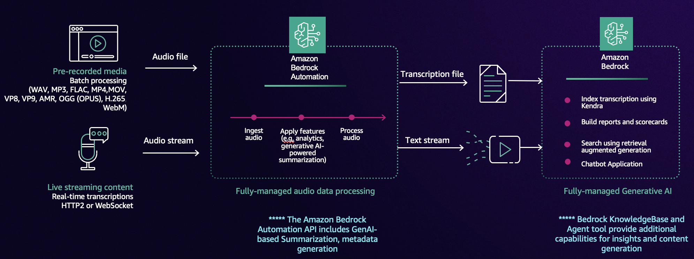

# Podcast Analytics

Podcasts have become a widely popular medium for sharing information, storytelling, and discussions on a vast range of topics. Unlike text-only datasets, podcast audio needs advanced processing such as speaker identity, content moderation, sentiment analysis, quick summary of the podcast, making it a valuable resource for developing and showcasing multimodal data processing capabilities. In this workshop, we will explore how to use Bedrock Data Automation service to analyze a raw audio file from a podcast, extract textual transcripts for further analysis, and incorporate metadata (e.g., speaker information, timestamps, chapter segmentation) to build a robust data processing pipeline. 

