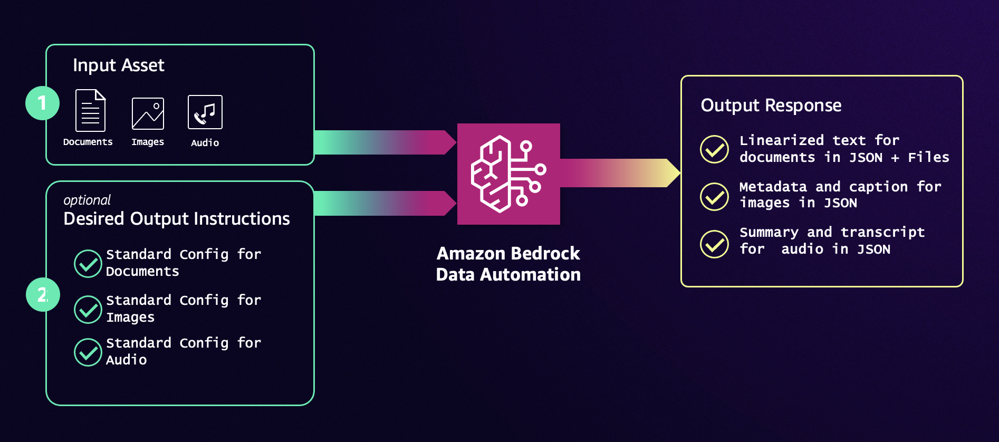

# Building a Multimodal Retrieval-Augmented Generation (RAG) Application with Amazon Bedrock Data Automation

This notebook demonstrates how to build a Multimodal Retrieval-Augmented Generation (RAG) application using Amazon Bedrock Data Automation (BDA) and Bedrock Knowledge Bases (KB). The application is designed to analyze and generate insights from multi-modalal data, including textual, visual, video and audio data. By incorporating contextual information from your own data sources with BDA, you can create highly accurate and secure intelligent search Generative AI applications.

With the latest integration between BDA and Amazon Bedrock Knowledge Bases, you can specify BDA as parser of your data source for Bedrock Knowledge Bases.

