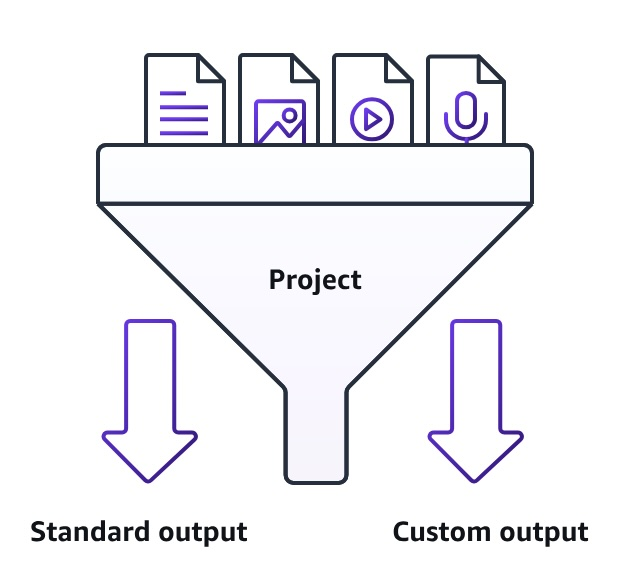

Bedrock Data Automation (BDA) lets you configure output based on your processing needs for you specific documents. BDA can generate standard output or custom output. Below are some key concepts for understanding how BDA works. If you're a new user, start with the information about standard output.

**Standard output** – Sending a file to BDA with no other information returns the default standard output, which consists of commonly required information that's based on the data type. Examples include audio transcriptions, scene summaries for video, and document summaries. These outputs can be tuned to your use case using projects to modify them. For more information, see [Standard output in Bedrock Data Automation](https://docs.aws.amazon.com/bedrock/latest/userguide/bda-standard-output.html).

**Custom output** – For documents and images, only. Choose custom output to define exactly what information you want to extract using a blueprint. A blueprint consists of a list of expected fields that you want retrieved from a document or image. Each field represents a piece of information that needs to be extracted to meet your specific use case. You can create your own blueprints, or select predefined blueprints from the BDA blueprint catalog. For more information, see [Custom output and blueprints](https://docs.aws.amazon.com/bedrock/latest/userguide/bda-custom-output-idp.html).

**Projects** – A project is a BDA resource that allows you to modify and organize output configurations. Each project can contain standard output configurations for documents, images, video, and audio, as well as custom output blueprints for documents and images. Projects are referenced in the InvokeDataAutomationAsync API call to instruct BDA on how to process the files. For more information about projects and their use cases, see [Bedrock Data Automation projects](https://docs.aws.amazon.com/bedrock/latest/userguide/bda-projects.html)