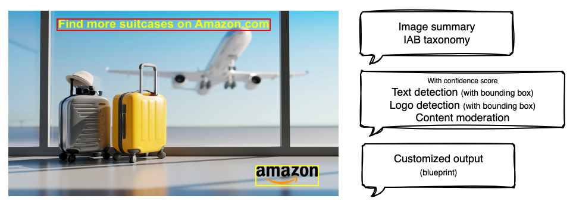

# Image extraction and analysis using BDA

BDA provides a comprehensive set of standard outputs for image processing to generate insights from your images. It also offers customizable features via blueprints, allowing users to flexibly extend the analysis outputs.

## Image standard output
- Image summary
- [IAB taxonomy](https://en.wikipedia.org/wiki/Interactive_Advertising_Bureau)
- Text detection (with bounding box and confidence score)
- Logo detection (with bounding box and confidence score)
- Content moderation (with confidence score)

For more information about BDA image standard output, refer to this [document](https://docs.aws.amazon.com/bedrock/latest/userguide/bda-ouput-image.html)

## Image custom output
BDA allows you to create custom blueprints for image modalities. You can use blueprints to define the desired output format and extraction logic for your input files. By creating custom blueprints, you can tailor BDA's output to meet your specific requirements. Within one project, you can apply a single image blueprint.

For more information about BDA image custom output, refer to this [document](https://docs.aws.amazon.com/bedrock/latest/userguide/bda-idp-images.html)
