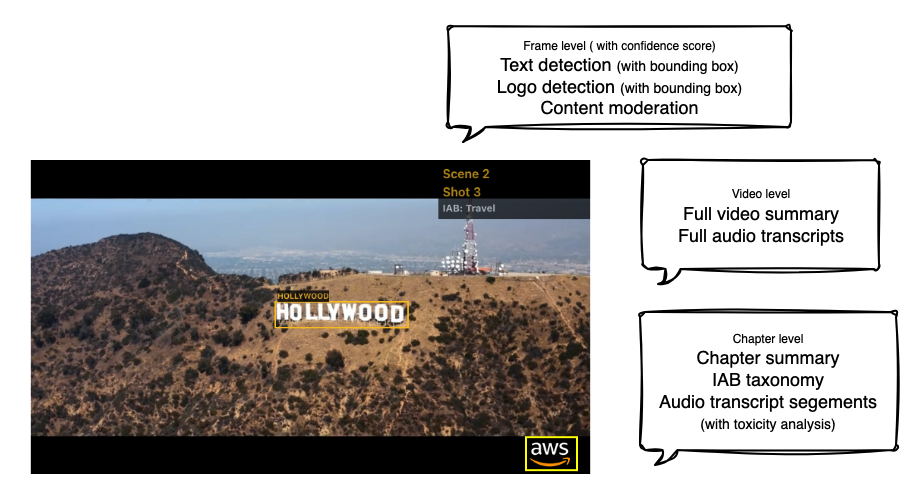

# Video extraction and analysis using BDA

BDA offers a set of standard outputs to process and generate insights for videos. 

## Video level
- Full video summary
- Full audio transcripts

## Chapter level
> A video chapter is a sequence of shots that form a coherent unit of action or narrative within the video. This feature breaks down the video into meaningful segments based on visual and audible cues, provides timestamps for those segments, and summarizes each. 
- Chapter summary
- [IAB taxonomy](https://en.wikipedia.org/wiki/Interactive_Advertising_Bureau)
- Audio transcrip segments

## Frame level
- Text detection (with bounding box and confidence score)
- Logo detection (with bounding box and confidence score)
- Content moderation (with confidence score)

For more information, refer to this [document](https://docs.aws.amazon.com/bedrock/latest/userguide/bda-ouput-video.html)