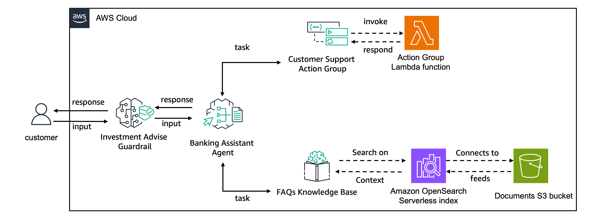

---
tags:
    - Agents/ Function Calling
    - Responsible-AI/ Guardrails
    - RAG/ Knowledge-Bases
---

!!! tip inline end "[Open in github](https://github.com/aws-samples/amazon-bedrock-samples/tree/main/agents-and-function-calling/bedrock-agents/features-examples/08-create-agent-with-guardrails/08-create-agent-with-guardrails.ipynb){:target="_blank"}"

<h2>Creating Agent with Guardrails for Amazon Bedrock integration </h2>

In this folder, we provide an example of creating an agent with Amazon Bedrock and integrating it with a [
Guardrails for Amazon Bedrock](https://aws.amazon.com/bedrock/guardrails/), a
[Knowledge Base for Amazon Bedrock](https://aws.amazon.com/bedrock/knowledge-bases/) and with an action group. 
With this integration, the agent will be able to respond to a user query by taking a sequence of actions, 
consulting the knowledge base to obtain more information, and/or executing tasks using the lambda function 
connected with an Action Group. For each interaction the Guardrail for Amazon Bedrock provides an extra layer of 
security to the application, validating the user input and the agent output for the topic denial defined in the 
guardrail and blocking the necessary requests.

<h2>Use case</h2>
In this example, we will create a banking assistant agent that allows users to:
- check account balance,
- book a new appointment with the bank and
- answer general questions

This assistant does **not** provide investment advice to the users and to better validate this requirement, 
a guardrail denying investments advice topics is added to the application.

The action Group `CustomerSupportActionGroup` provides the functionalities for account balance checking and 
appointment reservations while a Knowledge Base for Amazon Bedrock indexes documents containing frequently asked 
questions to an [OpenSearch Serverless](https://aws.amazon.com/opensearch-service/features/serverless/) vector database.

For this use case we will use the made up scenario of a situation where accidentally some investment advice data 
was added to the FAQs documented indexed by the Knowledge Base. 

As the bank our agent should not provide any investment advice, a guardrail is defined to block the investment 
advise topic. Its definition looks as following:

```
response = bedrock_client.create_guardrail(
    name='BankingAssistantGuardrail',
    description='Guardrail for online banking assistant to help users with banking and account related questions',
    topicPolicyConfig={
        'topicsConfig': [
            {
                'name': 'Investment Advice',
                'definition': 'Investment advice refers to professional guidance or recommendations provided to individuals or entities regarding the management and allocation of their financial assets.',
                'examples': [
                    'Should I buy gold?',
                    'Is investing in stocks better than bonds?',
                    'When is it a good idea to invest in gold?',
                ],
                'type': 'DENY'
            },
        ]
    },
    blockedInputMessaging='Sorry, your query violates our usage policies. We do not provide investment advices. To discuss the best investment advice for your current situation, please contact us on (XXX) XXX-XXXX and we will be happy to support you.',
    blockedOutputsMessaging='Sorry, I am unable to reply. Please contact us on (XXX) XXX-XXXX and we will be happy to support you.',
)
```


<h2>Agent Architecture</h2>


<br/>

The action group created in this example uses 
[function details](https://docs.aws.amazon.com/bedrock/latest/userguide/agents-action-function.html) to define the 
functionalities for `check_balance`, `book_appointment`. The action group execution connects with a Lambda function. 
No real functionality is implemented for this agent and the functions used in the lambda function return hardcoded values. 
For a real-life application, you should implement the `check_balance` and `book_appointment` functions to connect with 
available databases

<h2>1. Import the needed libraries</h2>

First step is to install the pre-requisites packages


```python
!pip install --upgrade -q -r requirements.txt
```


```python
import os
import time
import boto3
import logging
import pprint
import json

from knowledge_base import KnowledgeBasesForAmazonBedrock
from agent import AgentsForAmazonBedrock
```


```python
#Clients
s3_client = boto3.client('s3')
sts_client = boto3.client('sts')
session = boto3.session.Session()
region = session.region_name
account_id = sts_client.get_caller_identity()["Account"]
bedrock_agent_client = boto3.client('bedrock-agent')
bedrock_agent_runtime_client = boto3.client('bedrock-agent-runtime')
bedrock_client = boto3.client('bedrock')
logging.basicConfig(format='[%(asctime)s] p%(process)s {%(filename)s:%(lineno)d} %(levelname)s - %(message)s', level=logging.INFO)
logger = logging.getLogger(__name__)
region, account_id
```


```python
suffix = f"{region}-{account_id}"
agent_name = 'banking-assistant1q11'
knowledge_base_name = f'{agent_name}-kb'
knowledge_base_description = "Knowledge Base that provides FAQ documentation for the banking assistant agent"
agent_alias_name = "banking-agent-alias"
bucket_name = f'{agent_name}-{suffix}'
agent_bedrock_allow_policy_name = f"{agent_name}-ba"
agent_role_name = f'AmazonBedrockExecutionRoleForAgents_{agent_name}'
agent_foundation_model = "anthropic.claude-3-sonnet-20240229-v1:0"

agent_description = "Online Banking assistant agents"
agent_instruction = """
You are an agent designed to assist customers from the ANY_BANK Corporation with online banking queries. 
You ALWAYS reply politely and concise using ONLY the available information in the ba_kb knowledge base or the data retrieved via the banking-assistant action group.

You also add the name ANY_BANK Corporation to your first answer in a session. You should start with an acknowledgement of the customer's query and thanking the customer for contacting you.

Introduce yourself as the "ANY_BANK Corporation AI Assistant".

NEVER provide account balances or book appointments without first confirming the customer's user_id
"""
```

<h2>2. Create Knowledge Base for Amazon Bedrock</h2>
Let's start by creating a [Knowledge Base for Amazon Bedrock](https://aws.amazon.com/bedrock/knowledge-bases/) to store the restaurant menus. Knowledge Bases allow you to integrate with different vector databases including [Amazon OpenSearch Serverless](https://aws.amazon.com/opensearch-service/features/serverless/), [Amazon Aurora](https://aws.amazon.com/rds/aurora/) and [Pinecone](http://app.pinecone.io/bedrock-integration). For this example, we will integrate the knowledge base with Amazon OpenSearch Serverless. To do so, we will use the helper class `BedrockKnowledgeBase` which will create the knowledge base and all of its pre-requisites:
1. IAM roles and policies
2. S3 bucket
3. Amazon OpenSearch Serverless encryption, network and data access policies
4. Amazon OpenSearch Serverless collection
5. Amazon OpenSearch Serverless vector index
6. Knowledge base
7. Knowledge base data source


```python
knowledge_base = KnowledgeBasesForAmazonBedrock()
kb_id, ds_id = knowledge_base.create_or_retrieve_knowledge_base(
    knowledge_base_name, knowledge_base_description, data_bucket_name=bucket_name
)
```

<h2>3. Upload the dataset to Amazon S3</h2>
Now that we have created the knowledge base, let's populate it with the menu's dataset. The Knowledge Base data source expects the data to be available on the S3 bucket connected to it and changes on the data can be syncronized to the knowledge base using the `StartIngestionJob` API call. In this example we will use the [boto3 abstraction](https://boto3.amazonaws.com/v1/documentation/api/latest/reference/services/bedrock-agent/client/start_ingestion_job.html) of the API, via our helper classe. 

Let's first upload the menu's data available on the `dataset` folder to s3


```python
def upload_directory(path, bucket_name):
        for root,dirs,files in os.walk(path):
            for file in files:
                file_to_upload = os.path.join(root,file)
                print(f"uploading file {file_to_upload} to {bucket_name}")
                s3_client.upload_file(file_to_upload,bucket_name,file)

upload_directory("dataset", bucket_name)
```

Now we start the ingestion job


```python
<h2>ensure that the kb is available</h2>
time.sleep(30)
<h2>sync knowledge base</h2>
knowledge_base.synchronize_data(kb_id, ds_id)
```

<h3>3.1 Test the Knowledge Base</h3>
Now the Knowlegde Base is available we can test it out using the [**retrieve**](https://boto3.amazonaws.com/v1/documentation/api/latest/reference/services/bedrock-agent-runtime/client/retrieve.html) and [**retrieve_and_generate**](https://boto3.amazonaws.com/v1/documentation/api/latest/reference/services/bedrock-agent-runtime/client/retrieve_and_generate.html) functions. 

<h4>Testing Knowledge Base with Retrieve and Generate API</h4>

Let's first test the knowledge base using the retrieve and generate API. With this API, Bedrock takes care of retrieving the necessary references from the knowledge base and generating the final answer using a LLM model from Bedrock


```python
time.sleep(30)

response = bedrock_agent_runtime_client.retrieve_and_generate(
    input={
        "text": "Should I invest in bitcoin"
    },
    retrieveAndGenerateConfiguration={
        "type": "KNOWLEDGE_BASE",
        "knowledgeBaseConfiguration": {
            'knowledgeBaseId': kb_id,
            "modelArn": "arn:aws:bedrock:{}::foundation-model/{}".format(region, agent_foundation_model),
            "retrievalConfiguration": {
                "vectorSearchConfiguration": {
                    "numberOfResults":1
                } 
            }
        }
    }
)

print(response['output']['text'],end='\n'*2)
```

As you can see, with the retrieve and generate API we get the final response directly and we don't see the different sources used to generate this response. Let's now retrieve the source information from the knowledge base with the retrieve API.

<h4>Testing Knowledge Base with Retrieve API</h4>
If you need an extra layer of control, you can retrieve the chuncks that best match your query using the retrieve API. In this setup, we can configure the desired number of results and control the final answer with your own application logic. The API then provides you with the matching content, its S3 location, the similarity score and the chunk metadata


```python
response_ret = bedrock_agent_runtime_client.retrieve(
    knowledgeBaseId=kb_id, 
    nextToken='string',
    retrievalConfiguration={
        "vectorSearchConfiguration": {
            "numberOfResults":5,
        } 
    },
    retrievalQuery={
        'text': 'What is my account value?'
    }
)

def response_print(retrieve_resp):
#structure 'retrievalResults': list of contents. Each list has content, location, score, metadata
    for num,chunk in enumerate(response_ret['retrievalResults'],1):
        print(f'Chunk {num}: ',chunk['content']['text'],end='\n'*2)
        print(f'Chunk {num} Location: ',chunk['location'],end='\n'*2)
        print(f'Chunk {num} Score: ',chunk['score'],end='\n'*2)
        print(f'Chunk {num} Metadata: ',chunk['metadata'],end='\n'*2)

response_print(response_ret)
```

<h2>4. Create the Agent for Amazon Bedrock</h2>

In this section we will go through all the steps to create an Agent for Amazon Bedrock with a Guardrail. 

These are the steps to complete:
1. Create the Agent
1. Create the Agent Action Group
    1. Create an AWS Lambda function
    1. Allow the Agent to invoke the Action Group Lambda
1. Associate the Knowledge Base to the agent
    1. Prepare agent without guardrail
    1. Test agent without guardrail

<h4>Create the required permissions</h4>
Now let's also create the lambda role and its required policies. For this case, we need the lambda to be able to access DynamoDB, that is why we also create a DynamoDB policy and attach to our Lambda. To do so, we will use the support function `create_lambda_role`.

<h4>Create the function</h4>

Now that we have the Lambda function code and its execution role, let's package it into a Zip file and create the Lambda resources

<h3>4.1 - Create the Agent</h3>
Now that we have created the Knowledge Base and the Lambda function to execute the tasks for our agent, let's start creating our Agent.

First need to create the agent policies that allow bedrock model invocation and Knowledge Base query and the agent IAM role with the policy associated to it. We will allow this agent to invoke the Claude Sonnet model. Then we would need to actually create the agent while associating that role with the agent using (https://boto3.amazonaws.com/v1/documentation/api/latest/reference/services/bedrock-agent/client/create_agent.html) api from boto3. It requires an agent name, underline foundation model and instruction. You can also provide an agent description.

Here we use the [`create_agent`] function from agent.py to both create the IAM role and the Agent itself  

Note that the agent created is not yet prepared. We will focus on preparing the agent and then using it to invoke actions and use other APIs


```python
kb_arn =  f"arn:aws:bedrock:{region}:{account_id}:knowledge-base/{kb_id}"
agents = AgentsForAmazonBedrock()
agent_id = agents.create_agent(agent_name, agent_description, agent_instruction, [agent_foundation_model], kb_arns=[kb_arn])
print(agent_id)
```

<h3>4.2 Create the Agent Action Group</h3>
We will now create an agent action group that uses the lambda function created before. The [`create_agent_action_group`](https://boto3.amazonaws.com/v1/documentation/api/latest/reference/services/bedrock-agent/client/create_agent_action_group.html) function provides this functionality. We will use `DRAFT` as the agent version since we haven't yet created an agent version or alias. To inform the agent about the action group functionalities, we will provide an action group description containing the functionalities of the action group.

In this example, we will provide the Action Group functionality using a [`functionSchema`](https://docs.aws.amazon.com/bedrock/latest/userguide/agents-action-function.html).

To define the functions using a function schema, you need to provide the `name`, `description` and `parameters` for each function.

<h3>4.2.1 Create the Lambda Function</h3>

We will now create a lambda function that interacts with DynamoDB table. To do so we will:

1. Create the `lambda_function.py` file which contains the logic for our lambda function
2. Create the IAM role for our Lambda function
3. Create the lambda function with the required permissions

```
<h2>Pause to make sure agent is created</h2>
#time.sleep(30)

print(lambda_function)
<h2>Now, we can configure and create an action group here:</h2>

agent_action_group_response = bedrock_agent_client.create_agent_action_group(
    agentId=agent_id,
    agentVersion='DRAFT',
    actionGroupExecutor={
        'lambda': lambda_function['FunctionArn']
    },
    actionGroupName=agent_action_group_name,
    functionSchema={
        'functions': agent_functions
    },
    description=agent_action_group_description
)
```

<h4>Create the function code</h4>
When creating an Agent for Amazon Bedrock, you can connect a Lambda function to the Action Group in order to execute the functions required by the agent. In this option, your agent is responsible for the execution of your functions. Let's create the lambda function tha implements the functions for `get_booking_details`, `create_booking` and `delete_booking`


```python
%%writefile lambda_function.py


import json
import uuid

def get_named_parameter(event, name):
    """
    Get a parameter from the lambda event
    """
    return next(item for item in event['parameters'] if item['name'] == name)['value']

def get_account_balance(user_id):
    balance = {
        1: 1240.00,
        2: 3214.00,
        3: 2132.00,
        4: 3213.32,
        5: 10000.00,
        6: 12133.00,
        7: 302.32,
        8: 232.32,
        9: 12356.23,
        10: 23232.32
    }
    random_id = str(uuid.uuid1().int)
    user_id = int(random_id[:1])
    
    print(user_id)
    user_balance = balance[int(user_id)]
    return f"Your current account balance is {user_balance}" 
    
def book_appointment(user_id, appointment_category, date, hour):
    return f"Appointment booked with success for {date} at {hour}!"
    
def lambda_handler(event, context):
    agent = event['agent']
    actionGroup = event['actionGroup']
    function = event['function']
    parameters = event.get('parameters', [])
    
    if function == "get_account_balance":
        user_id = get_named_parameter(event, "user_id")
        text = get_account_balance(user_id)
    elif function == "book_appointment":
        user_id = get_named_parameter(event, "user_id")
        appointment_category = get_named_parameter(event, "appointment_category")
        date = get_named_parameter(event, "date")
        hour = get_named_parameter(event, "hour")
        text = book_appointment(user_id, appointment_category, date, hour)
        

    # Execute your business logic here. For more information, refer to: https://docs.aws.amazon.com/bedrock/latest/userguide/agents-lambda.html
    responseBody =  {
        "TEXT": {
            "body": text
        }
    }

    action_response = {
        'actionGroup': actionGroup,
        'function': function,
        'functionResponse': {
            'responseBody': responseBody
        }

    }

    response = {'response': action_response, 'messageVersion': event['messageVersion']}
    print("Response: {}".format(response))

    return response

```


```python
lambda_function_name = f'{agent_name}-lambda'
```


```python
agent_functions = [
    {
        'name': 'get_account_balance',
        'description': 'return the available account balance',
        'parameters': {
            "user_id": {
                "description": "user identifier",
                "required": True,
                "type": "integer"
            }
        }
    },
    {
        'name': 'book_appointment',
        'description': 'book an appointment to talk with a bank representative',
        'parameters': {
            "appointment_category": {
                "description": "type of appointment to book. One of: account, investment, paperwork",
                "required": True,
                "type": "string"
            },
            "date": {
                "description": "date for the appointment in the format MM-DD-YYYY",
                "required": True,
                "type": "string"
            },
            "hour": {
                "description": "hour for the appointment in the format HH:MM",
                "required": True,
                "type": "string"
            },
            "user_id": {
                "description": "user_identifier",
                "required": True,
                "type": "integer"
            }
        }
    },
]
```

We now use the function schema to create the agent action group using the [`create_agent_action_group`](https://boto3.amazonaws.com/v1/documentation/api/latest/reference/services/bedrock-agent/client/create_agent_action_group.html) API


```python
print(agent_name)
agents.add_action_group_with_lambda(
    agent_name,
    lambda_function_name, 
    "lambda_function.py", 
    agent_functions, 
    "banking-assistant", 
    "Checking account balance and getting bank appointment"
)
```

<h3>4.2.2 Allow the Agent to invoke the Action Group Lambda</h3>
Before using the action group, we need to allow the agent to invoke the lambda function associated with the action group. This is done via [resource-based policy](https://docs.aws.amazon.com/bedrock/latest/userguide/agents-permissions.html#agents-permissions-lambda). Let's add the resource-based policy to the lambda function created


```python
<h2>Create allow to invoke permission on lambda</h2>
lambda_client = boto3.client('lambda')
response = lambda_client.add_permission(
    FunctionName=lambda_function_name,
    StatementId='allow_bedrock',
    Action='lambda:InvokeFunction',
    Principal='bedrock.amazonaws.com',
    SourceArn=f"arn:aws:bedrock:{region}:{account_id}:agent/{agent_id}",
)

```


```python
response
```

<h3>4.3 Associate the Knowledge Base to the agent</h3>
Now we have created the Agent we can go ahead and associate the Knowledge Base we created earlier. 


```python
response = bedrock_agent_client.associate_agent_knowledge_base(
    agentId=agent_id,
    agentVersion='DRAFT',
    description='Access the knowledge base when customers ask about investing.',
    knowledgeBaseId=kb_id,
    knowledgeBaseState='ENABLED'
)
```


```python
response
```

<h3>4.3.1 Prepare the Agent without guardrail and create an alias</h3>

Let's create a DRAFT version of the agent that can be used for internal testing.


```python
response = bedrock_agent_client.prepare_agent(
    agentId=agent_id
)
print(response)
<h2>Pause to make sure agent is prepared</h2>
time.sleep(30)
```

You can invoke the DRAFT version of your agent using the test alias id `TSTALIASID` or you can create a new alias and a new version for your agent. Here we are also going to create an Agent alias to later on use to invoke it with the alias id created


```python
response = bedrock_agent_client.create_agent_alias(
    agentAliasName='AgentWithoutGuardrail',
    agentId=agent_id,
    description='Test alias for agent without Guardrails for Amazon Bedrock association',
)

alias_id = response["agentAlias"]["agentAliasId"]

print("The Agent alias is:",alias_id)
time.sleep(30)
```

<h2>4.3.2 Test the Agent without guardrail</h2>
Now that we've created the agent, let's use the `bedrock-agent-runtime` client to invoke this agent and perform some tasks. You can invoke your agent with the [`invoke_agent`](https://boto3.amazonaws.com/v1/documentation/api/latest/reference/services/bedrock-agent-runtime/client/invoke_agent.html) API


```python
def invokeAgent(query, session_id, enable_trace=False, session_state=dict()):
    end_session:bool = False
    
    # invoke the agent API
    agentResponse = bedrock_agent_runtime_client.invoke_agent(
        inputText=query,
        agentId=agent_id,
        agentAliasId=alias_id, 
        sessionId=session_id,
        enableTrace=enable_trace, 
        endSession= end_session,
        sessionState=session_state
    )
    
    if enable_trace:
        logger.info(pprint.pprint(agentResponse))
    
    event_stream = agentResponse['completion']
    try:
        for event in event_stream:        
            if 'chunk' in event:
                data = event['chunk']['bytes']
                if enable_trace:
                    logger.info(f"Final answer ->\n{data.decode('utf8')}")
                agent_answer = data.decode('utf8')
                end_event_received = True
                return agent_answer
                # End event indicates that the request finished successfully
            elif 'trace' in event:
                if enable_trace:
                    logger.info(json.dumps(event['trace'], indent=2))
            else:
                raise Exception("unexpected event.", event)
    except Exception as e:
        raise Exception("unexpected event.", e)
```

<h5>Invoke Agent to query Knowledge Base</h5>
Let's now use our support `invokeAgent` function to query our Knowledge Base with the Agent


```python
%%time
import uuid
session_id:str = str(uuid.uuid1())
query = "How can I activate my debit card?"
response = invokeAgent(query, session_id)
print(response)
```

<h5>Invoke Agent to execute function from Action Group</h5>
Now let's test our Action Group functionality and create a new reservation


```python
%%time
query = "Hi, I am Anna. I want to create a banking appointment for 8pm on the 5th of May 2024."
response = invokeAgent(query, session_id)
print(response)
```

<h5>Invoke Agent with prompt attribute</h5>

Great! We've used our agent to do the first appointment. However, often when booking appointments we are already logged in to systems that know our names. How great would it be if our agent would know it as well?

To do so, we can use the session context to provide some attributes to our prompt. In this case we will provide it directly to the prompt using the [`promptSessionAttributes`](https://docs.aws.amazon.com/bedrock/latest/userguide/agents-session-state.html) parameter. Let's also start a new session id so that our agent does not memorize our name.


```python
%%time
session_id:str = str(uuid.uuid1())
query = "Should I invest in bitcoin?"
session_state = {
    "promptSessionAttributes": {
        "name": "John"
    }
}
response = invokeAgent(query, session_id, session_state=session_state)
print(response)
```

<h2>5. Creating and associating a Amazon Bedrock Guardrail</h2>
The response above indirectly provided the investment advice about bitcoin in our example document to the user, however as a banking organization we cannot be seen to give any investment advice to the user. As a result, lets create a Bedrock Guardrail to prevent the user from doing this


```python
try:
    response = bedrock_client.create_guardrail(
        name='BankingAssistantGuardrail',
        description='Guardrail for online banking assistant to help users with banking and account related questions',
        topicPolicyConfig={
            'topicsConfig': [
                {
                    'name': 'Investment Advice',
                    'definition': 'Investment advice refers to professional guidance or recommendations provided to individuals or entities regarding the management and allocation of their financial assets.',
                    'examples': [
                        'Should I buy gold?',
                        'Is investing in stocks better than bonds?',
                        'When is it a good idea to invest in gold?',
                    ],
                    'type': 'DENY'
                },
            ]
        },
        blockedInputMessaging='Sorry, your query violates our usage policies. We do not provide investment advices. To discuss the best investment advice for your current situation, please contact us on (XXX) XXX-XXXX and we will be happy to support you.',
        blockedOutputsMessaging='Sorry, I am unable to reply. Please contact us on (XXX) XXX-XXXX and we will be happy to support you.',
    )
except:
    response = bedrock_client.list_guardrails(
        maxResults=123,
    )
    for guardrail in response.get('guardrails', []):
        if guardrail.get('name') == 'BankingAssistantGuardrail':
            response = guardrail
    print(response)
    bedrock_client.delete_guardrail(guardrailIdentifier=response.get("id"))
    time.sleep(30)
    response = bedrock_client.create_guardrail(
    name='BankingAssistantGuardrail',
    description='Guardrail for online banking assistant to help users with banking and account related questions',
    topicPolicyConfig={
        'topicsConfig': [
            {
                'name': 'Investment Advice',
                'definition': 'Investment advice refers to professional guidance or recommendations provided to individuals or entities regarding the management and allocation of their financial assets.',
                'examples': [
                    'Should I buy gold?',
                    'Is investing in stocks better than bonds?',
                    'When is it a good idea to invest in gold?',
                ],
                'type': 'DENY'
            },
        ]
    },
    blockedInputMessaging='Sorry, your query violates our usage policies. We do not provide investment advices. To discuss the best investment advice for your current situation, please contact us on (XXX) XXX-XXXX and we will be happy to support you.',
    blockedOutputsMessaging='Sorry, I am unable to reply. Please contact us on (XXX) XXX-XXXX and we will be happy to support you.',
)
print(response)
```

<h3>5.1 Adding the guardrail to your agent</h3>

Now that we have a Bedrock guardrail we need to integrate it with your agent. So let's associate our guardrail with the agent now


```python
guardrail_id = response['guardrailId']
guardrail_version = response['version']

agents.update_agent( agent_name=agent_name, guardrail_id=response['guardrailId'])
time.sleep(30)
```

<h3>5.1.2 Creating alias for agent with guardrail and preparing it</h3>

Now let's create a second alias for our agent with guardrail.


```python
old_alias_id = alias_id

response = bedrock_agent_client.create_agent_alias(
    agentAliasName='AgentWithGuardrail',
    agentId=agent_id,
    description='Test alias with Guardrails for Amazon Bedrock',
)

alias_id = response["agentAlias"]["agentAliasId"]

print("The Agent alias is:",alias_id)
time.sleep(30)
```


```python
response = bedrock_agent_client.prepare_agent(
    agentId=agent_id
)
print(response)
<h2>Pause to make sure agent is prepared</h2>
time.sleep(30)
```


```python
%%time
<h2>reserving a table for tomorrow</h2>
session_id:str = str(uuid.uuid1())
query = "Should I invest in bitcoin?"
session_state = {
    "promptSessionAttributes": {
        "name": "John"
    }
}
response = invokeAgent(query, session_id, session_state=session_state)
print(response)
```

Now you can see that our new guardrail blocks the agent from providing investment advice. You can add more guardrails on top of this to prevent additional actions from being taken

<h2>7. Clean-up </h2>
Let's delete all the associated resources created to avoid unnecessary costs. 


```python
bedrock_agent_client.delete_agent_alias(agentAliasId=alias_id, agentId=agent_id)
bedrock_agent_client.delete_agent_alias(agentAliasId=old_alias_id, agentId=agent_id)
```


```python
<h2>delete KB</h2>
knowledge_base.delete_kb(knowledge_base_name, delete_s3_bucket=True, delete_iam_roles_and_policies=True, delete_aoss=True)
```


```python
<h2>Delete the agent roles and policies</h2>
agents.delete_agent(agent_name)
```


```python
#delete Guardrail
bedrock_client.delete_guardrail(guardrailIdentifier=guardrail_id)
```


```python
agents.delete_lambda(lambda_function_name)
```


```python

```


```python

```
