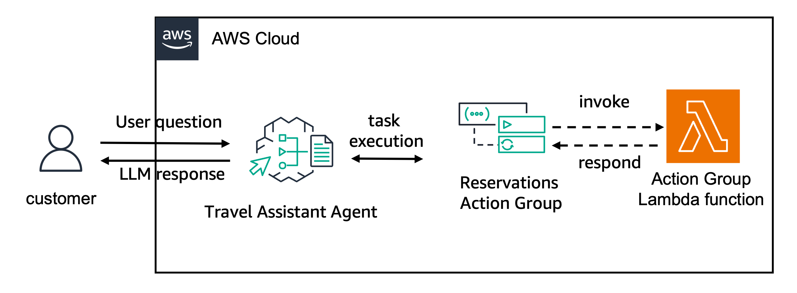

---
tags:
    - Agents/ Memory
    - Agents/ Function Definition
    - Agents/ Tool Binding
---

!!! tip inline end "[Open in github](https://github.com/aws-samples/amazon-bedrock-samples/tree/main/agents-and-function-calling/bedrock-agents/features-examples/09-create-agent-with-memory/09-create-agent-with-memory.ipynb){:target="_blank"}"

<h2>Create Agent with Memory</h2>

In this notebook we will create an Agent for Amazon Bedrock using the new capabilities for memory retention.

We will use an travel assistant example. With this agent, you can book a new trip, update trip details and delete existing reservations

For this example we will use dummy functions that only confirm the actions without executing them. For a real live system, you should implement the function execution and integrate with existing systems.

The following architecture will be built:



<h2>Prerequisites</h2>
Before starting, let's update the botocore and boto3 packages to ensure we have the latest version


```python
!python3 -m pip install --upgrade --force-reinstall -q boto3
!python3 -m pip install --upgrade --force-reinstall -q botocore
!python3 -m pip install --upgrade --force-reinstall -q awscli
```

Let's now check the boto3 version to ensure the correct version has been installed. Your version should be greater than or equal to 1.34.139.


```python
import boto3
import botocore
import awscli
print(boto3.__version__)
print(botocore.__version__)
print(awscli.__version__)
```

Next we want to import the support packages and set the logger object


```python
import json
import time
import zipfile
from io import BytesIO
import uuid
import pprint
import logging
```


```python
<h2>setting logger</h2>
logging.basicConfig(format='[%(asctime)s] p%(process)s {%(filename)s:%(lineno)d} %(levelname)s - %(message)s', level=logging.INFO)
logger = logging.getLogger(__name__)
```

Let's now create the boto3 clients for the required AWS services


```python
<h2>getting boto3 clients for required AWS services</h2>
sts_client = boto3.client('sts')
iam_client = boto3.client('iam')
lambda_client = boto3.client('lambda')
bedrock_agent_client = boto3.client('bedrock-agent')
bedrock_agent_runtime_client = boto3.client('bedrock-agent-runtime')
```

Next we can set some configuration variables for the agent and for the lambda function being created


```python
session = boto3.session.Session()
region = session.region_name
account_id = sts_client.get_caller_identity()["Account"]
region, account_id
```


```python
<h2>configuration variables</h2>
suffix = f"{region}-{account_id}"
agent_name = "travel-assistant-with-memory"
agent_bedrock_allow_policy_name = f"{agent_name}-ba-{suffix}"
agent_role_name = f'AmazonBedrockExecutionRoleForAgents_{agent_name}'
agent_foundation_model = "anthropic.claude-3-sonnet-20240229-v1:0"
agent_description = "Agent for providing travel assistant to manage trips reservations"
agent_instruction = """
You are a travel agency agent that helps customers making travel reservations.
You can create, update and delete travel reservations.
"""
agent_action_group_name = "BookingManagerActionGroup"
agent_action_group_description = """
Action group to manage travel bookings. It allows you to create, update and delete train and air travel reservations
"""
agent_alias_name = f"{agent_name}-alias"
lambda_function_role = f'{agent_name}-lambda-role-{suffix}'
lambda_function_name = f'{agent_name}-{suffix}'
memory_time = 30 # 30 days of memory
```

Let's now create our lambda function. It implements the functionality for `book_trip`, `update_existing_trip_dates` and `delete_existing_trip_reservation`


```python
%%writefile lambda_function.py
import json
import uuid
import boto3

def get_named_parameter(event, name):
    """
    Get a parameter from the lambda event
    """
    return next(item for item in event['parameters'] if item['name'] == name)['value']


def book_trip(origin, destination, start_date, end_date, transportation_mode):
    """
    Retrieve details of a restaurant booking
    
    Args:
        booking_id (string): The ID of the booking to retrieve
    """
    booking_id = str(uuid.uuid4())[:8]
    return f"Successfully booked trip from {origin} ({start_date}) to {destination} ({end_date}) via {transportation_mode}. Your booking_id is {booking_id}"

def populate_function_response(event, response_body):
    return {
        'response': {
            'actionGroup': event['actionGroup'], 
            'function': event['function'],
            'functionResponse': {
                'responseBody': {
                    'TEXT': {
                        'body': response_body
                    }
                }
            }
        }
    }


def update_existing_trip_dates(booking_id, new_start_date, new_end_date):
    return f"Successfully updated trip {booking_id}. New departure date: {new_start_date} and new return date: {new_end_date}."

def delete_existing_trip_reservation(booking_id):
    return f"Successfully deleted reservation {booking_id}."

def lambda_handler(event, context):
    # get the action group used during the invocation of the lambda function
    actionGroup = event.get('actionGroup', '')
    
    # name of the function that should be invoked
    function = event.get('function', '')
    
    # parameters to invoke function with
    parameters = event.get('parameters', [])

    if function == 'update_existing_trip_dates':
        booking_id = get_named_parameter(event, "booking_id")
        new_start_date = get_named_parameter(event, "new_start_date")
        new_end_date = get_named_parameter(event, "new_end_date")
        if booking_id and new_start_date and new_end_date:
            response = str(update_existing_trip_dates(booking_id, new_start_date, new_end_date))
            result = json.dumps(response)
        else:
            result = 'Missing booking_id parameter'

    elif function == 'book_trip':
        origin = get_named_parameter(event, "origin")
        destination = get_named_parameter(event, "destination")
        start_date = get_named_parameter(event, "start_date")
        end_date = get_named_parameter(event, "end_date")
        transportation_mode = get_named_parameter(event, "transportation_mode")

        if origin and  destination and start_date and end_date and transportation_mode:
            response = str(book_trip(origin, destination, start_date, end_date, transportation_mode))
            result = json.dumps(response) 
        else:
            result = 'Missing required parameters'
    elif function == 'delete_existing_trip_reservation':
        booking_id = get_named_parameter(event, "booking_id")
        if booking_id and new_start_date and new_end_date:
            response = str(delete_existing_trip_reservation(booking_id))
            result = json.dumps(response)
        else:
            result = 'Missing booking_id parameter'
    else:
        result = 'Invalid function'
    
    action_response = populate_function_response(event, result)

    print(action_response)

    return action_response
```

Next let's create the lambda IAM role and policy to invoke a Bedrock model


```python
<h2>Create IAM Role for the Lambda function</h2>
try:
    assume_role_policy_document = {
        "Version": "2012-10-17",
        "Statement": [
            {
                "Effect": "Allow",
                "Principal": {
                    "Service": "lambda.amazonaws.com"
                },
                "Action": "sts:AssumeRole"
            }
        ]
    }
    

    assume_role_policy_document_json = json.dumps(assume_role_policy_document)

    lambda_iam_role = iam_client.create_role(
        RoleName=lambda_function_role,
        AssumeRolePolicyDocument=assume_role_policy_document_json
    )

    # Pause to make sure role is created
    time.sleep(10)
except:
    lambda_iam_role = iam_client.get_role(RoleName=lambda_function_role)

iam_client.attach_role_policy(
    RoleName=lambda_function_role,
    PolicyArn='arn:aws:iam::aws:policy/service-role/AWSLambdaBasicExecutionRole'
)
```

We can now package the lambda function to a Zip file and create the lambda function using boto3


```python
<h2>Package up the lambda function code</h2>
s = BytesIO()
z = zipfile.ZipFile(s, 'w')
z.write("lambda_function.py")
z.close()
zip_content = s.getvalue()

<h2>Create Lambda Function</h2>
lambda_function = lambda_client.create_function(
    FunctionName=lambda_function_name,
    Runtime='python3.12',
    Timeout=180,
    Role=lambda_iam_role['Role']['Arn'],
    Code={'ZipFile': zip_content},
    Handler='lambda_function.lambda_handler'
)
```

<h2>Create Agent</h2>
We will now create the agent. To do so, we first need to create the agent policies that allow bedrock model invocation for a specific foundation model and the agent IAM role with the policy associated to it. 


```python
<h2>Create IAM policies for agent</h2>
bedrock_agent_bedrock_allow_policy_statement = {
    "Version": "2012-10-17",
    "Statement": [
        {
            "Sid": "AmazonBedrockAgentBedrockFoundationModelPolicy",
            "Effect": "Allow",
            "Action": "bedrock:InvokeModel",
            "Resource": [
                f"arn:aws:bedrock:{region}::foundation-model/{agent_foundation_model}"
            ]
        }
    ]
}

bedrock_policy_json = json.dumps(bedrock_agent_bedrock_allow_policy_statement)

agent_bedrock_policy = iam_client.create_policy(
    PolicyName=agent_bedrock_allow_policy_name,
    PolicyDocument=bedrock_policy_json
)


```


```python
<h2>Create IAM Role for the agent and attach IAM policies</h2>
assume_role_policy_document = assume_role_policy_document = {
    "Version": "2012-10-17",
    "Statement": [{
          "Effect": "Allow",
          "Principal": {
            "Service": "bedrock.amazonaws.com"
          },
          "Action": "sts:AssumeRole"
    }]
}

assume_role_policy_document_json = json.dumps(assume_role_policy_document)
agent_role = iam_client.create_role(
    RoleName=agent_role_name,
    AssumeRolePolicyDocument=assume_role_policy_document_json
)

<h2>Pause to make sure role is created</h2>
time.sleep(10)
    
iam_client.attach_role_policy(
    RoleName=agent_role_name,
    PolicyArn=agent_bedrock_policy['Policy']['Arn']
)
```

<h3>Creating the agent with memory configuration</h3>
Once the needed IAM role is created, we can use the Bedrock Agent client to create a new agent. To do so we use the `create_agent` function. It requires an agent name, underlying foundation model and instructions. You can also provide an agent description. Note that the agent created is not yet prepared. Later, we will prepare and use the agent.

As part of the `create_agent` process, we want to enable long term memory to the agent. To do so, we use the `memoryConfiguration` parameter to enable `SESSION_SUMMARY` memory for up to 30 days. The number of days that you want to store your memory for is defined using the `storageDays` configuration.

With `SESSION_SUMMARY` as memory type, your agent will summarize the each session and add the summary to the long-term memory of the agent. To control this behavior, you need to pass a `memoryId` during agent invocation time.


```python
response = bedrock_agent_client.create_agent(
    agentName=agent_name,
    agentResourceRoleArn=agent_role['Role']['Arn'],
    description=agent_description,
    idleSessionTTLInSeconds=1800,
    foundationModel=agent_foundation_model,
    instruction=agent_instruction,
    memoryConfiguration={
        "enabledMemoryTypes": ["SESSION_SUMMARY"],
        "storageDays": 30
    }
)
response
```

Let's now store the agent id in a local variable to use it on subsequent steps.


```python
agent_id = response['agent']['agentId']
agent_id
```

<h2>Create Agent Action Group</h2>
We will now create an agent action group that uses the lambda function created earlier. The [`create_agent_action_group`](https://boto3.amazonaws.com/v1/documentation/api/latest/reference/services/bedrock-agent/client/create_agent_action_group.html) function provides this functionality. We will use `DRAFT` as the agent version since we haven't yet created an agent version or alias. To inform the agent about the action group capabilities, we provide an action group description.

In this example, we provide the Action Group functionality using a `functionSchema`. You can alternatively provide an `APISchema`. The notebook [02-create-agent-with-api-schema.ipynb](02-create-agent-with-api-schema/02-create-agent-with-api-schema.ipynb) provides an example of that approach.

To define the functions using a function schema, you need to provide the `name`, `description` and `parameters` for each function.


```python
agent_functions = [
    {
        'name': 'book_trip',
        'description': 'book a trip for a customer',
        'parameters': {
            "origin": {
                "description": "city of origin for the trip",
                "required": True,
                "type": "string"
            },
            "destination": {
                "description": "city of destination for the trip",
                "required": True,
                "type": "string"
            },
            "start_date": {
                "description": "the start date for the trip in the format YYYY-MM-DD",
                "required": True,
                "type": "string"
            },
            "end_date": {
                "description": "the end date for the trip in the format YYYY-MM-DD",
                "required": True,
                "type": "string"
            },
            "transportation_mode": {
                "description": "the transportation mode. One of TRAIN or AIR",
                "required": True,
                "type": "string"
            }
        }
    },
    {
        'name': 'update_existing_trip_dates',
        'description': 'update start or end date for an existing trip reservation',
        'parameters': {
            "booking_id": {
                "description": "the id of the trip to update",
                "required": True,
                "type": "integer"
            },
            "new_start_date": {
                "description": "the new start date for the trip in the format YYYY-MM-DD",
                "required": True,
                "type": "string"
            },
            "new_end_date": {
                "description": "the new end date for the trip in the format YYYY-MM-DD",
                "required": True,
                "type": "string"
            }
        }
    },
    {
        'name': 'delete_existing_trip_reservation',
        'description': 'delete an existing trip reservation',
        'parameters': {
            "booking_id": {
                "description": "the id of the trip to update",
                "required": True,
                "type": "integer"
            }
        }
    }
]
```


```python
<h2>Pause to make sure agent is created</h2>
time.sleep(30)
<h2>Now, we can configure and create an action group here:</h2>
agent_action_group_response = bedrock_agent_client.create_agent_action_group(
    agentId=agent_id,
    agentVersion='DRAFT',
    actionGroupExecutor={
        'lambda': lambda_function['FunctionArn']
    },
    actionGroupName=agent_action_group_name,
    functionSchema={
        'functions': agent_functions
    },
    description=agent_action_group_description
)
```


```python
agent_action_group_response
```

<h2>Allowing Agent to invoke Action Group Lambda</h2>
Before using the action group, we need to allow the agent to invoke the lambda function associated with the action group. This is done via resource-based policy. Let's add the resource-based policy to the lambda function created


```python
<h2>Create allow invoke permission on lambda</h2>
response = lambda_client.add_permission(
    FunctionName=lambda_function_name,
    StatementId='allow_bedrock',
    Action='lambda:InvokeFunction',
    Principal='bedrock.amazonaws.com',
    SourceArn=f"arn:aws:bedrock:{region}:{account_id}:agent/{agent_id}",
)

```


```python
response
```

<h2>Preparing Agent</h2>

Let's create a DRAFT version of the agent that can be used for internal testing.


```python
response = bedrock_agent_client.prepare_agent(
    agentId=agent_id
)
print(response)
```


```python
<h2>Pause to make sure agent is prepared</h2>
time.sleep(30)

<h2>Extract the agentAliasId from the response</h2>
agent_alias_id = "TSTALIASID"

```

<h2>Invoke Agent with Memory</h2>

We will now invoke this agent passing a `memoryId` and we will see how to handle the most common memory APIs.

Let's first create a helper function to invoke your agent and a helper function to get your agent id via the agent name.

The `invoke_agent_helper` function allows the user to send a `query` to the agent with a `session_id`. A session defines a turn of back and forward conversations that a user has with the agent. The agent can remember the full context inside of a session. Once the user ends a session, this context is removed.

The user can then decide to enable trace or not using the `enable_trace` boolean variable and to pass a session state as a dictionary via the `session_state` variable.

If a new `session_id` is provided, the agent will create a new conversation without previous context. If the same `session_id` is reused, the conversation context related to that session is known by the agent.

If the `enable_trace` is set to `True`, each response from the agent is accompanied by a *trace* that details the step being orchestrated by the agent. It allows you to follow the agent's (reasoning via Chain of Thoughts prompting) that led to the final response at that point of the conversation.

To handle the memory capabilities the `memory_id` parameter is used. Once a session is ended, it will summarize the content into a new session id as part of the `memory_id`.

Finally, you can also pass a session context using the `session_state` parameter. The session state allows you to share the following information with the agent:
- **`sessionAttributes`**: attributes that persist over a session between the user and the agent. All invokeAgent calls with the same session_id belong to the same sesison and will have the sessionAttributes shared with them as long as the session time limit has not being surpassed and the user has not ended the session. The sessionAttributes are available in the lambda function but are **not** added to the agent's prompt. As a result, you can only use session attributes if your lambda function can handle them. You can find more examples of using a session attribute [here](https://github.com/aws-samples/amazon-bedrock-samples/tree/main/agents-for-bedrock/features-examples/06-prompt-and-session-attributes). It is also a good pattern to implement fine-grained access control for certain APIs using the lambda function integration. You can find an example for it [here](https://github.com/aws-samples/amazon-bedrock-samples/tree/main/agents-for-bedrock/features-examples/09-fine-grained-access-permissions)
- **`promptSessionAttributes`**: attributes that persist over a single invokeAgent call. Prompt attributes are added to the prompt and to the lambda function. You can also use the `$prompt_session_attributes$` placeholder when editing the orchestration base prompt.
- **`invocationId`**: The id returned by the agent in the [ReturnControlPayload](https://docs.aws.amazon.com/bedrock/latest/APIReference/API_agent-runtime_ReturnControlPayload.html) object in the returnControl field of the InvokeAgent response. This field is required if passing the answer of a Return of Control invocation. You can find an example of how to use it [here](https://github.com/aws-samples/amazon-bedrock-samples/tree/main/agents-for-bedrock/features-examples/03-create-agent-with-return-of-control).
- **`returnControlInvocationResults`**: the results obtained from invoking the action outside of Amazon Bedrock Agents.  This field is required if passing the answer of a Return of Control invocation. You can find an example of how to use it [here](https://github.com/aws-samples/amazon-bedrock-samples/tree/main/agents-for-bedrock/features-examples/03-create-agent-with-return-of-control).

We will also use the test `agent_alias_id` set to `TSTALIASID`. This is a default value that you can use to test agents being developed. You can also [deploy your agent](https://docs.aws.amazon.com/bedrock/latest/userguide/agents-deploy.html) to create a new version of your agent and have a new agent alias id.


```python
def invoke_agent_helper(
    query, session_id, agent_id, alias_id, enable_trace=False, memory_id=None, session_state=None, end_session=False
):
    if not session_state:
        session_state = {}

    # invoke the agent API
    agent_response = bedrock_agent_runtime_client.invoke_agent(
        inputText=query,
        agentId=agent_id,
        agentAliasId=alias_id,
        sessionId=session_id,
        enableTrace=enable_trace,
        endSession=end_session,
        memoryId=memory_id,
        sessionState=session_state
    )

    if enable_trace:
        logger.info(pprint.pprint(agent_response))

    event_stream = agent_response['completion']
    try:
        for event in event_stream:
            if 'chunk' in event:
                data = event['chunk']['bytes']
                if enable_trace:
                    logger.info(f"Final answer ->\n{data.decode('utf8')}")
                agent_answer = data.decode('utf8')
                return agent_answer
                # End event indicates that the request finished successfully
            elif 'trace' in event:
                if enable_trace:
                    logger.info(json.dumps(event['trace'], indent=2))
            else:
                raise Exception("unexpected event.", event)
    except Exception as e:
        raise Exception("unexpected event.", e)
```

<h3>Starting conversation with empty memory</h3>
Let's run an end-to-end conversation


```python
<h2>create a random id for session initiator id</h2>
session_id:str = str(uuid.uuid1())
memory_id:str = 'TST_MEM_ID'
enable_trace:bool = False
end_session:bool = False
query = "Hi, my name is Anna. I would like to book a trip from Boston to NYC departuring on July 11th 2024 and returning on July 22nd 2024. Via AIR."
invoke_agent_helper(query, session_id, agent_id, agent_alias_id, enable_trace=enable_trace, memory_id=memory_id)
```

We now assume that the agent has booked a trip and provided you with a booking id. You then thank the agent for the support.


```python
query = "thank you!"
invoke_agent_helper(query, session_id, agent_id, agent_alias_id, enable_trace=enable_trace, memory_id=memory_id)
```

Next we set `end_session` to `True` in order to end our session


```python
query = "end"
invoke_agent_helper(query, session_id, agent_id, agent_alias_id, enable_trace=enable_trace, memory_id=memory_id, end_session=True)
```

Let's now create a new support function `wait_memory_creation` that waits until the memory has been created


```python
def wait_memory_creation(agent_id, agent_alias_id, memory_id):
    start_memory=time.time()
    memory_content = None
    if memory_id is not None:
        while not memory_content:
            time.sleep(5)
            memory_content=bedrock_agent_runtime_client.get_agent_memory(
                agentAliasId=agent_alias_id,
                agentId=agent_id,
                memoryId=memory_id,
                memoryType='SESSION_SUMMARY'
            )['memoryContents']
        end_memory=time.time()
        memory_creation_time=(end_memory-start_memory)
    return memory_creation_time, memory_content
```


```python
wait_memory_creation(agent_id, agent_alias_id, memory_id)
```

<h3>Invoking agent based on memory information</h3>

Let's now use our memory to invoke the agent with the stored information


```python
<h2>create a new session id</h2>
session_id:str = str(uuid.uuid1())
query = "I need to stay an extra day. Can I return on the 23rd instead?"
invoke_agent_helper(query, session_id, agent_id, agent_alias_id, enable_trace=enable_trace, memory_id=memory_id)
```

Here we assume that the information returned from the memory by the agent is correct and we confirm, allowing the agent to execute
the function that updates the trip reservation


```python
query = "that is correct, thanks!"
invoke_agent_helper(query, session_id, agent_id, agent_alias_id, enable_trace=enable_trace, memory_id=memory_id)
```


```python
query = "end"
invoke_agent_helper(query, session_id, agent_id, agent_alias_id, enable_trace=enable_trace, memory_id=memory_id,  end_session=True)
```

<h3>Retrieving memory</h3>

Now let's take a look at the memory that is saved to the agent. You can do so using the `get_agent_memory` functionality from boto3. It will return the different session summaries for a certain `memoryId`. For this example we use the support function again `wait_memory_creation`


```python
wait_memory_creation(agent_id, agent_alias_id, memory_id)
```

<h2>Deleting memory</h2>
Now let's take a look at the memory that is saved to the agent. You can do so using the `delete_agent_memory` functionality from boto3. It will return the different session summaries for a certain `memoryId`.

It is important to notice the by calling the `delete_agent_memory` functionality, you will delete **all** sessions in a `memoryId`


```python
response = bedrock_agent_runtime_client.delete_agent_memory(
    agentAliasId=agent_alias_id, 
    agentId=agent_id, 
    memoryId=memory_id
)
response
```

Let's just call the get_memory_id method again to confirm the memory has been deleted


```python
response = bedrock_agent_runtime_client.get_agent_memory(
    agentAliasId=agent_alias_id, 
    agentId=agent_id , 
    memoryId=memory_id, 
    memoryType="SESSION_SUMMARY"
)
memory_contents = response['memoryContents']
memory_contents
```

<h2>Clean up</h2>

Optionally, you can clean up the resources created


```python
<h2>This is not needed, you can delete agent successfully after deleting alias only</h2>
<h2>Additionaly, you need to disable it first</h2>
action_group_id = agent_action_group_response['agentActionGroup']['actionGroupId']
action_group_name = agent_action_group_response['agentActionGroup']['actionGroupName']

response = bedrock_agent_client.update_agent_action_group(
    agentId=agent_id,
    agentVersion='DRAFT',
    actionGroupId= action_group_id,
    actionGroupName=action_group_name,
    actionGroupExecutor={
        'lambda': lambda_function['FunctionArn']
    },
    functionSchema={
        'functions': agent_functions
    },
    actionGroupState='DISABLED',
)

action_group_deletion = bedrock_agent_client.delete_agent_action_group(
    agentId=agent_id,
    agentVersion='DRAFT',
    actionGroupId= action_group_id
)
agent_deletion = bedrock_agent_client.delete_agent(
    agentId=agent_id
)
<h2>Delete Lambda function</h2>
lambda_client.delete_function(
    FunctionName=lambda_function_name
)
<h2>Delete IAM Roles and policies</h2>

for policy in [agent_bedrock_allow_policy_name]:
    iam_client.detach_role_policy(RoleName=agent_role_name, PolicyArn=f'arn:aws:iam::{account_id}:policy/{policy}')
    
iam_client.detach_role_policy(RoleName=lambda_function_role, PolicyArn='arn:aws:iam::aws:policy/service-role/AWSLambdaBasicExecutionRole')

for role_name in [agent_role_name, lambda_function_role]:
    iam_client.delete_role(
        RoleName=role_name
    )

for policy in [agent_bedrock_policy]:
    iam_client.delete_policy(
        PolicyArn=policy['Policy']['Arn']
)

```

<h2>Conclusion</h2>
We have now experimented with using boto3 SDK to create and invoke an agent with memory enabled. We also learned how to retrieve and delete the memory created.

<h2>Next Steps</h2>

As a next step, you should experiment with the Agent's memory capabilities in your applications! Get started by enabling memory to your existing agents.
<h2>Thank You</h2>
