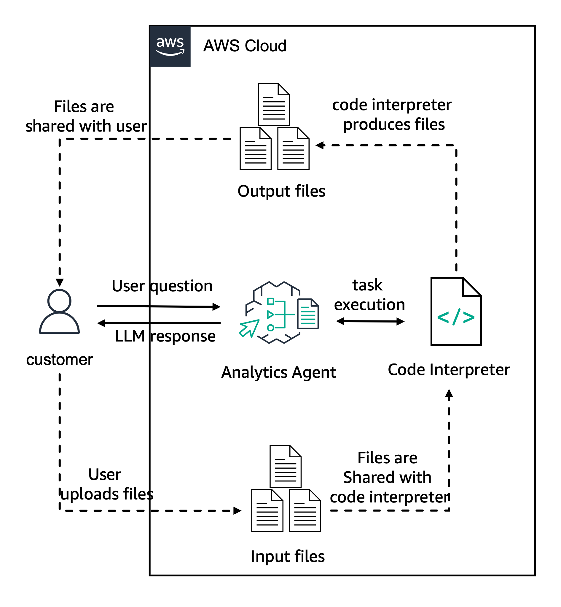

---
tags:
    - Agent/ Code-Interpreter
    - API-Usage-Example
    - Agents/ Function Calling
---

!!! tip inline end "[Open in github](https://github.com/aws-samples/amazon-bedrock-samples/tree/main/agents-and-function-calling/bedrock-agents/features-examples/10-create-agent-with-code-interpreter/10-create-agent-with-code-interpreter.ipynb){:target="_blank"}"

<h2>Create Agent with Code Interpreter</h2>

In this notebook we will create an Agent for Amazon Bedrock using the new capabilities for code interpreter to execute code. Code interpreter is a special pre-defined tool (action group) that provides the model with a sandbox environment in which it can execute code (currently Python), using a set of available pre-defined libraries.

The example will first use code interpreter to help answer math questions. LLMs often struggle with accuracy on math, but are proficient in writing code, so the agent will write code to perform its math calculations, use code interpreter to execute it, and pass the results back to the user. We will also show how to pass files into the agent, either for chat processing or for analysis using code interpretation. Finally, the agent will use code interpreter to write code to create files of types that it normally could not, such as graphs.

Examples:
* Create agent with code interpretation
* Invoke agent asking for some math questions
* Invoke agent passing a file for chat
* Invoke agent passing a file for code interpretation
* Invoke agent to plot a graph
* Invoke agent to create documents

The following architecture will be built:




<h2>Prerequisites</h2>
Before starting, let's update the botocore and boto3 packages to ensure we have the latest version


```python
!python3 -m pip install --upgrade -q boto3
!python3 -m pip install --upgrade -q botocore
!python3 -m pip install --upgrade -q awscli
```

Let's now check the boto3 version to ensure the correct version has been installed. Your version should be greater than or equal to 1.34.139.


```python
import boto3
import botocore
import awscli
print(boto3.__version__)
print(botocore.__version__)
print(awscli.__version__)
```

Next we want to import the support packages and set the logger object


```python
import json
import time
from io import BytesIO
import uuid
import pprint
import logging
```


```python
<h2>setting logger</h2>
logging.basicConfig(format='[%(asctime)s] p%(process)s {%(filename)s:%(lineno)d} %(levelname)s - %(message)s', level=logging.INFO)
logger = logging.getLogger(__name__)
```

Let's now create the boto3 clients for the required AWS services


```python
<h2>getting boto3 clients for required AWS services</h2>
sts_client = boto3.client('sts')
iam_client = boto3.client('iam')
lambda_client = boto3.client('lambda')
bedrock_agent_client = boto3.client('bedrock-agent')
bedrock_agent_runtime_client = boto3.client('bedrock-agent-runtime')
```

Next we can set some configuration variables for the agent and for the lambda function being created


```python
session = boto3.session.Session()
region = session.region_name
account_id = sts_client.get_caller_identity()["Account"]
region, account_id
```


```python
<h2>configuration variables</h2>
suffix = f"{region}-{account_id}"
agent_name = "assistant-w-code-interpret"
agent_bedrock_allow_policy_name = f"{agent_name}-ba-{suffix}"
agent_role_name = f'AmazonBedrockExecutionRoleForAgents_{agent_name}'
agent_foundation_model = "anthropic.claude-3-sonnet-20240229-v1:0"
agent_description = "Assistant with code interpreter that can write and execute code to answer questions"
agent_instruction = """
You are an assistant that helps customers answer questions and create documents.
You have access to code interpreter to execute Python code, so when tasks are best handled via Python code, 
write code as needed and pass it to code interpreter to execute, then return the result to the user.
"""
agent_alias_name = f"{agent_name}-alias"
```

<h2>Create synthetic stock price data</h2>
We will use a CSV of stock price data for the non-existent company 'FAKECO'; we create it here.


```python
import pandas as pd
import numpy as np
from datetime import datetime, timedelta
def make_synthetic_stock_data(filename):
    # Define the start and end dates
    start_date = datetime(2023, 6, 27)
    end_date = datetime(2024, 6, 27)

    # Create a date range
    date_range = pd.date_range(start_date, end_date, freq='D')

    # Initialize lists to store the data
    symbol = []
    dates = []
    open_prices = []
    high_prices = []
    low_prices = []
    close_prices = []
    adj_close_prices = []
    volumes = []

    # Set the initial stock price
    initial_price = 100.0

    # Generate plausible stock prices
    for date in date_range:
        symbol.append('FAKECO')
        dates.append(date)
        open_price = np.round(initial_price + np.random.uniform(-1, 1), 2)
        high_price = np.round(open_price + np.random.uniform(0, 5), 2)
        low_price = np.round(open_price - np.random.uniform(0, 5), 2)
        close_price = np.round(np.random.uniform(low_price, high_price), 2)
        adj_close_price = close_price
        volume = np.random.randint(1000, 10000000)

        open_prices.append(open_price)
        high_prices.append(high_price)
        low_prices.append(low_price)
        close_prices.append(close_price)
        adj_close_prices.append(adj_close_price)
        volumes.append(volume)

        initial_price = close_price

    # Create a DataFrame
    data = {
        'Symbol': symbol,
        'Date': dates,
        'Open': open_prices,
        'High': high_prices,
        'Low': low_prices,
        'Close': close_prices,
        'Adj Close': adj_close_prices,
        'Volume': volumes
    }

    stock_data = pd.DataFrame(data)

    # Save the dataframe
    stock_data.to_csv(filename, index=False)
```


```python
<h2>Insure the output directory exists</h2>
import os
if not os.path.exists('output'):
    os.makedirs('output')

stock_file = os.path.join('output', 'FAKECO.csv')
if not os.path.exists(stock_file):
    make_synthetic_stock_data(stock_file)
```

<h2>Create Agent</h2>
We will now create the agent. To do so, we first need to create the agent policies that allow bedrock model invocation for a specific foundation model and the agent IAM role with the policy associated to it. 


```python
<h2>Create IAM policies for agent</h2>
bedrock_agent_bedrock_allow_policy_statement = {
    "Version": "2012-10-17",
    "Statement": [
        {
            "Sid": "AmazonBedrockAgentBedrockFoundationModelPolicy",
            "Effect": "Allow",
            "Action": "bedrock:InvokeModel",
            "Resource": [
                f"arn:aws:bedrock:{region}::foundation-model/{agent_foundation_model}"
            ]
        }
    ]
}

bedrock_policy_json = json.dumps(bedrock_agent_bedrock_allow_policy_statement)

agent_bedrock_policy = iam_client.create_policy(
    PolicyName=agent_bedrock_allow_policy_name,
    PolicyDocument=bedrock_policy_json
)
```


```python
<h2>Create IAM Role for the agent and attach IAM policies</h2>
assume_role_policy_document = assume_role_policy_document = {
    "Version": "2012-10-17",
    "Statement": [{
          "Effect": "Allow",
          "Principal": {
            "Service": "bedrock.amazonaws.com"
          },
          "Action": "sts:AssumeRole"
    }]
}

assume_role_policy_document_json = json.dumps(assume_role_policy_document)
agent_role = iam_client.create_role(
    RoleName=agent_role_name,
    AssumeRolePolicyDocument=assume_role_policy_document_json
)

<h2>Pause to make sure role is created</h2>
time.sleep(10)
    
iam_client.attach_role_policy(
    RoleName=agent_role_name,
    PolicyArn=agent_bedrock_policy['Policy']['Arn']
)
```

<h3>Creating the Bedrock agent</h3>
Once the needed IAM role is created, we can use the Bedrock Agent client to create a new agent. To do so we use the `create_agent` function. It requires an agent name, underlying foundation model and instructions. You can also provide an agent description. Note that the agent created is not yet prepared. Later, we will prepare and use the agent.

You cannot set the agent to use code interpreter at create time; because code interpreter is a special action group, that is done when creating the action group, below.


```python
response = bedrock_agent_client.create_agent(
    agentName=agent_name,
    agentResourceRoleArn=agent_role['Role']['Arn'],
    description=agent_description,
    idleSessionTTLInSeconds=1800,
    foundationModel=agent_foundation_model,
    instruction=agent_instruction
)
response
```

Let's now store the agent id in a local variable to use it on subsequent steps.


```python
agent_id = response['agent']['agentId']
agent_id
```

<h3>Create Agent Action Group</h3>
In Bedrock agents, action groups define tools for the agent to use. We will now create an agent action group to provide the agent with code interpreter, a runtime environment for evaluating code. Action groups can also define other tools, such as lambda functions, and can also define a channel for the model to solicit clarifying input from the user if needed (treating the user as a tool that the model can invoke). Our action group, however, just defines the code interpreter. This is done via a special access parameter, parentActionGroupSignature (see [boto3 documentation](https://boto3.amazonaws.com/v1/documentation/api/latest/reference/services/bedrock-agent/client/create_agent_action_group.html))

To allow your agent to generate, run, and troubleshoot code when trying to complete a task, set `parentActionGroupSignature=AMAZON.CodeInterpreter`. You must leave the description, apiSchema, and actionGroupExecutor fields blank for this action group.

Note that you can also define an action group with parentActionGroupSignature set to the special value `AMAZON.UserInput`. If this is set, then during orchestration, if your agent determines that it needs to invoke an API in an action group, but doesn’t have enough information to complete the API request, it will invoke this action group instead and return an Observation reprompting the user for more information. User input is appropriate if you know the interaction has a human in the loop. We do not do that here.


```python
<h2>Pause to make sure agent is created</h2>
time.sleep(30)
<h2>Now, we can configure and create an action group here:</h2>

<h2>Enable code interpretation for the agent</h2>
agent_action_group_response = bedrock_agent_client.create_agent_action_group(
    agentId=agent_id,       
    agentVersion='DRAFT',
    actionGroupName='code-interpreter',
    parentActionGroupSignature='AMAZON.CodeInterpreter',
    actionGroupState='ENABLED'
)
```


```python
agent_action_group_response
```

<h3>Preparing Agent</h3>

Let's create a DRAFT version of the agent that can be used for internal testing.


```python
response = bedrock_agent_client.prepare_agent(
    agentId=agent_id
)
print(response)
```


```python
<h2>Pause to make sure agent is prepared</h2>
time.sleep(30)

<h2>Extract the agentAliasId from the response</h2>
agent_alias_id = "TSTALIASID"

```

<h2>Invoking the agent</h2>
We will now define a helper function to invoke the agent and parse its responses, then invoke it to see it use code invocation.

<h3>Define a helper function for agent invocation</h3>

This helper function can invoke your agent and parse the stream of returned responses. 

*Note: This helper function differs from the one used in similar examples by also defining a show_code_use parameter, which will cause the helper to print a message if the agent invokes the code interpreter, and also has the event stream parsing separated into another helper function `process_response`. Later in the notebook we will replace `process_response` with a more elaborate version that can capture returned files and output more richly formatted data*

The `invoke_agent_helper` function allows the user to send a `query` to the agent with a `session_id`. A session defines a turn of back and forward conversations that a user has with the agent. The agent can remember the full context inside of a session. Once the user ends a session, this context is removed.

The user can then decide to enable trace or not using the `enable_trace` boolean variable and to pass a session state as a dictionary via the `session_state` variable.

If a new `session_id` is provided, the agent will create a new conversation without previous context. If the same `session_id` is reused, the conversation context related to that session is known by the agent.

If the `enable_trace` is set to `True`, each response from the agent is accompanied by a *trace* that details the step being orchestrated by the agent. It allows you to follow the agent's (reasoning via Chain of Thoughts prompting) that led to the final response at that point of the conversation.

To handle the memory capabilities the `memory_id` parameter is used. Once a session is ended, it will summarize the content into a new session id as part of the `memory_id`.

You can also pass a session context using the `session_state` parameter. The session state allows you to share the following information with the agent:
- **`sessionAttributes`**: attributes that persist over a session between the user and the agent. All invokeAgent calls with the same session_id belong to the same sesison and will have the sessionAttributes shared with them as long as the session time limit has not being surpassed and the user has not ended the session. The sessionAttributes are available in the lambda function but are **not** added to the agent's prompt. As a result, you can only use session attributes if your lambda function can handle them. You can find more examples of using a session attribute [here](https://github.com/aws-samples/amazon-bedrock-samples/tree/main/agents-for-bedrock/features-examples/06-prompt-and-session-attributes). It is also a good pattern to implement fine-grained access control for certain APIs using the lambda function integration. You can find an example for it [here](https://github.com/aws-samples/amazon-bedrock-samples/tree/main/agents-for-bedrock/features-examples/09-fine-grained-access-permissions)
- **`promptSessionAttributes`**: attributes that persist over a single invokeAgent call. Prompt attributes are added to the prompt and to the lambda function. You can also use the `$prompt_session_attributes$` placeholder when editing the orchestration base prompt.
- **`invocationId`**: The id returned by the agent in the [ReturnControlPayload](https://docs.aws.amazon.com/bedrock/latest/APIReference/API_agent-runtime_ReturnControlPayload.html) object in the returnControl field of the InvokeAgent response. This field is required if passing the answer of a Return of Control invocation. You can find an example of how to use it [here](https://github.com/aws-samples/amazon-bedrock-samples/tree/main/agents-for-bedrock/features-examples/03-create-agent-with-return-of-control).
- **`returnControlInvocationResults`**: the results obtained from invoking the action outside of Amazon Bedrock Agents.  This field is required if passing the answer of a Return of Control invocation. You can find an example of how to use it [here](https://github.com/aws-samples/amazon-bedrock-samples/tree/main/agents-for-bedrock/features-examples/03-create-agent-with-return-of-control).

Finally, if `show_code_use` is passed as True, the helper will print a message when the code interpreter is invoked. It turns on tracing internally to do this.

We will also use the test `agent_alias_id` set to `TSTALIASID`. This is a default value that you can use to test agents being developed. You can also [deploy your agent](https://docs.aws.amazon.com/bedrock/latest/userguide/agents-deploy.html) to create a new version of your agent and have a new agent alias id.


```python
def invoke_agent_helper(
    query, session_id, agent_id, alias_id, enable_trace=False, memory_id=None, session_state=None, end_session=False, show_code_use=False
):
    
    if not session_state:
        session_state = {}

    # invoke the agent API
    agent_response = bedrock_agent_runtime_client.invoke_agent(
        inputText=query,
        agentId=agent_id,
        agentAliasId=alias_id,
        sessionId=session_id,
        enableTrace=(enable_trace | show_code_use), # Force tracing on if showing code use
        endSession=end_session,
        memoryId=memory_id,
        sessionState=session_state
    )
    return process_response(agent_response, enable_trace=enable_trace, show_code_use=show_code_use)
```


```python
def process_response(resp, enable_trace:bool=False, show_code_use:bool=False):
    if enable_trace:
        logger.info(pprint.pprint(resp))

    event_stream = resp['completion']
    try:
        for event in event_stream:
            if 'chunk' in event:
                data = event['chunk']['bytes']
                if enable_trace:
                    logger.info(f"Final answer ->\n{data.decode('utf8')}")
                agent_answer = data.decode('utf8')
                return agent_answer
                # End event indicates that the request finished successfully
            elif 'trace' in event:
                if 'codeInterpreterInvocationInput' in json.dumps(event['trace']):
                    if show_code_use:
                        print("Invoked code interpreter")
                if enable_trace:
                    logger.info(json.dumps(event['trace'], indent=2))
            else:
                raise Exception("unexpected event.", event)
    except Exception as e:
        raise Exception("unexpected event.", e)
```

<h2>Invoking code interpreter</h2>
We ask the agent to generate a random string, which will require it to use the code interpreter. Using the `show_code_use` flag, we can see that the agent invokes code interpreter to evaluate the python code it generates.


```python
<h2>create a random id for session initiator id</h2>
session_id:str = str(uuid.uuid1())
memory_id:str = 'TST_MEM_ID'
query = "Please generate a 10 character long string of random characters"
invoke_agent_helper(query, session_id, agent_id, agent_alias_id, enable_trace=False, memory_id=memory_id, show_code_use=True)
```

Similarly, the agent will write Python code and invoke code interpreter to solve math problems


```python
query = "What is 75 * sin(.75)?"
invoke_agent_helper(query, session_id, agent_id, agent_alias_id, enable_trace=False, memory_id=memory_id, 
                    show_code_use=True)
```

By comparison, other operations where the model does not need to execute code do not invoke code interpreter


```python
query = "thank you!"
invoke_agent_helper(query, session_id, agent_id, agent_alias_id, enable_trace=False, memory_id=memory_id, show_code_use=True)
```

<h2>Sending files to the agent</h2>
We can send files to the agent, either for use in normal chat, or for use with code interpreter. To send files, we attach them to the session state.

<h3>Define helper functions</h3>
We define helper functions to handle the various kinds of files, setting the media type properly, and to invoke the agent and process responses

The helper function below adds files to the session state. Files are passed via the session state. Each file is specified by a:
* name
* sourceType ('s3', or 'byte_content' for local files, 
* mediaType (currently supports: CSV, XLS, XLSX, YAML, JSON, DOC, DOCX, HTML, MD, TXT, and PDF)
* data (from the file data)
* useCase indicating how we intend the model use the file, which can be either `CHAT` or `CODE_INTERPRETER`.

See the [session state documentation](https://docs.aws.amazon.com/bedrock/latest/userguide/agents-test-code-interpretation.html) for more detail.


```python
<h2>Return a session state populated with the files from the supplied list of filenames</h2>
def add_file_to_session_state(file_name, use_case='CODE_INTERPRETER', session_state=None):
    if use_case != "CHAT" and use_case != "CODE_INTERPRETER":
        raise ValueError("Use case must be either 'CHAT' or 'CODE_INTERPRETER'")
    if not session_state:
        session_state = {
            "files": []
        }
    type = file_name.split(".")[-1].upper()
    name = file_name.split("/")[-1]

    if type == "CSV":
        media_type = "text/csv" 
    elif type in ["XLS", "XLSX"]:
        media_type = "application/vnd.openxmlformats-officedocument.spreadsheetml.sheet"
    else:
        media_type = "text/plain"

    named_file = {
        "name": name,
        "source": {
            "sourceType": "BYTE_CONTENT", 
            "byteContent": {
                "mediaType": media_type,
                "data": open(file_name, "rb").read()
            }
        },
        "useCase": use_case
    }
    session_state['files'].append(named_file)

    return session_state
```

<h3>Passing files for normal chat</h3>
Here we pass in a local CSV file and ask the model to explain what the data is. Note that when adding the file to the session state, we specify use case 'CHAT' instead of 'CODE_INTERPRETER' and by setting show_code_use=True for our helper we see that the model does not use the code interpreter, it assesses the information using the LLM model's intelligence.

First, we examine the file ourselves. We see it is a list of historical prices for a stock.


```python
import base64 

<h2>base64 encode the csv file </h2>
with open(stock_file, "rb") as file_name:
    data = file_name.read()
    encoded_file = data #base64.b64encode(data)

    # Show the first 100 characters of the encoded file
encoded_file[0:100]
```

Next, we invoke the agent to examine the file and tell us about its data. The agent recognizes the data in the file (which contains synthetically generated stock price data for 'FAKECO'), telling us what kind of data it is and what date range it covers. Note that it does not need to invoke code interpretation to do this.


```python
<h2>Invoke the agent and process the response stream</h2>
query = "What is the data in this file?"

sessionState=add_file_to_session_state(stock_file, 'CHAT')

invoke_agent_helper(query, session_id, agent_id, agent_alias_id, enable_trace=False, session_state=sessionState, 
                    memory_id=memory_id, show_code_use=True)
```

<h3>Passing files for use with code interpretation</h3>
Now that we know the contents of the file are stock data, we can ask financial questions about it, which will require the model to invoke the code interpreter. Here we re-create the session data specifying the use case as 'CODE_INTERPRETER'


```python
<h2>Invoke the agent and process the response stream</h2>
query = "Given the attached price data file, what pct growth happened across the full time series for closing price? what was the price on the first and last days?"

sessionState=add_file_to_session_state(stock_file, 'CODE_INTERPRETER')

invoke_agent_helper(query, session_id, agent_id, agent_alias_id, enable_trace=False, session_state=sessionState, 
                    memory_id=memory_id, show_code_use=True)
```

We see the model invoked the code interpreter, and analyzed the data in response to the questions asked.

<h2>Generating files with code interpreter</h2>
Amazon Bedrock agents can also generate and return files to the user. They can generate files either by using the model's native intelligence to generate file types, such as .CSV files, or by the agent writing code using code interpreter to write code to generate binary files, such as data plots. Agents return files in the response stream.

<h3>The Bedrock Agents response stream</h3>
The response stream consists of events, formatted in JSON. It conveys rich data about the details of the agent's thought and actions as it works through the [ReAct pattern](https://aws.amazon.com/blogs/aws/preview-enable-foundation-models-to-complete-tasks-with-agents-for-amazon-bedrock/) (reasoning and action). Here are some important keys:
* 'files' contain files generated by the agent's LLM model intrinsically
* 'trace' events contain information about the agent's thought process and work steps. There are several kinds of trace events: 
    * 'modelInvocationInput' keys contain 
    * 'rationale' keys contain the agent's reasoning
    * 'invocationInput' keys contain details of parameters to action group calls. 
        * 'codeInterpreterInvocationInput' keys within that contain code that the model generated and is passing to code interpretation.
    * 'observation' keys contain important observations, including:
        * 'codeInterpreterInvocationOutput' within that contains specific output from the code interpretation:
            * 'executionOutput' contains the results of the code execution
            * 'executionError' is populated with an error if an error is encountered while executing the code
            * 'files' contain files generated by the code interpretation
        * 'finalResponse' contains the agent's final response

We will redefine our helper function to capture file results from the response stream. Then we will use it to save files generated by the agent, either through its own intelligence or by using code interpretation, and returned to the user.

<h3>Redefine the helper function</h3>
We redefine the `process_response` helper function to be able to capture and display more of the rich detail from the response stream. Here we are importing IPython.display so that if run in a notebook with rich display output like Markdown, it can better display the agent interaction, such as embeddng returned files for display. We must import additional libraries for notebook and image handling.


```python
from IPython.display import display, Markdown
import matplotlib.pyplot as plt
import matplotlib.image as mpimg
```


```python
def process_response(resp, enable_trace:bool=True, show_code_use:bool=False):
    if resp['ResponseMetadata']['HTTPStatusCode'] != 200:
        print(f"API Response was not 200: {resp}")

    event_stream = resp['completion']
    for event in event_stream:
        if 'files' in event.keys():
            files_event = event['files']
            display(Markdown("### Files"))
            files_list = files_event['files']
            for this_file in files_list:
                print(f"{this_file['name']} ({this_file['type']})")
                file_bytes = this_file['bytes']

                # save bytes to file, given the name of file and the bytes 
                file_name = os.path.join('output', this_file['name'])
                with open(file_name, 'wb') as f:
                    f.write(file_bytes)
                if this_file['type'] == 'image/png' or this_file['type'] == 'image/jpeg':
                    img = mpimg.imread(file_name)
                    plt.imshow(img)
                    plt.show()

        if 'trace' in event.keys() and enable_trace:
            trace_event = event.get('trace')['trace']['orchestrationTrace']

            if 'modelInvocationInput' in trace_event.keys():
                pass

            if 'rationale' in trace_event.keys():
                rationale = trace_event['rationale']['text']
                display(Markdown(f"### Rationale\n{rationale}"))

            if 'invocationInput' in trace_event.keys() and show_code_use:
                inv_input = trace_event['invocationInput']
                if 'codeInterpreterInvocationInput' in inv_input:
                    gen_code = inv_input['codeInterpreterInvocationInput']['code']
                    code = f"```python\n{gen_code}\n```"
                    display(Markdown(f"### Generated code\n{code}"))

            if 'observation' in trace_event.keys():
                obs = trace_event['observation']
                if 'codeInterpreterInvocationOutput' in obs:
                    if 'executionOutput' in obs['codeInterpreterInvocationOutput'].keys() and show_code_use:
                        raw_output = obs['codeInterpreterInvocationOutput']['executionOutput']
                        output = f"```\n{raw_output}\n```"
                        display(Markdown(f"### Output from code execution\n{output}"))

                    if 'executionError' in obs['codeInterpreterInvocationOutput'].keys():
                        display(Markdown(f"### Error from code execution\n{obs['codeInterpreterInvocationOutput']['executionError']}"))

                    if 'files' in obs['codeInterpreterInvocationOutput'].keys():
                        display(Markdown("### Files generated\n"))
                        display(Markdown(f"{obs['codeInterpreterInvocationOutput']['files']}"))

                if 'finalResponse' in obs:                    
                    final_resp = obs['finalResponse']['text']
                    display(Markdown(f"### Final response\n{final_resp}"))
                    return final_resp
```

<h3>Generate a file using code generation</h3>
We will ask the agent to generate a file, which it will return via the response stream.


```python
query = """
Please generate a list of the 10 greatest books of all time. Return it as a CSV file. Always return the file, even if you have provided it before.
"""

invoke_agent_helper(query, session_id, agent_id, agent_alias_id, enable_trace=False, session_state=sessionState,
                    memory_id=memory_id, show_code_use=True)
```

<h3>Generate a chart using code interpretation</h3>
We will send in the same stock price data file as before, but this time will ask for a chart. Our agent will need to write python code to create the chart. The markdown-enhanced response stream parser will render the chart into the notebook.


```python
<h2>Invoke the agent and process the response stream</h2>
query = "Given the attached price data file, please make me a chart with moving average in red and actual data in blue"

sessionState=add_file_to_session_state(stock_file, 'CODE_INTERPRETER')

invoke_agent_helper(query, session_id, agent_id, agent_alias_id, enable_trace=True, session_state=sessionState,
                    memory_id=memory_id, show_code_use=True)
```

<h3>Generate synthetic data and analyze it</h3>
For a final more complex example, we prompt the agent to create a synthetic data set, perform analysis, and render a visualization


```python
<h2>Invoke the agent and process the response stream</h2>
query = """
generate two csv files for me. 
one called SALES, with 3 columns: COMPANY_ID, COMPANY_NAME, and SALES_2024. 
the other called DETAILS, with 3 columns: COMPANY_ID, COMPANY_STATE_CODE. 
follow these rules:
1) each file should contain 200 companies, and share the same company ID’s. 
2) use human readable english words in the names (not random strings of letters and digits), 
3) use ID’s of the form: C00001. 
4) Only use states that are generally considered to be near the east coast or near the west coast. 
5) Make the revenue from each eastern company range from 0 to $700,000, 
6) Make revenue from each western company range from $500,000 up to $2,000,000. 
When done, test to be sure you have followed each of the above rules, 
and produce a chart comparing sales per company in the two regions using box plots.
"""

invoke_agent_helper(query, session_id, agent_id, agent_alias_id, enable_trace=True, session_state=sessionState,
                    memory_id=memory_id, show_code_use=True)
```

<h2>Clean up</h2>

Optionally, you can clean up the resources created


```python
<h2>This is not needed, you can delete agent successfully after deleting alias only</h2>
<h2>Additionaly, you need to disable it first</h2>
action_group_id = agent_action_group_response['agentActionGroup']['actionGroupId']
action_group_name = agent_action_group_response['agentActionGroup']['actionGroupName']

response = bedrock_agent_client.update_agent_action_group(
    agentId=agent_id,
    agentVersion='DRAFT',
    actionGroupId= action_group_id,
    actionGroupName=action_group_name,
    actionGroupState='DISABLED',
    parentActionGroupSignature='AMAZON.CodeInterpreter'
)

action_group_deletion = bedrock_agent_client.delete_agent_action_group(
    agentId=agent_id,
    agentVersion='DRAFT',
    actionGroupId= action_group_id
)
agent_deletion = bedrock_agent_client.delete_agent(
    agentId=agent_id
)

<h2>Delete IAM Roles and policies</h2>

for policy in [agent_bedrock_allow_policy_name]:
    iam_client.detach_role_policy(RoleName=agent_role_name, PolicyArn=f'arn:aws:iam::{account_id}:policy/{policy}')

for policy in [agent_bedrock_policy]:
    iam_client.delete_policy(
        PolicyArn=policy['Policy']['Arn']
)
    
iam_client.delete_role(
    RoleName=agent_role_name
)
```

<h2>Conclusion</h2>
We have now experimented with using boto3 SDK to create and invoke an agent with code interpretation enabled. We also learned how send files to the agent and to retrieve files returned by the agent in its response stream. We used Markdown rendering to better display the elements that the agent transmits in its response stream, including its rationale, code that it writes to pursue the goal, and the results from code invocation.

<h2>Next Steps</h2>

As a next step, you should experiment further with the the agent's to explore how it can to pursue more complex requests using code evaluation. 
<h2>Thank You</h2>
