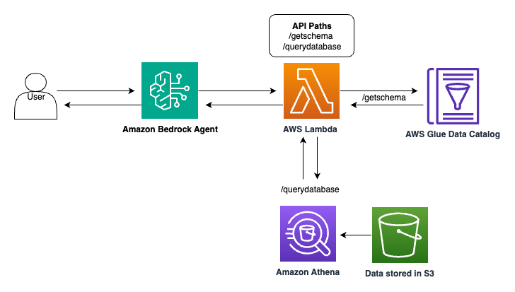

---
tags:
    - Use cases
---

!!! tip inline end "[Open in github](https://github.com/aws-samples/amazon-bedrock-samples/tree/main/agents-and-function-calling/bedrock-agents/use-case-examples/text-2-sql-agent/create_and_invoke_sql_agent.ipynb){:target="_blank"}"

<h2>Create and Invoke Agent via Boto3 SDK</h2>

> *This notebook should work well with the **`Data Science 3.0`** kernel in SageMaker Studio*

<h2>Introduction</h2>

This notebook demonstrates the usage of the `bedrock-agent` and `bedrock-agent-runtime` boto3 clients to:
- Create an agent
- Create an action group
- Associate the agent with the action group and prepare it for use
- Create an agent alias
- Invoke the agent

We'll be utilizing Bedrock's Claude v3 Sonnet through the Boto3 API.

**Note:** *This notebook is designed to be run both within and outside of an AWS environment.*

<h3>Prerequisites</h3>

Ensure you have an AWS account with permissions to:
- Create and manage IAM roles and policies
- Create and invoke AWS Lambda functions
- Create, read from, and write to Amazon S3 buckets
- Access and manage Amazon Bedrock agents and models
- Create and manage Amazon Glue databases and crawlers
- Execute queries and manage Amazon Athena workspaces

<h3>Context</h3>

The following sections guide you through creating and invoking a Bedrock agent using the Boto3 SDK.

<h3>Use Case</h3>

The notebook sets up an agent capable of crafting SQL queries from natural language questions. It then retrieves responses from the database, providing accurate answers to user inquiries. The diagram below outlines the high-level architecture of this solution.



The Agent is designed to:
- Retrieve database schemas
- Execute SQL queries


```python
upgrade_output = !pip install --upgrade pip
install_boto3_output = !pip install boto3
##Ensure your boto3 and botocore libraries are up to date
upgrade_output_botocore_boto3= !pip install --upgrade boto3 botocore 
```


```python
from dependencies.config import *
```


```python
!python ./dependencies/build_infrastructure.py
```


```python
from dependencies.config import *

list_agent=bedrock_agent_client.list_agents()['agentSummaries']
#print(list_agent)
#print(agent_name)
<h2>Search f</h2>
agent_id = next((agent['agentId'] for agent in list_agent if agent['agentName'] == agent_name), None)

print(agent_id)

response = bedrock_agent_client.list_agent_aliases(
    agentId=agent_id,
)
response['agentAliasSummaries']
agentAliasId=next((agent['agentAliasId'] for agent in response['agentAliasSummaries'] if agent['agentAliasName'] == agent_alias_name), None)
agent_alias_id=agentAliasId
print(agent_alias_id)
```


```python
<h2>### Invoke Agent</h2>
<h2>Now that we've created the agent, let's use the `bedrock-agent-runtime` client to invoke this agent and perform some tasks.</h2>
query_to_agent = """What was John Denny's salary in 1986?"""

<h2>create a random id for session initiator id</h2>
session_id:str = str(uuid.uuid1())
enable_trace:bool = True
end_session:bool = False


<h2>invoke the agent API</h2>
agentResponse = bedrock_agent_runtime_client.invoke_agent(
    inputText=query_to_agent,
    agentId=agent_id,
    agentAliasId=agent_alias_id, 
    sessionId=session_id,
    enableTrace=enable_trace, 
    endSession= end_session
)
logger.info(pprint.pprint(agentResponse))
```


```python
%%time
event_stream = agentResponse['completion']
try:
    for event in event_stream:        
        if 'chunk' in event:
            data = event['chunk']['bytes']
            logger.info(f"Final answer ->\n{data.decode('utf8')}")
            agent_answer = data.decode('utf8')
            end_event_received = True
            # End event indicates that the request finished successfully
        elif 'trace' in event:
            logger.info(json.dumps(event['trace'], indent=2))
        else:
            raise Exception("unexpected event.", event)
except Exception as e:
    raise Exception("unexpected event.", e)
```


```python
<h2>And here is the response if you just want to see agent's reply</h2>
print(agent_answer)
```


```python
#Create function to invoke agent
def invoke_agent(query):
    ## create a random id for session initiator id
    session_id:str = str(uuid.uuid1())
    enable_trace:bool = False
    end_session:bool = False
 

    # invoke the agent API
    agentResponse = bedrock_agent_runtime_client.invoke_agent(
        inputText=query,
        agentId=agent_id,
        agentAliasId=agent_alias_id, 
        sessionId=session_id,
        enableTrace=enable_trace, 
        endSession= end_session
    )
    event_stream = agentResponse['completion']
    print("Fetching answer...")
    try:
        for event in event_stream:        
            if 'chunk' in event:
                data = event['chunk']['bytes']
                logger.info(f"Final answer ->\n{data.decode('utf8')}")
                agent_answer = data.decode('utf8')
                end_event_received = True
                # End event indicates that the request finished successfully
            elif 'trace' in event:
                logger.info(json.dumps(event['trace'], indent=2))
            else:
                raise Exception("unexpected event.", event)
    except Exception as e:
        raise Exception("unexpected event.", e)


```


```python
invoke_agent("What year was Nolan Ryan inducted into the Hall of Fame?")
```


```python
invoke_agent("What year was Nolan Ryan inducted into the Hall of Fame?")

```


```python
invoke_agent("In what year did Hank Aaron hit the most home runs?")

```


```python
#This query requires a join of two tables to be able to answer the question
invoke_agent("What player has received the most All-Star Game selections?")
```


```python
#This query should say there is no data available for this year!!
invoke_agent("What was Babe Ruth's salary in 1930?")

```


```python
invoke_agent("Who is the richest player in baseball history? ")

```


```python
invoke_agent("What was John Denny's salary in 1986? ")

```


```python
<h2>This will stop the notebook's execution and wait for the user to press Enter</h2>
input("Press Enter to continue...")

```

<h2>Clean up (optional)</h2>

The next steps are optional and delete the infrustcture we built. 


```python
!python ./dependencies/clean.py
```


<h2>Conclusion</h2>
We have now experimented with using `boto3` SDK to create, invoke and delete an agent.

<h3>Take aways</h3>
- Adapt this notebook to create new agents for your application

<h2>Thank You</h2>
