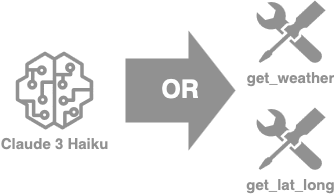
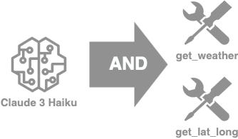
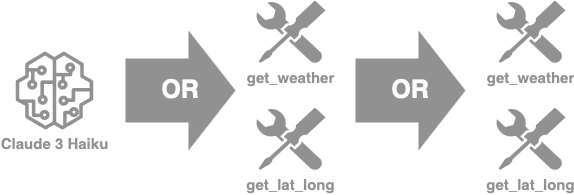

---
tags:
    - Agents/ Function Calling
---
<!-- <h2>How to do function calling with the Converse API</h2> -->

!!! tip inline end "[Open in github](https://github.com/aws-samples/amazon-bedrock-samples/blob/main/agents-and-function-calling/function-calling/function_calling_with_converse/function_calling_with_converse.ipynb){:target="_blank"}"

<h2>Overview</h2>

- **Basic tool definition and function calling** We define a single tool for simulating a weather forecast lookup tool (`get_weather`) and allow the model to call this tool.
- **Supplying the model with multiple tools to choose from** Starting from the previous example, we add a tool to search the web (`web_search`) and give the the model the liberty to decide the tool that is best fit for a given request.
- **Letting the model call multiple tools in a single turn** We modify the conversation flow to support parallel function calling. Then, we present an example where the model needs to call multiple tools in succession.

<h2>Context</h2>

This notebook demonstrates how we can improve model capability by using the Converse or ConverseStream API with external functions.

Converse and ConverseStream provide a unified structured text action for simplifying the invocations to Bedrock LLMs. It includes the possibility to define tools for implementing external functions that can be called or triggered from the LLMs.

As part of these APIs, the `toolConfig` parameter takes a list of `tools` in JSON schema. Each tool is defined as a `ToolSpec`, which includes its name, description and input schema. The model can be forced to call a given tool by supplying `toolChoice` within `toolConfig` with `{"tool": {"name": <some_tool_name>}}`. Each tool receives a unique identifier.

When the model chooses to call a tool, the response contains a `toolUse` object. It includes the tool's identifier, name and the input parameters supplied by the model. The model will also set the `stopReason` response field to `tool_use`.

If you want to learn more details about the parameters supported in the Bedrock Converse API, read the [api reference](https://docs.aws.amazon.com/bedrock/latest/APIReference/API_runtime_Converse.html) and [user guide](https://docs.aws.amazon.com/bedrock/latest/userguide/conversation-inference.html).


<h2>Prerequisites</h2>

Before you can use Amazon Bedrock, you must carry out the following steps:

- Sign up for an AWS account (if you don't already have one) and IAM Role with the necessary permissions for Amazon Bedrock, see [AWS Account and IAM Role](https://docs.aws.amazon.com/bedrock/latest/userguide/getting-started.html#new-to-aws){:target="_blank"}.
- Request access to the foundation models (FM) that you want to use, see [Request access to FMs](https://docs.aws.amazon.com/bedrock/latest/userguide/getting-started.html#getting-started-model-access){:target="_blank"}. 
    

<h2>Setup</h2>

!!! info
    This notebook should work well with the Data Science 3.0 kernel (Python 3.10 runtime) in SageMaker Studio

Run the cells in this section to install the packages needed by this notebook.

```python
!pip3 install boto3 --quiet
!pip3 install googlesearch-python --quiet
!pip3 install lxml --quiet
!pip3 install pydantic --quiet
```

Although this example leverages Claude 3 Sonnet, Bedrock supports many other models. The full list of models and supported features can be found [here](https://docs.aws.amazon.com/bedrock/latest/userguide/conversation-inference.html). The models are invoked via `bedrock-runtime`.


```python
import json
from datetime import datetime
from typing import Any, Dict, List
import inspect
import boto3
from pydantic import BaseModel, Field, create_model

modelId = 'anthropic.claude-3-sonnet-20240229-v1:0'
region = 'us-east-1'

bedrock = boto3.client(
    service_name = 'bedrock-runtime',
    region_name = region,
    )
```

<h2>Basic tool definition and function calling</h3>

We set our tools through Python functions and start by defining a tool for simulating a weather forecast lookup tool (`get_weather`). Note in our example we're just returning a constant weather forecast to illustrate the concept, but you could make it fully functional by connecting any weather service API. Later in the example, we call the Open-Meteo API.

We define `ToolsList` as a class where individual tools are defined as functions. Note that there is nothing specific to the model used or Bedrock in this definition.


```python
class ToolsList:
    #Define our get_weather tool function...
    def get_weather(self, city, state):
        result = f'Weather in {city}, {state} is 70F and clear skies.'
        print(f'Tool result: {result}')
        return result
```

Within `toolConfig`, setting `toolChoice` to `{auto: {}}` gives the model the choice to decide if a tool should be called or if it can rely on its internal body of knowledge.


```python
#Define the configuration for our tool...
toolConfig = {
    'tools': [],
    'toolChoice': {
        'auto': {}
    }
}
```

Let's structure our tool configuration and append it to our `tools`. We have to clearly define the schema that our tools are expecting in the corresponding functions. The descriptions we provide allow the model to get a sense of the external function's purpose. 


```python
toolConfig['tools'].append({
        'toolSpec': {
            'name': 'get_weather',
            'description': 'Get weather of a location.',
            'inputSchema': {
                'json': {
                    'type': 'object',
                    'properties': {
                        'city': {
                            'type': 'string',
                            'description': 'City of the location'
                        },
                        'state': {
                            'type': 'string',
                            'description': 'State of the location'
                        }
                    },
                    'required': ['city', 'state']
                }
            }
        }
    })
```

This function simply calls the Converse API given some `toolConfig` and returns the response


```python
#Function for caling the Bedrock Converse API...
def converse_with_tools(messages, system='', toolConfig=toolConfig):
    response = bedrock.converse(
        modelId=modelId,
        system=system,
        messages=messages,
        toolConfig=toolConfig
    )
    return response
```

<h2>Defining the conversation flow</h3>

Next, we define a function to manage the conversation flow. For this simple case, the function starts by invoking the model. Should the model choose to execute the tool we have defined, it returns it in `toolUse`. With this, the function runs the selected tool. Lastly, the tool's output is returned in `toolResults` to the model who can be given instructions to format it in a more conversational tone for the user.

<h3>Prompt flow</h4>


```python
#Function for orchestrating the conversation flow...
def converse(prompt, system=''):
    #Add the initial prompt:
    messages = []
    messages.append(
        {
            "role": "user",
            "content": [
                {
                    "text": prompt
                }
            ]
        }
    )
    print(f"Initial prompt:\n{json.dumps(messages, indent=2)}")

    #Invoke the model the first time:
    output = converse_with_tools(messages, system)
    print(f"Output so far:\n{json.dumps(output['output'], indent=2, ensure_ascii=False)}")

    #Add the intermediate output to the prompt:
    messages.append(output['output']['message'])

    function_calling = next((c['toolUse'] for c in output['output']['message']['content'] if 'toolUse' in c), None)

    #Check if function calling is triggered:
    if function_calling:
        #Get the tool name and arguments:
        tool_name = function_calling['name']
        tool_args = function_calling['input'] or {}
        
        #Run the tool:
        print(f"Running ({tool_name}) tool...")
        tool_response = getattr(ToolsList(), tool_name)(**tool_args) or ""
        if tool_response:
            tool_status = 'success'
        else:
            tool_status = 'error'

        #Add the tool result to the prompt:
        messages.append(
            {
                "role": "user",
                "content": [
                    {
                        'toolResult': {
                            'toolUseId':function_calling['toolUseId'],
                            'content': [
                                {
                                    "text": tool_response
                                }
                            ],
                            'status': tool_status
                        }
                    }
                ]
            }
        )

        #Invoke the model one more time:
        output = converse_with_tools(messages, system)
        print(f"Final output:\n{json.dumps(output['output'], indent=2, ensure_ascii=False)}\n")
    return
```

Now, we have everything setup and are ready for testing our function calling bot.

If we prompt our model about the weather, it will respond with the formatted string defined in our tool.


```python
prompt = "What is the weather like in Queens, NY?"


converse(
    system = [{"text": "You're provided with a tool that can get the weather information for a specific locations 'get_weather'; \
        only use the tool if required. Don't make reference to the tools in your final answer."}],
    prompt = prompt)
```

If we ask a question about another topic, the model will answer the question directly without making a tool call. Notice the absence of `toolUse` in the output.


```python
prompt = "What is the capital of France?"

converse(
    system = [{"text": "You're provided with a tool that can get the weather information for a specific locations 'get_weather'; \
        only use the tool if required. Don't make reference to the tools in your final answer."}],
    prompt = prompt)
```

As we can see, the LLM decides whether or not to call the `get_weather` tool depending on the question. You can further improve this example by playing with the system prompts.

<h2>Supplying the model with multiple tools to choose from</h2>

In many cases, it makes sense to supply the model with multiple external functions to choose from. We explore a slightly more evolved case from the one described above to not only have a `get_weather` tool, but also have a fully functional `web_search` tool that can look up information in the Internet for enriching our responses. For this, we'll leverage a simple public library with a simple web scrapping implementation.

<h3>Tool definition</h3>

We again define `ToolsList` as a class where individual tools are defined as functions.




```python
from googlesearch import search
import requests
from bs4 import BeautifulSoup

class ToolsList:
    #Define our get_weather tool function...
    def get_weather(self, city, state):
        #print(city, state)
        result = f'Weather in {city}, {state} is 70F and clear skies.'
        return result

    # Define our web_search tool function...
    def web_search(self, query):
        results = []
        response_list = []
        results.extend([r for r in search(query, 3, 'en')])
        for j in results:
            response = requests.get(j)
            if response.status_code == 200:
                soup = BeautifulSoup(response.text, 'html.parser')
                response_list.append(soup.get_text().strip())
        response_text = ",".join(str(i) for i in response_list)
        return response_text
```

We reset `toolConfig` to load it with the new set of tools.


```python
toolConfig = {'tools': [], 'toolChoice': {'auto': {}}}
```

Similarily, we append the new tools to the `tools` section of the object.


```python
# Add the get_weather tool...
toolConfig['tools'].append({
        'toolSpec': {
            'name': 'get_weather',
            'description': 'Get weather of a location.',
            'inputSchema': {
                'json': {
                    'type': 'object',
                    'properties': {
                        'city': {
                            'type': 'string',
                            'description': 'City of the location'
                        },
                        'state': {
                            'type': 'string',
                            'description': 'State of the location'
                        }
                    },
                    'required': ['city', 'state']
                }
            }
        }
    })

# Add the web_search tool...
toolConfig['tools'].append({
        'toolSpec': {
            'name': 'web_search',
            'description': 'Search a term in the public Internet. \
                Useful for getting up to date information.',
            'inputSchema': {
                'json': {
                    'type': 'object',
                    'properties': {
                        'search_term': {
                            'type': 'string',
                            'description': 'Term to search in the Internet'
                        }
                    },
                    'required': ['search_term']
                }
            }
        }
    })
```

<h3>Defining the conversation flow</h3>

We reuse the `converse` method defined above to control the flow of conversation. It can be reused to support any number of tools. 

If we prompt our model about the weather, it will respond with the same formatted string defined in our `get_weather` tool.


```python
prompt = "What is the weather like in Queens, NY?"
    
converse(
    system = [{"text": "You're provided with a tool that can get the weather information for a specific locations 'get_weather', and another tool to perform a web search for up to date information 'web_search'; \
        use those tools if required. Don't mention the tools in your final answer."}],
    prompt = prompt
)
```

If we prompt our model with another topic, it will respond a result from the web by using the `web_search` tool.


```python
prompt = "In which team is Caitlin Clark playing in the WNBA in 2024?"

converse(
    system = [{"text": "You're provided with a tool that can get the weather information for a specific locations 'get_weather', and another tool to perform a web search for up to date information 'web_search'; \
        use those tools if required. Don't mention the tools in your final answer."}],
    prompt = prompt
)
```

As we can see, the LLM decides whether to call the `get_weather` tool, provide an answer without any tool, or searching in the public Internet with the `web_search` tool.

<h2>Letting the model call multiple tools in a single turn</h2>

<h3>Parallel functions</h3>

Parallel function refers to the model's ability to make multiple calls to one or more tools in a single turn. By allowing the model to decompose the requester's question into multiple subproblems each solvable with a tool, it is able to increase its level flexibility.

<h4>Tool as Pydantic definition</h4>

To do this, we use Pydantic, a data-validation library. We rely on a Pydantic-based helper function for doing the tool config translation for us in a way that ensures we avoid potential mistakes when defining our tool config schema in a JSON dictionary.


```python
def tool(name, description):
    def decorator(func):
        # defining our model inheriting from pydantic.BaseModel and define fields as annotated attributes
        input_model = create_model(
            func.__name__ + "_input",
            **{
                name: (param.annotation, param.default)
                for name, param in inspect.signature(func).parameters.items()
                if param.default is not inspect.Parameter.empty
            },
        )

        # bedrock tool schema
        func.bedrock_schema = {
            'toolSpec': {
                'name': name,
                'description': description,
                'inputSchema': {
                    'json': input_model.schema()
                }
            }
        }
        return func

    return decorator
```

Now we can again define our tool list, and all we need to specify is the name, description, any relevant attributes that are required in our function. Of course we should also add the content of our tool. We define the `get_lat_long` tool to call Open Streat Map to retrieve these coordinates.

If you have more tools, you can adapt this cell for testing with your own.


```python
# Define your tools
class ToolsList:
    # define get_lat_long tool
    @tool(
        name="get_lat_long",
        description="Get the coordinates of a city based on a location."
    )
    def get_lat_long(self, place: str = Field(..., description="City of the location")) -> dict:
        """Returns the latitude and longitude for a given place name as a dict object of python."""
        header_dict = {
            "User-Agent": "Mozilla/5.0 (Windows NT 10.0; Win64; x64) AppleWebKit/537.36 (KHTML, like Gecko) Chrome/90.0.4430.212 Safari/537.36",
            "referer": 'https://www.guichevirtual.com.br'
        }
        url = "http://nominatim.openstreetmap.org/search"
        params = {'q': place, 'format': 'json', 'limit': 1}
        response = requests.get(url, params=params, headers=header_dict).json()
        if response:
            lat = response[0]["lat"]
            lon = response[0]["lon"]
            return {"latitude": lat, "longitude": lon}
        else:
            return None
```

We are now ready to define our configuration, setup the function for invoking Bedrock with Converse, and define our workflow orchestration function as per the previous examples. Using the Pydantic definition allows us to generalize `toolConfig` to any tool supplied to `ToolsList`. 


```python
toolConfig = {
    'tools': [tool.bedrock_schema for tool in ToolsList.__dict__.values() if hasattr(tool, 'bedrock_schema')],
    'toolChoice': {'auto': {}}
}
```

<h4>Defining the conversation flow</h4>

The following `converse` method has been adapted from the previous one to support parallel function calling in a single turn of the conversation. As it did before, the conversation begins with an invocation of the model dedicing whether to use a tool or not. During this step, the model can choose to call any number of tool as many times as it is necessary to complete the request. The model is then supplied the result of the executions in `toolResult` during the subsequent invokation.




```python
def converse(tool_class, prompt, system='', toolConfig=None, modelId=modelId):
    messages = [{"role": "user", "content": [{"text": prompt}]}]
    print("Invoking model...")
    output = converse_with_tools(messages, system, toolConfig)
    messages.append(output['output']['message'])
    print("Got output from model...")

    function_calling = [c['toolUse'] for c in output['output']['message']['content'] if 'toolUse' in c]
    if function_calling:
        tool_result_message = {"role": "user", "content": []}
        for function in function_calling:
            print("Function calling - Calling tool...")
            tool_name = function['name']
            tool_args = function['input'] or {}
            tool_response = json.dumps(getattr(tool_class, tool_name)(**tool_args))
            print("Function calling - Got tool response...")
            tool_result_message['content'].append({
                'toolResult': {
                    'toolUseId': function['toolUseId'],
                    'content': [{"text": tool_response}]
                }
            })
        messages.append(tool_result_message)
        print("Function calling - Calling model with result...")
        
        output = converse_with_tools(messages, system, toolConfig)
    return messages, output
```

We define a system prompt describing the model's role and task.


```python
# System prompt building an optional chain of thought response
system_prompt = """You're provided with a tool that can get the coordinates for a specific city 'get_lat_long';
    only use the tool if required. You can call the tool multiple times in the same response if required. \
    Don't make reference to the tools in your final answer."""
system_prompt = [{"text": system_prompt}]
```

If we ask for the coordinates of two cities, the model calls `get_lat_long` twice and aggregates the model answers.


```python
# prompt to get up-to-date coordinates of Montreal and Toronto
prompt = "What are the coordinates for both Paris and in Berlin??"

messages, output = converse(ToolsList(), prompt, system_prompt, toolConfig)
print(output)
print(f"Output:\n{output['output']}\n")
print(f"Messages:\n{json.dumps(messages, indent=2, ensure_ascii=False)}\n")
```

<h3>Chaining tool calls</h3>

Tool chaining refers to the ability of the model to reach its goal by calling more than one tool where the output of one tool serves as the input to the next. This more complex workflow requires the model to breakdown the query into subproblems that can individually be met with a call to an external function or the model's own body of knowledge.

We define `ToolList` again to include `get_lat_long` and a modified version of the previous `get_weather` function. This new version lerverages the Open-Meteo service translating a given set of coordinates to the currrent weather at those coordinates. Logically, this means that for a given question about the weather in a location, the model must first retrieve the coordinates of that place using `get_lat_long` and use those coordinates when calling `get_weather`. These calls occur in two seperate steps where the model is able to observe outputs, which differs from parallel functions call where the model selects multiple tools in a single turn.


```python
# Define your tools
class ToolsList:
    # define get_lat_long tool
    @tool(
        name="get_lat_long",
        description="Get the coordinates of a city based on a location."
    )
    def get_lat_long(self, place: str = Field(..., description="City of the location")) -> dict:
        """Returns the latitude and longitude for a given place name as a dict object of python."""
        header_dict = {
            "User-Agent": "Mozilla/5.0 (Windows NT 10.0; Win64; x64) AppleWebKit/537.36 (KHTML, like Gecko) Chrome/90.0.4430.212 Safari/537.36",
            "referer": 'https://www.guichevirtual.com.br'
        }
        url = "http://nominatim.openstreetmap.org/search"
        params = {'q': place, 'format': 'json', 'limit': 1}
        response = requests.get(url, params=params, headers=header_dict).json()
        if response:
            lat = response[0]["lat"]
            lon = response[0]["lon"]
            return {"latitude": lat, "longitude": lon}
        else:
            return None
            
    # define get_weather tool...
    @tool(
        name="get_weather",
        description="Get weather of a location."
    )
    def get_weather(self,
        latitude: str = Field(..., description="latitude of the location"), 
        longitude: str = Field(..., description="longitude of the location")) -> dict:
        """Returns weather data for a given latitude and longitude."""
        url = f"https://api.open-meteo.com/v1/forecast?latitude={latitude}&longitude={longitude}&current_weather=true"
        response = requests.get(url)
        return response.json()
```

We reset `toolConfig` with the new set of functions in `ToolList`.


```python
toolConfig = {
    'tools': [tool.bedrock_schema for tool in ToolsList.__dict__.values() if hasattr(tool, 'bedrock_schema')],
    'toolChoice': {'auto': {}}
}
```

<h3>Defining the conversation flow</h3>

To simplify the `converse` function, we create a helper function to wrap the call of the function.

!!! info 
    This is an example conversation flow that can be extended or simplified using common libraries such as Langchain and LlamaIndex.

```python
def call_function_and_add_message(tool_class, messages, previous_output):
    function_calling = [c['toolUse'] for c in previous_output['output']['message']['content'] if 'toolUse' in c]
    if function_calling:
        function = function_calling[0]
        tool_result_message = {"role": "user", "content": []}
        print("Function calling - Calling tool...")
        tool_name = function['name']
        tool_args = function['input'] or {}
        tool_response = json.dumps(getattr(tool_class, tool_name)(**tool_args))
        print("Function calling - Got tool response...")
        tool_result_message['content'].append({
            'toolResult': {
                'toolUseId': function['toolUseId'],
                'content': [{"text": tool_response}]
            }
        })
        messages.append(tool_result_message)
    return messages
```

As previously described, our workflow involves at most two function calls. We adjust the `converse` function again to match this flow.




```python
def converse(tool_class, prompt, system='', toolConfig=None, modelId=modelId):
    messages = [{"role": "user", "content": [{"text": prompt}]}]
    
    print("Invoking model...")
    output = converse_with_tools(messages, system, toolConfig)
    function_calling = [c['toolUse'] for c in output['output']['message']['content'] if 'toolUse' in c]
    if function_calling:
        messages.append(output['output']['message'])
    
    print("Got output from model...")
    messages = call_function_and_add_message(tool_class, messages, output)
    
    print("Function calling - Calling model with result...")
    output = converse_with_tools(messages, system, toolConfig)
    function_calling = [c['toolUse'] for c in output['output']['message']['content'] if 'toolUse' in c]
    if function_calling:
        messages.append(output['output']['message'])
    
    print("Got output from model...")
    messages = call_function_and_add_message(tool_class, messages, output)
    output = converse_with_tools(messages, system, toolConfig)
    return messages, output
```

We adjust the system prompt to account for the availability of multiple tools. 


```python
# System prompt building an optional chain of thought response
system_prompt = """You're provided with a tool that can get the coordinates for a specific city 'get_lat_long'
    and a tool that can get the weather for that city, but requires the coordinates 'get_weather';
    only use the tool if required. You can call the tool multiple times in the same response if required. \
    Don't make reference to the tools in your final answer."""
system_prompt = [{"text": system_prompt}]
```

If we ask for the weather of a given city, the model calls `get_lat_long` then `get_weather`. 


```python
# prompt to get up-to-date weather on Montreal
prompt = "What is the weather in Montreal??"

messages, output = converse(ToolsList(), prompt, system_prompt, toolConfig)
print(output)
print(f"Output:\n{output['output']}\n")
print(f"Messages:\n{json.dumps(messages, indent=2, ensure_ascii=False)}\n")
```

If we ask for the coordinates of a given city, the model calls `get_lat_long`.


```python
# prompt to get up-to-date weather on Montreal
prompt = "What are the coordinates in Montreal??"

messages, output = converse(ToolsList(), prompt, system_prompt, toolConfig)
print(output)
print(f"Output:\n{output['output']}\n")
print(f"Messages:\n{json.dumps(messages, indent=2, ensure_ascii=False)}\n")
```

If we ask an unrelated question to our tools, the model will not call the tools.


```python
# prompt to get up-to-date weather on Montreal
prompt = "What is SageMaker??"

messages, output = converse(ToolsList(), prompt, system_prompt, toolConfig)
print(output)
print(f"Output:\n{output['output']}\n")
print(f"Messages:\n{json.dumps(messages, indent=2, ensure_ascii=False)}\n")
```
    
<h2>Next Steps</h2>

This notebook demonstrates function calling with the Converse API with one or multiple tools.These tools can be called both in parallel and in succession. As a next step, explore similar implementation using the **Langchain** integration with Amazon Bedrock's Converse API to reduce the amount of code necessary for the solution.

<h2>Cleanup</h2>

There is no clean up necessary for this notebook.