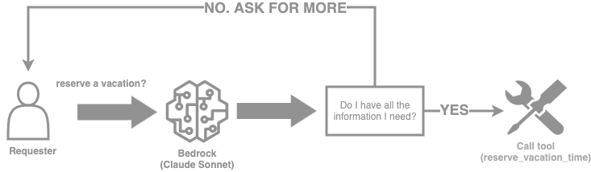

# How to work with Return of Control (ROC)

<h2>Overview</h2>
- **Basic setup with one external function** We define an external function requiring multiple parameters and returning simple outputs. We allow the model to call this API through its ability to do [function calling](https://github.com/aws-samples/amazon-bedrock-samples/blob/release/v2/agents/function-calling/function_calling_with_converse/function_calling_with_converse.ipynb).
- **Modifying the solution to enable Return of Control** Starting from the initial solution, we implement changes to allow the model to ask for additional information when it is unable to assign a value to every function parameter.
- **Increasing flexibility with Amazon Bedrock Agents** We simplify the solution by leveraging Bedrock native functionality.
- **Replicating the result in Langchain** We translate the solution to leverage a simple Langchain implementation.

<h2>Context + Theory + Details about feature/use case</h2>

This notebook demonstrates how to work with Return of Control (ROC) and Amazon Bedrock. Return of control extends model capabilities by enabling it to ask clarifying questions in order to solicit necessary information from the requester and offloading the function execution to the application developer. This not only can increase robustness of the application, but also allows the developer to introduce additional business logic, if needed, between the model's choice to use a tool and the execution of that tool.

This is a core functionality in agentic applications, which often work by identifying the requester's intent and working to fulfill it. 

<h2>Prerequisites</h2>

Ensure you enable access to Amazon Bedrock models through the Model Access section within the Amazon Bedrock page of the AWS Console.

<h2>Setup</h2>

```python
!pip install botocore --quiet
!pip install boto3 --quiet
!pip install pydantic --quiet
!pip install langchain --quiet
!pip install langchain-aws --upgrade --quiet
```

### Generating the dataset

We generate the dataset that will be used throughout this notebook. The data structured under the `employees`, `vacations` and `planned_vacations` tables. Our functions will interact with this data. We store it locally.


```python
# creating employee database to be used by lambda function
import sqlite3
import random
from datetime import date, timedelta

# Connect to the SQLite database (creates a new one if it doesn't exist)
conn = sqlite3.connect('employee_database.db')
c = conn.cursor()

# Create the employees table
c.execute('''CREATE TABLE IF NOT EXISTS employees
                (employee_id INTEGER PRIMARY KEY AUTOINCREMENT, employee_name TEXT, employee_job_title TEXT, employee_start_date TEXT, employee_employment_status TEXT)''')

# Create the vacations table
c.execute('''CREATE TABLE IF NOT EXISTS vacations
                (employee_id INTEGER, year INTEGER, employee_total_vacation_days INTEGER, employee_vacation_days_taken INTEGER, employee_vacation_days_available INTEGER, FOREIGN KEY(employee_id) REFERENCES employees(employee_id))''')

# Create the planned_vacations table
c.execute('''CREATE TABLE IF NOT EXISTS planned_vacations
                (employee_id INTEGER, vacation_start_date TEXT, vacation_end_date TEXT, vacation_days_taken INTEGER, FOREIGN KEY(employee_id) REFERENCES employees(employee_id))''')

# Generate some random data for 10 employees
employee_names = ['John Doe', 'Jane Smith', 'Bob Johnson', 'Alice Williams', 'Tom Brown', 'Emily Davis', 'Michael Wilson', 'Sarah Taylor', 'David Anderson', 'Jessica Thompson']
job_titles = ['Manager', 'Developer', 'Designer', 'Analyst', 'Accountant', 'Sales Representative']
employment_statuses = ['Active', 'Inactive']

for i in range(10):
    name = employee_names[i]
    job_title = random.choice(job_titles)
    start_date = date(2015 + random.randint(0, 7), random.randint(1, 12), random.randint(1, 28)).strftime('%Y-%m-%d')
    employment_status = random.choice(employment_statuses)
    c.execute("INSERT INTO employees (employee_name, employee_job_title, employee_start_date, employee_employment_status) VALUES (?, ?, ?, ?)", (name, job_title, start_date, employment_status))
    employee_id = c.lastrowid

    # Generate vacation data for the current employee
    for year in range(date.today().year, date.today().year - 3, -1):
        total_vacation_days = random.randint(10, 30)
        days_taken = random.randint(0, total_vacation_days)
        days_available = total_vacation_days - days_taken
        c.execute("INSERT INTO vacations (employee_id, year, employee_total_vacation_days, employee_vacation_days_taken, employee_vacation_days_available) VALUES (?, ?, ?, ?, ?)", (employee_id, year, total_vacation_days, days_taken, days_available))

        # Generate some planned vacations for the current employee and year
        num_planned_vacations = random.randint(0, 3)
        for _ in range(num_planned_vacations):
            start_date = date(year, random.randint(1, 12), random.randint(1, 28)).strftime('%Y-%m-%d')
            end_date = (date(int(start_date[:4]), int(start_date[5:7]), int(start_date[8:])) + timedelta(days=random.randint(1, 14))).strftime('%Y-%m-%d')
            days_taken = (date(int(end_date[:4]), int(end_date[5:7]), int(end_date[8:])) - date(int(start_date[:4]), int(start_date[5:7]), int(start_date[8:])))
            c.execute("INSERT INTO planned_vacations (employee_id, vacation_start_date, vacation_end_date, vacation_days_taken) VALUES (?, ?, ?, ?)", (employee_id, start_date, end_date, days_taken.days))

# Commit the changes and close the connection
conn.commit()
conn.close()
```

### Function calling with the Converse API 
Although this example leverages Claude 3 Sonnet, Bedrock supports many other models. The full list of models and supported features can be found [here](https://docs.aws.amazon.com/bedrock/latest/userguide/conversation-inference.html). The models are invoked via `bedrock-runtime`.


```python
import json
from datetime import datetime
from typing import Any, Dict, List
import inspect
import boto3
from pydantic import BaseModel, Field, create_model

# Claude 3 Sonnet model id
modelId = 'anthropic.claude-3-sonnet-20240229-v1:0'

region = 'us-east-1'

bedrock = boto3.client(
    service_name = 'bedrock-runtime',
    region_name = region,
    )
```

<h2>Notebook/Code with comments</h2>

### Tool as Pydantic definition

We rely on a Pydantic-based helper function to translate the tool configuration in a way that ensures we avoid potential mistakes when defining our tool config schema in a JSON dictionary.


```python
def tool(name, description):
    def decorator(func):
        # defining our model inheriting from pydantic.BaseModel and define fields as annotated attributes
        input_model = create_model(
            func.__name__ + "_input",
            **{
                name: (param.annotation, param.default)
                for name, param in inspect.signature(func).parameters.items()
                if param.default is not inspect.Parameter.empty
            },
        )

        # bedrock tool schema
        func.bedrock_schema = {
            'toolSpec': {
                'name': name,
                'description': description,
                'inputSchema': {
                    'json': input_model.schema()
                }
            }
        }
        return func

    return decorator
```

We define our tools under `ToolsList`.


```python
class ToolsList:
    @tool(
        name="get_available_vacations_days",
        description="Gets the number of available vacation days remaining."
    )
    def get_available_vacations_days(self, employee_id: str = Field(..., description="Employee identifier")):
        # Connect to the SQLite database
        conn = sqlite3.connect('employee_database.db')
        c = conn.cursor()
    
        if employee_id:
    
            # Fetch the available vacation days for the employee
            c.execute("""
                SELECT employee_vacation_days_available
                FROM vacations
                WHERE employee_id = ?
                ORDER BY year DESC
                LIMIT 1
            """, (employee_id,))
    
            available_vacation_days = c.fetchone()
            print(available_vacation_days)
            if available_vacation_days:
                available_vacation_days = available_vacation_days[0]  # Unpack the tuple
                print(f"Available vacation days for employed_id {employee_id}: {available_vacation_days}")
                conn.close()
                return available_vacation_days
            else:
                return_msg = f"No vacation data found for employed_id {employee_id}"
                print(return_msg)
                conn.close()
                return return_msg
        else:
            conn.close()
            raise Exception(f"No employeed id provided")
        
    @tool(
        name="reserve_vacation_time",
        description="Creates an entry to reserve vacation time."
    )  
    def reserve_vacation_time(self,
                              employee_id: str = Field(..., description="Employee identifier"),
                              start_date: str = Field(..., description="Start date for the vacation"),
                              end_date: str = Field(..., description="End date for the vacation")):
        # Connect to the SQLite database
        conn = sqlite3.connect('employee_database.db')
        c = conn.cursor()
        try:
            # Calculate the number of vacation days
            start_date = datetime.strptime(start_date, '%Y-%m-%d')
            end_date = datetime.strptime(end_date, '%Y-%m-%d')
            vacation_days = (end_date - start_date).days + 1
    
            # Get the current year
            current_year = start_date.year
    
            # Check if the employee exists
            c.execute("SELECT * FROM employees WHERE employee_id = ?", (employee_id,))
            employee = c.fetchone()
            if employee is None:
                return_msg = f"Employee with ID {employee_id} does not exist."
                print(return_msg)
                conn.close()
                return return_msg
    
            # Check if the vacation days are available for the employee in the current year
            c.execute("SELECT employee_vacation_days_available FROM vacations WHERE employee_id = ? AND year = ?", (employee_id, current_year))
            available_days = c.fetchone()
            if available_days is None or available_days[0] < vacation_days:
                return_msg = f"Employee with ID {employee_id} does not have enough vacation days available for the requested period."
                print(return_msg)
                conn.close()
                return return_msg
    
            # Insert the new vacation into the planned_vacations table
            c.execute("INSERT INTO planned_vacations (employee_id, vacation_start_date, vacation_end_date, vacation_days_taken) VALUES (?, ?, ?, ?)", (employee_id, start_date, end_date, vacation_days))
    
            # Update the vacations table with the new vacation days taken
            c.execute("UPDATE vacations SET employee_vacation_days_taken = employee_vacation_days_taken + ?, employee_vacation_days_available = employee_vacation_days_available - ? WHERE employee_id = ? AND year = ?", (vacation_days, vacation_days, employee_id, current_year))
    
            conn.commit()
            print(f"Vacation booked successfully for employee with ID {employee_id} from {start_date} to {end_date}.")
            # Close the database connection
            conn.close()
            return f"Vacation booked successfully for employee with ID {employee_id} from {start_date} to {end_date}."
        except Exception as e:
            conn.rollback()
            # Close the database connection
            conn.close()
            raise Exception(f"Error occurred: {e}")
```

Using the Pydantic definition lets us to generalize `toolConfig` to any tool supplied to `ToolsList`. This in turn is passed to the Converse API to define the external functions the model has access to.


```python
toolConfig = {
    'tools': [tool.bedrock_schema for tool in ToolsList.__dict__.values() if hasattr(tool, 'bedrock_schema')],
    'toolChoice': {'auto': {}}
}
```

This function simply calls the Converse API given some `toolConfig` and returns the response.


```python
#Function for caling the Bedrock Converse API...
def converse_with_tools(messages, system='', toolConfig=toolConfig):
    response = bedrock.converse(
        modelId=modelId,
        system=system,
        messages=messages,
        toolConfig=toolConfig
    )
    return response
```

The following `converse` method supports a single-turn conversation flow. The model is initially prompted by the requester where it determines if it should call a tool and returns the call in `toolUse`. Once the tool is called, its result is returned in `toolResult` and appended to the list of previous messages in the conversation.

The model is then prompted again with the result of the tool to provide and answer to the requester.


```python
def converse(tool_class, prompt, system='', toolConfig=None, modelId=modelId):
    # invoke model with the initial query
    messages = [{"role": "user", "content": [{"text": prompt}]}]
    print("Invoking model...")
    output = converse_with_tools(messages, system, toolConfig)
    print(output)
    messages.append(output['output']['message'])
    print("Got output from model...")
    # function to call including name and values for the parameters
    function_calling = [c['toolUse'] for c in output['output']['message']['content'] if 'toolUse' in c]
    if function_calling:
        tool_result_message = {"role": "user", "content": []}
        # Loop through if more than one tool to call
        for function in function_calling:
            print("Function calling - Calling tool...")
            tool_name = function['name']
            tool_args = function['input'] or {}
            tool_response = json.dumps(getattr(tool_class, tool_name)(**tool_args))
            print("Function calling - Got tool response...")
            # add the result of the tool to messages
            tool_result_message['content'].append({
                'toolResult': {
                    'toolUseId': function['toolUseId'],
                    'content': [{"text": tool_response}]
                }
            })
        messages.append(tool_result_message)
        print("Function calling - Calling model with result...")
        # prompt model with the original query and the result of the tool calls
        output = converse_with_tools(messages, system, toolConfig)
    return messages, output
```

We define the system prompt governing the model's overall behaviour and supply the model with a description of the `reserve_vacation_time` tool.


```python
# System prompt building an optional chain of thought response
system_prompt = """You're provided with a tool that can book the vacation for a given employee 'reserve_vacation_time';
    only use the tool if required. You can call the tool multiple times in the same response if required. \
    Don't make reference to the tools in your final answer."""
system_prompt = [{"text": system_prompt}]
```

When requesting to reserve a vacation with the necessary parameters, the model calls the tool and returns the output correctly.


```python
# prompt to reserve a vacation between given dates
prompt = "reserve a vacation with employee ID 1 from the 3rd of June 2024 to the 4th of June 2024."

messages, output = converse(ToolsList(), prompt, system_prompt, toolConfig)
print(f"Output:\n{output['output']}\n")
print(f"Messages:\n{json.dumps(messages, indent=2, ensure_ascii=False)}\n")
```

    Invoking model...
    {'ResponseMetadata': {'RequestId': '930822da-fb2c-4e29-a318-b58abfe22ea9', 'HTTPStatusCode': 200, 'HTTPHeaders': {'date': 'Wed, 14 Aug 2024 17:16:28 GMT', 'content-type': 'application/json', 'content-length': '439', 'connection': 'keep-alive', 'x-amzn-requestid': '930822da-fb2c-4e29-a318-b58abfe22ea9'}, 'RetryAttempts': 0}, 'output': {'message': {'role': 'assistant', 'content': [{'text': 'Here is how to reserve a vacation for employee ID 1 from June 3, 2024 to June 4, 2024:'}, {'toolUse': {'toolUseId': 'tooluse_utPMaGljQ8ev6BVSwC1JNg', 'name': 'reserve_vacation_time', 'input': {'employee_id': '1', 'start_date': '2024-06-03', 'end_date': '2024-06-04'}}}]}}, 'stopReason': 'tool_use', 'usage': {'inputTokens': 506, 'outputTokens': 137, 'totalTokens': 643}, 'metrics': {'latencyMs': 3426}}
    Got output from model...
    Function calling - Calling tool...
    Vacation booked successfully for employee with ID 1 from 2024-06-03 00:00:00 to 2024-06-04 00:00:00.
    Function calling - Got tool response...
    Function calling - Calling model with result...
    {'ResponseMetadata': {'RequestId': '23104b78-0225-4bac-a330-890915a57326', 'HTTPStatusCode': 200, 'HTTPHeaders': {'date': 'Wed, 14 Aug 2024 17:16:29 GMT', 'content-type': 'application/json', 'content-length': '221', 'connection': 'keep-alive', 'x-amzn-requestid': '23104b78-0225-4bac-a330-890915a57326'}, 'RetryAttempts': 0}, 'output': {'message': {'role': 'assistant', 'content': [{'text': 'Let me know if you need anything else!'}]}}, 'stopReason': 'end_turn', 'usage': {'inputTokens': 696, 'outputTokens': 13, 'totalTokens': 709}, 'metrics': {'latencyMs': 637}}
    Output:
    {'message': {'role': 'assistant', 'content': [{'text': 'Let me know if you need anything else!'}]}}
    
    Messages:
    [
      {
        "role": "user",
        "content": [
          {
            "text": "reserve a vacation with employee ID 1 from the 3rd of June 2024 to the 4th of June 2024."
          }
        ]
      },
      {
        "role": "assistant",
        "content": [
          {
            "text": "Here is how to reserve a vacation for employee ID 1 from June 3, 2024 to June 4, 2024:"
          },
          {
            "toolUse": {
              "toolUseId": "tooluse_utPMaGljQ8ev6BVSwC1JNg",
              "name": "reserve_vacation_time",
              "input": {
                "employee_id": "1",
                "start_date": "2024-06-03",
                "end_date": "2024-06-04"
              }
            }
          }
        ]
      },
      {
        "role": "user",
        "content": [
          {
            "toolResult": {
              "toolUseId": "tooluse_utPMaGljQ8ev6BVSwC1JNg",
              "content": [
                {
                  "text": "\"Vacation booked successfully for employee with ID 1 from 2024-06-03 00:00:00 to 2024-06-04 00:00:00.\""
                }
              ]
            }
          }
        ]
      }
    ]
    


However, given the previous system prompt, the model quickly defaults to random `start_date` and `end_date` when those parameters are not supplied. This may not be expected behaviour for many use cases.


```python
# prompt to reserve a vacation for a given employee. Information is incomplete for the request.
prompt = "reserve a vacation with employee ID 1"

messages, output = converse(ToolsList(), prompt, system_prompt, toolConfig)
print(f"Output:\n{output['output']}\n")
print(f"Messages:\n{json.dumps(messages, indent=2, ensure_ascii=False)}\n")
```

    Invoking model...
    {'ResponseMetadata': {'RequestId': '76fb7203-958d-4717-8e57-1ee66cba80ba', 'HTTPStatusCode': 200, 'HTTPHeaders': {'date': 'Wed, 14 Aug 2024 17:16:36 GMT', 'content-type': 'application/json', 'content-length': '476', 'connection': 'keep-alive', 'x-amzn-requestid': '76fb7203-958d-4717-8e57-1ee66cba80ba'}, 'RetryAttempts': 0}, 'output': {'message': {'role': 'assistant', 'content': [{'text': 'To reserve a vacation for the employee with ID 1, we can use the `reserve_vacation_time` tool with the required parameters:'}, {'toolUse': {'toolUseId': 'tooluse_G_s3OV7US1qU6vHm5guAeQ', 'name': 'reserve_vacation_time', 'input': {'employee_id': '1', 'start_date': '2023-06-01', 'end_date': '2023-06-14'}}}]}}, 'stopReason': 'tool_use', 'usage': {'inputTokens': 483, 'outputTokens': 135, 'totalTokens': 618}, 'metrics': {'latencyMs': 7032}}
    Got output from model...
    Function calling - Calling tool...
    Employee with ID 1 does not have enough vacation days available for the requested period.
    Function calling - Got tool response...
    Function calling - Calling model with result...
    {'ResponseMetadata': {'RequestId': '46bb0754-2daf-47f3-a4a7-c45099028d0e', 'HTTPStatusCode': 200, 'HTTPHeaders': {'date': 'Wed, 14 Aug 2024 17:16:37 GMT', 'content-type': 'application/json', 'content-length': '378', 'connection': 'keep-alive', 'x-amzn-requestid': '46bb0754-2daf-47f3-a4a7-c45099028d0e'}, 'RetryAttempts': 0}, 'output': {'message': {'role': 'assistant', 'content': [{'text': 'Let me check how many vacation days the employee has available first:'}, {'toolUse': {'toolUseId': 'tooluse_2hT2J7qDTXGNcU4t-sXrlw', 'name': 'get_available_vacations_days', 'input': {'employee_id': '1'}}}]}}, 'stopReason': 'tool_use', 'usage': {'inputTokens': 647, 'outputTokens': 75, 'totalTokens': 722}, 'metrics': {'latencyMs': 1647}}
    Output:
    {'message': {'role': 'assistant', 'content': [{'text': 'Let me check how many vacation days the employee has available first:'}, {'toolUse': {'toolUseId': 'tooluse_2hT2J7qDTXGNcU4t-sXrlw', 'name': 'get_available_vacations_days', 'input': {'employee_id': '1'}}}]}}
    
    Messages:
    [
      {
        "role": "user",
        "content": [
          {
            "text": "reserve a vacation with employee ID 1"
          }
        ]
      },
      {
        "role": "assistant",
        "content": [
          {
            "text": "To reserve a vacation for the employee with ID 1, we can use the `reserve_vacation_time` tool with the required parameters:"
          },
          {
            "toolUse": {
              "toolUseId": "tooluse_G_s3OV7US1qU6vHm5guAeQ",
              "name": "reserve_vacation_time",
              "input": {
                "employee_id": "1",
                "start_date": "2023-06-01",
                "end_date": "2023-06-14"
              }
            }
          }
        ]
      },
      {
        "role": "user",
        "content": [
          {
            "toolResult": {
              "toolUseId": "tooluse_G_s3OV7US1qU6vHm5guAeQ",
              "content": [
                {
                  "text": "\"Employee with ID 1 does not have enough vacation days available for the requested period.\""
                }
              ]
            }
          }
        ]
      }
    ]
    


### Modifying the solution to allow the model to ask for more information

Return of Control is primairly implemented in the model's system prompt. As we will see later in this notebook, both Amazon Bedrock and popular prompt orchestration libraries like Langchain offer abstractions to make this task easier. The target model behaviour in our case can be described by the following diagram:



In the prompt below, we present the model with `reserve_vacation_time` initially available at its disposal. We continue by explaining that all information must be present to use the tool and to not use the tool if information is incomplete. As this part of the prompt has a strong impact on overall behaviour, we suggest experimenting with it and seeing how the model responds.


```python
# System prompt building an optional chain of thought response
system_prompt = """You're provided with a tool that can book the vacation for a given employee 'reserve_vacation_time';
    You can only use the tool if you have all the information from the user. 
    If the information provided by the user to call your tool 
    is incomplete, do not use the tool and instead respond by stating the 
    missing parameters in plain language."""
system_prompt = [{"text": system_prompt}]
```

Finally, we test our example with a sample prompt. In this instance, the model is unable to answer, because the requester did not provide information in the query that would let the model infer the `start_date` and `end_date` parameters required by the `reserve_vacation_time` tool.

When this occurs, the model identifies this gap and prompts the requester by citing the values it has correctly received and the ones missing for a successful call. Notice the tool has not been called.


```python
# prompt to reserve a vacation for a given employee. Information is incomplete for the request.
prompt = "reserve a vacation with employee ID 1"

messages, output = converse(ToolsList(), prompt, system_prompt, toolConfig)
print(f"Output:\n{output['output']}\n")
print(f"Messages:\n{json.dumps(messages, indent=2, ensure_ascii=False)}\n")
```

    Invoking model...
    {'ResponseMetadata': {'RequestId': '6eec9cfa-3f09-4c20-bf22-28989628a276', 'HTTPStatusCode': 200, 'HTTPHeaders': {'date': 'Wed, 14 Aug 2024 17:16:40 GMT', 'content-type': 'application/json', 'content-length': '528', 'connection': 'keep-alive', 'x-amzn-requestid': '6eec9cfa-3f09-4c20-bf22-28989628a276'}, 'RetryAttempts': 0}, 'output': {'message': {'role': 'assistant', 'content': [{'text': 'To reserve a vacation for an employee, I need the following information:\n\n- Employee ID (you provided this as 1)\n- Start date for the vacation\n- End date for the vacation\n\nPlease provide the start date and end date for the vacation you want to reserve, and I can then invoke the `reserve_vacation_time` tool with the complete information.'}]}}, 'stopReason': 'end_turn', 'usage': {'inputTokens': 505, 'outputTokens': 79, 'totalTokens': 584}, 'metrics': {'latencyMs': 2415}}
    Got output from model...
    {'ResponseMetadata': {'RequestId': '6eec9cfa-3f09-4c20-bf22-28989628a276', 'HTTPStatusCode': 200, 'HTTPHeaders': {'date': 'Wed, 14 Aug 2024 17:16:40 GMT', 'content-type': 'application/json', 'content-length': '528', 'connection': 'keep-alive', 'x-amzn-requestid': '6eec9cfa-3f09-4c20-bf22-28989628a276'}, 'RetryAttempts': 0}, 'output': {'message': {'role': 'assistant', 'content': [{'text': 'To reserve a vacation for an employee, I need the following information:\n\n- Employee ID (you provided this as 1)\n- Start date for the vacation\n- End date for the vacation\n\nPlease provide the start date and end date for the vacation you want to reserve, and I can then invoke the `reserve_vacation_time` tool with the complete information.'}]}}, 'stopReason': 'end_turn', 'usage': {'inputTokens': 505, 'outputTokens': 79, 'totalTokens': 584}, 'metrics': {'latencyMs': 2415}}
    Output:
    {'message': {'role': 'assistant', 'content': [{'text': 'To reserve a vacation for an employee, I need the following information:\n\n- Employee ID (you provided this as 1)\n- Start date for the vacation\n- End date for the vacation\n\nPlease provide the start date and end date for the vacation you want to reserve, and I can then invoke the `reserve_vacation_time` tool with the complete information.'}]}}
    
    Messages:
    [
      {
        "role": "user",
        "content": [
          {
            "text": "reserve a vacation with employee ID 1"
          }
        ]
      },
      {
        "role": "assistant",
        "content": [
          {
            "text": "To reserve a vacation for an employee, I need the following information:\n\n- Employee ID (you provided this as 1)\n- Start date for the vacation\n- End date for the vacation\n\nPlease provide the start date and end date for the vacation you want to reserve, and I can then invoke the `reserve_vacation_time` tool with the complete information."
          }
        ]
      }
    ]
    


If we supply the additional parameters, the model is now able to call the tool and fulfill the intent.


```python
# prompt to reserve a vacation for a given employee between some dates. 
prompt = "reserve a vacation with employee ID 1 from the 3rd of June 2024 to the 4th of June 2024."

messages, output = converse(ToolsList(), prompt, system_prompt, toolConfig)
print(output)
print(f"Output:\n{output['output']}\n")
print(f"Messages:\n{json.dumps(messages, indent=2, ensure_ascii=False)}\n")
```

    Invoking model...
    {'ResponseMetadata': {'RequestId': 'c59ed7c7-8e37-48e5-b5c9-ba17d414e2d5', 'HTTPStatusCode': 200, 'HTTPHeaders': {'date': 'Wed, 14 Aug 2024 17:16:43 GMT', 'content-type': 'application/json', 'content-length': '414', 'connection': 'keep-alive', 'x-amzn-requestid': 'c59ed7c7-8e37-48e5-b5c9-ba17d414e2d5'}, 'RetryAttempts': 0}, 'output': {'message': {'role': 'assistant', 'content': [{'text': 'Okay, let me reserve your vacation with the provided details:'}, {'toolUse': {'toolUseId': 'tooluse_Pp6ThIoESaq3WS3hgE_N9Q', 'name': 'reserve_vacation_time', 'input': {'employee_id': '1', 'start_date': '2024-06-03', 'end_date': '2024-06-04'}}}]}}, 'stopReason': 'tool_use', 'usage': {'inputTokens': 528, 'outputTokens': 119, 'totalTokens': 647}, 'metrics': {'latencyMs': 2817}}
    Got output from model...
    Function calling - Calling tool...
    Vacation booked successfully for employee with ID 1 from 2024-06-03 00:00:00 to 2024-06-04 00:00:00.
    Function calling - Got tool response...
    Function calling - Calling model with result...
    {'ResponseMetadata': {'RequestId': '95dd5213-8b90-4ec8-b162-481c9df619dc', 'HTTPStatusCode': 200, 'HTTPHeaders': {'date': 'Wed, 14 Aug 2024 17:16:43 GMT', 'content-type': 'application/json', 'content-length': '171', 'connection': 'keep-alive', 'x-amzn-requestid': '95dd5213-8b90-4ec8-b162-481c9df619dc'}, 'RetryAttempts': 0}, 'output': {'message': {'role': 'assistant', 'content': []}}, 'stopReason': 'end_turn', 'usage': {'inputTokens': 700, 'outputTokens': 3, 'totalTokens': 703}, 'metrics': {'latencyMs': 590}}
    Output:
    {'message': {'role': 'assistant', 'content': []}}
    
    Messages:
    [
      {
        "role": "user",
        "content": [
          {
            "text": "reserve a vacation with employee ID 1 from the 3rd of June 2024 to the 4th of June 2024."
          }
        ]
      },
      {
        "role": "assistant",
        "content": [
          {
            "text": "Okay, let me reserve your vacation with the provided details:"
          },
          {
            "toolUse": {
              "toolUseId": "tooluse_Pp6ThIoESaq3WS3hgE_N9Q",
              "name": "reserve_vacation_time",
              "input": {
                "employee_id": "1",
                "start_date": "2024-06-03",
                "end_date": "2024-06-04"
              }
            }
          }
        ]
      },
      {
        "role": "user",
        "content": [
          {
            "toolResult": {
              "toolUseId": "tooluse_Pp6ThIoESaq3WS3hgE_N9Q",
              "content": [
                {
                  "text": "\"Vacation booked successfully for employee with ID 1 from 2024-06-03 00:00:00 to 2024-06-04 00:00:00.\""
                }
              ]
            }
          }
        ]
      }
    ]
    


### Increasing flexibility with Amazon Bedrock Agents

Similar to the simple function calling model we built above, an agent helps end-users complete actions based on requester input. Agents orchestrate interactions between the model, data sources, software applications, and user conversations. Bedrock Agent can have access to **Action Groups** or **Knowledge Bases**. The later is differentiated from the former by managing the query over a large set of documents rather than calling an API more generally.

In this notebook, we focus on action groups and, more specifically, return of control when the agent intends to execute an action. `boto3` has clients specific to Bedrock Agents letting us create and modify agents to streamline workflows and automate repetitive tasks.


```python
sts_client = boto3.client('sts')
iam_client = boto3.client('iam')
bedrock_agent_client = boto3.client('bedrock-agent')
bedrock_agent_runtime_client = boto3.client('bedrock-agent-runtime')
```

Next we can set some configuration variables for the agent


```python
session = boto3.session.Session()
region = session.region_name
account_id = sts_client.get_caller_identity()["Account"]
region, account_id

# configuration variables
suffix = f"{region}-{account_id}"
agent_name = "hr-assistant-function-roc"
agent_bedrock_allow_policy_name = f"{agent_name}-ba-{suffix}"
agent_role_name = f'AmazonBedrockExecutionRoleForAgents_{agent_name}'
```

#### Granting service role access 

Next, we attach a resource-based policy to allow Bedrock to take actions on our behalf. The following policy allows access to Bedrock's `InvokeModel` API.


```python
# Create IAM policies for agent
bedrock_agent_bedrock_allow_policy_statement = {
    "Version": "2012-10-17",
    "Statement": [
        {
            "Sid": "AmazonBedrockAgentBedrockFoundationModelPolicy",
            "Effect": "Allow",
            "Action": "bedrock:InvokeModel",
            "Resource": [
                f"arn:aws:bedrock:{region}::foundation-model/{modelId}"
            ]
        }
    ]
}

bedrock_policy_json = json.dumps(bedrock_agent_bedrock_allow_policy_statement)

agent_bedrock_policy = iam_client.create_policy(
    PolicyName=agent_bedrock_allow_policy_name,
    PolicyDocument=bedrock_policy_json
)
```

We create the trust relationship so Bedrock can assume the role with the policy we defined.


```python
import time

# Create IAM Role for the agent and attach IAM policies
assume_role_policy_document = {
    "Version": "2012-10-17",
    "Statement": [{
          "Effect": "Allow",
          "Principal": {
            "Service": "bedrock.amazonaws.com"
          },
          "Action": "sts:AssumeRole"
    }]
}

assume_role_policy_document_json = json.dumps(assume_role_policy_document)
agent_role = iam_client.create_role(
    RoleName=agent_role_name,
    AssumeRolePolicyDocument=assume_role_policy_document_json
)

# Pause to make sure role is created
time.sleep(10)
    
iam_client.attach_role_policy(
    RoleName=agent_role_name,
    PolicyArn=agent_bedrock_policy['Policy']['Arn']
)
```


    {'ResponseMetadata': {'RequestId': '3d77c301-93fc-44d2-a5b7-193c7709d5aa',
      'HTTPStatusCode': 200,
      'HTTPHeaders': {'date': 'Wed, 14 Aug 2024 17:16:53 GMT',
       'x-amzn-requestid': '3d77c301-93fc-44d2-a5b7-193c7709d5aa',
       'content-type': 'text/xml',
       'content-length': '212'},
      'RetryAttempts': 0}}


#### Creating the agent
Once the IAM role is created, we create a new agent. To do so we use Bedrock's `create_agent`. It requires an agent name, the underlying foundation model's identifier and an instruction. You can also provide an agent description. 

The `instruction` provides natural language describing what the agent should do and how it should interact with users. We tailor it to reflect expected behaviour and role. The `description` is an optional parameter used to further describe what the agent does. It does not impact behaviour. It is also not exposed to the end-user prompting the agent.

Bedrock Agents have functionality to help manage user sessions by storing information about a requester's interactions with the agent for a defined amount of time. `idleSessionTTLInSeconds` defines the number of seconds a given user's interactions remain active without additional activity.


```python
agent_description = "Agent for providing HR assistance to book holidays"
agent_instruction = "You are an HR agent, helping employees understand HR policies and manage vacation time"
idleSessionTTLInSeconds = 1800
```

We create the agent using the role and parameters defined above.


```python
# Create agent
response = bedrock_agent_client.create_agent(
    agentName=agent_name,
    agentResourceRoleArn=agent_role['Role']['Arn'],
    description=agent_description,
    idleSessionTTLInSeconds=idleSessionTTLInSeconds,
    foundationModel=modelId,
    instruction=agent_instruction,
)
response
```

We store the agent id in a local variable to use it on the next steps


```python
agent_id = response['agent']['agentId']
```

#### Creating the agent Action Group with ROC
We now create an action group, so the agent can call external functions, using [`create_agent_action_group`](https://boto3.amazonaws.com/v1/documentation/api/latest/reference/services/bedrock-agent/client/create_agent_action_group.html). We use `DRAFT` as the agent version since we have not created an agent version or alias. To inform the agent about the action group's intended purpose, we provide an action group description.

In this example, we provide the Action Group functionality using a `functionSchema`. Alternatively, you can provide an `APISchema` containing the details about the OpenAPI schema.

To define the functions using a function schema, we provide the `name`, `description` and `parameters` as we have done before.


```python
agent_functions = [
    # schema for the get_available_vacations_days tool
    {
        'name': 'get_available_vacations_days',
        'description': 'get the number of vacations available for a certain employee',
        'parameters': {
            "employee_id": {
                "description": "the id of the employee to get the available vacations",
                "required": True,
                "type": "integer"
            }
        }
    },
    #schema for the reserve_vacation_time tool
    {
        'name': 'reserve_vacation_time',
        'description': 'reserve vacation time for a specific employee - you need all parameters to reserve vacation time',
        'parameters': {
            "employee_id": {
                "description": "the id of the employee for which time off will be reserved",
                "required": True,
                "type": "integer"
            },
            "start_date": {
                "description": "the start date for the vacation time",
                "required": True,
                "type": "string"
            },
            "end_date": {
                "description": "the end date for the vacation time",
                "required": True,
                "type": "string"
            }
        }
    },
]
```

We define the action group's name and description. In all cases, the descriptions are optional, but are used by the model to understand the context in which it should leverage a given tool. Strong descriptions will often result in a more robust and performant solution.


```python
agent_action_group_name = "VacationsActionGroup"
agent_action_group_description = """Actions for getting the number of available vactions days 
for an employee and book new vacations in the system"""
```

To enable return of control, we create the action group with a `customContrl` executor of `RETURN_CONTROL`. This lets the agent know that instead of executing the function, it should simply return the appropriate function and parameters. The client application is then responsible for executing the function.


```python
# Pause to make sure agent is created
time.sleep(30)

# Now, we can configure and create an action group here:
agent_action_group_response = bedrock_agent_client.create_agent_action_group(
    agentId=agent_id,
    agentVersion='DRAFT',
    actionGroupExecutor={
        'customControl': 'RETURN_CONTROL'
    },
    actionGroupName=agent_action_group_name,
    functionSchema={
        'functions': agent_functions
    },
    description=agent_action_group_description
)
```

We create a DRAFT version of the agent. Ensure the version is created before invoking the agent.


```python
## create a random id for session initiator id
session_id:str = str(uuid.uuid1())
agent_alias_id = "TSTALIASID"
enable_trace:bool = False
end_session:bool = False

response = bedrock_agent_client.prepare_agent(
    agentId=agent_id
)
```

#### Invoke Agent

Now that we have created the agent, we use the `bedrock-agent-runtime` client to invoke it and perform some tasks with `invoke_agent`. We ask for the amount of vacation time available for a given employee, which triggers a call to the `get_available_vacations_days` tool. With ROC, the agent does not forward the request to a Lambda function for fulfillment, but instead returns the result to the requester.


```python
import uuid

# invoke the agent API
agentResponse = bedrock_agent_runtime_client.invoke_agent(
    inputText="how much vacation time does employee 1 have available?",
    agentId=agent_id,
    agentAliasId=agent_alias_id,
    sessionId=session_id,
    enableTrace=enable_trace,
    endSession=end_session
)
```

We parse the response to find that `employee_id` was set to 1 correctly. We then use the output to call the `get_available_vacations_days` function. This output can further utilized by the agent. This is done by passing in a dictionary for `returnControlInvocationResults` in the `sessionState` when invoking the agent as described [here](https://docs.aws.amazon.com/bedrock/latest/userguide/agents-returncontrol.html).


```python
event_stream = agentResponse['completion']

for event in event_stream:        
    if 'chunk' in event:
        data = event['chunk']['bytes']
        print(f"Final answer ->\n{data.decode('utf8')}")
        agent_answer = data.decode('utf8')
        end_event_received = True
        # End event indicates that the request finished successfully
    elif 'trace' in event:
        print(json.dumps(event['trace'], indent=2))
    elif 'returnControl' in event:
        # Parse event response when returnControl
        event = event["returnControl"]["invocationInputs"][0]["functionInvocationInput"]
        tool_name = event["function"]
        function_params = event["parameters"]
        tool_args = {}
        for function_param in function_params:
            tool_args[function_param["name"]] = function_param["value"]
        # Call the tool and print its response
        tool_resp = getattr(ToolsList(), tool_name)(**tool_args)
        print(f"Tool Result: {tool_resp}")

```

    (2,)
    Available vacation days for employed_id 1: 2
    Tool Result: 2


ROC handles input text that cannot be resolved with available functions and prompts the requester for more information


```python
def simple_agent_roc_invoke(input_text, agent_id, agent_alias_id, session_id=None, enable_trace=False, end_session=False):
    agentResponse = bedrock_agent_runtime_client.invoke_agent(
        inputText=input_text,
        agentId=agent_id,
        agentAliasId=agent_alias_id, 
        sessionId=session_id,
        enableTrace=enable_trace, 
        endSession= end_session
    )
    event_stream = agentResponse['completion']
    try:
         for event in event_stream:        
            if 'chunk' in event:
                data = event['chunk']['bytes']
                print(f"Final answer ->\n{data.decode('utf8')}")
                agent_answer = data.decode('utf8')
                end_event_received = True
                # End event indicates that the request finished successfully
            elif 'trace' in event:
                print(json.dumps(event['trace'], indent=2))
            elif 'returnControl' in event:
                print(event)

            else:
                raise Exception("unexpected event.", event)
    except Exception as e:
        raise Exception("unexpected event.", e)

```

When requesting information that has nothing to do with the agent and its available functions, the agent refuses to answer the question and acknowledges the role defined in the agent instruction.


```python
# prompt with unrelated request
simple_agent_roc_invoke("who is the president of the United States?", agent_id, agent_alias_id, session_id)
```

    Final answer ->
    Sorry, I cannot answer questions about who the president is or provide information outside of managing vacation time and HR policies for employees. My role is to assist with understanding HR policies and managing vacation time using the available functions.


When requesting information within the bounds of its role that should be fulfilled with the `reserve_vacation_time` tool, the model correctly identifies it should use the tool. However, the model is not supplied values for `startDate` and `endDate`, which are required by the tool. Hence, it continues by prompting the requester for a start date. Given the nature of the request, this will let it infer the end date.


```python
# prompt to reserve a vacation for a given employee. Incomplete request to be refused.
simple_agent_roc_invoke("reserve 2 days off for employee 2", agent_id, agent_alias_id, session_id)
```

    Final answer ->
    Okay, to reserve 2 days off for employee 2, I need you to provide the start and end dates for the vacation time. What are the start and end dates you want me to reserve for employee 2's 2 day vacation?


#### Replicating the results in Langchain

We now replicate the results described above using Langchain.

Langchain a frameworks used to orchestrate calls to LLMs. In this section, we replicate ROC functionality using Langchain abstractions and primitives. We use `ChatBedrock` to interact with the Bedrock API. Enabling `beta_use_converse_api` allows us to leverage Bedrock's Converse API.


```python
from langchain_aws.chat_models.bedrock import ChatBedrock

# chat model to interact with Bedrock's Converse API
llm = ChatBedrock(
    model_id=modelId,
    client=bedrock,
    beta_use_converse_api=True
)
```

We redefine `ToolsList` with small changes. Mainly, we replace the previous `tool` decorator defined using Pydantic with the one from the core Langchain library. We also supply a `DOCSTRING` describing what is returned by our functions.


```python
from langchain.tools import tool

class ToolsList:
    @tool("get_available_vacations_days")
    def get_available_vacations_days(employee_id: str) -> str:
        """Returns the number of available vacation days"""
        # Connect to the SQLite database
        conn = sqlite3.connect('employee_database.db')
        c = conn.cursor()
        
        if employee_id:
        
            # Fetch the available vacation days for the employee
            c.execute("""
                SELECT employee_vacation_days_available
                FROM vacations
                WHERE employee_id = ?
                ORDER BY year DESC
                LIMIT 1
            """, (employee_id,))
        
            available_vacation_days = c.fetchone()
            print(available_vacation_days)
            if available_vacation_days:
                available_vacation_days = available_vacation_days[0]  # Unpack the tuple
                print(f"Available vacation days for employed_id {employee_id}: {available_vacation_days}")
                conn.close()
                return available_vacation_days
            else:
                return_msg = f"No vacation data found for employed_id {employee_id}"
                print(return_msg)
                conn.close()
                return return_msg
        else:
            conn.close()
            raise Exception(f"No employeed id provided")
        
    @tool("reserve_vacation_time")
    def reserve_vacation_time(employee_id: str,
                              start_date: str,
                              end_date: str) -> str:
        """Returns a success or failure message after booking a vacation for some employee with the given start and end dateé"""
        # Connect to the SQLite database
        conn = sqlite3.connect('employee_database.db')
        c = conn.cursor()
        try:
            # Calculate the number of vacation days
            start_date = datetime.strptime(start_date, '%Y-%m-%d')
            end_date = datetime.strptime(end_date, '%Y-%m-%d')
            vacation_days = (end_date - start_date).days + 1
    
            # Get the current year
            current_year = start_date.year
    
            # Check if the employee exists
            c.execute("SELECT * FROM employees WHERE employee_id = ?", (employee_id,))
            employee = c.fetchone()
            if employee is None:
                return_msg = f"Employee with ID {employee_id} does not exist."
                print(return_msg)
                conn.close()
                return return_msg
    
            # Check if the vacation days are available for the employee in the current year
            c.execute("SELECT employee_vacation_days_available FROM vacations WHERE employee_id = ? AND year = ?", (employee_id, current_year))
            available_days = c.fetchone()
            if available_days is None or available_days[0] < vacation_days:
                return_msg = f"Employee with ID {employee_id} does not have enough vacation days available for the requested period."
                print(return_msg)
                conn.close()
                return return_msg
    
            # Insert the new vacation into the planned_vacations table
            c.execute("INSERT INTO planned_vacations (employee_id, vacation_start_date, vacation_end_date, vacation_days_taken) VALUES (?, ?, ?, ?)", (employee_id, start_date, end_date, vacation_days))
    
            # Update the vacations table with the new vacation days taken
            c.execute("UPDATE vacations SET employee_vacation_days_taken = employee_vacation_days_taken + ?, employee_vacation_days_available = employee_vacation_days_available - ? WHERE employee_id = ? AND year = ?", (vacation_days, vacation_days, employee_id, current_year))
    
            conn.commit()
            print(f"Vacation booked successfully for employee with ID {employee_id} from {start_date} to {end_date}.")
            # Close the database connection
            conn.close()
            return f"Vacation booked successfully for employee with ID {employee_id} from {start_date} to {end_date}."
        except Exception as e:
            conn.rollback()
            # Close the database connection
            conn.close()
            raise Exception(f"Error occurred: {e}")
```

To enable tool use, the model needs access each tool's schema. `bind_tools` abstracts away manual steps to do this by taking a list of `BaseTool`, Pydantic classes or JSON Schemas. Each element holds information related to the tool name and input parameters. Tool calling is further covered in the Langchain [documentation](https://python.langchain.com/v0.1/docs/modules/model_io/chat/function_calling/).


```python
tools_list = [ToolsList.get_available_vacations_days, ToolsList.reserve_vacation_time]
llm_with_tools = llm.bind_tools(tools_list)
```

Now that the model has access to the necessary tools, we can prompt it using the `.invoke` method taking a list of `BaseMessage`. We supply the system prompt as a `SystemMessage`.

When asking the model an unrelated question, the model correctly refuses to answer with `stopReason` set to `endTurn`. This indicates the model does not believe a tool can answer the request.


```python
from langchain_core.messages import HumanMessage, SystemMessage

system_prompt="""You can only use the tool if you have all the information from the user. 
If the information provided by the user to call your tool 
is incomplete, do not use the tool and instead respond by stating the 
missing parameters in plain language. Set the missing parameters to MISSING. 
You can simply refuse to answer unrelated questions"""

# prompt with unrelated request
messages = [
    SystemMessage(content=system_prompt),
    HumanMessage(content="who is the president of the United States?")
]

ai_msg = llm_with_tools.invoke(messages)
ai_msg
```

    bedrock_messages: [{'role': 'user', 'content': [{'text': 'who is the president of the United States?'}]}]


    AIMessage(content='I do not have any tools related to identifying the president of the United States. As an AI assistant without direct access to updated information about political offices, I cannot definitively answer who the current president is.', response_metadata={'ResponseMetadata': {'RequestId': '7d29bf0d-f3a8-42cc-a973-13a8c1530b82', 'HTTPStatusCode': 200, 'HTTPHeaders': {'date': 'Wed, 14 Aug 2024 17:18:25 GMT', 'content-type': 'application/json', 'content-length': '414', 'connection': 'keep-alive', 'x-amzn-requestid': '7d29bf0d-f3a8-42cc-a973-13a8c1530b82'}, 'RetryAttempts': 0}, 'stopReason': 'end_turn', 'metrics': {'latencyMs': 2022}}, id='run-4d318696-0e37-4968-8c4e-f0b831c9ba71-0', usage_metadata={'input_tokens': 429, 'output_tokens': 44, 'total_tokens': 473})


When prompting the model with a relevant question where the model has all the necessary information, it returns an `AIMessage` with `stopReason` set to `tool_use` and valid values for the required parameters. In this case, `employee_id` is set to 2 for the `get_available_vacations_days` tool.


```python
# prompt to get the number of remaining vacations days. Execute tool.
messages = [
    SystemMessage(content=system_prompt),
    HumanMessage(content="how many vacation days left for employee 2")
]

ai_msg = llm_with_tools.invoke(messages)
ai_msg
```

    bedrock_messages: [{'role': 'user', 'content': [{'text': 'how many vacation days left for employee 2'}]}]


    AIMessage(content=[{'type': 'text', 'text': 'Okay, let me check your available vacation days:'}, {'type': 'tool_use', 'name': 'get_available_vacations_days', 'input': {'employee_id': '2'}, 'id': 'tooluse_jHiq7yf6Tm6JJioaWTXqfg'}], response_metadata={'ResponseMetadata': {'RequestId': 'ed03d27b-007d-479f-9fc0-0f4c7639c533', 'HTTPStatusCode': 200, 'HTTPHeaders': {'date': 'Wed, 14 Aug 2024 21:55:01 GMT', 'content-type': 'application/json', 'content-length': '357', 'connection': 'keep-alive', 'x-amzn-requestid': 'ed03d27b-007d-479f-9fc0-0f4c7639c533'}, 'RetryAttempts': 1}, 'stopReason': 'tool_use', 'metrics': {'latencyMs': 1123}}, id='run-36fe475b-ceb6-46a9-9188-e329697ca228-0', tool_calls=[{'name': 'get_available_vacations_days', 'args': {'employee_id': '2'}, 'id': 'tooluse_jHiq7yf6Tm6JJioaWTXqfg', 'type': 'tool_call'}], usage_metadata={'input_tokens': 425, 'output_tokens': 72, 'total_tokens': 497})


When prompting the model with a request that does not have all the relevant parameters required to properly call the tool, the model correctly refuses to answer and instead asks for more information. The model also sets the missing values to `MISSING` as indicated in the system prompt.


```python
# prompt to reserve a vacation for a given employee. Incomplete request to be refused.
messages = [
    SystemMessage(content=system_prompt),
    HumanMessage(content="reserve 2 days off for employee 2")
]

ai_msg = llm_with_tools.invoke(messages)
ai_msg
```

    bedrock_messages: [{'role': 'user', 'content': [{'text': 'reserve 2 days off for employee 2'}]}]


    AIMessage(content=[{'type': 'text', 'text': 'Okay, to reserve vacation time for an employee I will need the following parameters:'}, {'type': 'tool_use', 'name': 'reserve_vacation_time', 'input': {'employee_id': '2', 'start_date': 'MISSING', 'end_date': 'MISSING'}, 'id': 'tooluse_uao4k_r3TYWzYFcrwtK2UA'}], response_metadata={'ResponseMetadata': {'RequestId': '059f540f-49a6-4065-bfee-d49b2aa5d37c', 'HTTPStatusCode': 200, 'HTTPHeaders': {'date': 'Wed, 14 Aug 2024 17:18:29 GMT', 'content-type': 'application/json', 'content-length': '431', 'connection': 'keep-alive', 'x-amzn-requestid': '059f540f-49a6-4065-bfee-d49b2aa5d37c'}, 'RetryAttempts': 0}, 'stopReason': 'tool_use', 'metrics': {'latencyMs': 2230}}, id='run-c2336a51-1b50-4d3a-9d21-10d21fc886af-0', tool_calls=[{'name': 'reserve_vacation_time', 'args': {'employee_id': '2', 'start_date': 'MISSING', 'end_date': 'MISSING'}, 'id': 'tooluse_uao4k_r3TYWzYFcrwtK2UA', 'type': 'tool_call'}], usage_metadata={'input_tokens': 430, 'output_tokens': 115, 'total_tokens': 545})


In this notebook, we covered the basics of return of control (ROC) with Claude Sonnet using Bedrock models, Agents on Bedrock and the `ChatBedrock` on Langchain.

<h2>Next Steps</h2>

Now that you have a deeper understanding of return of control and Amazon Bedrock Agents, we suggest diving deeper into the notebooks and exemples covering the various facets of Bedrock Agents, Knowledge Bases and ActionGroups. These components are built to simplify the implementation of Agents across a variety of use cases.

<h2>Cleanup</h2>

The next steps are optional and demonstrate how to delete our agent. To delete the agent we need to:

1. update the action group to disable it
2. delete agent action group
4. delete agent
6. delete the created IAM roles and policies


```python
# This is not needed, you can delete agent successfully after deleting alias only
# Additionaly, you need to disable it first
action_group_id = agent_action_group_response['agentActionGroup']['actionGroupId']
action_group_name = agent_action_group_response['agentActionGroup']['actionGroupName']

response = bedrock_agent_client.update_agent_action_group(
    agentId=agent_id,
    agentVersion='DRAFT',
    actionGroupId= action_group_id,
    actionGroupName=action_group_name,
    actionGroupExecutor={
        'customControl': 'RETURN_CONTROL'
    },
    functionSchema={
        'functions': agent_functions
    },
    actionGroupState='DISABLED',
)

action_group_deletion = bedrock_agent_client.delete_agent_action_group(
    agentId=agent_id,
    agentVersion='DRAFT',
    actionGroupId= action_group_id
)
```


```python
agent_deletion = bedrock_agent_client.delete_agent(
    agentId=agent_id
)
```


```python
# Delete IAM Roles and policies

for policy in [agent_bedrock_allow_policy_name]:
    iam_client.detach_role_policy(RoleName=agent_role_name, PolicyArn=f'arn:aws:iam::{account_id}:policy/{policy}')
    
for role_name in [agent_role_name]:
    iam_client.delete_role(
        RoleName=role_name
    )

for policy in [agent_bedrock_policy]:
    iam_client.delete_policy(
        PolicyArn=policy['Policy']['Arn']
)

```
