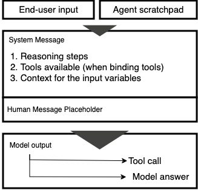

---
tags:
    - Agents/ Tool Binding
    - Open Source/ Langchain
    - Open Source/ LlamaIndex
---

<!-- <h2>How to work with tools bindings</h2> -->

!!! tip inline end "[Open in github](https://github.com/aws-samples/amazon-bedrock-samples/blob/main/agents-and-function-calling/function-calling/tool_binding/tool_bindings.ipynb){:target="_blank"}"

<h2>Overview</h2>

- **Tool binding with Langchain** We define a list of tools and apply the `.bind_tools` function.
- **Tool binding with LlamaIndex** We translate the setup to leverage LlamaIndex.

<h2>Context</h2>

Most differentiated real-world applications require access to real-time data and the ability to interact with it. On their own, models cannot call external functions or APIs to bridge this gap. To solve this, function calling lets developers define a set of tools (external functions) the model has access to and defines instructions the model uses to return a structured output that can be used to call the function. A tool definition includes its name, description and input schema. The model can be give a certain level of freedom when choosing to answer user requests using a set of tools. 

In this notebook we cover tool binding where the frameworks we use convert our tool definitions to a format accepted by Bedrock and makes them available for subsequent calls.

<h2>Prerequisites</h2>

Before you can use Amazon Bedrock, you must carry out the following steps:

- Sign up for an AWS account (if you don't already have one) and IAM Role with the necessary permissions for Amazon Bedrock, see [AWS Account and IAM Role](https://docs.aws.amazon.com/bedrock/latest/userguide/getting-started.html#new-to-aws){:target="_blank"}.
- Request access to the foundation models (FM) that you want to use, see [Request access to FMs](https://docs.aws.amazon.com/bedrock/latest/userguide/getting-started.html#getting-started-model-access){:target="_blank"}. 
    

<h2>Setup</h2>

!!! info
    This notebook should work well with the Data Science 3.0 kernel (Python 3.10 runtime) in SageMaker Studio

Run the cells in this section to install the packages needed by this notebook.

```python
!pip install botocore --quiet
!pip install boto3 --quiet
!pip install pydantic --quiet
!pip install langchain --quiet
!pip install langchain-aws --upgrade --quiet
```

Although this example leverages Claude 3 Sonnet, Bedrock supports many other models. This full list of models and supported features can be found [here](https://docs.aws.amazon.com/bedrock/latest/userguide/conversation-inference.html). The models are invoked via `bedrock-runtime`.


```python
import json
from datetime import datetime
from typing import Any, Dict, List
import inspect
import boto3
from pydantic import BaseModel, Field, create_model

modelId = 'anthropic.claude-3-sonnet-20240229-v1:0'
region = 'us-east-1'

bedrock = boto3.client(
    service_name = 'bedrock-runtime',
    region_name = region,
    )
```

We use `ChatBedrock` to interact with the Bedrock API. We enable `beta_use_converse_api` to use the Converse API.


```python
from langchain_aws.chat_models.bedrock import ChatBedrock

# chat model to interact with Bedrock's Converse API
llm = ChatBedrock(
    model_id=modelId,
    client=bedrock,
    beta_use_converse_api=True
)
```

<h3> Tool binding with Langchain</h3>

Langchain's `bind_tools` function takes a list of Langchain `Tool`, Pydantic classes or JSON schemas. We set our tools through Python functions and use the a weather agent example. With this agent, a requester can get up-to-date weather information based on a given location.

<h4>Tool definition</h4>

We define `ToolsList` to include `get_lat_long`, which gets a set of coordinates for a location using Open Street Map, and `get_weather`, which leverages the Open-Meteo service to translate a set of coordinates to the currrent weather at those coordinates. 

We use the `@tool` decorator to define our tool's schema. We pass a name and supply a DOCSTRING used by the decorator as the tool's description. 


```python
from langchain.tools import tool

# Define your tools
class ToolsList:
    # define get_lat_long tool
    @tool("get_lat_long",)
    def get_lat_long(self, place: str ) -> dict:
        """Returns the latitude and longitude for a given place name as a dict object of python."""
        header_dict = {
            "User-Agent": "Mozilla/5.0 (Windows NT 10.0; Win64; x64) AppleWebKit/537.36 (KHTML, like Gecko) Chrome/90.0.4430.212 Safari/537.36",
            "referer": 'https://www.guichevirtual.com.br'
        }
        url = "http://nominatim.openstreetmap.org/search"
        params = {'q': place, 'format': 'json', 'limit': 1}
        response = requests.get(url, params=params, headers=header_dict).json()
        if response:
            lat = response[0]["lat"]
            lon = response[0]["lon"]
            return {"latitude": lat, "longitude": lon}
        else:
            return None
            
    # define get_weather tool...
    @tool("get_weather")
    def get_weather(self,
        latitude: str, 
        longitude: str) -> dict:
        """Returns weather data for a given latitude and longitude."""
        url = f"https://api.open-meteo.com/v1/forecast?latitude={latitude}&longitude={longitude}&current_weather=true"
        response = requests.get(url)
        return response.json()
```

We bind our tools to `ChatBedrock` making them available for subsequent calls. `bind_tools` is part of the `langchain-aws` library and takes a list of tool definitions as inputs. 

Optionally, we can supply a `tool_choice` to force the model to strictly call a tool of our choice. This is done by passing dictionary with the form ` {"type": "function", "function": {"name": <<tool_name>>}}`. By not supplying a tool choice, the library provides the default value of `auto` letting the model choose the optimal tool for a given request. In its simplest form, the template for this type of application reflects this flow:




```python
tools_list = [ToolsList.get_lat_long, ToolsList.get_weather]
llm_with_tools = llm.bind_tools(tools_list)
```

If we ask a relevant question on the weather, the model correctly chooses the initial tool to call. Fulfilling the request requires the model to breakdown the challenges into two subproblems each requiring a tool call. 

`ChatBedrock` retuns an `AIMessage` with two messages. The first, reflects the model breakdown of the problem and, the second, the tool call. Although it generally increases robustness, we do not define a `SystemMessage` refering to the tools in the list of messages.


```python
from langchain_core.messages import HumanMessage, SystemMessage

# prompt with a question on the weather
messages = [
    HumanMessage(content="what is the weather in Canada?")
]

ai_msg = llm_with_tools.invoke(messages)
ai_msg
```

If we ask an irrelevant question, the model does not call a function and directly answers the question


```python
from langchain_core.messages import HumanMessage, SystemMessage

# prompt with unrelated request
messages = [
    HumanMessage(content="who is the president of the United States?")
]

ai_msg = llm_with_tools.invoke(messages)
ai_msg
```

<h4> Using the AgentExecutor</h4>

We define the system prompt and template governing the model's behaviour. We use `ChatPromptTemplate` to create a reusable template with a components including the steps the model should use to go about solving the problem with the tools it has available and runtime variables. The `agent_scratchpad` contains intermediate steps used by the model to understand the current state of reasoning as it is completing the request. This parameter is necessary for the model to effectively solve the problem with a smaller number of cycles.


!!! info
    The prompt template can be modified for other intended flows. In all cases, `agent_scratchpad` must be included.


```python
from langchain.agents import AgentExecutor, create_tool_calling_agent
from langchain_core.prompts import PromptTemplate
from langchain.prompts import ChatPromptTemplate, SystemMessagePromptTemplate,HumanMessagePromptTemplate


prompt_template_sys = """
Use the following format:
Question: the input question you must answer
Thought: you should always think about what to do, Also try to follow steps mentioned above
Action: the action to take, should be one of [ "get_lat_long", "get_weather"]
Action Input: the input to the action\nObservation: the result of the action
... (this Thought/Action/Action Input/Observation can repeat N times)
Thought: I now know the final answer
Final Answer: the final answer to the original input question

Question: {input}

Assistant:
{agent_scratchpad}'

"""
messages=[
    SystemMessagePromptTemplate(prompt=PromptTemplate(input_variables=['agent_scratchpad', 'input'], template=prompt_template_sys)), 
    HumanMessagePromptTemplate(prompt=PromptTemplate(input_variables=['input'], template='{input}'))
]

chat_prompt_template = ChatPromptTemplate.from_messages(messages)

chat_prompt_template = ChatPromptTemplate(
    input_variables=['agent_scratchpad', 'input'], 
    messages=messages
)
```

We create the agent as a Runnable Sequence using `create_tool_calling_agent`, which pipes the input through the following sequence:
```
RunnablePassthrough.assign(
    agent_scratchpad=lambda x: message_formatter(x["intermediate_steps"])
)
| prompt
| llm.bind_tools(tools)
| ToolsAgentOutputParser()
```

This agent is passed to the `AgentExecutor` so that it can be called using `.invoke` as a Langchain Runnable letting us easily control aspects of the behaviour including the maximum number of cycles.


```python
# Construct the Tools agent
react_agent = create_tool_calling_agent(llm, tools_list,chat_prompt_template)
agent_executor = AgentExecutor(agent=react_agent, tools=tools_list, verbose=True, max_iterations=5, return_intermediate_steps=True)
```

If we prompt the model with a relevant question about the weather, it breaks down the task and iteratively works to solve it.


```python
agent_executor.invoke({"input": "Describe the weather in Montreal today"})
```

<h3>Tool binding with LlamaIndex</h3>

LlamaIndex is another widely used framework for model and prompt orchestration. We import LlamaIndex and its Bedrock-specific components.


```python
!pip install llama-index --quiet
!pip install llama-index-llms-bedrock --quiet
```

We use the `Bedrock` object to interact with the Bedrock client. 


```python
from llama_index.core.llms import ChatMessage
from llama_index.llms.bedrock import Bedrock

context_size=2000

llm = Bedrock(
    model=modelId, client=bedrock, context_size=context_size
)
```

We redefine `ToolsList` with the same functions without the Langchain tool decorator.


```python
import requests

class ToolsList:
    # define get_lat_long tool
    def get_lat_long(place: str ) -> dict:
        """Returns the latitude and longitude for a given place name as a dict object of python."""
        header_dict = {
            "User-Agent": "Mozilla/5.0 (Windows NT 10.0; Win64; x64) AppleWebKit/537.36 (KHTML, like Gecko) Chrome/90.0.4430.212 Safari/537.36",
            "referer": 'https://www.guichevirtual.com.br'
        }
        url = "http://nominatim.openstreetmap.org/search"
        params = {'q': place, 'format': 'json', 'limit': 1}
        response = requests.get(url, params=params, headers=header_dict).json()
        if response:
            lat = response[0]["lat"]
            lon = response[0]["lon"]
            return {"latitude": lat, "longitude": lon}
        else:
            return None
            
    # define get_weather tool...
    def get_weather(latitude: str, 
        longitude: str) -> dict:
        """Returns weather data for a given latitude and longitude."""
        url = f"https://api.open-meteo.com/v1/forecast?latitude={latitude}&longitude={longitude}&current_weather=true"
        response = requests.get(url)
        return response.json()
```

LlamaIndex's `FunctionTool` offers similar functionality to the previous `@tool` decorator to convert a user-defined function into a `Tool`. Both synchronous and asynchronous tools are supported.

Although we use synchronous tools in this notebook, asynchronous tools let the model execute multiple tools at the same time to speed-up response time. This becomes especially relevant when data happens to be located in multiple data stores. 


```python
from llama_index.core.tools import FunctionTool

# convert the Python functions to LlamaIndex FunctionTool
tools = [FunctionTool.from_defaults(
        ToolsList.get_weather,
    ), 
    FunctionTool.from_defaults(
        ToolsList.get_lat_long,
)]
```

We bind tools with the model using `ReActAgent`. ReAct broadly involves generating some form of reasoning on the current state of knowledge ("Thought") and taking a step to build on existing knowledge to be able to answer the request or solve a problem ("Action"). The action step is generally where the model will interface with external functions based on their description. ReAct is a prompting technique that often requires few-shot examples letting the model get a better sense of the intended flow of reasoning.


```python
from llama_index.core.agent import ReActAgent

# defines the agent and binds the llm to the tools
agent = ReActAgent.from_tools(tools, llm=llm, verbose=True)
```

If we prompt the model with a relevant question about the weather, it breaks down the task and iteratively works to solve it. The model returns its answer as a `AgentChatResponse`.


```python
# relevant question on the weather
agent.chat("Describe the weather in Montreal today")
```

<h2>Next Steps</h2>

Now that you have a deeper understanding of tool binding and simple agents, we suggest diving deeper into **Langgraph** and other notebooks in this repository. This framework lets you increase the complexity of your applications with multi-agent workflows allowing agents to collaborate with eachother. You define the workflow as a DAG (directed acyclic graph).

<h2>Cleanup</h2>

This notebook does not require any cleanup or additional deletion of resources.