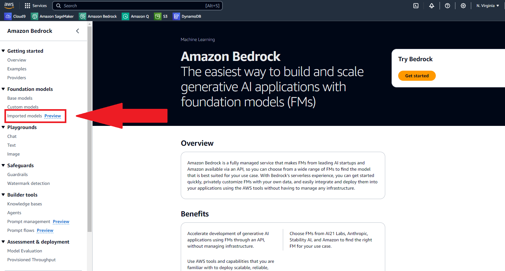
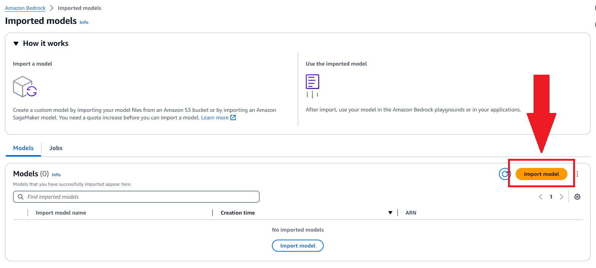
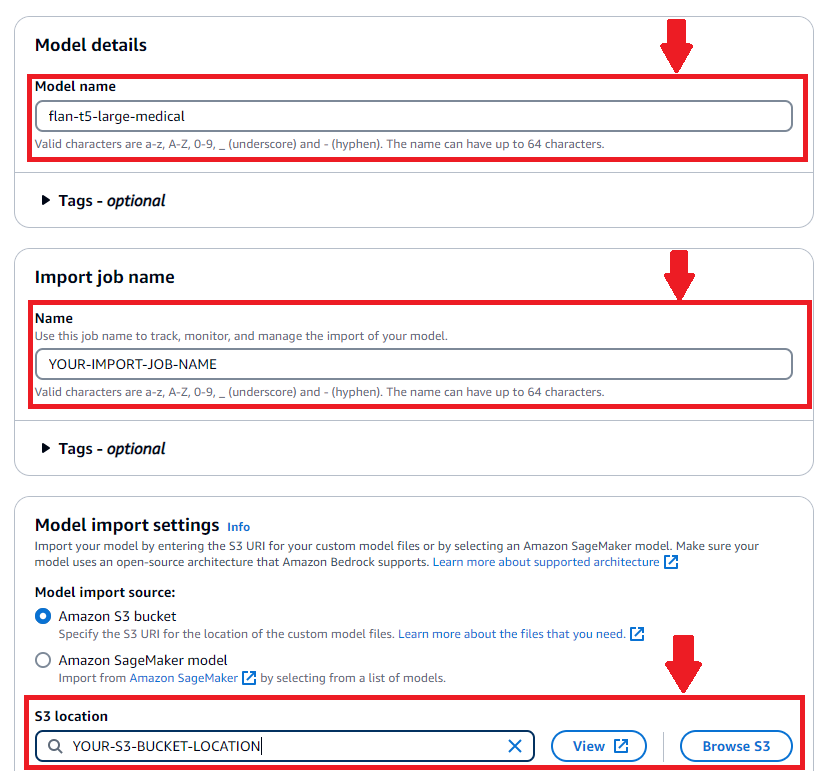
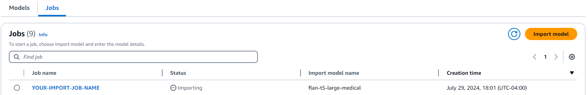
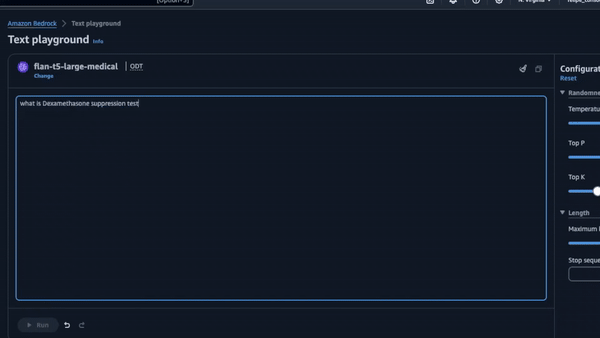
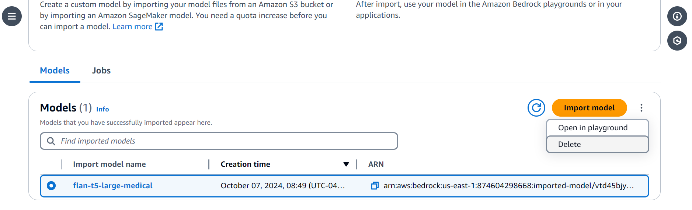

---
tags:
    - CMI-Example
---

<h1> Fine tuning & deploying Flan-T5-Large to Amazon Bedrock using Custom Model Import (Using PEFT & SFTTrainer) </h1>

[Open notebook in github](https://github.com/aws-samples/amazon-bedrock-samples/blob/main/custom-models/import_models/flan-t5/flant5-finetune-medical-terms.ipynb)

<h2> Overview </h2>

this notebook was tested on a ["g5.12xlarge"](https://aws.amazon.com/ec2/instance-types/g5/) instance. 

This notebook will use the HuggingFace Transformers library to fine tune FLAN-T5-Large. due to the fine tuning process being "local" you can run this notebook anywhere as long as the proper compute is available. 

This notebook covers the step by step process of fine tuning a [FLAN-T5 large](https://huggingface.co/google/flan-t5-large) mode and deploying it using Bedrock's [Custom Model Import](https://docs.aws.amazon.com/bedrock/latest/userguide/model-customization-import-model.html) feature. 
The fine tuning data we will be using is based on medical terminology this data can be found on HuggingFace [here](https://huggingface.co/datasets/gamino/wiki_medical_terms). In many discplines, industry specific jargon is used and an LLM may not have the correct understanding of words, context or abbreviations. By fine tuning a model on medical terminology in this case, the LLM is given the ability to understand specific jargon and answer questions the user might have. 

<h2> Amazon Bedrock Custom Model Import (CMI) </h2>

The resulting model files are imported into Amazon Bedrock via [Custom Model Import (CMI)](https://docs.aws.amazon.com/bedrock/latest/userguide/model-customization-import-model.html). 

Bedrock Custom Model Import allows for importing foundation models that have been customized in other environments outside of Amazon Bedrock, such as Amazon Sagemaker, EC2, etc. 

<h2> Use Case </h2>

Often times the broad knowledge of Foundation Models allows for usage in multiple use cases. In some workflows, where domain specific jargon is required, out of the box foundation models may not be sufficient in recognizing or defining terms. In this example the model will be finetuned on Medical Terminology, to be able to recognize & define medical domain specific terms. A customized model such as this can be useful for patients who may receive a diagnosis and need it broken down in simpler, everyday terms. This type of customized model could even help medical students while they study.    

<h2> What will you learn from this notebook </h2>

In this notebook, you will learn how to:

* Pull a model from the HuggingFace Hub & quantize it
* Pull a dataset from HuggingFace & Process it 
* Finetune the model (Flan-T5)
* Deploy the finetuned model to Amazon Bedrock Custom Import & Conduct Inference

<h2> Architectural pattern </h2>


As can be seen from the diagram above, the dataset & model (Flan-T5) get pulled from the HuggingFace hub, and are finetuned on a Jupyter Notebook. The model files are then stored in an S3 bucket, to then be imported into Amazon Bedrock. This architecture is modular because the Notebook can be run anywhere, that the appropriate compute is available (as explained earlier).

<h2> Flan-T5 </h2>

Flan-T5 is the model we will be finetuning in this notebook. Flan-T5 is an efficient smaller model that is easy to use, and easy to deploy with Bedrock Custom Model Import. It is a Sequence to Sequence (Seq2Seq) model which uses an encoder-decoder architecture. What this means is this model processes in two parts - processes inputs with the encoder, and processes outputs with the decoder. This two part process allows models like Flan-T5 to be efficient in tasks like summarization, translation, and Q & A.    

<h2> Prerequisites </h2>

Before you can use Amazon Bedrock, you must carry out the following steps:

- Sign up for an AWS account (if you don't already have one) and IAM Role with the necessary permissions for Amazon Bedrock, see [AWS Account and IAM Role](https://docs.aws.amazon.com/bedrock/latest/userguide/getting-started.html#new-to-aws)

Depending on where you want to run your compute you can set up the following: 

1. Configuring an AWS EC2 instance with a Deep Learning AMI, and setting up a Jupyter Server: [Link](https://docs.aws.amazon.com/dlami/latest/devguide/launch-config.html)
2. Configuring an Amazon Sagemaker environment: [Link](https://docs.aws.amazon.com/sagemaker/latest/dg/gs.html)
3. Configure your own environment, with equivalent compute

<h2> Notebook code with comments </h2>

<h3> Installs </h3>

we will be utilizing HuggingFace Transformers library to pull a pretrained model from the Hub and fine tune it. The dataset we will be finetuning on will also be pulled from HuggingFace

```python
%pip install transformers --quiet
%pip install torch
%pip install -U bitsandbytes accelerate transformers peft trl
%pip install datasets --quiet
%pip install sentencepiece --quiet
```

<h3> Imports </h3>

Import the libraries installed above

```python
import bitsandbytes
import torch
from transformers import BitsAndBytesConfig, T5ForConditionalGeneration, T5Tokenizer, TrainingArguments
from transformers import DataCollatorForSeq2Seq
import accelerate
from datasets import load_dataset
from peft import LoraConfig
from trl import SFTTrainer
import torch
```

<h3> Pull a pre-trained model from HuggingFace </h3>

as mentioned at the beginning of the notebook, we will be fine tuning google's FLAN-t5-large from HuggingFace. This model is free to pull - no HuggingFace account needed.

The model is loaded with the "bitsandbytes" library. This allows the model to be quantized in 4-bit, to set it up for fine tuning with QLoRA

```python
bnb_config = BitsAndBytesConfig(
    load_in_4bit=True,
    bnb_4bit_quant_type="nf4",
    bnb_4bit_compute_dtype=torch.bfloat16,
    bnb_4bit_use_double_quant=True,
    bnb_4bit_quant_storage=torch.bfloat16,
)

#Set Model Attributes

model_name = "google/flan-t5-large"

model = T5ForConditionalGeneration.from_pretrained(
    model_name,
    quantization_config=bnb_config,
    torch_dtype=torch.bfloat16,
)
tokenizer = T5Tokenizer.from_pretrained(model_name)
data_collator = DataCollatorForSeq2Seq(tokenizer=tokenizer, model=model)
```

<h3> Pull a dataset from HuggingFace </h3> 

The dataset we are pulling can be looked at [here](https://huggingface.co/datasets/gamino/wiki_medical_terms). This is a dataset containing over 6000+ medical terms, and their wiki definitions. 

Since the model is being trained to recognize & understand medical terminology, with the function below the dataset will be converted to a Q & A format. "What is" is added as a prefix to the medical terms column, and the other column stays as the definition.

One important aspect here is ensuring the "padding=True" argument is passed. This is needed when training a FLAN-T5 model with QLoRA

```python
#Load data from huggingface
ds = load_dataset("gamino/wiki_medical_terms")

#Using 70% of the dataset to train
ds = ds["train"].train_test_split(test_size=0.3)

#Process data to fit a Q & A format 
prefix = "What is "

# Define the preprocessing function

def preprocess_function(examples):
   """Add prefix to the sentences, tokenize the text, and set the labels"""
   # Transform page title into an answer:
   inputs = [prefix + doc for doc in examples["page_title"]]
   model_inputs = tokenizer(inputs, max_length=128, truncation=True, padding=True)
  
   # keep explanations as is:
   labels = tokenizer(text_target=examples["page_text"], 
                      max_length=512, truncation=True, padding=True)

   model_inputs["labels"] = labels["input_ids"]
   return model_inputs

# Map the preprocessing function across our dataset
ds = ds.map(preprocess_function, batched=True)
#Take the training portion of the dataset
ds = ds["train"]
```

<h3> Set up PEFT training parameters </h3>

In the first cell below, the PEFT configurations are being set up. The term PEFT has been mentioned a couple of times in this notebook already, but what is it? PEFT stands for Parameter Efficient Fine Tuning. It allows the majority of the model parameters to be frozen, and only fine tune a small number of them. This technique decreases computation & storage costs, without performance suffering. Read more about HuggingFace's PEFT library [here](https://huggingface.co/docs/peft/en/index) 

```python
#Set up PEFT Configurations 
peft_config = LoraConfig(
    lora_alpha=16,
    lora_dropout=0.1,
    r=64,
    bias="none",
    task_type="SEQ_2_SEQ_LM",
    target_modules="all-linear",
)
```

<h3> Set up SFT trainer parameters </h3>

In this cell all training parameters are being passed into the "SFTTrainer" class. This is HuggingFace's Supervised Finetuning Trainer. Since the dataset has been prepared as Q & A pairs this is the appropriate trainer class to use. More can be read about SFTTrainer [here](https://huggingface.co/docs/trl/en/sft_trainer) 

Note: Training is set to 1 epoch. This is for a faster training time to showcase Bedrock Custom Model Import. If you require fine tuning with higher performance, consider increasing the epochs & optimizing hyperparameters passed

```python
#Pass all parameters to SFTTrainer
trainer = SFTTrainer(
    model=model,
    train_dataset=ds,
    peft_config=peft_config,
    dataset_text_field="text",
    tokenizer=tokenizer,
    data_collator=data_collator,
    args= TrainingArguments(
        output_dir="./results",
        per_device_train_batch_size = 1,
        num_train_epochs=1,
        gradient_accumulation_steps=2,
        eval_accumulation_steps=2
    ),
)
```

<h3> Start model training </h3>

In the first cell we empty the pytorch cache to free as much memory on the device possible. In the next cell, "trainer.train()" actually stars the training job.

In the training parameters passed, the line output_dir="./results" saves the model checkpoints into the "results" folder in the device directory (creates it if not already created). The final model is in this directory as "checkpoint-XXX" - XXX being the largest number. 

This training job will take approx. 30 mins 

```python
#Empty pytorch cache
torch.cuda.empty_cache()
trainer.train()
```

<h3> Model Inference </h3>

We will now take our latest checkpoint and generate text with it to ensure it is working properly

```python
#Model Inference 
last_checkpoint = "./results/checkpoint-600" #Load checkpoint that you want to test 

finetuned_model = T5ForConditionalGeneration.from_pretrained(last_checkpoint)
tokenizer = T5Tokenizer.from_pretrained(last_checkpoint)

med_term = "what is Dexamethasone suppression test" 

query = tokenizer(med_term, return_tensors="pt")
output = finetuned_model.generate(**query, max_length=512, no_repeat_ngram_size=True)
answer = tokenizer.decode(output[0])

print(answer)
```
<h3> Model Upload </h3> 

with out model now generating text related to medical terminology we will now upload it to S3 to ensure readiness for Bedrock Custom Model Import. Depending on the environment you have chosen to run this notebook in, your AWS credentials will have to be initialized to upload the model files to your S3 bucket of choice. 

```python
#Upload model to S3 Bucket
import boto3
import os
# Set up S3 client
s3 = boto3.client('s3')

# Specify your S3 bucket name and the prefix (folder) where you want to upload the files
bucket_name = 'your-bucket-here'#YOU BUCKET HERE
model_name = "results/checkpoint-#" #YOUR LATEST CHECKPOINT HERE (this will be in the "results" folder in your notebook directory replace the "#" with the latest checkpoint number)
prefix = 'flan-t5-large-medical/' + model_name

# Upload files to S3
def upload_directory_to_s3(local_directory, bucket, s3_prefix):
    for root, dirs, files in os.walk(local_directory):
        for file in files:
            local_path = os.path.join(root, file)
            relative_path = os.path.relpath(local_path, local_directory)
            s3_path = os.path.join(s3_prefix, relative_path)
            
            print(f'Uploading {local_path} to s3://{bucket}/{s3_path}')
            s3.upload_file(local_path, bucket, s3_path)

# Call the function to upload the downloaded model files to S3
upload_directory_to_s3(model_name, bucket_name, prefix)
```

<h3> Importing Model to Amazon Bedrock </h3>

Now that our model artifacts are uploaded into an S3 bucket, we can import it into Amazon Bedrock 

in the AWS console, we can go to the Amazon Bedrock page. On the left side under "Foundation models" we will click on "Imported models"




You can now click on "Import model"



In this next step you will have to configure:

1. Model Name 
2. Import Job Name 
3. Model Import Settings 
    a. Select Amazon S3 bucket 
    b. Select your bucket location (uploaded in the previous section)
4. Create a IAM role, or use an existing one (not shown in image)
5. Click Import (not shown in image)




You will now be taken to the page below. Your model may take up to an hour to import. 



After your model imports you will then be able to test it via the playground or API! 



<h3> Clean Up </h3>

You can delete your Imported Model in the console as shown in the image below:



Ensure to shut down your instance/compute that you have run this notebook on.

**END OF NOTEBOOK**