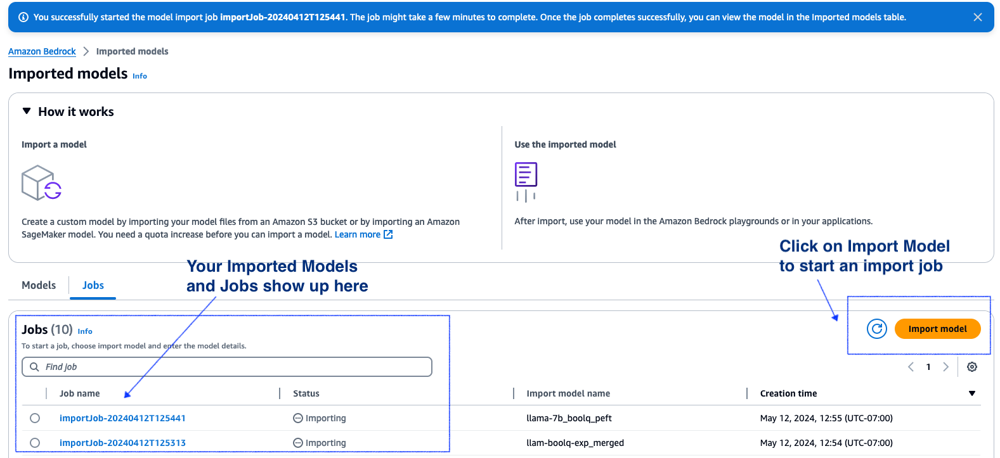
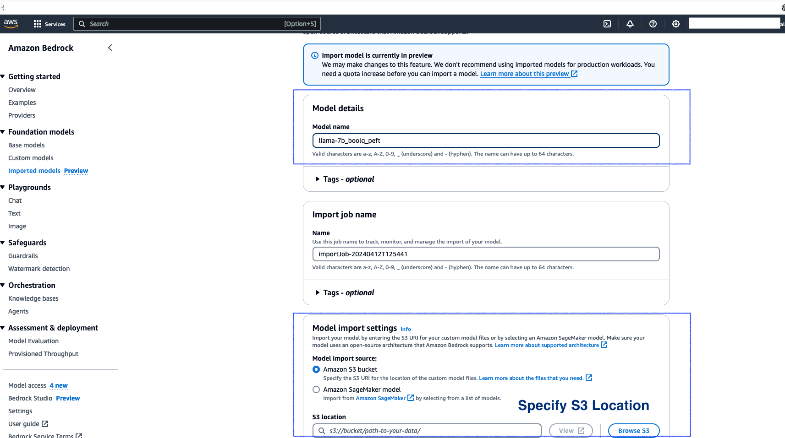
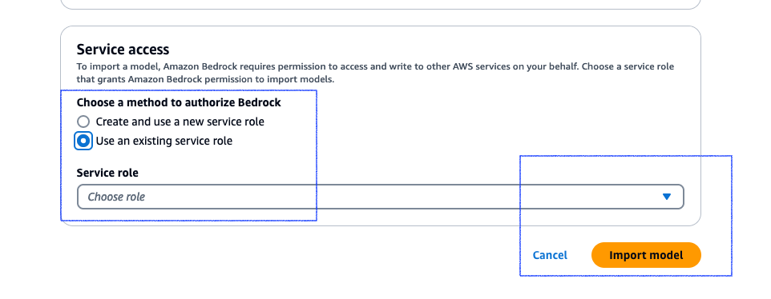

<h1> Fine-Tuning LLaMA 2: A Step-by-Step Instructional Guide and then import into Bedrock </h1>

<h2> Overview </h2>

In this tutorial, we will fine-tune LlaMA 2 so it can summarize customer support tickets. This will be done by using SFTTrainer from HuggingFace, and the BoolQ dataset pulled from the HuggingFace hub. 

This notebook will use the HuggingFace Transformers library to fine tune LLaMA 2. due to the fine tuning process being "local" you can run this notebook anywhere as long as the proper compute is available. 

1. Configuring an AWS EC2 instance with a Deep Learning AMI, and setting up a Jupyter Server: [Link](https://docs.aws.amazon.com/dlami/latest/devguide/launch-config.html)
2. Configuring an Amazon Sagemaker environment: [Link](https://docs.aws.amazon.com/sagemaker/latest/dg/gs.html)
3. Configure your own environment, with equivalent compute

For this tutorial, 4 A10 High-RAM GPUs were used, which provided robust performance for running the the model. 

<h2> Usecase </h2>

BoolQ is a question answering dataset for yes/no questions. This will allow the model to be optimized for answering user questions. this philosophy can be extrapolated to all Q & A datasets. If the LLM answers need to be standardized Supervised fine tuning is an excellent choice. 

<h2> Amazon Bedrock Custom Model Import (CMI) </h2>

The resulting model files are imported into Amazon Bedrock via [Custom Model Import (CMI)](https://docs.aws.amazon.com/bedrock/latest/userguide/model-customization-import-model.html). 

Bedrock Custom Model Import allows for importing foundation models that have been customized in other environments outside of Amazon Bedrock, such as Amazon Sagemaker, EC2, etc. 

<h2> Pre-requisites </h2>

Below are the commands to install the essential libraries:

*   The keys steps are :
1. Run the training job 
2. Save the LORA peft weights as safetensors
3. Load and Merge with the base adapter and save it to a folder as safetensors
4. Upload the merged weights to S3
5. Run the Import jobs in Bedrock

<h2> Notebook code with comments: </h2>

<h3> Install the essential libraries </h3>


```python
!pip install -q accelerate peft bitsandbytes transformers==4.38.2 trl==0.7.10 torch==2.1.1
```


```python
!pip install tensorboard safetensors
```

<h3> We will use the BoolQ data set and the SFTTrainer from HuggingFace </h3>


```python
import os
import torch
from datasets import load_dataset, Dataset
from transformers import (
    AutoModelForCausalLM,
    AutoTokenizer,
    BitsAndBytesConfig,
    HfArgumentParser,
    TrainingArguments,
    pipeline,
    logging,
)
from peft import LoraConfig, PeftModel
from trl import SFTTrainer
from safetensors.torch import save_model

```

<h3> Change the cache location to match your local set up -- below is an example location </h3>


```python
hf_cache_dir='/home/ubuntu/sm/cache/huggingface/hub'
!mkdir -p {hf_cache_dir}
import os
os.environ['TRANSFORMERS_CACHE'] = hf_cache_dir
os.environ['HF_HOME'] = hf_cache_dir
os.environ['HF_DATASETS_CACHE'] = hf_cache_dir
os.environ['TORCH_HOME'] = hf_cache_dir
!export TRANSFORMERS_CACHE=/home/ubuntu/sm/cache/huggingface/hub
!export HF_HOME=/home/ubuntu/sm/cache/huggingface/hub
!export HF_DATASETS_CACHE=/home/ubuntu/sm/cache/huggingface/hub
!export TORCH_HOME=/home/ubuntu/sm/cache/huggingface/hub
```

    huggingface/tokenizers: The current process just got forked, after parallelism has already been used. Disabling parallelism to avoid deadlocks...
    To disable this warning, you can either:
    	- Avoid using `tokenizers` before the fork if possible
    	- Explicitly set the environment variable TOKENIZERS_PARALLELISM=(true | false)
    huggingface/tokenizers: The current process just got forked, after parallelism has already been used. Disabling parallelism to avoid deadlocks...
    To disable this warning, you can either:
    	- Avoid using `tokenizers` before the fork if possible
    	- Explicitly set the environment variable TOKENIZERS_PARALLELISM=(true | false)
    huggingface/tokenizers: The current process just got forked, after parallelism has already been used. Disabling parallelism to avoid deadlocks...
    To disable this warning, you can either:
    	- Avoid using `tokenizers` before the fork if possible
    	- Explicitly set the environment variable TOKENIZERS_PARALLELISM=(true | false)
    huggingface/tokenizers: The current process just got forked, after parallelism has already been used. Disabling parallelism to avoid deadlocks...
    To disable this warning, you can either:
    	- Avoid using `tokenizers` before the fork if possible
    	- Explicitly set the environment variable TOKENIZERS_PARALLELISM=(true | false)
    huggingface/tokenizers: The current process just got forked, after parallelism has already been used. Disabling parallelism to avoid deadlocks...
    To disable this warning, you can either:
    	- Avoid using `tokenizers` before the fork if possible
    	- Explicitly set the environment variable TOKENIZERS_PARALLELISM=(true | false)


<h3> Optional Download the model -- </h3>

**From HuggingFace TheBloke/Llama-2-7b-fp16**


```python
from huggingface_hub import snapshot_download
from pathlib import Path
import os

# - This will download the model into the current directory where ever the jupyter notebook is running
local_model_path = Path("/home/ubuntu/sm/llama_train/llama-7b")
local_model_path.mkdir(exist_ok=True)
model_name = "TheBloke/Llama-2-7b-fp16"
# Only download pytorch checkpoint files
allow_patterns = ["*.json", "*.txt", "*.model", "*.safetensors", "*.bin", "*.chk", "*.pth", "*.py"]

# - Leverage the snapshot library to donload the model since the model is stored in repository using LFS
# model_download_path = snapshot_download(
#     repo_id=model_name, cache_dir=local_model_path, allow_patterns=allow_patterns
# )
# print(model_download_path)
#
#- Identify the snapshot id
# model_download_path='/home/ubuntu/SageMaker/models/llama/llama-7b/models--TheBloke--Llama-2-7b-fp16/snapshots/ba2306439903c2ebf7d09970a973ef44d1402239'
# print(model_download_path)

# model_loc = "/home/ubuntu/sm/llama_train/llama-7b/actual_model/"
# !cp -L {model_download_path}/* {model_loc} --recursive
# !ls -alrt {model_loc}
```

<h3> Continue the training </h3>

<h3> You can alternately set the model_loc to be </h3>

**TheBloke/Llama-2-7b-fp16 or use the actual path to the downloaded weights** 


```python
#- base model loc -
model_loc = "/home/ubuntu/sm/llama_train/llama-7b/actual_model/"
```

<h3> Configurations </h3>

The lora peft values. Please note these are just for sample and not for production use case. We will save the trained model under llama-2-7b-boolq and then merge the weights


```python

def create_model_and_tokenizer(model_loc, bnb_config):


    model = AutoModelForCausalLM.from_pretrained(
        model_loc,
        cache_dir=hf_cache_dir,
        use_safetensors=True,
        quantization_config=bnb_config,
        trust_remote_code=True,
        device_map="auto",
        torch_dtype=torch.float16 #torch.float32, # - float16 
    )
    
    model.config.use_cache = False
    model.config.pretraining_tp = 1

    tokenizer = AutoTokenizer.from_pretrained(model_loc)
    tokenizer.pad_token = tokenizer.eos_token
    tokenizer.padding_side = "right"


    return model, tokenizer
```


```python
# The model that you want to train from the Hugging Face hub
#model_name = "NousResearch/llama-2-7b-chat-hf"

# The instruction dataset to use
dataset_name = "google/boolq"

# Fine-tuned model name
new_model = "llama-2-7b-boolq"

################################################################################
# QLoRA parameters
################################################################################

# LoRA attention dimension
lora_r = 64

# Alpha parameter for LoRA scaling
lora_alpha = 16

# Dropout probability for LoRA layers
lora_dropout = 0.1

################################################################################
# bitsandbytes parameters
################################################################################

# Activate 4-bit precision base model loading
use_4bit = True

# Compute dtype for 4-bit base models
bnb_4bit_compute_dtype = "float16"

# Quantization type (fp4 or nf4)
bnb_4bit_quant_type = "nf4"

# Activate nested quantization for 4-bit base models (double quantization)
use_nested_quant = False

################################################################################
# TrainingArguments parameters
################################################################################

# Output directory where the model predictions and checkpoints will be stored
output_dir = "./results"

! rm -rf ./results

# Number of training epochs
num_train_epochs = 1

# Enable fp16/bf16 training (set bf16 to True with an A100)
fp16 = False
bf16 = False

# Batch size per GPU for training
per_device_train_batch_size = 4

# Batch size per GPU for evaluation
per_device_eval_batch_size = 4

# Number of update steps to accumulate the gradients for
gradient_accumulation_steps = 1

# Enable gradient checkpointing
gradient_checkpointing = True

# Maximum gradient normal (gradient clipping)
max_grad_norm = 0.3

# Initial learning rate (AdamW optimizer)
learning_rate = 2e-4

# Weight decay to apply to all layers except bias/LayerNorm weights
weight_decay = 0.001

# Optimizer to use
optim = "paged_adamw_32bit"

# Learning rate schedule (constant a bit better than cosine)
lr_scheduler_type = "constant"

# Number of training steps (overrides num_train_epochs)
max_steps = -1

# Ratio of steps for a linear warmup (from 0 to learning rate)
warmup_ratio = 0.03

# Group sequences into batches with same length
# Saves memory and speeds up training considerably
group_by_length = True

# Save checkpoint every X updates steps
save_steps = 25

# Log every X updates steps
logging_steps = 25

################################################################################
# SFT parameters
################################################################################

# Maximum sequence length to use
max_seq_length = None

# Pack multiple short examples in the same input sequence to increase efficiency
packing = False

# OPTIONAL depending on Instance Type Load the entire model on the GPU 0
#device_map = {"": 0}
```

    huggingface/tokenizers: The current process just got forked, after parallelism has already been used. Disabling parallelism to avoid deadlocks...
    To disable this warning, you can either:
    	- Avoid using `tokenizers` before the fork if possible
    	- Explicitly set the environment variable TOKENIZERS_PARALLELISM=(true | false)


<h3> Load the data set </h3>

we are using Boolq


```python
#Process dataset
boolq_dataset = load_dataset(dataset_name, split="train")
def process_dataset(dataset):
    processed_data = []

    for row in dataset:
        question = row['question']
        answer = row['answer']
        passage = row['passage']

        system_prompt = f"Context: {passage}"
        user_message = f"Question: {question}"
        model_answer = answer

        formatted_example = f"<s>[INST] <<SYS>>{system_prompt}<</SYS>>{user_message} [/INST] {model_answer} </s>"
        processed_data.append({"text": formatted_example})

    return processed_data
#Create list of dictionaries from the dataset. Dataset class expects list of dictionaries
dataset_list = process_dataset(boolq_dataset)

# Create a Dataset Object
dataset = Dataset.from_list(dataset_list)
```


```python
# Load dataset (you can process it here)
#dataset = load_dataset(dataset_name, split="train")

# Load tokenizer and model with QLoRA configuration
compute_dtype = getattr(torch, bnb_4bit_compute_dtype)

bnb_config = BitsAndBytesConfig(
    load_in_4bit=use_4bit,
    bnb_4bit_quant_type=bnb_4bit_quant_type,
    bnb_4bit_compute_dtype=compute_dtype,
    bnb_4bit_use_double_quant=use_nested_quant,
)

# Check GPU compatibility with bfloat16
if compute_dtype == torch.float16 and use_4bit:
    major, _ = torch.cuda.get_device_capability()
    if major >= 8:
        print("=" * 80)
        print("Your GPU supports bfloat16: accelerate training with bf16=True")
        print("=" * 80)

# Load base model
# model = AutoModelForCausalLM.from_pretrained(
#     model_name,
#     quantization_config=bnb_config,
#     device_map="auto"
# )
# model.config.use_cache = False
# model.config.pretraining_tp = 1

# # Load LLaMA tokenizer
# tokenizer = AutoTokenizer.from_pretrained(model_name, trust_remote_code=True)
# tokenizer.pad_token = tokenizer.eos_token
# tokenizer.padding_side = "right" # Fix weird overflow issue with fp16 training

model, tokenizer = create_model_and_tokenizer(model_loc,bnb_config)

# Load LoRA configuration
peft_config = LoraConfig(
    lora_alpha=lora_alpha,
    lora_dropout=lora_dropout,
    r=lora_r,
    bias="none",
    task_type="CAUSAL_LM",
)

# Set training parameters
training_arguments = TrainingArguments(
    output_dir=output_dir,
    num_train_epochs=num_train_epochs,
    per_device_train_batch_size=per_device_train_batch_size,
    gradient_accumulation_steps=gradient_accumulation_steps,
    optim=optim,
    save_steps=save_steps,
    logging_steps=logging_steps,
    learning_rate=learning_rate,
    weight_decay=weight_decay,
    fp16=fp16,
    bf16=bf16,
    max_grad_norm=max_grad_norm,
    max_steps=max_steps,
    warmup_ratio=warmup_ratio,
    group_by_length=group_by_length,
    lr_scheduler_type=lr_scheduler_type,
    report_to="tensorboard"
)

# Set supervised fine-tuning parameters
trainer = SFTTrainer(
    model=model,
    train_dataset=dataset,
    peft_config=peft_config,
    dataset_text_field="text",
    max_seq_length=max_seq_length,
    tokenizer=tokenizer,
    args=training_arguments,
    packing=packing,
)

# Train model
trainer.train()

# Save trained model as .bin
#trainer.model.save_pretrained(new_model)

#save model as safetensors
#save_model(trainer.model, new_model)
```

<h3> Print the location of the new saved Peft Weights and save it in safetensors format </h3>


```python
new_model
```


    'llama-2-7b-boolq'


```python
trainer.model.save_pretrained(new_model, safe_serialization=True) # saves the peft weights
```

    /home/ubuntu/sm/virtualenv/trainenv/lib/python3.10/site-packages/peft/utils/save_and_load.py:148: UserWarning: Could not find a config file in /home/ubuntu/sm/llama_train/llama-7b/actual_model/ - will assume that the vocabulary was not modified.
      warnings.warn(


```python
! ls -alrt {new_model}
```

    huggingface/tokenizers: The current process just got forked, after parallelism has already been used. Disabling parallelism to avoid deadlocks...
    To disable this warning, you can either:
    	- Avoid using `tokenizers` before the fork if possible
    	- Explicitly set the environment variable TOKENIZERS_PARALLELISM=(true | false)


    total 67884
    -rw-rw-r--  1 ubuntu ubuntu     1061 May 12 00:34 tokenizer_config.json
    -rw-rw-r--  1 ubuntu ubuntu   499723 May 12 00:34 tokenizer.model
    -rw-rw-r--  1 ubuntu ubuntu      434 May 12 00:34 special_tokens_map.json
    -rw-rw-r--  1 ubuntu ubuntu       21 May 12 00:34 added_tokens.json
    -rw-rw-r--  1 ubuntu ubuntu  1842945 May 12 00:34 tokenizer.json
    -rw-rw-r--  1 ubuntu ubuntu      712 May 12 00:34 config.json
    drwxrwxr-x  2 ubuntu ubuntu     4096 May 12 00:34 .
    drwxrwxr-x 27 ubuntu ubuntu     4096 May 12 01:01 ..
    -rw-rw-r--  1 ubuntu ubuntu     5126 May 12 01:40 README.md
    -rw-rw-r--  1 ubuntu ubuntu 67126104 May 12 01:40 adapter_model.safetensors
    -rw-rw-r--  1 ubuntu ubuntu      625 May 12 01:40 adapter_config.json


<h3> Merge the weights and save to local location </h3>

The steps:
1. Load from the saved weights. this loads peft and the base weights
2. run merge_and_unload()
3. Save these in a new folder


```python
from peft import AutoPeftModelForCausalLM
from transformers import AutoTokenizer
import sys
import torch
import shutil


# merge base + LoRa models and save the model
trained_model = AutoPeftModelForCausalLM.from_pretrained(
    new_model,
    # low_cpu_mem_usage=True,
    # torch_dtype=torch.bfloat16
)

    
shutil.rmtree("./llama2_boolq_peft_merged_model", ignore_errors=True)
os.makedirs("./llama2_boolq_peft_merged_model", exist_ok=True)

print("./llama2_boolq_peft_merged_model")

merged_model = trained_model.merge_and_unload()
merged_model.save_pretrained("./llama2_boolq_peft_merged_model", safe_serialization=True)
tokenizer.save_pretrained("./llama2_boolq_peft_merged_model")

!ls -alrt ./llama2_boolq_peft_merged_model
```


    Loading checkpoint shards:   0%|          | 0/2 [00:00<?, ?it/s]


    ./llama2_boolq_peft_merged_model


    huggingface/tokenizers: The current process just got forked, after parallelism has already been used. Disabling parallelism to avoid deadlocks...
    To disable this warning, you can either:
    	- Avoid using `tokenizers` before the fork if possible
    	- Explicitly set the environment variable TOKENIZERS_PARALLELISM=(true | false)


    total 26324356
    drwxrwxr-x 27 ubuntu ubuntu       4096 May 12 01:40 ..
    -rw-rw-r--  1 ubuntu ubuntu        132 May 12 01:40 generation_config.json
    -rw-rw-r--  1 ubuntu ubuntu        731 May 12 01:40 config.json
    -rw-rw-r--  1 ubuntu ubuntu 4840412800 May 12 01:40 model-00001-of-00006.safetensors
    -rw-rw-r--  1 ubuntu ubuntu 4857206856 May 12 01:40 model-00002-of-00006.safetensors
    -rw-rw-r--  1 ubuntu ubuntu 4857206904 May 12 01:40 model-00003-of-00006.safetensors
    -rw-rw-r--  1 ubuntu ubuntu 4857206904 May 12 01:40 model-00004-of-00006.safetensors
    -rw-rw-r--  1 ubuntu ubuntu 4857206904 May 12 01:41 model-00005-of-00006.safetensors
    -rw-rw-r--  1 ubuntu ubuntu 2684488496 May 12 01:41 model-00006-of-00006.safetensors
    -rw-rw-r--  1 ubuntu ubuntu        871 May 12 01:41 tokenizer_config.json
    -rw-rw-r--  1 ubuntu ubuntu     499723 May 12 01:41 tokenizer.model
    -rw-rw-r--  1 ubuntu ubuntu        434 May 12 01:41 special_tokens_map.json
    -rw-rw-r--  1 ubuntu ubuntu      23950 May 12 01:41 model.safetensors.index.json
    -rw-rw-r--  1 ubuntu ubuntu    1842863 May 12 01:41 tokenizer.json
    drwxrwxr-x  2 ubuntu ubuntu       4096 May 12 01:41 .


```python
!ls -alrt ./llama2_boolq_peft_merged_model
```

    huggingface/tokenizers: The current process just got forked, after parallelism has already been used. Disabling parallelism to avoid deadlocks...
    To disable this warning, you can either:
    	- Avoid using `tokenizers` before the fork if possible
    	- Explicitly set the environment variable TOKENIZERS_PARALLELISM=(true | false)


    total 26324376
    drwxrwxr-x 27 ubuntu ubuntu       4096 May 12 01:40 ..
    -rw-rw-r--  1 ubuntu ubuntu        132 May 12 01:40 generation_config.json
    -rw-rw-r--  1 ubuntu ubuntu        731 May 12 01:40 config.json
    -rw-rw-r--  1 ubuntu ubuntu 4840412800 May 12 01:40 model-00001-of-00006.safetensors
    -rw-rw-r--  1 ubuntu ubuntu 4857206856 May 12 01:40 model-00002-of-00006.safetensors
    -rw-rw-r--  1 ubuntu ubuntu 4857206904 May 12 01:40 model-00003-of-00006.safetensors
    -rw-rw-r--  1 ubuntu ubuntu 4857206904 May 12 01:40 model-00004-of-00006.safetensors
    -rw-rw-r--  1 ubuntu ubuntu 4857206904 May 12 01:41 model-00005-of-00006.safetensors
    -rw-rw-r--  1 ubuntu ubuntu 2684488496 May 12 01:41 model-00006-of-00006.safetensors
    -rw-rw-r--  1 ubuntu ubuntu        871 May 12 01:41 tokenizer_config.json
    -rw-rw-r--  1 ubuntu ubuntu     499723 May 12 01:41 tokenizer.model
    -rw-rw-r--  1 ubuntu ubuntu        434 May 12 01:41 special_tokens_map.json
    -rw-rw-r--  1 ubuntu ubuntu      23950 May 12 01:41 model.safetensors.index.json
    -rw-rw-r--  1 ubuntu ubuntu    1842863 May 12 01:41 tokenizer.json
    drwxrwxr-x  2 ubuntu ubuntu       4096 May 12 01:41 .


```python
#Free memory for merging weights
del trainer
torch.cuda.empty_cache()
```


```python
# Ignore warnings
logging.set_verbosity(logging.CRITICAL)
```


```python
# Run text generation pipeline with our next model
prompt = "is the bicuspid valve the same as the mitral valve?"
pipe = pipeline(task="text-generation", model=merged_model, tokenizer=tokenizer, max_length=200)
```


```python
result = pipe(f"<s>[INST] {prompt} [/INST]")
print(result[0]['generated_text'])
```

    <s>[INST] is the bicuspid valve the same as the mitral valve? [/INST] False. The mitral valve is located between the left atrium and the left ventricle, whereas the bicuspid valve is located between the right atrium and the right ventricle.<</</</</</</</</</</</</</</</</</</</</</</</</</</</</</</</</</</</</</</</</</</</</</</</</</</</</</</</</</</</</</</</</</</</</</</</</</</</</</</</</</</</</</</</</</</</</</</</</</</</</</</</</</</</</</</</</</</</</</</</</</</</</</</</</</</</</</</


<h3> Alternate way of creating the merged model. Here </h3>

1. we first load the base model
2. Load the peft model and merge
3. set the config to false to avoid any transformers library issue 
4. Save the merged model


```python
# Reload model in FP16 and merge it with LoRA weights
base_model = AutoModelForCausalLM.from_pretrained(
    model_loc,
    low_cpu_mem_usage=True,
    return_dict=True,
    torch_dtype=torch.float16,
    device_map="auto",
)
```


```python
model = PeftModel.from_pretrained(base_model, new_model)
merged_model = model.merge_and_unload()
```


```python
tokenizer = AutoTokenizer.from_pretrained(model_loc, trust_remote_code=True)
tokenizer.pad_token = tokenizer.eos_token
tokenizer.padding_side = "right"
tokenizer.save_pretrained('./llama2_boolq_peft_merged_model')
merged_model.generation_config.do_sample = True
merged_model.save_pretrained("./llama2_boolq_peft_merged_model", safe_serialization=True)
```


```python
!ls -alrt ./llama2_boolq_peft_merged_model
```

    huggingface/tokenizers: The current process just got forked, after parallelism has already been used. Disabling parallelism to avoid deadlocks...
    To disable this warning, you can either:
    	- Avoid using `tokenizers` before the fork if possible
    	- Explicitly set the environment variable TOKENIZERS_PARALLELISM=(true | false)


    total 26324376
    drwxrwxr-x 27 ubuntu ubuntu       4096 May 12 01:40 ..
    -rw-rw-r--  1 ubuntu ubuntu        132 May 12 01:40 generation_config.json
    -rw-rw-r--  1 ubuntu ubuntu        731 May 12 01:40 config.json
    -rw-rw-r--  1 ubuntu ubuntu 4840412800 May 12 01:40 model-00001-of-00006.safetensors
    -rw-rw-r--  1 ubuntu ubuntu 4857206856 May 12 01:40 model-00002-of-00006.safetensors
    -rw-rw-r--  1 ubuntu ubuntu 4857206904 May 12 01:40 model-00003-of-00006.safetensors
    -rw-rw-r--  1 ubuntu ubuntu 4857206904 May 12 01:40 model-00004-of-00006.safetensors
    -rw-rw-r--  1 ubuntu ubuntu 4857206904 May 12 01:41 model-00005-of-00006.safetensors
    -rw-rw-r--  1 ubuntu ubuntu 2684488496 May 12 01:41 model-00006-of-00006.safetensors
    -rw-rw-r--  1 ubuntu ubuntu        871 May 12 01:41 tokenizer_config.json
    -rw-rw-r--  1 ubuntu ubuntu     499723 May 12 01:41 tokenizer.model
    -rw-rw-r--  1 ubuntu ubuntu        434 May 12 01:41 special_tokens_map.json
    -rw-rw-r--  1 ubuntu ubuntu      23950 May 12 01:41 model.safetensors.index.json
    -rw-rw-r--  1 ubuntu ubuntu    1842863 May 12 01:41 tokenizer.json
    drwxrwxr-x  2 ubuntu ubuntu       4096 May 12 01:41 .


<h3> Copy to S3 location </h3>

**Important** this file assumes you are running the training job on a EC2. Hence we assume a role and then upload to S3. This steps is completely optional and if you run via SageMaker studio you will not need to assume the role and instead just run the s3_upload cells directly

the merged weights are under -- ./llama2_boolq_peft_merged_model


```python
import boto3


boto3_kwargs = {}
```

<h3> This is optional </h3>
**If you are runing the notebook from outise of SageMaker then use the below to so sts:assume role successfully**


```python
import os
import boto3


# os.environ["AWS_ACCESS_KEY_ID"] = "your key"
# os.environ["AWS_SECRET_ACCESS_KEY"] = "your access"
# os.environ["AWS_DEFAULT_REGION"] = "us-east-1"


assumed_role = None # "set to your assume role if needed"

```

**Assume this role using sts to import** 


```python
print(assumed_role)
session = boto3.Session()
if assumed_role:
    sts = session.client("sts")
    response = sts.assume_role(
        RoleArn=str(assumed_role),
        RoleSessionName="langchain-llm-1"
    )
    print(response)
    boto3_kwargs = dict(
        aws_access_key_id=response['Credentials']['AccessKeyId'],
        aws_secret_access_key=response['Credentials']['SecretAccessKey'],
        aws_session_token=response['Credentials']['SessionToken']
    )


```

<h3> Continue the run -- to save the weights into S3 location </h3>

**Important set your bucket and key values**


```python
import os
import boto3

bucket = "your bucket"
key = 'your_key/' # add the rest of the path later on 
```


```python
boto3_sm_client = boto3.client(
    "sagemaker-runtime",
    **boto3_kwargs
)
print(boto3_sm_client)
```

    <botocore.client.SageMakerRuntime object at 0x7f7717c0e950>


```python
s3_client = boto3.client(
    "s3",
    **boto3_kwargs
)
s3_client
```


    <botocore.client.S3 at 0x7f76dce18ac0>


```python
for i in os.listdir('./llama2_boolq_peft_merged_model/'):
    print(i)
```

    model-00006-of-00006.safetensors
    special_tokens_map.json
    model-00001-of-00006.safetensors
    model.safetensors.index.json
    tokenizer.json
    model-00002-of-00006.safetensors
    model-00004-of-00006.safetensors
    generation_config.json
    tokenizer.model
    model-00005-of-00006.safetensors
    model-00003-of-00006.safetensors
    config.json
    tokenizer_config.json


```python
#s3.upoad_file(file_name, bucket, key)

key = f'{key}code_merged/llama7b_boolq'

file_name = './merged_model/*.safetensors'

for one_file in os.listdir('./llama2_boolq_peft_merged_model/'):
    print(one_file)
    uploaded = s3_client.upload_file(f"./llama2_boolq_peft_merged_model/{one_file}", bucket, f"{key}/{one_file}")
    print(uploaded)
```

    model-00006-of-00006.safetensors
    None
    special_tokens_map.json
    None
    model-00001-of-00006.safetensors
    None
    model.safetensors.index.json
    None
    tokenizer.json
    None
    model-00002-of-00006.safetensors
    None
    model-00004-of-00006.safetensors
    None
    generation_config.json
    None
    tokenizer.model
    None
    model-00005-of-00006.safetensors
    None
    model-00003-of-00006.safetensors
    None
    config.json
    None
    tokenizer_config.json
    None


<h3> Now follow the steps from the link below to continue to import this model </h3>

https://docs.aws.amazon.com/bedrock/latest/userguide/model-customization-import-model.html

<h3> The steps to import the Model into Bedrock can be </h3>

1. Login to the Bedrock console on your account
2. Click on the import Model screen, it will bring you the screen as shown below



3. Fill in the details including the S3 location where the weights have been uploaded as shown below



4. Specify the role or create a new one and then click import to run your jobs. You will see the imported jobs in the import jobs list as shown in the 1st image above



Open your model in the Play ground to test it


<h3> Optional - Upload to HuggingFace Hub if needed </h3>


```python
!pip install huggingface_hub
```


```python
from huggingface_hub import notebook_login

```


```python
notebook_login()
```


```python
model.push_to_hub(new_model, use_temp_dir=False, safe_serialization=True)
```


```python
tokenizer.push_to_hub(new_model, use_temp_dir=False)
```

<h3> Clean Up </h3>

You can delete your Imported Model in the console as shown in the image below:


Ensure to shut down your instance/compute that you have run this notebook on.

**END OF NOTEBOOK**
