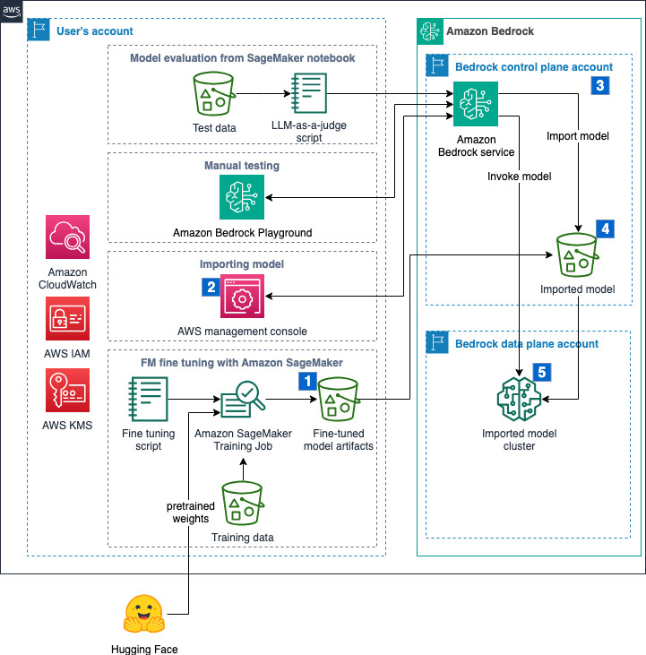
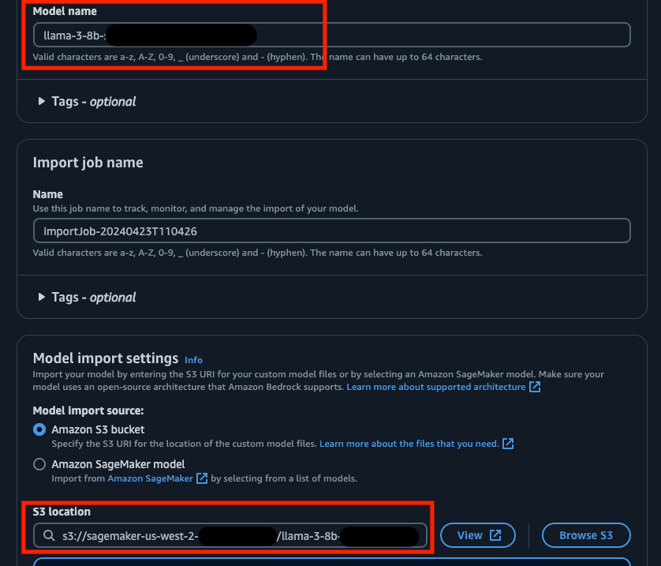
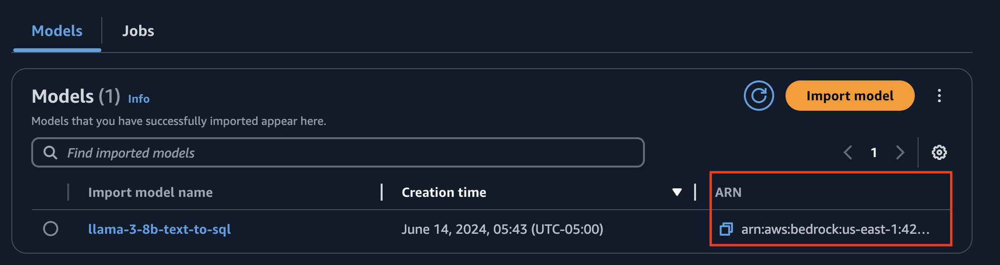
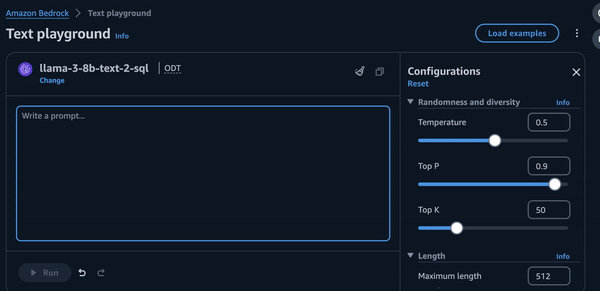

<h1> Fine tuning and deploying Llama 3 8B to Amazon Bedrock using Custom Model Import </h1>

<h2> Overview </h2>

This notebook illustrates the process of fine tuning [Llama 3 8B](https://huggingface.co/meta-llama/Meta-Llama-3-8B) and deploying the custom model in Amazon Bedrock using Custom Model Import (CMI). 

This notebook will use an Amazon SageMaker training job to fine tune Llama 3 8B. The training script uses [PyTorch FSDP](https://pytorch.org/docs/stable/fsdp.html) and QLoRA for parameter efficient fine tuning. Once trained, the adapters are **merged** back into the original model to get an updated set of weights persisted as `safetensors` files (Bedrock custom model import does not support separate LoRA adapters). The resulting files are later imported into Bedrock using the [custom model import](https://docs.aws.amazon.com/bedrock/latest/userguide/model-customization-import-model.html) option.

This notebook is inspired by [Philipp Schmid's Blog](https://www.philschmid.de/fsdp-qlora-llama3).

<h3> Model License Information </h3>

In this notebook we use the Meta Llama 3 model from HuggingFace. This model is a gated model within HuggingFace repository. To use this model you have to agree to the [license agreement](https://llama.meta.com/llama3/license) and request access before the model can be used in this notebook.

<h2> Usecase </h2>

The usecase for this example will be LLM code generation, the code generation scenario will be text to SQL generation, which is sometimes needed to improve the quality of the generated queries or when using a non-standard SQL dialect. The same script can be adapted to other code generation scenarios by changing the fine tuning instructions and the dataset.

<h2> Amazon Bedrock Custom Model Import (CMI) </h2>

The resulting model files are imported into Amazon Bedrock via [Custom Model Import (CMI)](https://docs.aws.amazon.com/bedrock/latest/userguide/model-customization-import-model.html). 

Bedrock Custom Model Import allows for importing foundation models that have been customized in other environments outside of Amazon Bedrock, such as Amazon Sagemaker, EC2, etc. 

<h2> Architecture Diagram </h2>



<h2> Notebook code with comments: </h2>

<h3> Installing pre-requisites </h3>


```python
!pip uninstall autogluon autogluon-multimodal -y
!pip install sagemaker huggingface_hub datasets --upgrade --quiet
```

    WARNING: Skipping autogluon as it is not installed.
    WARNING: Skipping autogluon-multimodal as it is not installed.
    WARNING: Running pip as the 'root' user can result in broken permissions and conflicting behaviour with the system package manager. It is recommended to use a virtual environment instead: https://pip.pypa.io/warnings/venv
    WARNING: Running pip as the 'root' user can result in broken permissions and conflicting behaviour with the system package manager. It is recommended to use a virtual environment instead: https://pip.pypa.io/warnings/venv
    


```python
%pip list | grep -e torch -e datasets
```

    datasets                             2.20.0
    Note: you may need to restart the kernel to use updated packages.


Llama 3 8B is a gated model on the Hugging Face Hub. You will need to request access and then authenticate on this notebook by entering your Hugging Face access token.


```python
from huggingface_hub import notebook_login

notebook_login()
```


    VBox(children=(HTML(value='<center>  Setup </h3>

Loading the information from this SageMaker session.


```python
import sagemaker
import boto3

sess = sagemaker.Session()

sagemaker_session_bucket=None
if sagemaker_session_bucket is None and sess is not None:
    sagemaker_session_bucket = sess.default_bucket()
    
try:
    role = sagemaker.get_execution_role()
except ValueError:
    iam = boto3.client('iam')
    role = iam.get_role(RoleName='sagemaker_execution_role')['Role']['Arn']
    
sess = sagemaker.Session(default_bucket=sagemaker_session_bucket)
 
print(f"sagemaker role arn: {role}")
print(f"sagemaker bucket: {sess.default_bucket()}")
print(f"sagemaker session region: {sess.boto_region_name}")
```

    sagemaker.config INFO - Not applying SDK defaults from location: /etc/xdg/sagemaker/config.yaml
    sagemaker.config INFO - Not applying SDK defaults from location: /root/.config/sagemaker/config.yaml
    sagemaker role arn: arn:aws:iam::425576326687:role/SageMakerStudioDomainNoAuth-SageMakerExecutionRole-3RBLN6GPZ46O
    sagemaker bucket: sagemaker-us-east-1-425576326687
    sagemaker session region: us-east-1


```python
# S3 prefix for fine tuning training data
training_input_path = f's3://{sess.default_bucket()}/datasets/sql-context'
```

<h3> Preparing the data set </h3>

We are going to use the [sql-create-context](https://huggingface.co/datasets/b-mc2/sql-create-context) available on Hugging Face to train this model. The data set contains 78,577 records, and we will use 99% of them for training. The data set has three columns:

- *question*: The question made by a user in natural language
- *content*: Schema of the relevant table(s)
- *answer*: The SQL query

Please refer to the [Licensing Information](https://huggingface.co/datasets/b-mc2/sql-create-context) regarding this dataset before proceeding further.


```python
from datasets import load_dataset, DatasetDict

system_message = """You are a powerful text-to-SQL model. Your job is to answer questions about a database."""

def create_conversation(record):
    sample = {"messages": [
        {"role": "system", "content": system_message + f"""You can use the following table schema for context: {record["context"]}"""},
        {"role": "user", "content": f"""Return the SQL query that answers the following question: {record["question"]}"""},
        {"role" : "assistant", "content": f"""{record["answer"]}"""}
    ]}
    return sample

dataset = load_dataset("b-mc2/sql-create-context")
dataset = dataset.map(create_conversation, batched=False).remove_columns(['answer', 'question', 'context'])

train_test_split = dataset["train"].train_test_split(test_size=0.01, seed=42) # only 1% for testing
# Training and test sets
training_data = train_test_split["train"]
test_data = train_test_split["test"]

training_data.to_json("data/train_dataset.json", orient="records", force_ascii=False)
test_data.to_json("data/test_dataset.json", orient="records", force_ascii=False)
```


    Creating json from Arrow format:   0%|          | 0/78 [00:00<?, ?ba/s]


    Creating json from Arrow format:   0%|          | 0/1 [00:00<?, ?ba/s]


    409031


```python
# Upload train and test data sets to S3
train_s3_path = sagemaker.s3.S3Uploader.upload("data/train_dataset.json", training_input_path)
test_s3_path = sagemaker.s3.S3Uploader.upload("data/test_dataset.json", training_input_path)
print("Training data uploaded to ", train_s3_path)
print("Test data uploaded to ", test_s3_path)
```

<h3> Fine tuning the model </h3>

In this step we are going to fine tune Llama 3 8B using PyTorch FSDP and QLora, with the help of the Hugging Face [TRL](https://huggingface.co/docs/trl/index), [Tranformers](https://huggingface.co/docs/transformers/index), [PEFT](https://huggingface.co/docs/peft/index), and [dadtasets](https://huggingface.co/docs/datasets/index) libraries. The code will be packaged to run inside a SageMaker training job.


```python
model_id = "meta-llama/Meta-Llama-3-8B"
use_bf16 = True  # use bfloat16 precision
```


```python
!rm -rf scripts && mkdir scripts && mkdir scripts/trl
```


```python
%%writefile scripts/trl/requirements.txt
torch==2.2.2
transformers==4.40.2
sagemaker>=2.190.0
datasets==2.18.0
accelerate==0.29.3
evaluate==0.4.1
bitsandbytes==0.43.1
trl==0.8.6
peft==0.10.0
```


```python
%%writefile scripts/trl/run_fsdp_qlora.py
import logging
from dataclasses import dataclass, field
import os

try:
    os.system("pip install flash-attn --no-build-isolation --upgrade")
except:
    print("flash-attn failed to install")

import random
import torch
from datasets import load_dataset
from tqdm import tqdm
from trl.commands.cli_utils import  TrlParser
from transformers import (
    AutoModelForCausalLM,
    AutoTokenizer,
    TrainingArguments,
    HfArgumentParser,
    BitsAndBytesConfig,
        set_seed,

)
from trl import setup_chat_format
from peft import LoraConfig


from trl import (
   SFTTrainer)

# Anthropic/Vicuna like template without the need for special tokens
# Use the same template in inference
LLAMA_3_CHAT_TEMPLATE = (
    ""
        ""
            "{{ message['content'] }}"
        ""
            "{{ '\n\nHuman: ' + message['content'] +  eos_token }}"
        ""
            "{{ '\n\nAssistant: '  + message['content'] +  eos_token  }}"
        ""
    ""
    ""
    "{{ '\n\nAssistant: ' }}"
    ""
)


tqdm.pandas()

@dataclass
class ScriptArguments:
    dataset_path: str = field(
        default=None,
        metadata={
            "help": "Path to the dataset"
        },
    )
    model_id: str = field(
        default=None, metadata={"help": "Model ID to use for SFT training"}
    )
    max_seq_length: int = field(
        default=512, metadata={"help": "The maximum sequence length for SFT Trainer"}
    )
    use_qlora: bool = field(default=False, metadata={"help": "Whether to use QLORA"})
    merge_adapters: bool = field(
        metadata={"help": "Whether to merge weights for LoRA."},
        default=False,
    )


def training_function(script_args, training_args):
    ################
    # Dataset
    ################
    
    train_dataset = load_dataset(
        "json",
        data_files=os.path.join(script_args.dataset_path, "train_dataset.json"),
        split="train",
    )
    test_dataset = load_dataset(
        "json",
        data_files=os.path.join(script_args.dataset_path, "test_dataset.json"),
        split="train",
    )

    ################
    # Model & Tokenizer
    ################

    # Tokenizer        
    tokenizer = AutoTokenizer.from_pretrained(script_args.model_id, use_fast=True)
    tokenizer.pad_token = tokenizer.eos_token
    tokenizer.chat_template = LLAMA_3_CHAT_TEMPLATE
    
    # template dataset
    def template_dataset(examples):
        return{"text":  tokenizer.apply_chat_template(examples["messages"], tokenize=False)}
    
    train_dataset = train_dataset.map(template_dataset, remove_columns=["messages"])
    test_dataset = test_dataset.map(template_dataset, remove_columns=["messages"])
    
    # print random sample
    with training_args.main_process_first(
        desc="Log a few random samples from the processed training set"
    ):
        for index in random.sample(range(len(train_dataset)), 2):
            print(train_dataset[index]["text"])

    # Model    
    torch_dtype = torch.bfloat16 if training_args.bf16 else torch.float32
    quant_storage_dtype = torch.bfloat16

    if script_args.use_qlora:
        print(f"Using QLoRA - {torch_dtype}")
        quantization_config = BitsAndBytesConfig(
                load_in_4bit=True,
                bnb_4bit_use_double_quant=True,
                bnb_4bit_quant_type="nf4",
                bnb_4bit_compute_dtype=torch_dtype,
                bnb_4bit_quant_storage=quant_storage_dtype,
            )
    else:
        quantization_config = None
        
    model = AutoModelForCausalLM.from_pretrained(
        script_args.model_id,
        quantization_config=quantization_config,
        #device_map="auto",
        device_map={'':torch.cuda.current_device()},
        attn_implementation="flash_attention_2", # use sdpa, alternatively use "flash_attention_2"
        torch_dtype=quant_storage_dtype,
        use_cache=False if training_args.gradient_checkpointing else True,  # this is needed for gradient checkpointing
    )
    
    if training_args.gradient_checkpointing:
        model.gradient_checkpointing_enable()

    ################
    # PEFT
    ################

    # LoRA config based on QLoRA paper & Sebastian Raschka experiment
    peft_config = LoraConfig(
        lora_alpha=8,
        lora_dropout=0.05,
        r=16,
        bias="none",
        target_modules="all-linear",
        task_type="CAUSAL_LM",
    )

    ################
    # Training
    ################
    trainer = SFTTrainer(
        model=model,
        args=training_args,
        train_dataset=train_dataset,
        dataset_text_field="text",
        eval_dataset=test_dataset,
        peft_config=peft_config,
        max_seq_length=script_args.max_seq_length,
        tokenizer=tokenizer,
        packing=True,
        dataset_kwargs={
            "add_special_tokens": False,  # We template with special tokens
            "append_concat_token": False,  # No need to add additional separator token
        },
    )
    if trainer.accelerator.is_main_process:
        trainer.model.print_trainable_parameters()

    ##########################
    # Train model
    ##########################
    checkpoint = None
    if training_args.resume_from_checkpoint is not None:
        checkpoint = training_args.resume_from_checkpoint
    trainer.train(resume_from_checkpoint=checkpoint)

    ##########################
    # SAVE MODEL FOR SAGEMAKER
    ##########################
    sagemaker_save_dir = "/opt/ml/model"

    if trainer.is_fsdp_enabled:
        trainer.accelerator.state.fsdp_plugin.set_state_dict_type("FULL_STATE_DICT")

    if script_args.merge_adapters:
        # persist tokenizer
        trainer.tokenizer.save_pretrained(sagemaker_save_dir)
        # merge adapter weights with base model and save
        # save int 4 model
        print('########## Merging Adapters  ##########')
        trainer.model.save_pretrained(training_args.output_dir)
        trainer.tokenizer.save_pretrained(training_args.output_dir)
        # clear memory
        del model
        del trainer
        torch.cuda.empty_cache()

        from peft import AutoPeftModelForCausalLM

        # load PEFT model
        model = AutoPeftModelForCausalLM.from_pretrained(
            training_args.output_dir,
            low_cpu_mem_usage=True,
            torch_dtype=torch.float16
        )
        # Merge LoRA and base model and persist weights
        model = model.merge_and_unload()
        model.save_pretrained(
            sagemaker_save_dir, safe_serialization=True, max_shard_size="2GB"
        )
    else:
        trainer.model.save_pretrained(sagemaker_save_dir, safe_serialization=True)
    
if __name__ == "__main__":
    parser = HfArgumentParser((ScriptArguments, TrainingArguments))
    script_args, training_args = parser.parse_args_into_dataclasses()    
    
    # set use reentrant to False
    if training_args.gradient_checkpointing:
        training_args.gradient_checkpointing_kwargs = {"use_reentrant": True}
    # set seed
    set_seed(training_args.seed)
  
    # launch training
    training_function(script_args, training_args)
```


```python
hyperparameters = {
  ### SCRIPT PARAMETERS ###
  'dataset_path': '/opt/ml/input/data/training/',    # path where sagemaker will save training dataset
  'model_id': model_id,                              # or `mistralai/Mistral-7B-v0.1`
  'max_seq_len': 3072,                               # max sequence length for model and packing of the dataset
  'use_qlora': True,                                 # use QLoRA model
  ### TRAINING PARAMETERS ###
  'num_train_epochs': 2,                             # number of training epochs
  'per_device_train_batch_size': 1,                  # batch size per device during training
  'per_device_eval_batch_size': 1,                   # batch size for evaluation    
  'gradient_accumulation_steps': 4,                  # number of steps before performing a backward/update pass
  'gradient_checkpointing': True,                    # use gradient checkpointing to save memory
  'optim': "adamw_torch",                            # use fused adamw optimizer
  'logging_steps': 10,                               # log every 10 steps
  'save_strategy': "epoch",                          # save checkpoint every epoch
  'evaluation_strategy': "epoch",
  'learning_rate': 0.0002,                           # learning rate, based on QLoRA paper
  'bf16': use_bf16,                                      # use bfloat16 precision
  'tf32': True,                                      # use tf32 precision
  'max_grad_norm': 0.3,                              # max gradient norm based on QLoRA paper
  'warmup_ratio': 0.03,                              # warmup ratio based on QLoRA paper
  'lr_scheduler_type': "constant",                   # use constant learning rate scheduler
  'report_to': "tensorboard",                        # report metrics to tensorboard
  'output_dir': '/tmp/tun',                          # Temporary output directory for model checkpoints
  'merge_adapters': True,                            # merge LoRA adapters into model for easier deployment
  'fsdp': '"full_shard auto_wrap offload"',
}
```


```python
from sagemaker.huggingface import HuggingFace
from huggingface_hub import HfFolder 
import time

# define Training Job Name
job_name = f'{model_id.replace("/", "-")}-{"bf16" if use_bf16 else "f32" }-{time.strftime("%Y-%m-%d-%H-%M-%S", time.localtime())}'
```


```python
# create the Estimator
huggingface_estimator = HuggingFace(
    entry_point          = 'run_fsdp_qlora.py',    # train script
    source_dir           = 'scripts/trl/',      # directory which includes all the files needed for training
    instance_type        = 'ml.g5.12xlarge',   # instances type used for the training job
    instance_count       = 1,                 # the number of instances used for training
    max_run              = 2*24*60*60,        # maximum runtime in seconds (days * hours * minutes * seconds)
    base_job_name        = job_name,          # the name of the training job
    role                 = role,              # Iam role used in training job to access AWS ressources, e.g. S3
    volume_size          = 300,               # the size of the EBS volume in GB
    transformers_version = '4.36.0',            # the transformers version used in the training job
    pytorch_version      = '2.1.0',             # the pytorch_version version used in the training job
    py_version           = 'py310',           # the python version used in the training job
    hyperparameters      =  hyperparameters,  # the hyperparameters passed to the training job
    disable_output_compression = True,        # not compress output to save training time and cost
    distribution={"torch_distributed": {"enabled": True}},
    environment          = {
        "HUGGINGFACE_HUB_CACHE": "/tmp/.cache", # set env variable to cache models in /tmp
        "HF_TOKEN": HfFolder.get_token(),       # Retrieve HuggingFace Token to be used for downloading base models from
        "ACCELERATE_USE_FSDP":"1", 
        "FSDP_CPU_RAM_EFFICIENT_LOADING":"1"
    },
)
```


```python
# define a data input dictonary with our uploaded s3 uris
data = {'training': training_input_path}
 
# starting the train job with our uploaded datasets as input
huggingface_estimator.fit(data, wait=False)
```

    INFO:sagemaker.image_uris:image_uri is not presented, retrieving image_uri based on instance_type, framework etc.
    INFO:sagemaker:Creating training-job with name: meta-llama-Meta-Llama-3-8B-bf16-2024-06-2024-06-14-21-00-52-677


```python
s3_files_path = huggingface_estimator.model_data["S3DataSource"]["S3Uri"]
print("Model artifacts stored in: ", s3_files_path)
```

<h3> Deploy the model </h3>

Go to the AWS console and, on the left-hand size, click on `Imported models` under `Foundation models`.


Click on `Import model`.


Use `llama-3-8b-text-to-sql` as the `Model name`, and enter the S3 location from above. Click on `Import model`.



When the import job completes, click on `Models` to see your model. Copy the ARN because we will need it in the next steps.



You can test the model using the `Bedrock Playground`. Select your model and enter a question, as shown below.



<h3> Invoke the model </h3>

We are going to use the `InvokeModel` API from the Bedrock runtime to call the model on our test data set. Pleace enter your custom model ARN under `model_id`.


```python
import boto3
import json

region = sess.boto_region_name
client = boto3.client("bedrock-runtime", region_name=region)
model_id = "<ENTER_YOUR_MODEL_ARN_HERE>"

assert model_id != "<ENTER_YOUR_MODEL_ARN_HERE>", "ERROR: Please enter your model id"

def get_sql_query(system_prompt, user_question):
    """
    Generate a SQL query using Llama 3 8B
    Remember to use the same template used in fine tuning
    """
    formatted_prompt = f"<s>[INST] <<SYS>>{system_prompt}<</SYS>>\n\n[INST]Human: {user_question}[/INST]\n\nAssistant:"
    native_request = {
        "prompt": formatted_prompt,
        "max_tokens": 100,
        "top_p": 0.9,
        "temperature": 0.1
    }
    response = client.invoke_model(modelId=model_id,
                                   body=json.dumps(native_request))
    response_text = json.loads(response.get('body').read())["outputs"][0]["text"]

    return response_text
```

Let us try a sample invocation ...


```python
system_prompt = "You are a powerful text-to-SQL model. Your job is to answer questions about a database. You can use the following table schema for context: CREATE TABLE table_name_11 (tournament VARCHAR)"
user_question = "Return the SQL query that answers the following question: Which Tournament has A in 1987?"

query = get_sql_query(system_prompt, user_question).strip()
print(query)
```

    <s>[INST] <<SYS>>You are a powerful text-to-SQL model. Your job is to answer questions about a database. You can use the following table schema for context: CREATE TABLE table_name_11 (tournament VARCHAR)<</SYS>>
    
    [INST]Human: Return the SQL query that answers the following question: Which Tournament has A in 1987?[/INST]
    
    Assistant:
    SELECT tournament FROM table_name_11 WHERE 1987 = "a"


Now let us go through the test data set and, using an LLM as a judge, we'll quantify how well the model approximates the correct SQL queries given in the data set. Since using an LLM as a judge takes time, we will only process 100 records for testing.


```python
import pandas as pd

test_df = pd.read_json("data/test_dataset.json", lines=True)["messages"]

def extract_content(dicts, role):
    for d in dicts:
        if d['role'] == role:
            return d['content']
    return None

df = pd.DataFrame()
for role in ['system', 'user', 'assistant']:
    df[role] = test_df.apply(lambda x: extract_content(x, role))
del test_df

df = df[:100]
```


```python
df['llama'] = df.apply(lambda row: get_sql_query(row['system'], row['user']), axis=1)
```


```python
df.head()
```


<div>
<style scoped>
    .dataframe tbody tr th:only-of-type {
        vertical-align: middle;
    }

    .dataframe tbody tr th {
        vertical-align: top;
    }

    .dataframe thead th {
        text-align: right;
    }
</style>
<table border="1" class="dataframe">
  <thead>
    <tr style="text-align: right;">
      <th></th>
      <th>system</th>
      <th>user</th>
      <th>assistant</th>
      <th>llama</th>
    </tr>
  </thead>
  <tbody>
    <tr>
      <th>0</th>
      <td>You are a powerful text-to-SQL model. Your job...</td>
      <td>Return the SQL query that answers the followin...</td>
      <td>SELECT venue FROM table_name_50 WHERE away_tea...</td>
      <td>SELECT venue FROM table_name_50 WHERE away_te...</td>
    </tr>
    <tr>
      <th>1</th>
      <td>You are a powerful text-to-SQL model. Your job...</td>
      <td>Return the SQL query that answers the followin...</td>
      <td>SELECT MIN(game) FROM table_name_61 WHERE oppo...</td>
      <td>SELECT MIN(game) FROM table_name_61 WHERE opp...</td>
    </tr>
    <tr>
      <th>2</th>
      <td>You are a powerful text-to-SQL model. Your job...</td>
      <td>Return the SQL query that answers the followin...</td>
      <td>SELECT opponent FROM table_name_37 WHERE week ...</td>
      <td>SELECT opponent FROM table_name_37 WHERE week...</td>
    </tr>
    <tr>
      <th>3</th>
      <td>You are a powerful text-to-SQL model. Your job...</td>
      <td>Return the SQL query that answers the followin...</td>
      <td>SELECT SUM(points) FROM table_name_70 WHERE to...</td>
      <td>SELECT AVG(points) FROM table_name_70 WHERE t...</td>
    </tr>
    <tr>
      <th>4</th>
      <td>You are a powerful text-to-SQL model. Your job...</td>
      <td>Return the SQL query that answers the followin...</td>
      <td>SELECT name FROM table_name_83 WHERE nat = "sc...</td>
      <td>SELECT name FROM table_name_83 WHERE nat = "s...</td>
    </tr>
  </tbody>
</table>
</div>


<h3> Evaluation using an LLM as a judge </h3>

Since we have access to the "right" answer, we can evaluate similarity between the SQL queries returned by the fine-tuned Llama model and the right answer. Evaluation can be a bit tricky, since there is no single metric that evaluates semantic and syntactic similarity between two SQL queries. One alternative is to use a more powerful LLM, like Claude 3 Sonnet, to measure the similarity between the two SQL queries (LLM as a judge).


```python
# Helper function because Claude requires the Messages API

#for connecting with Bedrock, use Boto3
import boto3, time, json
from botocore.config import Config

my_config = Config(connect_timeout=60*3, read_timeout=60*3)
bedrock = boto3.client(service_name='bedrock-runtime',config=my_config)
bedrock_service = boto3.client(service_name='bedrock',config=my_config)

MAX_ATTEMPTS = 3 #how many times to retry if Claude is not working.

def ask_claude(messages,system="", model_version="haiku"):
    '''
    Send a prompt to Bedrock, and return the response
    '''
    raw_prompt_text = str(messages)
    
    if type(messages)==str:
        messages = [{"role": "user", "content": messages}]
    
    promt_json = {
        "system":system,
        "messages": messages,
        "max_tokens": 3000,
        "temperature": 0.7,
        "anthropic_version":"",
        "top_k": 250,
        "top_p": 0.7,
        "stop_sequences": ["\n\nHuman:"]
    }
    
    modelId = 'anthropic.claude-3-sonnet-20240229-v1:0'
    
    attempt = 1
    while True:
        try:
            response = bedrock.invoke_model(body=json.dumps(promt_json), modelId=modelId, accept='application/json', contentType='application/json')
            response_body = json.loads(response.get('body').read())
            results = response_body.get("content")[0].get("text")
            break
        except Exception as e:
            print("Error with calling Bedrock: "+str(e))
            attempt+=1
            if attempt>MAX_ATTEMPTS:
                print("Max attempts reached!")
                results = str(e)
                break
            else: #retry in 2 seconds
                time.sleep(2)
    return [raw_prompt_text,results]
```


```python
import re

def get_score(system, user, assistant, llama):
    db_schema = system[139:] # Remove generic instructions
    question = user[58:] # Remove generic instructions
    correct_answer = assistant
    test_answer = llama
    formatted_prompt = f"""You are a data science teacher that is introducing students to SQL. Consider the following question and schema:
<question>{question}</question>
<schema>{db_schema}</schema>
    
Here is the correct answer:
<correct_answer>{correct_answer}</correct_answer>
    
Here is the student's answer:
<student_answer>{test_answer}<student_answer>

Please provide a numeric score from 0 to 100 on how well the student's answer matches the correct answer for this question.
The score should be high if the answers say essentially the same thing.
The score should be lower if some parts are missing, or if extra unnecessary parts have been included.
The score should be 0 for an entirely wrong answer. Put the score in <SCORE> XML tags.
Do not consider your own answer to the question, but instead score based only on the correct answer above.
"""
    _, result = ask_claude(formatted_prompt, model_version="sonnet")
    pattern = r'<SCORE>(.*?)</SCORE>'
    match = re.search (pattern, result)
    
    return match.group(1)
```


```python
scores = []
for ix in range(len(df)):
    response = float(get_score(df["system"][ix], df["user"][ix], df["assistant"][ix], df["llama"][ix]))
    scores.append(response)
print("Assigned scores: ", scores)
```

    Assigned scores:  [100.0, 100.0, 90.0, 50.0, 100.0, 100.0, 100.0, 100.0, 90.0, 100.0, 100.0, 100.0, 100.0, 100.0, 95.0, 100.0, 75.0, 90.0, 100.0, 100.0, 95.0, 80.0, 100.0, 100.0, 90.0, 100.0, 100.0, 100.0, 90.0, 100.0, 100.0, 100.0, 100.0, 100.0, 100.0, 100.0, 90.0, 100.0, 100.0, 100.0, 100.0, 100.0, 100.0, 100.0, 100.0, 100.0, 90.0, 100.0, 100.0, 90.0, 80.0, 100.0, 100.0, 100.0, 80.0, 100.0, 100.0, 100.0, 100.0, 100.0, 100.0, 90.0, 100.0, 100.0, 100.0, 100.0, 100.0, 100.0, 100.0, 100.0, 100.0, 90.0, 100.0, 100.0, 100.0, 100.0, 100.0, 95.0, 100.0, 100.0, 100.0, 100.0, 100.0, 95.0, 25.0, 100.0, 100.0, 100.0, 100.0, 100.0, 100.0, 100.0, 100.0, 100.0, 100.0, 95.0, 100.0, 100.0, 100.0, 100.0]


```python
print("The average score of the fine tuned model is: ", sum(scores)/float(len(scores)))
```

    The average score of the fine tuned model is:  96.65


The average score given to this fine-tuned Llama 3 8B model is 96.65%, which is very good for a relatively small language model.

<h2> Clean Up </h2>

You can delete your Imported Model in the console as shown in the image below:


Ensure to shut down your instance/compute that you have run this notebook on.

**END OF NOTEBOOK**
