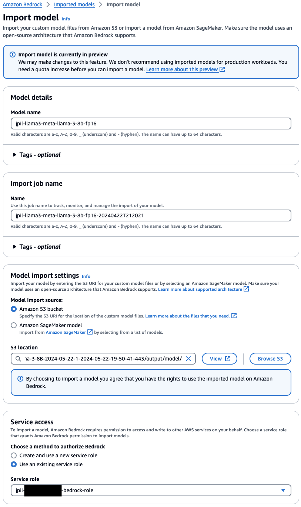
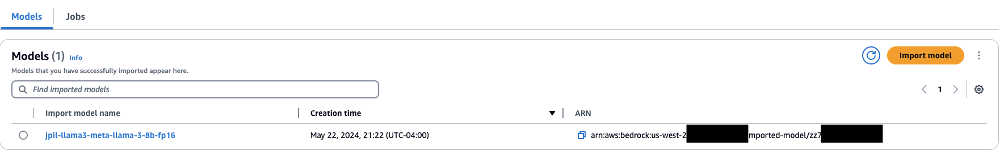
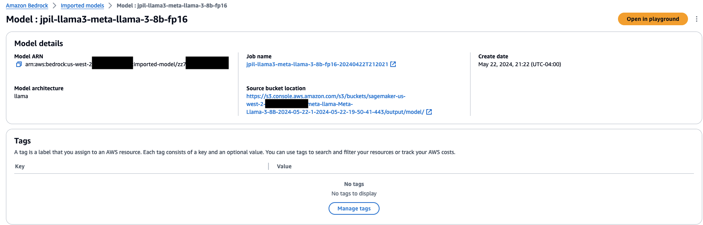
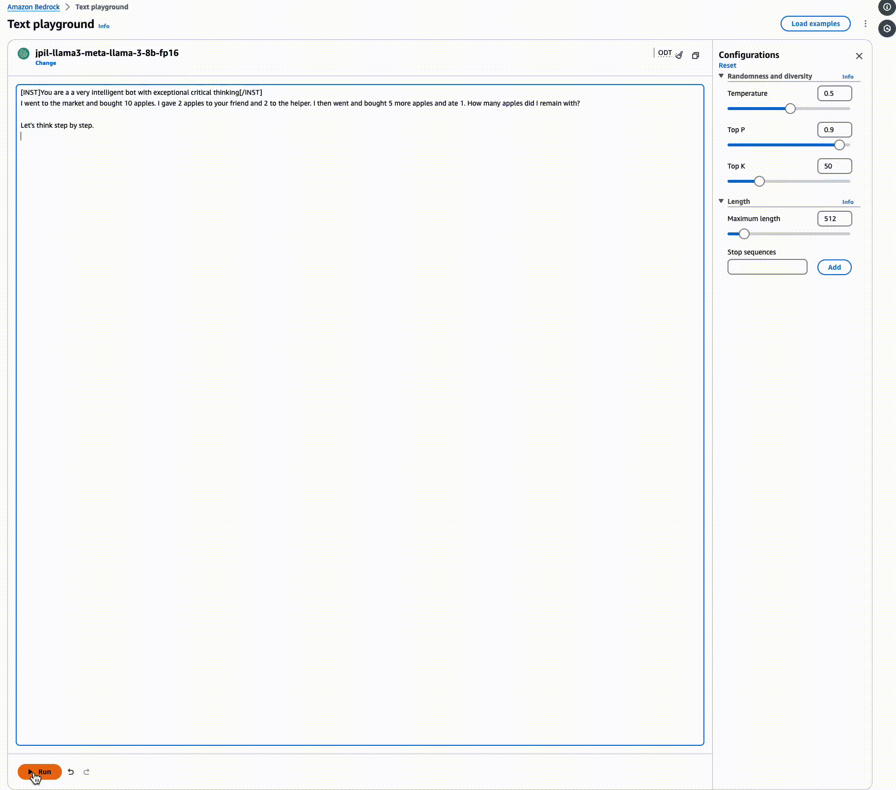
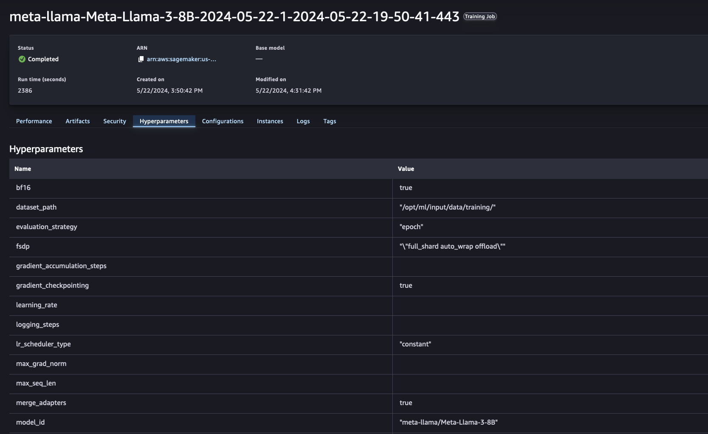

<h1> Fine-Tuning LlaMA 3 and Importing into Bedrock: A Step-by-Step Instructional Guide </h1>

<h2> Overview </h2>h2>

In this notebook we will walk through how to fine-tune a Llama-3 LLM on Amazon SageMaker using PyTorch FSDP and Flash Attention 2 including Q-LORA and PEFT. This notebook also explains using PEFT and merging the adapters.

<h2> Usecase </h2>

We will quantize the model as bf16 model. We use [Supervised Fine-tuning Trainer](https://huggingface.co/docs/trl/sft_trainer) (SFT) for fine tuning the model. We will use Anthropic/Vicuna like Chat Template with User: and Assistant: roles to fine tune the model. We will use [HuggingFaceH4/no_robots] (https://huggingface.co/datasets/HuggingFaceH4/no_robots) dataset for fine tuning the model. This is a high-quality dataset of 10,000 instructions and demonstrations created by skilled human annotators. Using [FSDP](https://pytorch.org/docs/main/fsdp.html) and [Q-Lora](https://arxiv.org/abs/2305.14314) allows us to fine tune Llama-3 models on 2x consumer GPU's. FSDP enables sharding model parameters, optimizer states and gradients across data parallel workers. Q- LORA helps reduce the memmory usage for finetuning LLM while preserving full 16-bit task performance. For fine tuning in this notebook we use ml.g5.12xlarge as a SageMaker Training Job. 

[Amazon SageMaker](https://aws.amazon.com/sagemaker) provides a fully managed service that enables build, train and deploy ML models at scale using tools like notebooks, debuggers, profilers, pipelines, MLOps, and more – all in one integrated development environment (IDE). [SageMaker Model Training](https://aws.amazon.com/sagemaker/train/) reduces the time and cost to train and tune machine learning (ML) models at scale without the need to manage infrastructure.

For detailed instructions please refer to [Importing a model with customer model import Bedrock Documentation](https://docs.aws.amazon.com/bedrock/latest/userguide/model-customization-import-model.html).

This notebook is inspired by Philipp Schmid Blog - https://www.philschmid.de/fsdp-qlora-llama3

<h2> Model License information </h2>

In this notebook we use the Meta Llama3 model from HuggingFace. This model is a gated model within HuggingFace repository. To use this model you have to agree to the license agreement (https://llama.meta.com/llama3/license) and request access to the model before it can be used in this notebook.

<h2> Notebook code with comments: </h2>

<h3> Install the Pre-Requisites </h3>


```python
!pip install transformers "sagemaker>=2.190.0" "huggingface_hub" "datasets[s3]==2.18.0" --upgrade --quiet
!pip install boto3 s3fs "aiobotocore==2.11.0" --upgrade --quiet
```

Logging into the HuggingFace Hub and requesting access to the meta-llama/Meta-Llama-3-8B is required to download the model and finetune the same. Please follow the [HuggingFace User Token Documentation](https://huggingface.co/docs/hub/en/security-tokens) to request tokens to be provided in the textbox appearning below after you run the cell.


```python
from huggingface_hub import notebook_login
notebook_login()
```

<h3> Setup </h3>
We will initialize the SageMaker Session required to finetune the model.


```python
import sagemaker
import boto3
sess = sagemaker.Session()
# sagemaker session bucket -> used for uploading data, models and logs
# sagemaker will automatically create this bucket if it not exists
sagemaker_session_bucket=None
if sagemaker_session_bucket is None and sess is not None:
    # set to default bucket if a bucket name is not given
    sagemaker_session_bucket = sess.default_bucket()
 
try:
    role = sagemaker.get_execution_role()
except ValueError:
    iam = boto3.client('iam')
    role = iam.get_role(RoleName='sagemaker_execution_role')['Role']['Arn']
 
sess = sagemaker.Session(default_bucket=sagemaker_session_bucket)
 
print(f"sagemaker role arn: {role}")
print(f"sagemaker bucket: {sess.default_bucket()}")
print(f"sagemaker session region: {sess.boto_region_name}")
```

<h3> Define the Parameters </h3>


```python
model_id = "meta-llama/Meta-Llama-3-8B" #"mistralai/Mistral-7B-v0.1" #"mistralai/Mixtral-8x7B-v0.1"
# save train_dataset to s3 using our SageMaker session
training_input_path = f's3://{sess.default_bucket()}/datasets/huggingface-h4-no-robots'
use_bf16 = True
```

<h3> Dataset Prepare </h3>
We will use [HuggingFaceH4/no_robots](https://huggingface.co/datasets/HuggingFaceH4/no_robots) dataset to finetune the Llama 3 model. Kindly refer to the [Licensing Information](https://huggingface.co/datasets/HuggingFaceH4/no_robots#licensing-information) regarding this dataset before proceeding further.

We will transform the messages to OAI format and split the data into Train and Test set. The Train and Test dataset will be uploaded into S3 - SageMaker Session Bucket for use during finetuning.


```python
from datasets import load_dataset
 
# Convert dataset to OAI messages
system_message = """You are Llama, an AI assistant to be helpful and honest. Your knowledge spans a wide range of topics, allowing you to engage in substantive conversations and provide analysis on complex subjects."""
 
def create_conversation(sample):
    if sample["messages"][0]["role"] == "system":
        return sample
    else:
      sample["messages"] = [{"role": "system", "content": system_message}] + sample["messages"]
      return sample
 
# Load dataset from the hub
dataset = load_dataset("HuggingFaceH4/no_robots")
 
# Add system message to each conversation
columns_to_remove = list(dataset["train"].features)
columns_to_remove.remove("messages")
dataset = dataset.map(create_conversation, remove_columns=columns_to_remove, batched=False)
 
# Filter out conversations which are corrupted with wrong turns, keep which have even number of turns after adding system message
dataset["train"] = dataset["train"].filter(lambda x: len(x["messages"][1:]) % 2 == 0)
dataset["test"] = dataset["test"].filter(lambda x: len(x["messages"][1:]) % 2 == 0)
 
# save datasets to s3
dataset["train"].to_json(f"{training_input_path}/train_dataset.json", orient="records", force_ascii=False)
dataset["test"].to_json(f"{training_input_path}/test_dataset.json", orient="records", force_ascii=False)
 
print(f"Training data uploaded to:")
print(f"{training_input_path}/train_dataset.json")
print(f"https://s3.console.aws.amazon.com/s3/buckets/{sess.default_bucket()}/?region={sess.boto_region_name}&prefix={training_input_path.split('/', 3)[-1]}/")
```

<h3> Training script and dependencies </h3>

Create the scripts directory to hold the training script and dependencies list. This directory will be provided to the trainer.


```python
import os
os.makedirs("scripts/trl", exist_ok=True)
```

Create the requirements file that will be used by the SageMaker Job container to initialize the dependencies.


```python
%%writefile scripts/trl/requirements.txt
torch==2.2.2
transformers==4.40.2
sagemaker>=2.190.0
datasets==2.18.0
accelerate==0.29.3
evaluate==0.4.1
bitsandbytes==0.43.1
trl==0.8.6
peft==0.10.0
```

Training Script that will use PyTorch FSDP, QLORA, PEFT and train the model using SFT Trainer. This script also includes prepping the data to Llama 3 chat template (Anthropic/Vicuna format). This training script is being written to the scripts folder along with the requirements file that will be used by the SageMaker Job.


```python
%%writefile scripts/trl/run_fsdp_qlora.py
import logging
from dataclasses import dataclass, field
import os

try:
    os.system("pip install flash-attn --no-build-isolation --upgrade")
except:
    print("flash-attn failed to install")

import random
import torch
from datasets import load_dataset
from tqdm import tqdm
from trl.commands.cli_utils import  TrlParser
from transformers import (
    AutoModelForCausalLM,
    AutoTokenizer,
    TrainingArguments,
    HfArgumentParser,
    BitsAndBytesConfig,
        set_seed,

)
from trl import setup_chat_format
from peft import LoraConfig


from trl import (
   SFTTrainer)


# Comment in if you want to use the Llama 3 instruct template but make sure to add modules_to_save
# LLAMA_3_CHAT_TEMPLATE="{{ content }}{{ '<|start_header_id|>assistant<|end_header_id|>\n\n' }}"

# Anthropic/Vicuna like template without the need for special tokens
LLAMA_3_CHAT_TEMPLATE = (
    ""
        ""
            "{{ message['content'] }}"
        ""
            "{{ '\n\nHuman: ' + message['content'] +  eos_token }}"
        ""
            "{{ '\n\nAssistant: '  + message['content'] +  eos_token  }}"
        ""
    ""
    ""
    "{{ '\n\nAssistant: ' }}"
    ""
)


tqdm.pandas()

@dataclass
class ScriptArguments:
    dataset_path: str = field(
        default=None,
        metadata={
            "help": "Path to the dataset"
        },
    )
    model_id: str = field(
        default=None, metadata={"help": "Model ID to use for SFT training"}
    )
    max_seq_length: int = field(
        default=512, metadata={"help": "The maximum sequence length for SFT Trainer"}
    )
    use_qlora: bool = field(default=False, metadata={"help": "Whether to use QLORA"})
    merge_adapters: bool = field(
        metadata={"help": "Wether to merge weights for LoRA."},
        default=False,
    )


def training_function(script_args, training_args):
    ################
    # Dataset
    ################
    
    train_dataset = load_dataset(
        "json",
        data_files=os.path.join(script_args.dataset_path, "train_dataset.json"),
        split="train",
    )
    test_dataset = load_dataset(
        "json",
        data_files=os.path.join(script_args.dataset_path, "test_dataset.json"),
        split="train",
    )

    ################
    # Model & Tokenizer
    ################

    # Tokenizer        
    tokenizer = AutoTokenizer.from_pretrained(script_args.model_id, use_fast=True)
    tokenizer.pad_token = tokenizer.eos_token
    tokenizer.chat_template = LLAMA_3_CHAT_TEMPLATE
    
    # template dataset
    def template_dataset(examples):
        return{"text":  tokenizer.apply_chat_template(examples["messages"], tokenize=False)}
    
    train_dataset = train_dataset.map(template_dataset, remove_columns=["messages"])
    test_dataset = test_dataset.map(template_dataset, remove_columns=["messages"])
    
    # print random sample
    with training_args.main_process_first(
        desc="Log a few random samples from the processed training set"
    ):
        for index in random.sample(range(len(train_dataset)), 2):
            print(train_dataset[index]["text"])

    # Model    
    torch_dtype = torch.bfloat16 if training_args.bf16 else torch.float32
    quant_storage_dtype = torch.bfloat16

    if script_args.use_qlora:
        print(f"Using QLoRA - {torch_dtype}")
        quantization_config = BitsAndBytesConfig(
                load_in_4bit=True,
                bnb_4bit_use_double_quant=True,
                bnb_4bit_quant_type="nf4",
                bnb_4bit_compute_dtype=torch_dtype,
                bnb_4bit_quant_storage=quant_storage_dtype,
            )
    else:
        quantization_config = None
        
    model = AutoModelForCausalLM.from_pretrained(
        script_args.model_id,
        quantization_config=quantization_config,
        #device_map="auto",
        device_map={'':torch.cuda.current_device()},
        attn_implementation="flash_attention_2", # use sdpa, alternatively use "flash_attention_2"
        torch_dtype=quant_storage_dtype,
        use_cache=False if training_args.gradient_checkpointing else True,  # this is needed for gradient checkpointing
    )
    
    if training_args.gradient_checkpointing:
        model.gradient_checkpointing_enable()

    ################
    # PEFT
    ################

    # LoRA config based on QLoRA paper & Sebastian Raschka experiment
    peft_config = LoraConfig(
        lora_alpha=8,
        lora_dropout=0.05,
        r=16,
        bias="none",
        target_modules="all-linear",
        task_type="CAUSAL_LM",
        # modules_to_save = ["lm_head", "embed_tokens"] # add if you want to use the Llama 3 instruct template
    )

    ################
    # Training
    ################
    trainer = SFTTrainer(
        model=model,
        args=training_args,
        train_dataset=train_dataset,
        dataset_text_field="text",
        eval_dataset=test_dataset,
        peft_config=peft_config,
        max_seq_length=script_args.max_seq_length,
        tokenizer=tokenizer,
        packing=True,
        dataset_kwargs={
            "add_special_tokens": False,  # We template with special tokens
            "append_concat_token": False,  # No need to add additional separator token
        },
    )
    if trainer.accelerator.is_main_process:
        trainer.model.print_trainable_parameters()

    ##########################
    # Train model
    ##########################
    checkpoint = None
    if training_args.resume_from_checkpoint is not None:
        checkpoint = training_args.resume_from_checkpoint
    trainer.train(resume_from_checkpoint=checkpoint)

    ##########################
    # SAVE MODEL FOR SAGEMAKER
    ##########################
    sagemaker_save_dir = "/opt/ml/model"

    if trainer.is_fsdp_enabled:
        trainer.accelerator.state.fsdp_plugin.set_state_dict_type("FULL_STATE_DICT")

    if script_args.merge_adapters:
        # merge adapter weights with base model and save
        # save int 4 model
        print('########## Merging Adapters  ##########')
        trainer.model.save_pretrained(training_args.output_dir)
        trainer.tokenizer.save_pretrained(training_args.output_dir)
        trainer.tokenizer.save_pretrained(sagemaker_save_dir)
        # clear memory
        del model
        del trainer
        torch.cuda.empty_cache()

        from peft import AutoPeftModelForCausalLM

        # list file in output_dir
        print(os.listdir(training_args.output_dir))

        # load PEFT model
        model = AutoPeftModelForCausalLM.from_pretrained(
            training_args.output_dir,
            low_cpu_mem_usage=True,
            torch_dtype=torch.float16 # loading in other precision types gives errors.
        )
        # Merge LoRA and base model and save
        model = model.merge_and_unload()
        model.save_pretrained(
            sagemaker_save_dir, safe_serialization=True, max_shard_size="2GB"
        )
    else:
        trainer.model.save_pretrained(sagemaker_save_dir, safe_serialization=True)
    
if __name__ == "__main__":
    parser = HfArgumentParser((ScriptArguments, TrainingArguments))
    script_args, training_args = parser.parse_args_into_dataclasses()    
    
    # set use reentrant to False
    if training_args.gradient_checkpointing:
        training_args.gradient_checkpointing_kwargs = {"use_reentrant": True}
    # set seed
    set_seed(training_args.seed)
  
    # launch training
    training_function(script_args, training_args)
```

Hyperparameters, which are passed into the training job


```python
hyperparameters = {
  ### SCRIPT PARAMETERS ###
  'dataset_path': '/opt/ml/input/data/training/',    # path where sagemaker will save training dataset
  'model_id': model_id,                              # or `mistralai/Mistral-7B-v0.1`
  'max_seq_len': 3072,                               # max sequence length for model and packing of the dataset
  'use_qlora': True,                                 # use QLoRA model
  ### TRAINING PARAMETERS ###
  'num_train_epochs': 1,                             # number of training epochs
  'per_device_train_batch_size': 1,                  # batch size per device during training
  'per_device_eval_batch_size': 1,                   # batch size for evaluation    
  'gradient_accumulation_steps': 4,                  # number of steps before performing a backward/update pass
  'gradient_checkpointing': True,                    # use gradient checkpointing to save memory
  'optim': "adamw_torch",                            # use fused adamw optimizer
  'logging_steps': 10,                               # log every 10 steps
  'save_strategy': "epoch",                          # save checkpoint every epoch
  'evaluation_strategy': "epoch",
  'learning_rate': 0.0002,                           # learning rate, based on QLoRA paper
  'bf16': use_bf16,                                      # use bfloat16 precision
  'tf32': True,                                      # use tf32 precision
  'max_grad_norm': 0.3,                              # max gradient norm based on QLoRA paper
  'warmup_ratio': 0.03,                              # warmup ratio based on QLoRA paper
  'lr_scheduler_type': "constant",                   # use constant learning rate scheduler
  'report_to': "tensorboard",                        # report metrics to tensorboard
  'output_dir': '/tmp/tun',                          # Temporary output directory for model checkpoints
  'merge_adapters': True,                            # merge LoRA adapters into model for easier deployment
  'fsdp': '"full_shard auto_wrap offload"',
}
```

Use the SageMaker HuggingFace Estimator to finetune the model passing in the hyperparameters and the scripts directory from above.


```python
from sagemaker.huggingface import HuggingFace
from huggingface_hub import HfFolder 
import time

# define Training Job Name
job_name = f'{model_id.replace("/", "-")}-{"bf16" if use_bf16 else "f32" }-{time.strftime("%Y-%m-%d-%H-%M-%S", time.localtime())}'
 
# create the Estimator
huggingface_estimator = HuggingFace(
    entry_point          = 'run_fsdp_qlora.py',    # train script
    source_dir           = 'scripts/trl/',      # directory which includes all the files needed for training
    instance_type        = 'ml.g5.12xlarge',   # instances type used for the training job
    instance_count       = 1,                 # the number of instances used for training
    max_run              = 2*24*60*60,        # maximum runtime in seconds (days * hours * minutes * seconds)
    base_job_name        = job_name,          # the name of the training job
    role                 = role,              # Iam role used in training job to access AWS ressources, e.g. S3
    volume_size          = 300,               # the size of the EBS volume in GB
    transformers_version = '4.36.0',            # the transformers version used in the training job
    pytorch_version      = '2.1.0',             # the pytorch_version version used in the training job
    py_version           = 'py310',           # the python version used in the training job
    hyperparameters      =  hyperparameters,  # the hyperparameters passed to the training job
    disable_output_compression = True,        # not compress output to save training time and cost
    distribution={"torch_distributed": {"enabled": True}},
    environment          = {
        "HUGGINGFACE_HUB_CACHE": "/tmp/.cache", # set env variable to cache models in /tmp
        "HF_TOKEN": HfFolder.get_token(),       # Retrieve HuggingFace Token to be used for downloading base models from
        "ACCELERATE_USE_FSDP":"1", 
        "FSDP_CPU_RAM_EFFICIENT_LOADING":"1"
    },
)

# define a data input dictonary with our uploaded s3 uris
data = {'training': training_input_path}
 
# starting the train job with our uploaded datasets as input
huggingface_estimator.fit(data, wait=True)
```


```python
huggingface_estimator.model_data["S3DataSource"]["S3Uri"]
```

<h3> Import the Finetuned model into Bedrock: </h3>

<h4> Now follow the steps from the link below to continue to import this model </h4>

https://docs.aws.amazon.com/bedrock/latest/userguide/model-customization-import-model.html











<h3> Invoke the imported model using Bedrock API's </h3>


```python
!pip install boto3 botocore --upgrade --quiet
```


```python
import boto3
import json
from botocore.exceptions import ClientError
```


```python
client = boto3.client("bedrock-runtime", region_name="us-west-2")

model_id = "<<replace with the imported bedrock model arn>>"
```


```python
def call_invoke_model_and_print(native_request):
    request = json.dumps(native_request)

    try:
        # Invoke the model with the request.
        response = client.invoke_model(modelId=model_id, body=request)
        model_response = json.loads(response["body"].read())

        response_text = model_response["generation"]
        print(response_text)
    except (ClientError, Exception) as e:
        print(f"ERROR: Can't invoke '{model_id}'. Reason: {e}")
        exit(1)
```


```python
prompt = "Write a paragraph about a cat and his owner but start each sentence with a new letter following alphabetical order"
formatted_prompt = f"{system_prompt}{prompt}"

native_request = {
    "prompt": formatted_prompt,
    "max_gen_len": 512,
    "top_p": 0.9,
    "temperature": 0.91
}

call_invoke_model_and_print(native_request)
```

<h2> Clean Up </h2>

You can delete your Imported Model in the console as shown in the image below:


Ensure to shut down your instance/compute that you have run this notebook on.

**END OF NOTEBOOK**
