<h1> Fine tuning Mistral-7b on Sagemaker Jumpstart and deploying to Amazon Bedrock using Custom Model Import </h1>

<h2> Overview </h2>

In this demo notebook, we demonstrate how to use the SageMaker Python SDK to fine-tuning [Mistral 7B](mistralai/Mistral-7B-v0.1) models for text generation. For fine-tuning, we include two types of fine-tuning: instruction fine-tuning and domain adaption fine-tuning. Then we deploy these models to Amazon Bedrock via Custom Model Import feature. 

Below is the content of the notebook.

1. [Instruction fine-tuning](#1.-Instruction-fine-tuning)
   * [1.1. Preparing training data](#1.1.-Preparing-training-data)
   * [1.2. Prepare training parameters](#1.2.-Prepare-training-parameters)
   * [1.3. Starting training](#1.3.-Starting-training)
   * [1.4. Importing custom model in Bedrock](#1.4.-Importing-Custom-model-in-Bedrock)
   * [1.5. Invoke model from Bedrock](#1.5.-Invoke-model-from-Bedrock)
   * [1.6. Clean up endpoint](#1.6.-Clean-up-the-endpoint)
2. [Domain adaptation fine-tuning](#2.-Domain-adaptation-fine-tuning)
   * [2.1. Preparing training data](#2.1.-Preparing-training-data)
   * [2.2. Prepare training parameters](#2.2.-Prepare-training-parameters)
   * [2.3. Starting training](#2.3.-Starting-training)
   * [2.4. Importing custom model in Bedrock](#2.4.-Importing-Custom-model-in-Bedrock)
   * [2.5. Invoke model from Bedrock](#2.5.-Invoke-model-from-Bedrock)
   * [2.6. Clean up endpoint](#2.6.-Clean-up-the-endpoint)

<h2> Amazon Bedrock Custom Model Import (CMI) </h2>

The resulting model files are imported into Amazon Bedrock via [Custom Model Import (CMI)](https://docs.aws.amazon.com/bedrock/latest/userguide/model-customization-import-model.html). 

Bedrock Custom Model Import allows for importing foundation models that have been customized in other environments outside of Amazon Bedrock, such as Amazon Sagemaker, EC2, etc. 

<h2> Context </h2>

Now, we demonstrate how to instruction-tune `huggingface-llm-mistral-7b` model for a new task. The Mistral-7B-v0.1 Large Language Model (LLM) is a pretrained generative text model with 7 billion parameters. Mistral-7B-v0.1 outperforms Llama 2 13B on all benchmarks we tested. For details, see its [HuggingFace webpage](https://huggingface.co/mistralai/Mistral-7B-v0.1).

<h2> Use Case </h2>

We are can fine-tuneing on the dataset with domain adaptation format or instruction tuning format. In this section, we will use a subset of [Dolly dataset](https://huggingface.co/datasets/databricks/databricks-dolly-15k) in an instruction tuning format. Dolly dataset contains roughly 15,000 instruction following records for various categories such as question answering, summarization, information extraction etc. It is available under Apache 2.0 license. We will select the summarization examples for fine-tuning.

<h2> Code with Comments </h2>

<h3> Installs </h3>


```python
!pip install sagemaker --quiet --upgrade --force-reinstall
!pip install ipywidgets==7.0.0 --quiet
!pip install datasets --quiet
```

    ERROR: pip's dependency resolver does not currently take into account all the packages that are installed. This behaviour is the source of the following dependency conflicts.
    autovizwidget 0.21.0 requires pandas<2.0.0,>=0.20.1, but you have pandas 2.2.2 which is incompatible.
    awscli 1.32.101 requires botocore==1.34.101, but you have botocore 1.35.0 which is incompatible.
    hdijupyterutils 0.21.0 requires pandas<2.0.0,>=0.17.1, but you have pandas 2.2.2 which is incompatible.
    sparkmagic 0.21.0 requires pandas<2.0.0,>=0.17.1, but you have pandas 2.2.2 which is incompatible.
    

<h3> Insert name/ID of model from Jumpstart </h3>


```python
pretrained_model_id="mistral.mistral-7b-instruct-v0:2"
model_id, model_version = "huggingface-llm-mistral-7b", "*"
```

<h3> 1.1. Preparing training data </h3>

Pulling the [Dolly dataset](https://huggingface.co/datasets/databricks/databricks-dolly-15k) from the HuggingFace hub.
Training data is formatted in JSON lines (.jsonl) format, where each line is a dictionary representing a single data sample. All training data must be in a single folder, however it can be saved in multiple jsonl files. The training folder can also contain a template.json file describing the input and output formats.


```python
import boto3
import sagemaker
import json

# Get current region, role, and default bucket
aws_region = boto3.Session().region_name
aws_role = sagemaker.session.Session().get_caller_identity_arn()
output_bucket = sagemaker.Session().default_bucket()

# This will be useful for printing
newline, bold, unbold = "\n", "\033[1m", "\033[0m"

print(f"{bold}aws_region:{unbold} {aws_region}")
print(f"{bold}aws_role:{unbold} {aws_role}")
print(f"{bold}output_bucket:{unbold} {output_bucket}")
```

    sagemaker.config INFO - Not applying SDK defaults from location: /etc/xdg/sagemaker/config.yaml
    sagemaker.config INFO - Not applying SDK defaults from location: /home/ec2-user/.config/sagemaker/config.yaml
    aws_region: us-west-2
    aws_role: arn:aws:iam::425576326687:role/sagemakerrole
    output_bucket: sagemaker-us-west-2-425576326687


```python
from datasets import load_dataset

dolly_dataset = load_dataset("databricks/databricks-dolly-15k", split="train")

# To train for question answering/information extraction, you can replace the assertion in next line to example["category"] == "closed_qa"/"information_extraction".
summarization_dataset = dolly_dataset.filter(lambda example: example["category"] == "summarization")
summarization_dataset = summarization_dataset.remove_columns("category")

# We split the dataset into two where test data is used to evaluate at the end.
train_and_test_dataset = summarization_dataset.train_test_split(test_size=0.1)

# Dumping the training data to a local file to be used for training.
train_and_test_dataset["train"].to_json("train.jsonl")
```

    /home/ec2-user/anaconda3/envs/pytorch_p310/lib/python3.10/site-packages/tqdm/auto.py:21: TqdmWarning: IProgress not found. Please update jupyter and ipywidgets. See https://ipywidgets.readthedocs.io/en/stable/user_install.html
      from .autonotebook import tqdm as notebook_tqdm
    Creating json from Arrow format: 100%|██████████| 2/2 [00:00<00:00, 29.97ba/s]


    2088646


```python
train_and_test_dataset["train"][0]
```


    {'instruction': 'Give me a bulleted list of all artists that performers on the Trolls World Tour Soundtrack.',
     'context': 'Trolls World Tour: Original Motion Picture Soundtrack is the soundtrack album to the 2020 DreamWorks Animation film Trolls World Tour, released by RCA Records on March 13, 2020. The soundtrack is produced primarily by singer-songwriter Justin Timberlake. The singles "The Other Side" by SZA and Timberlake and "Don\'t Slack" by Anderson .Paak and Timberlake were released prior to the album.\n\nBackground\nAs well as reprising his voice role as Branch in the sequel, Justin Timberlake also served as executive producer for its soundtrack, as he did on the original film\'s soundtrack, released in 2016. He revealed a handwritten list of the tracks on the soundtrack on his social media on February 13, also tagging the major artists featured on it.\n\nFollowing the plot of the film, in which the Trolls from the first film discover that Trolls around the world are divided by six different types of music (pop, funk, classical, techno, country, and rock), the soundtrack features songs in those genres.\n\nTrack listing\nNo.\tTitle\tWriter(s)\tProducer(s)\tLength\n1.\t"The Other Side" (SZA and Justin Timberlake)\t\nSolána RoweSarah AaronsJustin TimberlakeLudwig GöranssonMax Martin\nTimberlakeGöransson\n3:08\n2.\t"Trolls Wanna Have Good Times" (Anna Kendrick, Justin Timberlake, James Corden, Ester Dean, Icona Pop, Kenan Thompson and The Pop Trolls)\t\nThompsonBernard EdwardsChristopher HartzDmitry BrillHerbie HancockLady Miss KierGöranssonNile RodgersQ-TipRobert HazardTowa Tei\nGöransson\t3:25\n3.\t"Don\'t Slack" (Anderson .Paak and Justin Timberlake)\t\nTimberlakeBrandon AndersonGöransson\nTimberlakeAnderson .PaakGöransson\n2:54\n4.\t"It\'s All Love" (Anderson .Paak, Justin Timberlake, Mary J. Blige and George Clinton)\t\nAndersonJames FauntleroyJoseph ShirleyGöransson\nShirleyGöransson\n3:35\n5.\t"Just Sing (Trolls World Tour)" (Justin Timberlake, Anna Kendrick, Kelly Clarkson, Mary J. Blige, Anderson .Paak and Kenan Thompson)\t\nTimberlakeAaronsGöranssonMartin\nTimberlakeGöransson\n3:34\n6.\t"One More Time" (Anthony Ramos)\t\nThomas BangalterGuy-Manuel de Homem-ChristoAnthony Moore\nGöransson\t2:42\n7.\t"Atomic Dog World Tour Remix" (George Clinton and Parliament-Funkadelic, Anderson .Paak and Mary J. Blige)\t\nClintonDavid SpradleyGarry ShiderAnderson\nClintonShirleyGöransson\n4:17\n8.\t"Rainbows, Unicorns, Everything Nice" (Walt Dohrn and Joseph Shirley)\tAidan Jensen\tGöransson\t0:12\n9.\t"Rock N Roll Rules" (Haim and Ludwig Göransson)\t\nAlana HaimDanielle HaimEste HaimGöransson\nGöransson\t3:10\n10.\t"Leaving Lonesome Flats" (Dierks Bentley)\t\nChris StapletonTimberlake\nTimberlakeGöransson\n3:10\n11.\t"Born to Die" (Kelly Clarkson)\t\nStapletonTimberlake\nTimberlakeGöransson\n3:26\n12.\t"Trolls 2 Many Hits Mashup" (Anna Kendrick, Justin Timberlake, James Corden, Icona Pop and The Pop Trolls)\t\nAnslem DouglasArmando PerezDonnie WahlbergDan HartmanEmma BuntonYoo Gun-hyungPark Jai-sangDavid ListenbeeMark WahlbergMatthew RoweMelanie BrownMelanie ChrisholmPeter SchroederBiff StannardSandy WilhelmStefan GordySkyler GordyFaheem Najm\nGöransson\t1:01\n13.\t"Barracuda" (Rachel Bloom)\t\nAnn WilsonMichael DerosierNancy WilsonRoger Fisher\nGöransson\t4:06\n14.\t"Yodel Beat" (Ludwig Göransson)\tGöransson\tGöransson\t2:50\n15.\t"Crazy Train" (Rachel Bloom)\t\nOzzy OsbourneRandy RhoadsBob Daisley\nGöransson\t3:15\n16.\t"I Fall to Pieces" (Sam Rockwell)\t\nHank CochranHarlan Howard\nGöransson\t2:14\n17.\t"Perfect for Me" (Justin Timberlake)\t\nTimberlakeKenyon DixonGöransson\nTimberlakeGöransson\n3:47\n18.\t"Rock You Like a Hurricane" (Bloom)\t\nHerman RarebellKlaus MeineRudolf Schenker\nGöransson\t3:05\n19.\t"It\'s All Love (History of Funk)" (George Clinton, Mary J. Blige, Anderson .Paak)\t\nAndersonFauntleroyShirleyGöransson\nShirleyGöransson\n2:10\n20.\t"Just Sing (Trolls World Tour)" (Justin Timberlake, Anna Kendrick, James Corden, Kelly Clarkson, George Clinton, Mary J. Blige, Anderson .Paak, Rachel Bloom, Kenan Thompson, Anthony Ramos, Red Velvet, Icona Pop and Sam Rockwell)\t\nS. RoweTimberlakeAaronsGöranssonMartin\nTimberlakeGöransson\n4:00\nTotal length:\t60:00',
     'response': '• (SZA and Justin Timberlake)\n• (Anna Kendrick, Justin Timberlake, James Corden, Ester Dean, Icona Pop, Kenan Thompson and The Pop Trolls)\n• (Anderson .Paak and Justin Timberlake)\n• (Anderson .Paak, Justin Timberlake, Mary J. Blige and George Clinton)\n• (Trolls World Tour)" (Justin Timberlake, Anna Kendrick, Kelly Clarkson, Mary J. Blige, Anderson .Paak and Kenan Thompson)\n• (Anthony Ramos)\n• (George Clinton and Parliament-Funkadelic, Anderson .Paak and Mary J. Blige)\n• (Walt Dohrn and Joseph Shirley)\n• (Haim and Ludwig Göransson)\n• (Dierks Bentley)\n• (Kelly Clarkson)\n• (Anna Kendrick, Justin Timberlake, James Corden, Icona Pop and The Pop Trolls)\n• (Rachel Bloom)\n• (Ludwig Göransson)\n• (Rachel Bloom)\n• (Sam Rockwell)\n• (Justin Timberlake)\n• (Bloom)\n• (George Clinton, Mary J. Blige, Anderson .Paak)\n• (Justin Timberlake, Anna Kendrick, James Corden, Kelly Clarkson, George Clinton, Mary J. Blige, Anderson .Paak, Rachel Bloom, Kenan Thompson, Anthony Ramos, Red Velvet, Icona Pop and Sam Rockwell)'}


The training data must be formatted in JSON lines (.jsonl) format, where each line is a dictionary representing a single data sample. All training data must be in a single folder, however it can be saved in multiple jsonl files. The .jsonl file extension is mandatory. The training folder can also contain a template.json file describing the input and output formats.

If no template file is given, the following default template will be used:

```json
{
    "prompt": "Below is an instruction that describes a task, paired with an input that provides further context. Write a response that appropriately completes the request.\n\n### Instruction:\n{instruction}\n\n### Input:\n{context}`,
    "completion": "{response}",
}
```

In this case, the data in the JSON lines entries must include `instruction`, `context`, and `response` fields.

Different from using the default prompt template, in this demo we are going to use a custom template (see below).


```python
import json

template = {
    "prompt": "Below is an instruction that describes a task, paired with an input that provides further context. "
    "Write a response that appropriately completes the request.\n\n"
    "### Instruction:\n{instruction}\n\n### Input:\n{context}\n\n",
    "completion": " {response}",
}
with open("template.json", "w") as f:
    json.dump(template, f)
```

Next, we are going to reformat the SQuAD 2.0 dataset. The processed data is saved as `task-data.jsonl` file. Given the prompt template defined in above cell, each entry in the `task-data.jsonl` file include **`context`** and **`question`** fields. For demonstration purpose, we limit the number of training examples to be 2000.


```python
from sagemaker.s3 import S3Uploader
import sagemaker
import random

output_bucket = sagemaker.Session().default_bucket()
local_data_file = "train.jsonl"
train_data_location = f"s3://{output_bucket}/dolly_dataset_mistral"
S3Uploader.upload(local_data_file, train_data_location)
S3Uploader.upload("template.json", train_data_location)
print(f"Training data: {train_data_location}")
```

    Training data: s3://sagemaker-us-west-2-425576326687/dolly_dataset_mistral


Upload the prompt template (`template.json`) and training data (`task-data.jsonl`) into S3 bucket.

<h3> 1.2. Prepare training parameters </h3>


```python
from sagemaker import hyperparameters

my_hyperparameters = hyperparameters.retrieve_default(
    model_id=model_id, model_version=model_version
)
print(my_hyperparameters)
```

    Using model 'huggingface-llm-mistral-7b' with wildcard version identifier '*'. You can pin to version '2.9.1' for more stable results. Note that models may have different input/output signatures after a major version upgrade.


    {'peft_type': 'None', 'instruction_tuned': 'True', 'chat_dataset': 'False', 'epoch': '1', 'learning_rate': '6e-06', 'lora_r': '64', 'lora_alpha': '16', 'lora_dropout': '0', 'bits': '16', 'double_quant': 'True', 'quant_type': 'nf4', 'per_device_train_batch_size': '2', 'per_device_eval_batch_size': '8', 'add_input_output_demarcation_key': 'True', 'warmup_ratio': '0.1', 'train_from_scratch': 'False', 'fp16': 'False', 'bf16': 'True', 'evaluation_strategy': 'steps', 'eval_steps': '20', 'gradient_accumulation_steps': '8', 'logging_steps': '8', 'weight_decay': '0.2', 'load_best_model_at_end': 'True', 'max_train_samples': '-1', 'max_val_samples': '-1', 'seed': '10', 'max_input_length': '-1', 'validation_split_ratio': '0.2', 'train_data_split_seed': '0', 'preprocessing_num_workers': 'None', 'max_steps': '-1', 'gradient_checkpointing': 'True', 'early_stopping_patience': '3', 'early_stopping_threshold': '0.0', 'adam_beta1': '0.9', 'adam_beta2': '0.999', 'adam_epsilon': '1e-08', 'max_grad_norm': '1.0', 'label_smoothing_factor': '0', 'logging_first_step': 'False', 'logging_nan_inf_filter': 'True', 'save_strategy': 'steps', 'save_steps': '500', 'save_total_limit': '1', 'dataloader_drop_last': 'False', 'dataloader_num_workers': '0', 'eval_accumulation_steps': 'None', 'auto_find_batch_size': 'False', 'lr_scheduler_type': 'constant_with_warmup', 'warmup_steps': '0'}


Overwrite the hyperparameters. **Note. You can select the LoRA method for your fine-tuning by selecting peft_type=`lora` in the hyper-parameters.**


```python
my_hyperparameters["epoch"] = "1"
my_hyperparameters["per_device_train_batch_size"] = "2"
my_hyperparameters["gradient_accumulation_steps"] = "2"
my_hyperparameters["instruction_tuned"] = "True"
print(my_hyperparameters)
```

    {'peft_type': 'None', 'instruction_tuned': 'True', 'chat_dataset': 'False', 'epoch': '1', 'learning_rate': '6e-06', 'lora_r': '64', 'lora_alpha': '16', 'lora_dropout': '0', 'bits': '16', 'double_quant': 'True', 'quant_type': 'nf4', 'per_device_train_batch_size': '2', 'per_device_eval_batch_size': '8', 'add_input_output_demarcation_key': 'True', 'warmup_ratio': '0.1', 'train_from_scratch': 'False', 'fp16': 'False', 'bf16': 'True', 'evaluation_strategy': 'steps', 'eval_steps': '20', 'gradient_accumulation_steps': '2', 'logging_steps': '8', 'weight_decay': '0.2', 'load_best_model_at_end': 'True', 'max_train_samples': '-1', 'max_val_samples': '-1', 'seed': '10', 'max_input_length': '-1', 'validation_split_ratio': '0.2', 'train_data_split_seed': '0', 'preprocessing_num_workers': 'None', 'max_steps': '-1', 'gradient_checkpointing': 'True', 'early_stopping_patience': '3', 'early_stopping_threshold': '0.0', 'adam_beta1': '0.9', 'adam_beta2': '0.999', 'adam_epsilon': '1e-08', 'max_grad_norm': '1.0', 'label_smoothing_factor': '0', 'logging_first_step': 'False', 'logging_nan_inf_filter': 'True', 'save_strategy': 'steps', 'save_steps': '500', 'save_total_limit': '1', 'dataloader_drop_last': 'False', 'dataloader_num_workers': '0', 'eval_accumulation_steps': 'None', 'auto_find_batch_size': 'False', 'lr_scheduler_type': 'constant_with_warmup', 'warmup_steps': '0'}


Validate hyperparameters


```python
hyperparameters.validate(
    model_id=model_id, model_version=model_version, hyperparameters=my_hyperparameters
)
```

<h3> 1.3. Starting training </h3>


```python
from sagemaker.jumpstart.estimator import JumpStartEstimator

instruction_tuned_estimator = JumpStartEstimator(
    model_id=model_id,
    hyperparameters=my_hyperparameters,
    instance_type="ml.g5.24xlarge",
)
instruction_tuned_estimator.fit({"train": train_data_location}, logs=True)
```

Extract Training performance metrics. Performance metrics such as training loss and validation accuracy/loss can be accessed through cloudwatch while the training. We can also fetch these metrics and analyze them within the notebook.


```python
from sagemaker import TrainingJobAnalytics

training_job_name = instruction_tuned_estimator.latest_training_job.job_name

df = TrainingJobAnalytics(training_job_name=training_job_name).dataframe()
df.head(10)
```


```python
#note the below s3 location to be used later while importing models
instruction_tuned_estimator.model_data['S3DataSource']['S3Uri']
```

<h3> 1.4. Importing Custom model in Bedrock </h3>

Go to the AWS console, then search for Amazon Bedrock service. On the left-hand size, click on `Imported models` under `Foundation models`.
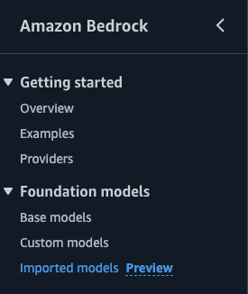 

Clic on `Import model`
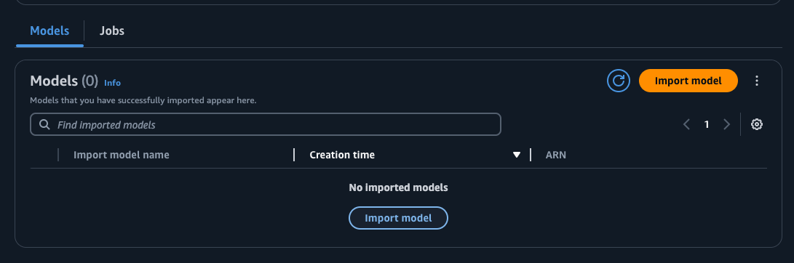
Use `mistral-7b-jumpstart-instruction-tuned` as the `Model name`, and enter the S3 location from above. Click on `Import model`.

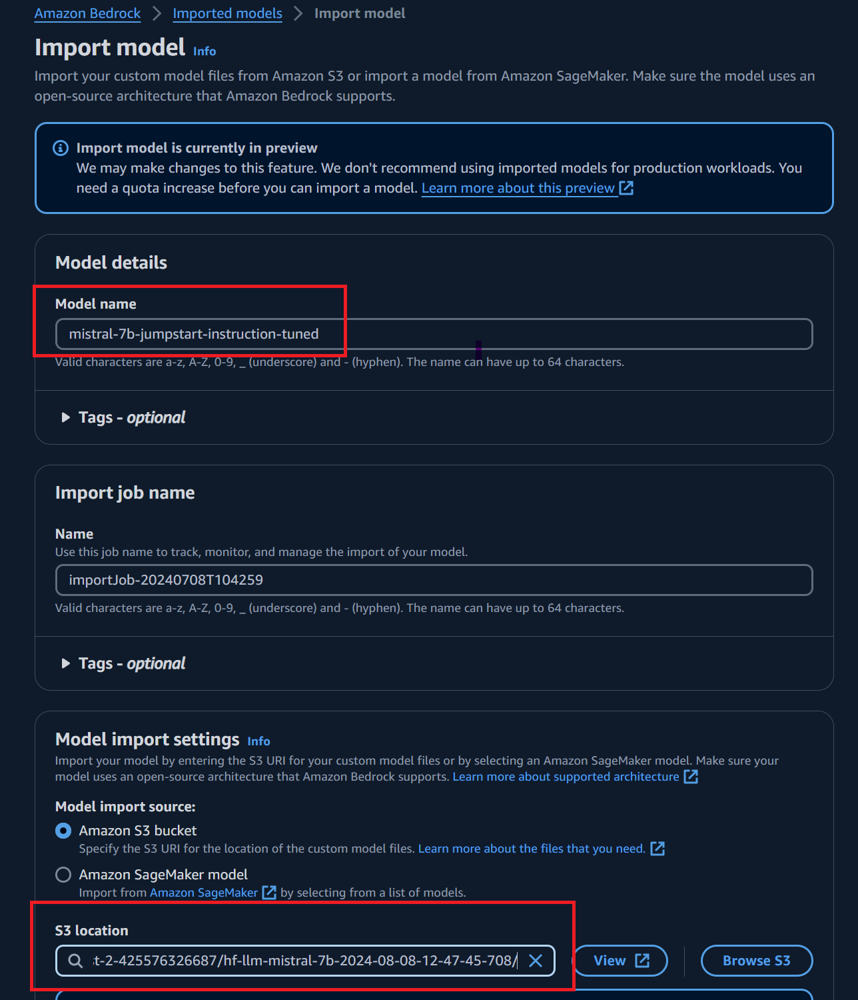
When the import job completes, click on `Models` to see your model. Copy the ARN because we will need it in the next steps

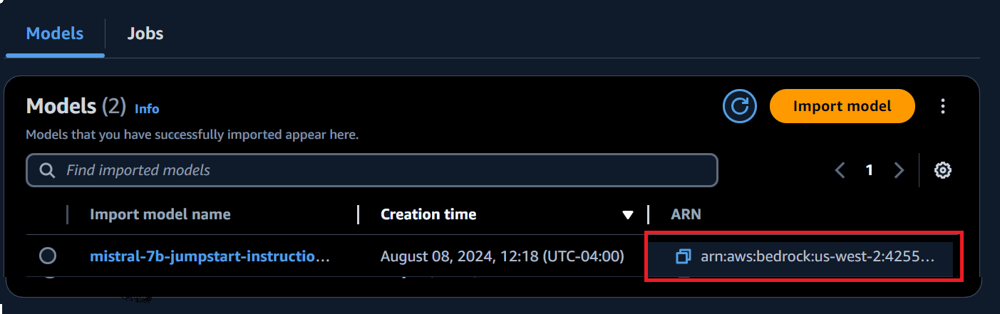

You can test the model using the `Bedrock Playground`. Select your model and enter a question, as shown below.
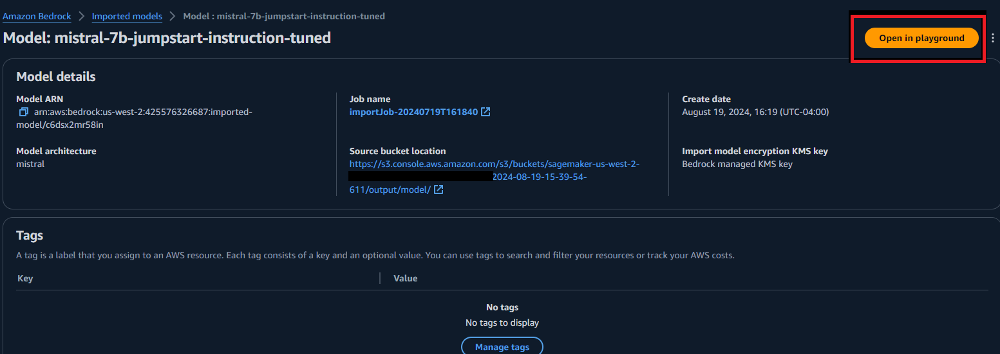

Run your query in the playground
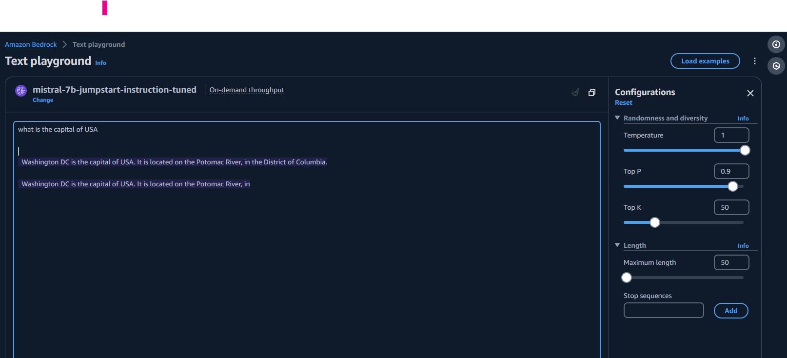

<h3> 1.5. Invoke model from Bedrock </h3>


```python

def parse_response(response):    
    response_text = json.loads(response.get('body').read())["outputs"][0]["text"]
    return response_text

def generate_response(model_id, user_prompt):    
    native_request = {
        "prompt": user_prompt,
        "max_tokens": 100,
        "top_p": 0.9,
        "temperature": 1
    }
    client = boto3.client("bedrock-runtime", region_name=aws_region)
    response = client.invoke_model(modelId=model_id,
                                body=json.dumps(native_request))

    generated_text = parse_response(response)
    print(f"Response: {generated_text}{newline}")
    return generated_text
```


```python
model_id='Replace with the ARN from Bedrock Custom Model'

user_question='What is the capital of United States'
generate_response(model_id, user_question)
```

    Response:  of America?
    
      Washington, D.C.
    
      Washington, D.C. is the capital of United States of America.
    
      Washington, D.C. is the capital of United States of America.
    
      Washington, D.C. is the capital of United States of America.
    
      Washington, D.C. is the capital of United States of America.
    
      Washington, D.C. is
    


    ' of America?\n\n  Washington, D.C.\n\n  Washington, D.C. is the capital of United States of America.\n\n  Washington, D.C. is the capital of United States of America.\n\n  Washington, D.C. is the capital of United States of America.\n\n  Washington, D.C. is the capital of United States of America.\n\n  Washington, D.C. is'


```python

system_prompt ='you are an assistant that summarizes the topic and provides answers.'
user_question='What is the capital of United States'
client = boto3.client("bedrock-runtime", region_name=aws_region)


formatted_prompt = f"<s>[INST] <<SYS>>{system_prompt}<</SYS>>\n\n[INST]Human: {user_question}[/INST]\n\nAssistant:"
native_request = {
    "prompt": formatted_prompt,
    "max_tokens": 100,
    "top_p": 0.9,
    "temperature": 1
}
response = client.invoke_model(modelId=model_id,
                               body=json.dumps(native_request))
response_text = json.loads(response.get('body').read())["outputs"][0]["text"]

print( response_text)
```

     The capital of United States is Washington, DC. Washington, DC is not a state, but a capital, it is also known as the District of Columbia.
    
      The capital of United states is Washington, DC.
    
      The capital of United states is Washington, DC.
    
      The capital of United states is Washington, DC.
    
      The capital of United states is Washington, DC.
    
      The capital of United states is Washington,


Note. <b>For dolly dataset, we observe the performance of fine-tuned model is equivalently excellent to that of pre-trained model. This is likely due to the Mistral 7B has already learned knowledge in this domain. The code example above is just a demonstration on how to fine-tune such model in an instruction way. For your own use case, please substitute the example dolly dataset by yours.</b>

<h3> 1.6. Clean up the endpoint </h3>


```python
# Delete the Bedrock Model

Click on `Models` to see your model. Delete the Model.
```

<h2> 2. Domain adaptation fine-tuning </h2>

We also have domain adaptation fine-tuning enabled for Mistral models. Different from instruction fine-tuning, you do not need prepare instruction-formatted dataset and can directly use unstructured text document which is demonstrated as below. However, the model that is domain-adaptation fine-tuned may not give concise responses as the instruction-tuned model because of less restrictive requirements on training data formats.

We will use financial text from SEC filings to fine tune Mistral 7B model for financial applications. 

Here are the requirements for train and validation data.

- **Input**: A train and an optional validation directory. Each directory contains a CSV/JSON/TXT file.
    - For CSV/JSON files, the train or validation data is used from the column called 'text' or the first column if no column called 'text' is found.
    - The number of files under train and validation (if provided) should equal to one.
- **Output**: A trained model that can be deployed for inference.

Below is an example of a TXT file for fine-tuning the Text Generation model. The TXT file is SEC filings of Amazon from year 2021 to 2022.

---
```
This report includes estimates, projections, statements relating to our
business plans, objectives, and expected operating results that are “forward-
looking statements” within the meaning of the Private Securities Litigation
Reform Act of 1995, Section 27A of the Securities Act of 1933, and Section 21E
of the Securities Exchange Act of 1934. Forward-looking statements may appear
throughout this report, including the following sections: “Business” (Part I,
Item 1 of this Form 10-K), “Risk Factors” (Part I, Item 1A of this Form 10-K),
and “Management’s Discussion and Analysis of Financial Condition and Results
of Operations” (Part II, Item 7 of this Form 10-K). These forward-looking
statements generally are identified by the words “believe,” “project,”
“expect,” “anticipate,” “estimate,” “intend,” “strategy,” “future,”
“opportunity,” “plan,” “may,” “should,” “will,” “would,” “will be,” “will
continue,” “will likely result,” and similar expressions. Forward-looking
statements are based on current expectations and assumptions that are subject
to risks and uncertainties that may cause actual results to differ materially.
We describe risks and uncertainties that could cause actual results and events
to differ materially in “Risk Factors,” “Management’s Discussion and Analysis
of Financial Condition and Results of Operations,” and “Quantitative and
Qualitative Disclosures about Market Risk” (Part II, Item 7A of this Form
10-K). Readers are cautioned not to place undue reliance on forward-looking
statements, which speak only as of the date they are made. We undertake no
obligation to update or revise publicly any forward-looking statements,
whether because of new information, future events, or otherwise.

...
```
---
SEC filings data of Amazon is downloaded from publicly available [EDGAR](https://www.sec.gov/edgar/searchedgar/companysearch). Instruction of accessing the data is shown [here](https://www.sec.gov/os/accessing-edgar-data).

<h3> 2.1. Preparing training data </h3>

The training data of SEC filing of Amazon has been pre-saved in the S3 bucket.


```python
from sagemaker.jumpstart.utils import get_jumpstart_content_bucket

# Sample training data is available in this bucket
data_bucket = get_jumpstart_content_bucket(aws_region)
data_prefix = "training-datasets/sec_data"

training_dataset_s3_path = f"s3://{data_bucket}/{data_prefix}/train/"
validation_dataset_s3_path = f"s3://{data_bucket}/{data_prefix}/validation/"
```

<h3> 2.2. Prepare training parameters </h3>

We pick the `max_input_length` to be 2048 on `g5.12xlarge`. You can use higher input length on larger instance type.


```python
from sagemaker import hyperparameters

my_hyperparameters = hyperparameters.retrieve_default(
    model_id=model_id, model_version=model_version
)

my_hyperparameters["epoch"] = "3"
my_hyperparameters["per_device_train_batch_size"] = "2"
my_hyperparameters["instruction_tuned"] = "False"
my_hyperparameters["max_input_length"] = "2048"
print(my_hyperparameters)
```

    {'peft_type': 'None', 'instruction_tuned': 'False', 'chat_dataset': 'False', 'epoch': '3', 'learning_rate': '6e-06', 'lora_r': '64', 'lora_alpha': '16', 'lora_dropout': '0', 'bits': '16', 'double_quant': 'True', 'quant_type': 'nf4', 'per_device_train_batch_size': '2', 'per_device_eval_batch_size': '8', 'add_input_output_demarcation_key': 'True', 'warmup_ratio': '0.1', 'train_from_scratch': 'False', 'fp16': 'False', 'bf16': 'True', 'evaluation_strategy': 'steps', 'eval_steps': '20', 'gradient_accumulation_steps': '8', 'logging_steps': '8', 'weight_decay': '0.2', 'load_best_model_at_end': 'True', 'max_train_samples': '-1', 'max_val_samples': '-1', 'seed': '10', 'max_input_length': '2048', 'validation_split_ratio': '0.2', 'train_data_split_seed': '0', 'preprocessing_num_workers': 'None', 'max_steps': '-1', 'gradient_checkpointing': 'True', 'early_stopping_patience': '3', 'early_stopping_threshold': '0.0', 'adam_beta1': '0.9', 'adam_beta2': '0.999', 'adam_epsilon': '1e-08', 'max_grad_norm': '1.0', 'label_smoothing_factor': '0', 'logging_first_step': 'False', 'logging_nan_inf_filter': 'True', 'save_strategy': 'steps', 'save_steps': '500', 'save_total_limit': '1', 'dataloader_drop_last': 'False', 'dataloader_num_workers': '0', 'eval_accumulation_steps': 'None', 'auto_find_batch_size': 'False', 'lr_scheduler_type': 'constant_with_warmup', 'warmup_steps': '0'}


Validate hyperparameters


```python
hyperparameters.validate(
    model_id=model_id, model_version=model_version, hyperparameters=my_hyperparameters
)
```

<h3> 2.3. Starting training </h3>


```python
from sagemaker.jumpstart.estimator import JumpStartEstimator

domain_adaptation_estimator = JumpStartEstimator(
    model_id=model_id,
    hyperparameters=my_hyperparameters,
    instance_type="ml.g5.24xlarge",
)
domain_adaptation_estimator.fit(
    {"train": training_dataset_s3_path, "validation": validation_dataset_s3_path}, logs=True
)
```

Extract Training performance metrics. Performance metrics such as training loss and validation accuracy/loss can be accessed through cloudwatch while the training. We can also fetch these metrics and analyze them within the notebook


```python
from sagemaker import TrainingJobAnalytics

training_job_name = domain_adaptation_estimator.latest_training_job.job_name

df = TrainingJobAnalytics(training_job_name=training_job_name).dataframe()
df.head(10)
```


<div>
<style scoped>
    .dataframe tbody tr th:only-of-type {
        vertical-align: middle;
    }

    .dataframe tbody tr th {
        vertical-align: top;
    }

    .dataframe thead th {
        text-align: right;
    }
</style>
<table border="1" class="dataframe">
  <thead>
    <tr style="text-align: right;">
      <th></th>
      <th>timestamp</th>
      <th>metric_name</th>
      <th>value</th>
    </tr>
  </thead>
  <tbody>
    <tr>
      <th>0</th>
      <td>0.0</td>
      <td>huggingface-textgeneration:eval-loss</td>
      <td>0.8135</td>
    </tr>
    <tr>
      <th>1</th>
      <td>0.0</td>
      <td>huggingface-textgeneration:train-loss</td>
      <td>2.9216</td>
    </tr>
    <tr>
      <th>2</th>
      <td>780.0</td>
      <td>huggingface-textgeneration:train-loss</td>
      <td>1.3880</td>
    </tr>
    <tr>
      <th>3</th>
      <td>1620.0</td>
      <td>huggingface-textgeneration:train-loss</td>
      <td>0.8351</td>
    </tr>
  </tbody>
</table>
</div>


```python
#note the below s3 location to be used later while importing models
domain_adaptation_estimator.model_data['S3DataSource']['S3Uri']
```


    's3://sagemaker-us-west-2-425576326687/hf-llm-mistral-7b-2024-08-19-16-30-10-827/output/model/'


<h3> 2.4. Importing Custom model in Bedrock </h3>

Go to the AWS console, then search for Amazon Bedrock service. On the left-hand size, click on `Imported models` under `Foundation models`.
 

Clic on `Import model`

Use `mistral-7b-jumpstart-domain-adapted` as the `Model name`, and enter the S3 location from above. Click on `Import model`.
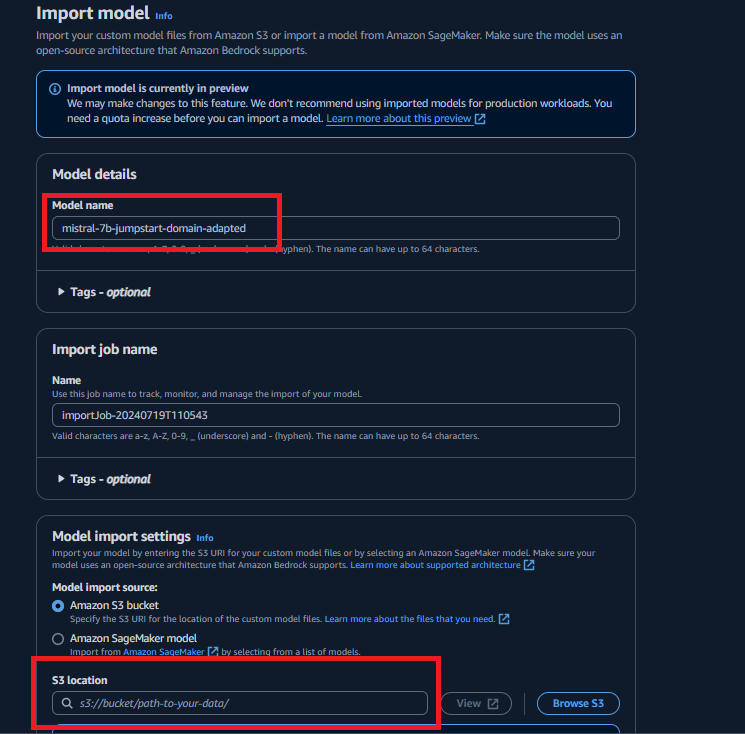
When the import job completes, click on `Models` to see your model. Copy the ARN because we will need it in the next steps
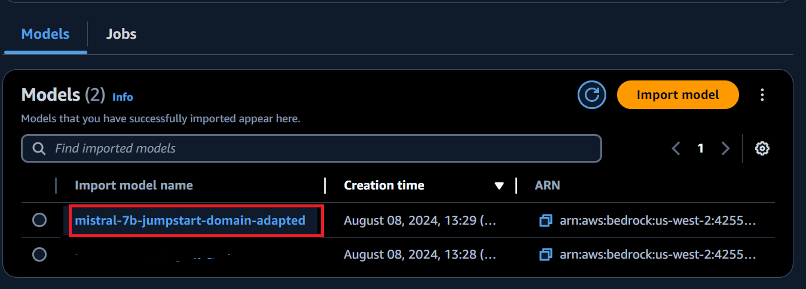
You can test the model using the `Bedrock Playground`. Select your model and enter a question, as shown below.
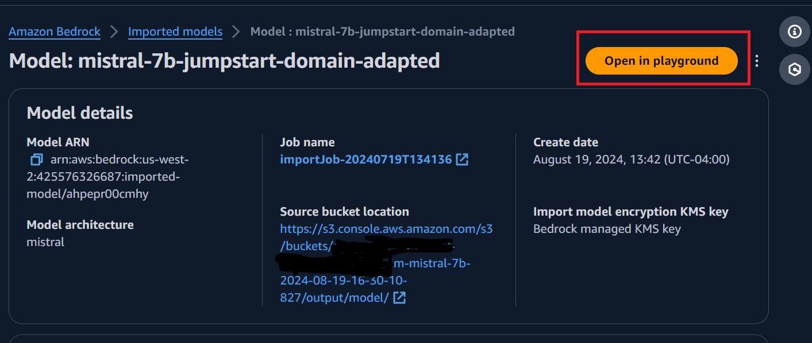
You can run the query and see the response:
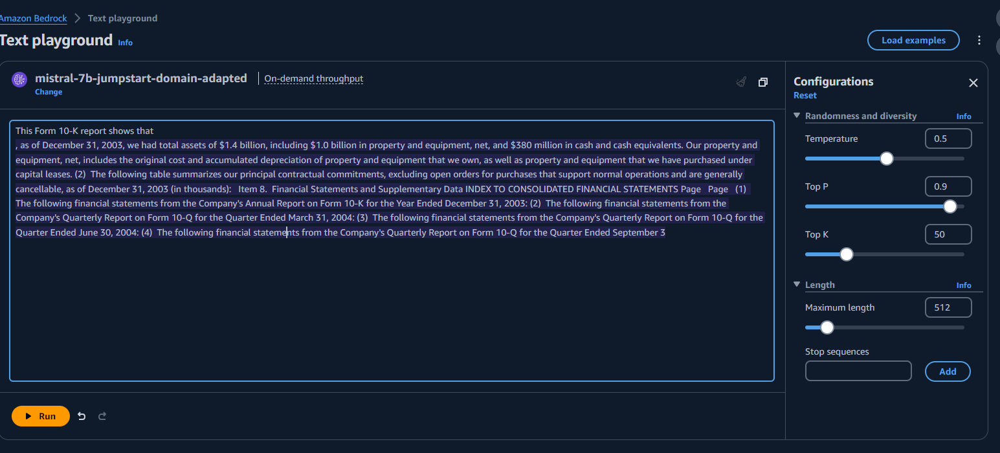


```python

```

<h3> 2.5. Invoke model from Bedrock </h3>


```python
newline, bold, unbold = "\n", "\033[1m", "\033[0m"

test_paragraph_domain_adaption = [
    "This Form 10-K report shows that",
    "We serve consumers through",
    "Our vision is",
]


domain_adaptated_model_id="Replace this with the arn of imported model"
for paragraph in test_paragraph_domain_adaption:
    print("-" * 80)
    print(paragraph)
    print("-" * 80)
    print(f"{bold}pre-trained{unbold}")
    generate_response(pretrained_model_id, paragraph)
    print(f"{bold}fine-tuned{unbold}")
    generate_response(domain_adaptated_model_id, paragraph)
```

    --------------------------------------------------------------------------------
    This Form 10-K report shows that
    --------------------------------------------------------------------------------
    pre-trained
    Response:  Caterpillar Inc. generated $55.7 billion in revenue in 2017. The company operates through three business segments: Construction Industries, Resource Industries, and Energy & Transportation. The Construction Industries segment sells machinery, engines, and other equipment for various construction activities. The Resource Industries segment sells machinery, engines, and other equipment for mining, quarrying, and oil and gas operations. The Energy & Transportation segment sells engines,
    
    fine-tuned
    Response:  during 2008 we acquired certain companies. The net purchase price of each acquired company and the related acquisition-related costs are summarized as follows: The fair value of acquired intangible assets was $170 million and $222 million, as of December 31, 2008 and 2007, and the related amortization periods are two years and five years, respectively. The acquired intangible
    
    --------------------------------------------------------------------------------
    We serve consumers through
    --------------------------------------------------------------------------------
    pre-trained
    Response:  our wide range of products, from our flagship brand, Dove, to other well-known names such as Axe, Knorr, Head & Shoulders, and Pringles. We also serve professional customers, including medical, scientific, and dental professionals, as well as consumers in institutional and foodservice settings, through our Healthcare and Personal Care Solutions business and our Food & Beverages division. Our innovative, scientifically-backed products and brands deliver solutions for people’s hy
    
    fine-tuned
    Response:  our retail websites and focus on selection, price, and convenience. We also manufacture and sell electronic devices. We serve sellers through our seller programs that enable third parties to sell their products in our stores, and we offer fulfillment-related services. We provide services, such as advertising services and co-branded credit card agreements. Additionally, we develop and produce media content. We have organized our operations into three segments: North America, International, and Amazon Web
    
    --------------------------------------------------------------------------------
    Our vision is
    --------------------------------------------------------------------------------
    pre-trained
    Response:  to offer a personalized, affordable, efficient and high-quality IT service to small and medium-sized enterprises (SMEs) that need to rely on their IT infrastructure to run their daily business. We aim to provide support for a wide range of IT systems including Windows, Linux, and MacOS, on-premise and cloud based servers, websites, networks, and workstations.
    
    We want to work with our clients to develop long-lasting relationships and mutual
    
    fine-tuned
    Response:  to be a trusted global investment management and services firm, focused on creating long-term value for our shareholders through sustained revenue growth and operating margins. We seek to build and maintain strong relationships with our clients, employees, business partners, and communities. We serve individual investors, financial advisors, institutionals, and corporate clients in three segments: North America, International, and Amazon Web Services (“AWS”). The North America segment includes revenues from retail sales of consumer
    


As you can, the fine-tuned model starts to generate responses that are more specific to the domain of fine-tuning data which is relating to SEC report of Amazon.

<h3> 2.6. Clean up the endpoint </h3>

<h3> Clean Up </h3>

You can delete your Imported Model in the console as shown in the image below:

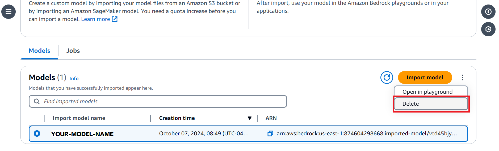

Ensure to shut down your instance/compute that you have run this notebook on.

**END OF NOTEBOOK**
