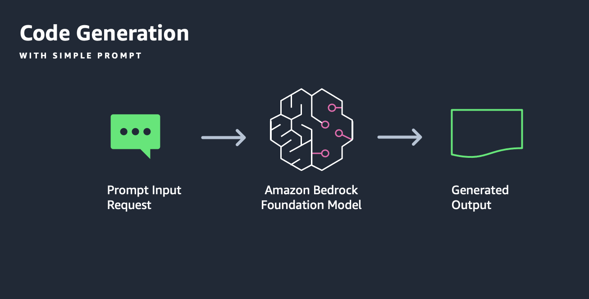

---
tags:
    - Use cases
    - API-Usage-Example
---
<!-- <h2> Invoke Bedrock model for code generation</h2> -->
!!! tip inline end "[Open in github](https://github.com/aws-samples/amazon-bedrock-samples/blob/main//genai-use-cases/text-generation/how_to_work_with_code_generation_w_bedrock.ipynb){:target="_blank"}"

<h2>Overview</h2>

To demonstrate the code generation capability of Amazon Bedrock, we will explore the use of Boto3 client to communicate with Amazon Bedrock Converse API. We will demonstrate different configurations available as well as how simple input can lead to desired outputs. We will explore code generation for two use cases:
- Python code generation for analytical QnA
- SQL query generation

<h2>Context</h2>

In this notebook we show you how to use a LLM to generate code based on the text prompt. We will use Anthropic's Claude 3 Sonnet model using the Boto3 API. 

The prompt used in this example is called a zero-shot prompt because we are not providing any examples of text other than the prompt.


<h3>Pattern</h3>

In both use cases, we will simply provide the Amazon Bedrock Converse API with an input consisting of a task, an instruction and an input for the model under the hood to generate an output without providing any additional example. The purpose here is to demonstrate how the powerful LLMs easily understand the task at hand and generate compelling outputs.



<h3>Use case</h3>

To demonstrate the generation capability of models in Amazon Bedrock, let's take the use case of code generation with Python to do some basic analytical QnA.

<h3>Persona</h3>

You are Moe, a Data Analyst, at AnyCompany. The company wants to understand its sales performance for different products for different products over the past year. You have been provided a dataset named sales.csv. The dataset contains the following columns:

- Date (YYYY-MM-DD) format
- Product_ID (unique identifer for each product)
- Price (price at which each product was sold)

<h3>Implementation</h3>

To fulfill this use case, in this notebook we will show how to generate code for a given prompt. We will use the Anthropic Claude v2 using the Amazon Bedrock API with Boto3 client. 

<h2>Prerequisites</h2>

Before you can use Amazon Bedrock, you must carry out the following steps:

- Sign up for an AWS account (if you don't already have one) and IAM Role with the necessary permissions for Amazon Bedrock, see [AWS Account and IAM Role](https://docs.aws.amazon.com/bedrock/latest/userguide/getting-started.html#new-to-aws){:target="_blank"}.
- Request access to the foundation models (FM) that you want to use, see [Request access to FMs](https://docs.aws.amazon.com/bedrock/latest/userguide/getting-started.html#getting-started-model-access){:target="_blank"}. 


<h2>Setup</h2>

!!! info
    This notebook should work well with the Data Science 3.0 kernel (Python 3.10 runtime) in SageMaker Studio

Run the cells in this section to install the packages needed by this notebook.


```python
import json
import os
import sys

import boto3
import botocore

boto3_bedrock = boto3.client('bedrock-runtime')
```

<h2>Code Generation</h2>


Following on the use case explained above, let's prepare an input for  the Amazon Bedrock service to generate python program for our use-case.


<h3>Lab setup - create sample sales.csv data for this lab.</h3>


```python
# create sales.csv file
import csv

data = [
    ["date", "product_id", "price", "units_sold"],
    ["2023-01-01", "P001", 50, 20],
    ["2023-01-02", "P002", 60, 15],
    ["2023-01-03", "P001", 50, 18],
    ["2023-01-04", "P003", 70, 30],
    ["2023-01-05", "P001", 50, 25],
    ["2023-01-06", "P002", 60, 22],
    ["2023-01-07", "P003", 70, 24],
    ["2023-01-08", "P001", 50, 28],
    ["2023-01-09", "P002", 60, 17],
    ["2023-01-10", "P003", 70, 29],
    ["2023-02-11", "P001", 50, 23],
    ["2023-02-12", "P002", 60, 19],
    ["2023-02-13", "P001", 50, 21],
    ["2023-02-14", "P003", 70, 31],
    ["2023-03-15", "P001", 50, 26],
    ["2023-03-16", "P002", 60, 20],
    ["2023-03-17", "P003", 70, 33],
    ["2023-04-18", "P001", 50, 27],
    ["2023-04-19", "P002", 60, 18],
    ["2023-04-20", "P003", 70, 32],
    ["2023-04-21", "P001", 50, 22],
    ["2023-04-22", "P002", 60, 16],
    ["2023-04-23", "P003", 70, 34],
    ["2023-05-24", "P001", 50, 24],
    ["2023-05-25", "P002", 60, 21]
]

# Write data to sales.csv
with open('sales.csv', 'w', newline='') as csvfile:
    writer = csv.writer(csvfile)
    writer.writerows(data)

print("sales.csv has been created!")
```

<h3>Analyzing sales with Amazon Bedrock generated Python program</h3>


```python
# Create the prompt
# Analyzing sales

system_prompt = """

Create a python program to analyze the sales data from a CSV file. The program should be able to read the data, and determine below:

- Total revenue for the year
- The product with the highest revenue
- The date with the highest revenue
- Visualize each month sales using a bar chart

Ensure the code is syntactically correct, bug-free, optimized, not span multiple lines unnessarily, and prefer to use standard libraries. Return only python code without any surrounding text, explanation or context.

"""

prompt_data = """

You have a CSV, sales.csv, with columns:
- date (YYYY-MM-DD)
- product_id
- price
- units_sold

"""
```

Let's start by using the Anthropic Claude 3 Sonnet model.


```python
# Base inference parameters.
inference_config = {
        "temperature": 0.5,
        "maxTokens": 4096,
        "topP": 0.5,
}

system_prompts = [
        {
            "text": system_prompt
        }
    ]
messages = [
        {
            "role": "user",
            "content": [{"text": prompt_data}]
        }
    ]
```

 invoke Bedrock Converse


```python

from IPython.display import clear_output, display, display_markdown, Markdown
modelId = 'anthropic.claude-3-sonnet-20240229-v1:0' # change this to use a different version from the model provider

# Send the message.
response = boto3_bedrock.converse(
        modelId=modelId,
        messages=messages,
        system=system_prompts,
        inferenceConfig=inference_config,
)

response_body = response["output"]["message"]["content"][0]["text"]

display_markdown(Markdown(print(response_body, end='')))
```

<h3> (Optional) Execute the Bedrock generated code for validation. Go to text editor to copy the generated code as printed output can be trucncated. Replace the code in below cell.</h3>


```python
# Sample Generated Python Code ( Generated with Amazon Bedrock in previous step)

import csv
from collections import defaultdict
from datetime import datetime
import matplotlib.pyplot as plt

# Initialize variables
total_revenue = 0
product_revenue = defaultdict(int)
date_revenue = defaultdict(int)
monthly_sales = defaultdict(int)

# Read the CSV file
with open('sales.csv', 'r') as file:
    reader = csv.DictReader(file)
    for row in reader:
        date = datetime.strptime(row['date'], '%Y-%m-%d').date()
        product_id = row['product_id']
        price = float(row['price'])
        units_sold = int(row['units_sold'])

        # Calculate revenue
        revenue = price * units_sold
        total_revenue += revenue
        product_revenue[product_id] += revenue
        date_revenue[date] += revenue

        # Calculate monthly sales
        monthly_sales[date.month] += units_sold

# Find the product with the highest revenue
highest_revenue_product = max(product_revenue, key=product_revenue.get)

# Find the date with the highest revenue
highest_revenue_date = max(date_revenue, key=date_revenue.get)

# Print the results
print(f"Total revenue for the year: ${total_revenue:.2f}")
print(f"Product with the highest revenue: {highest_revenue_product}")
print(f"Date with the highest revenue: {highest_revenue_date}")

# Visualize monthly sales
months = range(1, 13)
sales = [monthly_sales[month] for month in months]
plt.bar(months, sales)
plt.xlabel('Month')
plt.ylabel('Units Sold')
plt.title('Monthly Sales')
plt.show()
```

___

<h2> Use case 2 - SQL query generation</h2>


To demonstrate the generation capability of models in Amazon Bedrock, let's take the use case of code generation with Python to do some basic analytical QnA.

In this section we show you how to use a LLM to generate SQL Query to analyze Sales data.

We will use Anthropic's Claude 3 Sonnet model using the Boto3 API. 

The prompt used in this example is called a zero-shot prompt because we are not providing any examples of text other than the prompt.

**Note:** *This notebook can be run within or outside of AWS environment.*

<h3> Context</h3>

To demonstrate the SQL code generation capability of Amazon Bedrock, we will explore the use of Boto3 client to communicate with Amazon Bedrock API. We will demonstrate different configurations available as well as how simple input can lead to desired outputs.


<h3> Pattern</h3>

We will simply provide the Amazon Bedrock Converse API with an input consisting of a task, an instruction and an input for the model under the hood to generate an output without providing any additional example. The purpose here is to demonstrate how the powerful LLMs easily understand the task at hand and generate compelling outputs.

<h3> Use case</h3>

Let's take the use case to generate SQL queries to analyze sales data, focusing on trends, top products and average sales.


<h3>Persona</h3>

Maya is a business analyst, at AnyCompany primarily focusing on sales and inventory data. She is transitioning from Speadsheet analysis to data-driven analysis and want to use SQL to fetch specific data points effectively. She wants to use LLMs to generate SQL queries for her analysis. 


<h3>Implementation</h3>
To fulfill this use case, in this notebook we will show how to generate SQL queries. We will use the Anthropic Claude v2 model using the Amazon Bedrock API with Boto3 client. 


<h3>Generate SQL Query</h3>

Following on the use case explained above, let's prepare an input for  the Amazon Bedrock service to generate SQL query.


```python
# create the prompt to generate SQL query
prompt_data = """

AnyCompany has a database with a table named sales_data containing sales records. The table has following columns:
- date (YYYY-MM-DD)
- product_id
- price
- units_sold

Can you generate SQL queries for the below: 
- Identify the top 5 best selling products by total sales for the year 2023
- Calculate the monthly average sales for the year 2023


"""

```


```python
MODEL_IDS = [
    "amazon.titan-tg1-large",
    "anthropic.claude-3-sonnet-20240229-v1:0"
]
```


```python
# Base inference parameters.
inference_config = {
        "temperature": 0.5,
        "maxTokens": 4096,
        "topP": 0.9,
}


messages = [
        {
            "role": "user",
            "content": [{"text": prompt_data}]
        }
    ]
```

Let's use the Titan Text Large model: 


```python
# Send the message.
response = boto3_bedrock.converse(
        modelId=MODEL_IDS[1],
        messages=messages,
        inferenceConfig=inference_config
)

response_body = response["output"]["message"]["content"][0]["text"]

print(f"Output text: {response_body}")
```


<h2>Next Steps</h2>

You have now experimented with using `boto3` SDK which provides a vanilla exposure to Amazon Bedrock API. Using this API you generate a python program to analyze and visualize given sales data, and generate SQL statements based on an input task and schema.


- Adapt this notebook to experiment with different models available through Amazon Bedrock such as Amazon Titan and Anthropics models!

<h2>Cleanup</h2>

There is no clean up necessary for this notebook.