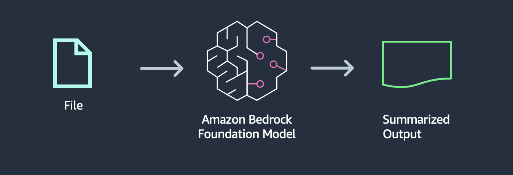

---
tags:
    - Use cases
    - API-Usage-Example
---
<!-- <h2> Invoke Bedrock model for Text summarization</h2> -->

!!! tip inline end "[Open in github](https://github.com/aws-samples/amazon-bedrock-samples/blob/main//genai-use-cases/text-generation/how_to_work_with_text-summarization-titan%2Bclaude.ipynb){:target="_blank"}"


<h2>Overview</h2>

In this example, you are going to ingest a small amount of data (String data) directly into Amazon Bedrock API (using Amazon Titan model) and give it an instruction to summarize the respective text.

<h2>Context</h2>



In this architecture:

1. A small piece of text (or small file) is loaded
1. A foundation model processes those data
1. Model returns a response with the summary of the ingested text

<h3>Use case</h3>

This approach can be used to summarize call transcripts, meetings transcripts, books, articles, blog posts, and other relevant content.


<h3>Challenges</h3>
This approach can be used when the input text or file fits within the model context length. 


<h2>Prerequisites</h2>

Before you can use Amazon Bedrock, you must carry out the following steps:

- Sign up for an AWS account (if you don't already have one) and IAM Role with the necessary permissions for Amazon Bedrock, see [AWS Account and IAM Role](https://docs.aws.amazon.com/bedrock/latest/userguide/getting-started.html#new-to-aws){:target="_blank"}.
- Request access to the foundation models (FM) that you want to use, see [Request access to FMs](https://docs.aws.amazon.com/bedrock/latest/userguide/getting-started.html#getting-started-model-access){:target="_blank"}. 

<h2>Setup</h2>

!!! info
    This notebook should work well with the Data Science 3.0 kernel (Python 3.10 runtime) in SageMaker Studio

Run the cells in this section to install the packages needed by this notebook.


```python
import json
import os
import sys

import boto3
import botocore

boto3_bedrock = boto3.client('bedrock-runtime')
```


<h2>Summarizing a short text with boto3</h2>
 
To learn detail of API request to Amazon Bedrock, this notebook introduces how to create API request and send the request via Boto3 rather than relying on langchain, which gives simpler API by wrapping Boto3 operation. 


<h3>Request Syntax of InvokeModel in Boto3</h3>

The Amazon Bedrock `Converse` API provides a consistent interface that works with all models that support messages. This allows you to write code once and use it with different models with an API .converse accepts the following parameter in this example:

modelId: This is the model ARN for the various foundation models available under Amazon Bedrock
inferenceConfig: Inference parameters to pass to the model. Converse supports a base set of inference parameters.
messages: A message consisting of the prompt
Check [documentation](https://docs.aws.amazon.com/bedrock/latest/userguide/model-ids-arns.html) for Available text generation model Ids

Here is an example of API request for sending text to Amazon Titan Text Large.


```python

response = boto3_bedrock.converse(
            modelId="amazon.titan-tg1-large",
            messages=messages,
            inferenceConfig=inference_config,
    )
```


<h3>Writing prompt with text to be summarized</h3>

In this notebook, you can use any short text whose tokens are less than the maximum token of a foundation model. As an exmple of short text, let's take one paragraph of an [AWS blog post](https://aws.amazon.com/jp/blogs/machine-learning/announcing-new-tools-for-building-with-generative-ai-on-aws/) about announcement of Amazon Bedrock.

The prompt starts with an instruction `Please provide a summary of the following text.`, and includes text surrounded by  `<text>` tag. 


```python
prompt = """
Please provide a summary of the following text. Do not add any information that is not mentioned in the text below.

<text>
AWS took all of that feedback from customers, and today we are excited to announce Amazon Bedrock, \
a new service that makes FMs from AI21 Labs, Anthropic, Stability AI, and Amazon accessible via an API. \
Bedrock is the easiest way for customers to build and scale generative AI-based applications using FMs, \
democratizing access for all builders. Bedrock will offer the ability to access a range of powerful FMs \
for text and images—including Amazons Titan FMs, which consist of two new LLMs we’re also announcing \
today—through a scalable, reliable, and secure AWS managed service. With Bedrock’s serverless experience, \
customers can easily find the right model for what they’re trying to get done, get started quickly, privately \
customize FMs with their own data, and easily integrate and deploy them into their applications using the AWS \
tools and capabilities they are familiar with, without having to manage any infrastructure (including integrations \
with Amazon SageMaker ML features like Experiments to test different models and Pipelines to manage their FMs at scale).
</text>

"""
```


<h2>Creating request body with prompt and inference parameters </h2>

Following the request syntax of `converse`, you create inference_config and message parameter with the above prompt and inference parameters.


<h3>Titan LLM </h3>


```python

# Base inference parameters.
inference_config = {
        "temperature": 0,
        "maxTokens": 4096,
        "topP": 0.95,
}


messages = [
        {
            "role": "user",
            "content": [{"text": prompt}]
        }
    ]
```


<h3>Invoke foundation model via Boto3 </h3>

Here sends the API request to Amazon Bedrock. Following the prompt, the foundation model in Amazon Bedrock sumamrizes the text.


```python
# modelId = 'amazon.titan-text-premier-v1:0' # Make sure Titan text premier is available in the account you are doing this workhsop in before uncommenting!
modelId = "amazon.titan-tg1-large"


try:
    response = boto3_bedrock.converse(
            modelId=modelId,
            messages=messages,
            inferenceConfig=inference_config,
    )
    response_body = response['output']['message']
  
    print(response_body.get('content')[0].get('text'))

except botocore.exceptions.ClientError as error:
    
    if error.response['Error']['Code'] == 'AccessDeniedException':
           print(f"\x1b[41m{error.response['Error']['Message']}\
                \nTo troubeshoot this issue please refer to the following resources.\
                 \nhttps://docs.aws.amazon.com/IAM/latest/UserGuide/troubleshoot_access-denied.html\
                 \nhttps://docs.aws.amazon.com/bedrock/latest/userguide/security-iam.html\x1b[0m\n")
        
    else:
        raise error
```

In the above the TTP generates the entire summary for the given prompt in a single output. Note that this can be slow if the output contains large amount of tokens. 


___

<h3>Claude 3 Sonnet: </h3>


```python
prompt = """
Please provide a summary of the following text.
<text>
AWS took all of that feedback from customers, and today we are excited to announce Amazon Bedrock, \
a new service that makes FMs from AI21 Labs, Anthropic, Stability AI, and Amazon accessible via an API. \
Bedrock is the easiest way for customers to build and scale generative AI-based applications using FMs, \
democratizing access for all builders. Bedrock will offer the ability to access a range of powerful FMs \
for text and images—including Amazons Titan FMs, which consist of two new LLMs we’re also announcing \
today—through a scalable, reliable, and secure AWS managed service. With Bedrock’s serverless experience, \
customers can easily find the right model for what they’re trying to get done, get started quickly, privately \
customize FMs with their own data, and easily integrate and deploy them into their applications using the AWS \
tools and capabilities they are familiar with, without having to manage any infrastructure (including integrations \
with Amazon SageMaker ML features like Experiments to test different models and Pipelines to manage their FMs at scale).
</text>

"""
```


```python

# Base inference parameters.
inference_config = {
        "temperature": 0,
        "maxTokens": 4096,
        "topP": 0.95,
}


messages = [
        {
            "role": "user",
            "content": [{"text": prompt}]
        }
    ]
```


```python
modelId = "anthropic.claude-3-sonnet-20240229-v1:0"

response = boto3_bedrock.converse(
            modelId=modelId,
            messages=messages,
            inferenceConfig=inference_config,
    )
response_body = response['output']['message']['content'][0]['text']


print(response_body)
```

<h2>Next Steps</h2>

You have now experimented with using `boto3` SDK which provides a vanilla exposure to Amazon Bedrock API. Using this API you have seen the use case of generating a summary of AWS news about Amazon Bedrock.

- Adapt this notebook to experiment with different models available through Amazon Bedrock such as Anthropic Claude and AI21 Labs Jurassic models.
- Change the prompts to your specific usecase and evaluate the output of different models.
- Play with the token length to understand the latency and responsiveness of the service.
- Apply different prompt engineering principles to get better outputs.


<h2>Cleanup</h2>

There is no clean up necessary for this notebook.
